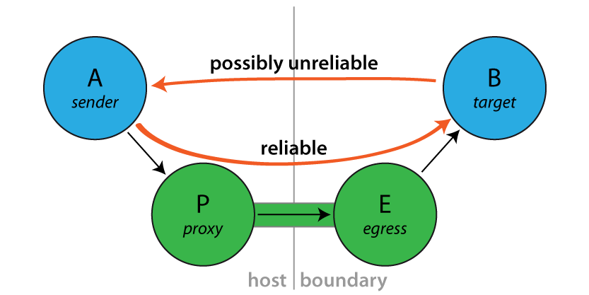

.. _reliable-proxy:

Reliable Proxy Pattern
======================

Looking at :ref:`message-delivery-reliability` one might come to the conclusion that
Akka actors are made for blue-sky scenarios: sending messages is the only way
for actors to communicate, and then that is not even guaranteed to work. Is the
whole paradigm built on sand? Of course the answer is an emphatic “No!”.

A local message send—within the same JVM instance—is not likely to fail, and if
it does the reason was one of

* it was meant to fail (due to consciously choosing a bounded mailbox, which
  upon overflow will have to drop messages)
* or it failed due to a catastrophic VM error, e.g. an
  :class:`OutOfMemoryError`, a memory access violation (“segmentation fault”,
  GPF, etc.), JVM bug—or someone calling ``System.exit()``.

In all of these cases, the actor was very likely not in a position to process
the message anyway, so this part of the non-guarantee is not problematic.

It is a lot more likely for an unintended message delivery failure to occur
when a message send crosses JVM boundaries, i.e. an intermediate unreliable
network is involved. If someone unplugs an ethernet cable, or a power failure
shuts down a router, messages will be lost while the actors would be able to
process them just fine.

.. note::

   This does not mean that message send semantics are different between local
   and remote operations, it just means that in practice there is a difference
   between how good the “best effort” is.

Introducing the Reliable Proxy
------------------------------

To bridge the disparity between “local” and “remote” sends is the goal of this
pattern. When sending from A to B must be as reliable as in-JVM, regardless of
the deployment, then you can interject a reliable tunnel and send through that
instead. The tunnel consists of two end-points, where the ingress point P (the
“proxy”) is a child of A and the egress point E is a child of P, deployed onto
the same network node where B lives. Messages sent to P will be wrapped in an
envelope, tagged with a sequence number and sent to E, who verifies that the
received envelope has the right sequence number (the next expected one) and
forwards the contained message to B. When B receives this message, the
``sender()`` will be a reference to the sender() of the original message to P.
Reliability is added by E replying to orderly received messages with an ACK, so
that P can tick those messages off its resend list. If ACKs do not come in a
timely fashion, P will try to resend until successful.

Exactly what does it guarantee?
-------------------------------

Sending via a :class:`ReliableProxy` makes the message send exactly as reliable
as if the represented target were to live within the same JVM, provided that
the remote actor system does not terminate. In effect, both ends (i.e. JVM and
actor system) must be considered as one when evaluating the reliability of this
communication channel. The benefit is that the network in-between is taken out
of that equation.

Connecting to the target
^^^^^^^^^^^^^^^^^^^^^^^^

The ``proxy`` tries to connect to the ``target`` using the mechanism outlined in
:ref:`actorSelection-scala`.  Once connected, if the ``tunnel`` terminates the ``proxy``
will optionally try to reconnect to the target using using the same process.

Note that during the reconnection process there is a possibility that a message
could be delivered to the ``target`` more than once.  Consider the case where a message
is delivered to the ``target`` and the target system crashes before the ACK
is sent to the ``sender``.  After the ``proxy`` reconnects to the ``target`` it
will start resending all of the messages that it has not received an ACK for, and
the message that it never got an ACK for will be redelivered.  Either this possibility
should be considered in the design of the ``target`` or reconnection should be disabled.

How to use it
-------------

Since this implementation does not offer much in the way of configuration,
simply instantiate a proxy wrapping a target ``ActorPath``. From Java it looks
like this:

.. includecode:: @contribSrc@/src/test/java/akka/contrib/pattern/ReliableProxyTest.java
   :include: import,demo-proxy

And from Scala like this:

.. includecode:: @contribSrc@/src/test/scala/akka/contrib/pattern/ReliableProxyDocSpec.scala#demo

Since the :class:`ReliableProxy` actor is an :ref:`fsm-scala`, it also offers
the capability to subscribe to state transitions. If you need to know when all
enqueued messages have been received by the remote end-point (and consequently
been forwarded to the target), you can subscribe to the FSM notifications and
observe a transition from state :class:`ReliableProxy.Active` to state
:class:`ReliableProxy.Idle`.

.. includecode:: @contribSrc@/src/test/java/akka/contrib/pattern/ReliableProxyTest.java#demo-transition

From Scala it would look like so:

.. includecode:: @contribSrc@/src/test/scala/akka/contrib/pattern/ReliableProxyDocSpec.scala#demo-transition

Configuration
^^^^^^^^^^^^^

* Set ``akka.reliable-proxy.debug`` to ``on`` to turn on extra debug logging for your
  :class:`ReliableProxy` actors.
* ``akka.reliable-proxy.default-connect-interval`` is used only if you create a :class:`ReliableProxy`
  with no reconnections (that is, ``reconnectAfter == None``). The default value is the value of the configuration
  property ``akka.remote.retry-gate-closed-for``.  For example, if ``akka.remote.retry-gate-closed-for`` is ``5 s``
  case the :class:`ReliableProxy` will send an ``Identify`` message to the *target* every 5 seconds
  to try to resolve the :class:`ActorPath` to an :class:`ActorRef` so that messages can be sent to the *target*.

The Actor Contract
------------------

Message it Processes
^^^^^^^^^^^^^^^^^^^^

* :class:`FSM.SubscribeTransitionCallBack` and :class:`FSM.UnsubscribeTransitionCallBack`, see :ref:`fsm-scala`
* :class:`ReliableProxy.Unsent`, see the API documentation for details.
* any other message is transferred through the reliable tunnel and forwarded to the designated target actor

Messages it Sends
^^^^^^^^^^^^^^^^^

* :class:`FSM.CurrentState` and :class:`FSM.Transition`, see :ref:`fsm-scala`
* :class:`ReliableProxy.TargetChanged` is sent to the FSM transition subscribers if the proxy reconnects to a
  new target.
* :class:`ReliableProxy.ProxyTerminated` is sent to the FSM transition subscribers if the proxy is stopped.

Exceptions it Escalates
^^^^^^^^^^^^^^^^^^^^^^^

* no specific exception types
* any exception encountered by either the local or remote end-point are escalated (only fatal VM errors)

Arguments it Takes
^^^^^^^^^^^^^^^^^^

* *target* is the :class:`ActorPath` to the actor to which the tunnel shall reliably deliver
  messages, ``B`` in the above illustration.
* *retryAfter* is the timeout for receiving ACK messages from the remote
  end-point; once it fires, all outstanding message sends will be retried.
* *reconnectAfter* is an optional interval between connection attempts. It is also used as the interval
  between receiving a ``Terminated`` for the tunnel and attempting to reconnect to the target actor.
* *maxConnectAttempts* is an optional maximum number of attempts to connect to the target while in
  the ``Connecting`` state.