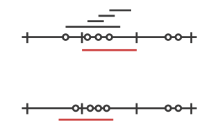

Throttling Actor Messages
=========================

Introduction
------------

Suppose you are writing an application that makes HTTP requests to an external
web service and that this web service has a restriction in place: you may not
make more than 10 requests in 1 minute. You will get blocked or need to pay if
you don’t stay under this limit. In such a scenario you will want to employ
a *message throttler*.

This extension module provides a simple implementation of a throttling actor,
the :class:`TimerBasedThrottler`.

How to use it
-------------

You can use a :class:`TimerBasedThrottler` as follows:

.. includecode:: @contribSrc@/src/test/scala/akka/contrib/throttle/TimerBasedThrottlerSpec.scala#demo-code

Please refer to the ScalaDoc documentation for the details.

The guarantees
--------------

:class:`TimerBasedThrottler` uses a timer internally. When the throttler’s rate is 3 msg/s,
for example, the throttler will start a timer that triggers
every second and each time will give the throttler exactly three "vouchers";
each voucher gives the throttler a right to deliver a message. In this way,
at most 3 messages will be sent out by the throttler in each interval.

It should be noted that such timer-based throttlers provide relatively **weak guarantees**:

* Only *start times* are taken into account. This may be a problem if, for example, the
  throttler is used to throttle requests to an external web service. If a web request
  takes very long on the server then the rate *observed on the server* may be higher.
* A timer-based throttler only makes guarantees for the intervals of its own timer. In
  our example, no more than 3 messages are delivered within such intervals. Other
  intervals on the timeline, however, may contain more calls.

The two cases are illustrated in the two figures below, each showing a timeline and three
intervals of the timer. The message delivery times chosen by the throttler are indicated
by dots, and as you can see, each interval contains at most 3 point, so the throttler
works correctly. Still, there is in each example an interval (the red one) that is
problematic. In the first scenario, this is because the delivery times are merely the
start times of longer requests (indicated by the four bars above the timeline that start
at the dots), so that the server observes four requests during the red interval. In the
second scenario, the messages are centered around one of the points in time where the
timer triggers, causing the red interval to contain too many messages.

For some application scenarios, the guarantees provided by a timer-based throttler might
be too weak. Charles Cordingley’s `blog post <http://www.cordinc.com/blog/2010/04/java-multichannel-asynchronous.html>`_
discusses a throttler with stronger guarantees (it solves problem 2 from above).
Future versions of this module may feature throttlers with better guarantees.