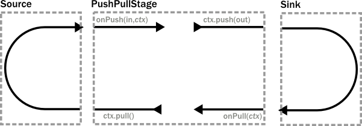
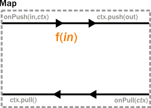
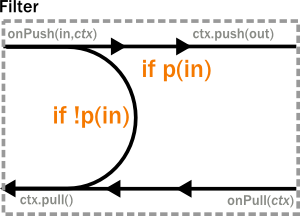
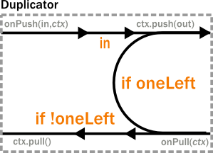
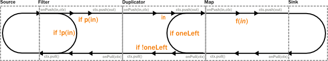
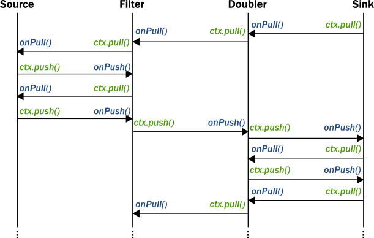
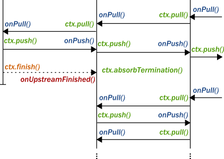
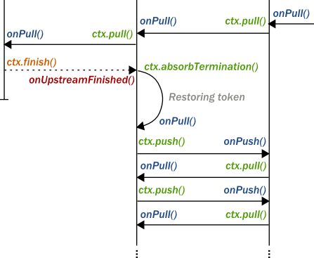
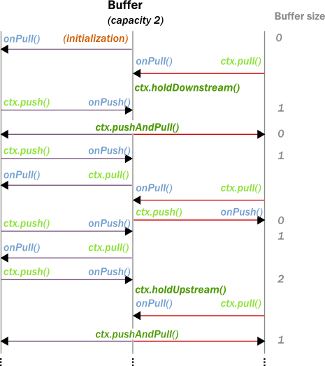

.. _stream-customize-java:

########################
Custom stream processing
########################

While the processing vocabulary of Akka Streams is quite rich (see the :ref:`stream-cookbook-java` for examples) it
is sometimes necessary to define new transformation stages either because some functionality is missing from the
stock operations, or for performance reasons. In this part we show how to build custom processing stages and graph
junctions of various kinds.

Custom linear processing stages
===============================

To extend the available transformations on a :class:`Flow` or :class:`Source` one can use the ``transform()`` method
which takes a factory function returning a :class:`Stage`. Stages come in different flavors swhich we will introduce in this
page.

.. _stream-using-push-pull-stage-java:

Using PushPullStage
-------------------

The most elementary transformation stage is the :class:`PushPullStage` which can express a large class of algorithms
working on streams. A :class:`PushPullStage` can be illustrated as a box with two "input" and two "output ports" as it is
seen in the illustration below.

|

|

The "input ports" are implemented as event handlers ``onPush(elem,ctx)`` and ``onPull(ctx)`` while "output ports"
correspond to methods on the :class:`Context` object that is handed as a parameter to the event handlers. By calling
exactly one "output port" method we wire up these four ports in various ways which we demonstrate shortly.

.. warning::
   There is one very important rule to remember when working with a ``Stage``. **Exactly one** method should be called
   on the **currently passed** :class:`Context` **exactly once** and as the **last statement of the handler** where the return type
   of the called method **matches the expected return type of the handler**. Any violation of this rule will
   almost certainly result in unspecified behavior (in other words, it will break in spectacular ways). Exceptions
   to this rule are the query methods ``isHolding()`` and ``isFinishing()``

To illustrate these concepts we create a small :class:`PushPullStage` that implements the ``map`` transformation.

|

|

Map calls ``ctx.push()`` from the ``onPush()`` handler and it also calls ``ctx.pull()`` form the ``onPull``
handler resulting in the conceptual wiring above, and fully expressed in code below:

.. includecode:: ../../../akka-samples/akka-docs-java-lambda/src/test/java/docs/stream/FlowStagesDocTest.java#one-to-one

Map is a typical example of a one-to-one transformation of a stream. To demonstrate a many-to-one stage we will implement
filter. The conceptual wiring of ``Filter`` looks like this:

|

|

As we see above, if the given predicate matches the current element we are propagating it downwards, otherwise
we return the "ball" to our upstream so that we get the new element. This is achieved by modifying the map
example by adding a conditional in the ``onPush`` handler and decide between a ``ctx.pull()`` or ``ctx.push()`` call
(and of course not having a mapping ``f`` function).

.. includecode:: ../../../akka-samples/akka-docs-java-lambda/src/test/java/docs/stream/FlowStagesDocTest.java#many-to-one

To complete the picture we define a one-to-many transformation as the next step. We chose a straightforward example stage
that emits every upstream element twice downstream. The conceptual wiring of this stage looks like this:

|

|

This is a stage that has state: the last element it has seen, and a flag ``oneLeft`` that indicates if we
have duplicated this last element already or not. Looking at the code below, the reader might notice that our ``onPull``
method is more complex than it is demonstrated by the figure above. The reason for this is completion handling, which we
will explain a little bit later. For now it is enough to look at the ``if(!ctx.isFinishing)`` block which
corresponds to the logic we expect by looking at the conceptual picture.

.. includecode:: ../../../akka-samples/akka-docs-java-lambda/src/test/java/docs/stream/FlowStagesDocTest.java#one-to-many

Finally, to demonstrate all of the stages above, we put them together into a processing chain, which conceptually
would correspond to the following structure:

|

|

In code this is only a few lines, using the ``transform`` method to inject our custom processing into a stream:

.. includecode:: ../../../akka-samples/akka-docs-java-lambda/src/test/java/docs/stream/FlowStagesDocTest.java#stage-chain

If we attempt to draw the sequence of events, it shows that there is one "event token"
in circulation in a potential chain of stages, just like our conceptual "railroad tracks" representation predicts.

|

|

Completion handling
^^^^^^^^^^^^^^^^^^^

Completion handling usually (but not exclusively) comes into the picture when processing stages need to emit a few
more elements after their upstream source has been completed. We have seen an example of this in our ``Duplicator`` class
where the last element needs to be doubled even after the upstream neighbor stage has been completed. Since the
``onUpstreamFinish()`` handler expects a :class:`TerminationDirective` as the return type we are only allowed to call
``ctx.finish()``, ``ctx.fail()`` or ``ctx.absorbTermination()``. Since the first two of these available methods will
immediately terminate, our only option is ``absorbTermination()``. It is also clear from the return type of
``onUpstreamFinish`` that we cannot call ``ctx.push()`` but we need to emit elements somehow! The trick is that after
calling ``absorbTermination()`` the ``onPull()`` handler will be called eventually, and at the same time
``ctx.isFinishing`` will return true, indicating that ``ctx.pull()`` cannot be called anymore. Now we are free to
emit additional elementss and call ``ctx.finish()`` or ``ctx.pushAndFinish()`` eventually to finish processing.

The reason for this slightly complex termination sequence is that the underlying ``onComplete`` signal of
Reactive Streams may arrive without any pending demand, i.e. without respecting backpressure. This means that
our push/pull structure that was illustrated in the figure of our custom processing chain does not
apply to termination. Our neat model that is analogous to a ball that bounces back-and-forth in a
pipe (it bounces back on ``Filter``, ``Duplicator`` for example) cannot describe the termination signals. By calling
``absorbTermination()`` the execution environment checks if the conceptual token was *above* the current stage at
that time (which means that it will never come back, so the environment immediately calls ``onPull``) or it was
*below* (which means that it will come back eventually, so the environment does not need to call anything yet).

The first of the two scenarios is when a termination signal arrives after a stage passed the event to its downstream. As
we can see in the following diagram, there is no need to do anything by ``absorbTermination()`` since the black arrows
representing the movement of the "event token" is uninterrupted.

|

|

In the second scenario the "event token" is somewhere upstream when the termination signal arrives. In this case
``absorbTermination`` needs to ensure that a new "event token" is generated replacing the old one that is forever gone
(since the upstream finished). This is done by calling the ``onPull()`` event handler of the stage.

|

|

Observe, that in both scenarios ``onPull()`` kicks off the continuation of the processing logic, the only difference is
whether it is the downstream or the ``absorbTermination()`` call that calls the event handler.

.. warning::
  It is not allowed to call ``absorbTermination()`` from ``onDownstreamFinish()``. If the method is called anyway,
  it will be logged at ``ERROR`` level, but no further action will be taken as at that point there is no active
  downstream to propagate the error to. Cancellation in the upstream direction will continue undisturbed.

Using PushStage
---------------

Many one-to-one and many-to-one transformations do not need to override the ``onPull()`` handler at all since all
they do is just propagate the pull upwards. For such transformations it is better to extend PushStage directly. For
example our ``Map`` and ``Filter`` would look like this:

.. includecode:: ../../../akka-samples/akka-docs-java-lambda/src/test/java/docs/stream/FlowStagesDocTest.java#pushstage

The reason to use ``PushStage`` is not just cosmetic: internal optimizations rely on the fact that the onPull method
only calls ``ctx.pull()`` and allow the environment do process elements faster than without this knowledge. By
extending ``PushStage`` the environment can be sure that ``onPull()`` was not overridden since it is ``final`` on
``PushStage``.

Using StatefulStage
-------------------

On top of ``PushPullStage`` which is the most elementary and low-level abstraction and ``PushStage`` that is a
convenience class that also informs the environment about possible optimizations ``StatefulStage`` is a new tool that
builds on ``PushPullStage`` directly, adding various convenience methods on top of it. It is possible to explicitly
maintain state-machine like states using its ``become()`` method to encapsulates states explicitly. There is also
a handy ``emit()`` method that simplifies emitting multiple values given as an iterator. To demonstrate this feature
we reimplemented ``Duplicator`` in terms of a ``StatefulStage``:

.. includecode:: ../../../akka-samples/akka-docs-java-lambda/src/test/java/docs/stream/FlowStagesDocTest.java#doubler-stateful

Using DetachedStage
-------------------

The model described in previous sections, while conceptually simple, cannot describe all desired stages. The main
limitation is the "single-ball" (single "event token") model which prevents independent progress of an upstream and
downstream of a stage. Sometimes it is desirable to *detach* the progress (and therefore, rate) of the upstream and
downstream of a stage, synchronizing only when needed.

This is achieved in the model by representing a :class:`DetachedStage` as a *boundary* between two "single-ball" regions.
One immediate consequence of this difference is that **it is not allowed to call** ``ctx.pull()`` **from** ``onPull()`` **and
it is not allowed to call** ``ctx.push()`` **from** ``onPush()`` as such combinations would "steal" a token from one region
(resulting in zero tokens left) and would inject an unexpected second token to the other region. This is enforced
by the expected return types of these callback functions.

One of the important use-cases for :class:`DetachedStage` is to build buffer-like entities, that allow independent progress
of upstream and downstream stages when the buffer is not full or empty, and slowing down the appropriate side if the
buffer becomes empty or full. The next diagram illustrates the event sequence for a buffer with capacity of two elements.

|

|

The very first difference we can notice is that our ``Buffer`` stage is automatically pulling its upstream on
initialization. Remember that it is forbidden to call ``ctx.pull`` from ``onPull``, therefore it is the task of the
framework to kick off the first "event token" in the upstream region, which will remain there until the upstream stages
stop. The diagram distinguishes between the actions of the two regions by colors: *purple* arrows indicate the actions
involving the upstream "event token", while *red* arrows show the downstream region actions. This demonstrates the clear
separation of these regions, and the invariant that the number of tokens in the two regions are kept unchanged.

For buffer it is necessary to detach the two regions, but it is also necessary to sometimes hold back the upstream
or downstream. The new API calls that are available for :class:`DetachedStage` s are the various ``ctx.holdXXX()`` methods
, ``ctx.pushAndPull()`` and variants, and ``ctx.isHoldingXXX()``.
Calling ``ctx.holdXXX()`` from ``onPull()`` or ``onPush`` results in suspending the corresponding
region from progress, and temporarily taking ownership of the "event token". This state can be queried by ``ctx.isHolding()``
which will tell if the stage is currently holding a token or not. It is only allowed to suspend one of the regions, not
both, since that would disable all possible future events, resulting in a dead-lock. Releasing the held token is only
possible by calling ``ctx.pushAndPull()``. This is to ensure that both the held token is released, and the triggering region
gets its token back (one inbound token + one held token = two released tokens).

The following code example demonstrates the buffer class corresponding to the message sequence chart we discussed.

.. includecode:: ../../../akka-samples/akka-docs-java-lambda/src/test/java/docs/stream/FlowStagesDocTest.java#detached

.. warning::
  If ``absorbTermination()`` is called on a :class:`DetachedStage` while it holds downstream (``isHoldingDownstream``
  returns true) then ``onPull()`` will be called on the stage. This ensures that the stage does not end up in a
  deadlocked case. Since at the point when the termination is absorbed there will be no way to get any callbacks because
  the downstream is held, so the framework invokes onPull() to avoid this situation. This is similar to the termination
  logic already shown for :class:`PushPullStage`.

Custom graph processing junctions
=================================

To extend available fan-in and fan-out structures (graph stages) Akka Streams include :class:`FlexiMerge` and
:class:`FlexiRoute` which provide an intuitive DSL which allows to describe which upstream or downstream stream
elements should be pulled from or emitted to.

Using FlexiMerge
----------------
:class:`FlexiMerge` can be used to describe a fan-in element which contains some logic about which upstream stage the
merge should consume elements. It is recommended to create your custom fan-in stage as a separate class, name it
appropriately to the behavior it is exposing and reuse it this way – similarly as you would use built-in fan-in stages.

The first flexi merge example we are going to implement is a so-called "preferring merge", in which one
of the input ports is *preferred*, e.g. if the merge could pull from the preferred or another secondary input port,
it will pull from the preferred port, only pulling from the secondary ports once the preferred one does not have elements
available.

Implementing a custom merge stage is done by extending the :class:`FlexiMerge` trait, exposing its input ports and finally
defining the logic which will decide how this merge should behave. First we need to create the ports which are used
to wire up the fan-in element in a :class:`FlowGraph`. These input ports *must* be properly typed and their names should
indicate what kind of port it is.

.. includecode:: ../../../akka-samples/akka-docs-java-lambda/src/test/java/docs/stream/FlexiMergeDocTest.java#flexi-preferring-merge

Next we implement the ``createMergeLogic`` method, which will be used as factory of merges :class:`MergeLogic`.
A new :class:`MergeLogic` object will be created for each materialized stream, so it is allowed to be stateful.

The :class:`MergeLogic` defines the behaviour of our merge stage, and may be *stateful* (for example to buffer some elements
internally).

.. warning::
  While a :class:`MergeLogic` instance *may* be stateful, the :class:`FlexiMerge` instance
  *must not* hold any mutable state, since it may be shared across several materialized ``FlowGraph`` instances.

Next we implement the ``initialState`` method, which returns the behaviour of the merge stage. A ``MergeLogic#State``
defines the behaviour of the merge by signaling which input ports it is interested in consuming, and how to handle
the element once it has been pulled from its upstream. Signalling which input port we are interested in pulling data
from is done by using an appropriate *read condition*. Available *read conditions* include:

- ``Read(input)`` - reads from only the given input,
- ``ReadAny(inputs)`` – reads from any of the given inputs,
- ``ReadPreferred(preferred)(secondaries)`` – reads from the preferred input if elements available, otherwise from one of the secondaries,
- ``ReadAll(inputs)`` – reads from *all* given inputs (like ``Zip``), and offers an :class:`ReadAllInputs` as the ``element`` passed into the state function, which allows to obtain the pulled element values in a type-safe way.

In our case we use the :class:`ReadPreferred` read condition which has the exact semantics which we need to implement
our preferring merge – it pulls elements from the preferred input port if there are any available, otherwise reverting
to pulling from the secondary inputs. The context object passed into the state function allows us to interact with the
connected streams, for example by emitting an ``element``, which was just pulled from the given ``input``, or signalling
completion or failure to the merges downstream stage.

The state function must always return the next behaviour to be used when an element should be pulled from its upstreams,
we use the special :class:`SameState` object which signals :class:`FlexiMerge` that no state transition is needed.

.. note::
  As response to an input element it is allowed to emit at most one output element.

Implementing Zip-like merges
^^^^^^^^^^^^^^^^^^^^^^^^^^^^
More complex fan-in junctions may require not only multiple States but also sharing state between those states.
As :class:`MergeLogic` is allowed to be stateful, it can be easily used to hold the state of the merge junction.

We now implement the equivalent of the built-in ``Zip`` junction by using the property that a the MergeLogic can be stateful
and that each read is followed by a state transition (much like in Akka FSM or ``Actor#become``).

.. includecode:: ../../../akka-samples/akka-docs-java-lambda/src/test/java/docs/stream/FlexiMergeDocTest.java#fleximerge-zip-states

The above style of implementing complex flexi merges is useful when we need fine grained control over consuming from certain
input ports. Sometimes however it is simpler to strictly consume all of a given set of inputs. In the ``Zip`` rewrite below
we use the :class:`ReadAll` read condition, which behaves slightly differently than the other read conditions, as the element
it is emitting is of the type :class:`ReadAllInputs` instead of directly handing over the pulled elements:

.. includecode:: ../../../akka-samples/akka-docs-java-lambda/src/test/java/docs/stream/FlexiMergeDocTest.java#fleximerge-zip-readall

Thanks to being handed a :class:`ReadAllInputs` instance instead of the elements directly it is possible to pick elements
in a type-safe way based on their input port.

Connecting your custom junction is as simple as creating an instance and connecting Sources and Sinks to its ports
(notice that the merged output port is named ``out``):

.. includecode:: ../../../akka-samples/akka-docs-java-lambda/src/test/java/docs/stream/FlexiMergeDocTest.java#fleximerge-zip-connecting

.. _flexi-merge-completion-handling-java:

Completion handling
^^^^^^^^^^^^^^^^^^^
Completion handling in :class:`FlexiMerge` is defined by an :class:`CompletionHandling` object which can react on
completion and failure signals from its upstream input ports. The default strategy is to remain running while at-least-one
upstream input port which are declared to be consumed in the current state is still running (i.e. has not signalled
completion or failure).

Customising completion can be done via overriding the ``MergeLogic#initialCompletionHandling`` method, or from within
a :class:`State` by calling ``ctx.changeCompletionHandling(handling)``. Other than the default completion handling (as
late as possible) :class:`FlexiMerge` also provides an ``eagerClose`` completion handling which completes (or fails) its
downstream as soon as at least one of its upstream inputs completes (or fails).

In the example below the we implement an ``ImportantWithBackups`` fan-in stage which can only keep operating while
the ``important`` and at-least-one of the ``replica`` inputs are active. Therefore in our custom completion strategy we
have to investigate which input has completed or failed and act accordingly. If the important input completed or failed
we propagate this downstream completing the stream, on the other hand if the first replicated input fails, we log the
exception and instead of failing the downstream swallow this exception (as one failed replica is still acceptable).
Then we change the completion strategy to ``eagerClose`` which will propagate any future completion or failure event right
to this stages downstream effectively shutting down the stream.

.. includecode:: ../../../akka-samples/akka-docs-java-lambda/src/test/java/docs/stream/FlexiMergeDocTest.java#fleximerge-completion

In case you want to change back to the default completion handling, it is available as ``MergeLogic#defaultCompletionHandling``.

It is not possible to emit elements from the completion handling, since completion
handlers may be invoked at any time (without regard to downstream demand being available).

Using FlexiRoute
----------------
Similarily to using :class:`FlexiMerge`, implementing custom fan-out stages requires extending the :class:`FlexiRoute` class
and with a :class:`RouteLogic` object which determines how the route should behave.

The first flexi route stage that we are going to implement is ``Unzip``, which consumes a stream of pairs and splits
it into two streams of the first and second elements of each pair.

A :class:`FlexiRoute` has exactly-one input port (in our example, type parameterized as ``Pair<A,B>``), and may have multiple
output ports, all of which must be created beforehand (they can not be added dynamically). First we need to create the
ports which are used to wire up the fan-in element in a :class:`FlowGraph`.

.. includecode:: ../../../akka-samples/akka-docs-java-lambda/src/test/java/docs/stream/FlexiRouteDocTest.java#flexiroute-unzip

Next we implement ``RouteLogic#initialState`` by providing a State that uses the :class:`DemandFromAll` *demand condition*
to signal to flexi route that elements can only be emitted from this stage when demand is available from all given downstream
output ports. Other available demand conditions are:

- ``DemandFrom(output)`` - triggers when the given output port has pending demand,
- ``DemandFromAny(outputs)`` - triggers when any of the given output ports has pending demand,
- ``DemandFromAll(outputs)`` - triggers when *all* of the given output ports has pending demand.

Since the ``Unzip`` junction we're implementing signals both downstreams stages at the same time, we use ``DemandFromAll``,
unpack the incoming pair in the state function and signal its first element to the ``left`` stream, and the second element
of the pair to the ``right`` stream. Notice that since we are emitting values of different types (``A`` and ``B``),
the output type parameter of this ``State`` must be set to ``Any``. This type can be utilised more efficiently when a junction
is emitting the same type of element to its downstreams e.g. in all *strictly routing* stages.

The state function must always return the next behaviour to be used when an element should be emitted,
we use the special :class:`SameState` object which signals :class:`FlexiRoute` that no state transition is needed.

.. warning::
  While a :class:`RouteLogic` instance *may* be stateful, the :class:`FlexiRoute` instance
  *must not* hold any mutable state, since it may be shared across several materialized ``FlowGraph`` instances.

.. note::
  It is only allowed to `emit` at most one element to each output in response to `onInput`, `IllegalStateException` is thrown.

Completion handling
^^^^^^^^^^^^^^^^^^^
Completion handling in :class:`FlexiRoute` is handled similarily to :class:`FlexiMerge` (which is explained in depth in
:ref:`flexi-merge-completion-handling-java`), however in addition to reacting to its upstreams *completion* or *failure*
it can also react to its downstream stages *cancelling* their subscriptions. The default completion handling for
:class:`FlexiRoute` (defined in ``RouteLogic#defaultCompletionHandling``) is to continue running until all of its
downstreams have cancelled their subscriptions, or the upstream has completed / failed.

In order to customise completion handling we can override overriding the ``RouteLogic#initialCompletionHandling`` method,
or call ``ctx.changeCompletionHandling(handling)`` from within a :class:`State`. Other than the default completion handling
(as late as possible) :class:`FlexiRoute` also provides an ``eagerClose`` completion handling which completes all its
downstream streams as well as cancels its upstream as soon as *any* of its downstream stages cancels its subscription.

In the example below we implement a custom completion handler which completes the entire stream eagerly if the ``important``
downstream cancels, otherwise (if any other downstream cancels their subscription) the :class:`ImportantRoute` keeps running.

.. includecode:: ../../../akka-samples/akka-docs-java-lambda/src/test/java/docs/stream/FlexiRouteDocTest.java#flexiroute-completion

Notice that State changes are only allowed in reaction to downstream cancellations, and not in the upstream completion/failure
cases. This is because since there is only one upstream, there is nothing else to do than possibly flush buffered elements
and continue with shutting down the entire stream.

It is not possible to emit elements from the completion handling, since completion
handlers may be invoked at any time (without regard to downstream demand being available).

Thread safety of custom processing stages
=========================================

All of the above custom stages (linear or graph) provide a few simple guarantees that implementors can rely on.
 - The callbacks exposed by all of these classes are never called concurrently.
 - The state encapsulated by these classes can be safely modified from the provided callbacks, without any further
   synchronization.

In essence, the above guarantees are similar to what :class:`Actor` s provide, if one thinks of the state of a custom
stage as state of an actor, and the callbacks as the ``receive`` block of the actor.

.. warning::
  It is **not safe** to access the state of any custom stage outside of the callbacks that it provides, just like it
  is unsafe to access the state of an actor from the outside. This means that Future callbacks should **not close over**
  internal state of custom stages because such access can be concurrent with the provided callbacks, leading to undefined
  behavior.
