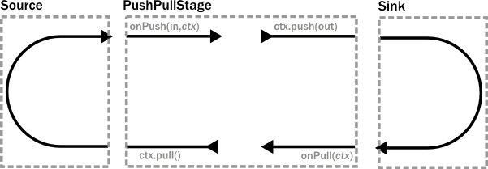
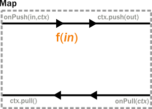

.. _stream-customize-scala:

########################
Custom stream processing
########################

While the processing vocabulary of Akka Streams is quite rich (see the :ref:`stream-cookbook-scala` for examples) it
is sometimes necessary to define new transformation stages either because some functionality is missing from the
stock operations, or for performance reasons. In this part we show how to build custom processing stages and graph
junctions of various kinds.

Custom linear processing stages
===============================

To extend the available transformations on a :class:`Flow` or :class:`Source` one can use the ``transform()`` method
which takes a factory function returning a :class:`Stage`. Stages come in different flavors swhich we will introduce in this
page.

Using PushPullStage
-------------------

The most elementary transformation stage is the :class:`PushPullStage` which can express a large class of algorithms
working on streams. A :class:`PushPullStage` can be illustrated as a box with two "input" and two "output ports" as it is
seen in the illustration below.

The "input ports" are implemented as event handlers ``onPush(elem,ctx)`` and ``onPull(ctx)`` while "output ports"
correspond to methods on the :class:`Context` object that is handed as a parameter to the event handlers. By calling
exactly one "output port" method we wire up these four ports in various ways which we demonstrate shortly.

.. warning::
   There is one very important rule to remember when working with a ``Stage``. **Exactly one** method should be called
   on the **currently passed** :class:`Context` **exactly once** and as the **last statement of the handler** where the return type
   of the called method **matches the expected return type of the handler**. Any violation of this rule will
   almost certainly result in unspecified behavior (in other words, it will break in spectacular ways). Exceptions
   to this rule are the query methods ``isHolding()`` and ``isFinishing()``

To illustrate these concepts we create a small :class:`PushPullStage` that implements the ``map`` transformation.

Map calls ``ctx.push()`` from the ``onPush()`` handler and it also calls ``ctx.pull()`` form the ``onPull``
handler resulting in the conceptual wiring above, and fully expressed in code below:

.. includecode:: code/docs/stream/FlowStagesSpec.scala#one-to-one

Map is a typical example of a one-to-one transformation of a stream. To demonstrate a many-to-one stage we will implement
filter. The conceptual wiring of ``Filter`` looks like this:

.. image:: ../images/stage_filter.png
   :align: center
   :width: 300

As we see above, if the given predicate matches the current element we are propagating it downwards, otherwise
we return the "ball" to our upstream so that we get the new element. This is achieved by modifying the map
example by adding a conditional in the ``onPush`` handler and decide between a ``ctx.pull()`` or ``ctx.push()`` call
(and of course not having a mapping ``f`` function).

.. includecode:: code/docs/stream/FlowStagesSpec.scala#many-to-one

To complete the picture we define a one-to-many transformation as the next step. We chose a straightforward example stage
that emits every upstream element twice downstream. The conceptual wiring of this stage looks like this:

.. image:: ../images/stage_doubler.png
   :align: center
   :width: 300

This is a stage that has state: the last element it has seen, and a flag ``oneLeft`` that indicates if we
have duplicated this last element already or not. Looking at the code below, the reader might notice that our ``onPull``
method is more complex than it is demonstrated by the figure above. The reason for this is completion handling, which we
will explain a little bit later. For now it is enough to look at the ``if(!ctx.isFinishing)`` block which
corresponds to the logic we expect by looking at the conceptual picture.

.. includecode:: code/docs/stream/FlowStagesSpec.scala#one-to-many

Finally, to demonstrate all of the stages above, we put them together into a processing chain, which conceptually
would correspond to the following structure:

.. image:: ../images/stage_chain.png
   :align: center
   :width: 650

In code this is only a few lines, using the ``transform`` method to inject our custom processing into a stream:

.. includecode:: code/docs/stream/FlowStagesSpec.scala#stage-chain

Completion handling
^^^^^^^^^^^^^^^^^^^

Completion handling usually (but not exclusively) comes into the picture when processing stages need to emit a few
more elements after their upstream source has been completed. We have seen an example of this in our ``Duplicator`` class
where the last element needs to be doubled even after the upstream neighbor stage has been completed. Since the
``onUpstreamFinish()`` handler expects a :class:`TerminationDirective` as the return type we are only allowed to call
``ctx.finish()``, ``ctx.fail()`` or ``ctx.absorbTermination()``. Since the first two of these available methods will
immediately terminate, our only option is ``absorbTermination()``. It is also clear from the return type of
``onUpstreamFinish`` that we cannot call ``ctx.push()`` but we need to emit elements somehow! The trick is that after
calling ``absorbTermination()`` the ``onPull()`` handler will be called eventually, and at the same time
``ctx.isFinishing`` will return true, indicating that ``ctx.pull()`` cannot be called anymore. Now we are free to
emit additional elementss and call ``ctx.finish()`` or ``ctx.pushAndFinish()`` eventually to finish processing.

.. note::
   The reason for this slightly complex termination sequence is that the underlying ``onComplete`` signal of
   Reactive Streams may arrive without any pending demand, i.e. without respecting backpressure. This means that
   our push/pull structure that was illustrated in the figure of our custom processing chain does not
   apply to termination. Unlike our neat model that is analogous to a ball that bounces back-and-forth in a
   pipe (it bounces back on ``Filter``, ``Duplicator`` for example) cannot describe the termination signals. By calling
   ``absorbTermination()`` the execution environment checks if the conceptual token was *above* the current stage at
   that time (which means that it will never come back, so the environment immediately calls ``onPull``) or it was
   *below* (which means that it will come back eventually, so the environment does not need to call anything yet).

Using PushStage
---------------

Many one-to-one and many-to-one transformations do not need to override the ``onPull()`` handler at all since all
they do is just propagate the pull upwards. For such transformations it is better to extend PushStage directly. For
example our ``Map`` and ``Filter`` would look like this:

.. includecode:: code/docs/stream/FlowStagesSpec.scala#pushstage

The reason to use ``PushStage`` is not just cosmetic: internal optimizations rely on the fact that the onPull method
only calls ``ctx.pull()`` and allow the environment do process elements faster than without this knowledge. By
extending ``PushStage`` the environment can be sure that ``onPull()`` was not overridden since it is ``final`` on
``PushStage``.

Using StatefulStage
-------------------

On top of ``PushPullStage`` which is the most elementary and low-level abstraction and ``PushStage`` that is a
convenience class that also informs the environment about possible optimizations ``StatefulStage`` is a new tool that
builds on ``PushPullStage`` directly, adding various convenience methods on top of it. It is possible to explicitly
maintain state-machine like states using its ``become()`` method to encapsulates states explicitly. There is also
a handy ``emit()`` method that simplifies emitting multiple values given as an iterator. To demonstrate this feature
we reimplemented ``Duplicator`` in terms of a ``StatefulStage``:

.. includecode:: code/docs/stream/FlowStagesSpec.scala#doubler-stateful

Using DetachedStage
-------------------

*TODO*

Custom graph processing junctions
=================================

Using FlexiMerge
----------------

*TODO*

Using FlexiRoute
----------------

*TODO*

