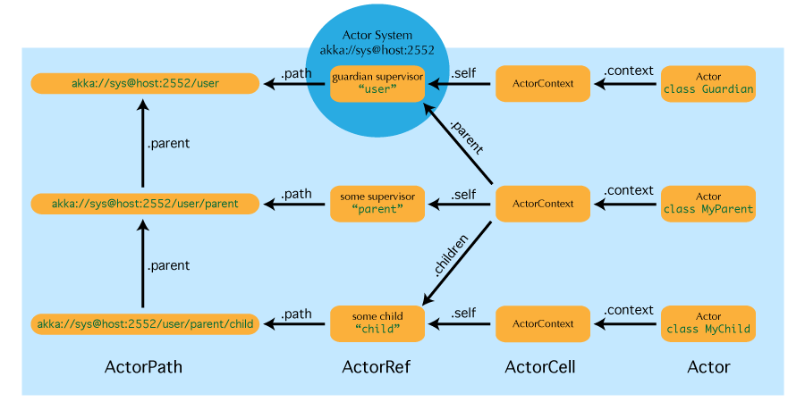

.. _addressing:

Actor References, Paths and Addresses
=====================================

This chapter describes how actors are identified and located within a possibly
distributed actor system. It ties into the central idea that
:ref:`actor-systems` form intrinsic supervision hierarchies as well as that
communication between actors is transparent with respect to their placement
across multiple network nodes.



The above image displays the relationship between the most important entities
within an actor system, please read on for the details.

What is an Actor Reference?
---------------------------

An actor reference is a subtype of :class:`ActorRef`, whose foremost purpose is
to support sending messages to the actor it represents. Each actor has access
to its canonical (local) reference through the :meth:`self` field; this
reference is also included as sender reference by default for all messages sent
to other actors. Conversely, during message processing the actor has access to
a reference representing the sender of the current message through the
:meth:`sender` field.

There are several different types of actor references that are supported
depending on the configuration of the actor system:

- Purely local actor references are used by actor systems which are not
  configured to support networking functions. These actor references cannot
  ever be sent across a network connection while retaining their functionality.
- Local actor references when remoting is enabled are used by actor systems
  which support networking functions for those references which represent
  actors within the same JVM. In order to be recognizable also when sent to
  other network nodes, these references include protocol and remote addressing
  information.
- There is a subtype of local actor references which is used for routers (i.e.
  actors mixing in the :class:`Router` trait). Its logical structure is the
  same as for the aforementioned local references, but sending a message to
  them dispatches to one of their children directly instead.
- Remote actor references represent actors which are reachable using remote
  communication, i.e. sending messages to them will serialize the messages
  transparently and send them to the other JVM.
- There are several special types of actor references which behave like local
  actor references for all practical purposes:

  - :class:`PromiseActorRef` is the special representation of a :meth:`Promise` for
    the purpose of being completed by the response from an actor; it is created
    by the :meth:`ActorRef.ask` invocation.
  - :class:`DeadLetterActorRef` is the default implementation of the dead
    letters service, where all messages are re-routed whose routees are shut
    down or non-existent.
  - :class:`EmptyLocalActorRef` is what is returned when looking up a
    non-existing local actor path: it is equivalent to a
    :class:`DeadLetterActorRef`, but it retains its path so that it can be sent
    over the network and compared to other existing actor refs for that path,
    some of which might have been obtained before the actor stopped existing.

- And then there are some one-off internal implementations which you should
  never really see:

  - There is an actor reference which does not represent an actor but acts only
    as a pseudo-supervisor for the root guardian, we call it “the one who walks
    the bubbles of space-time”.
  - The first logging service started before actually firing up actor creation
    facilities is a fake actor reference which accepts log events and prints
    them directly to standard output; it is :class:`Logging.StandardOutLogger`.

- **(Future Extension)** Cluster actor references represent clustered actor
  services which may be replicated, migrated or load-balanced across multiple
  cluster nodes. As such they are virtual names which the cluster service
  translates into local or remote actor references as appropriate.

What is an Actor Path?
----------------------

Since actors are created in a strictly hierarchical fashion, there exists a
unique sequence of actor names given by recursively following the supervision
links between child and parent down towards the root of the actor system. This
sequence can be seen as enclosing folders in a file system, hence we adopted
the name “path” to refer to it. As in some real file-systems there also are
“symbolic links”, i.e. one actor may be reachable using more than one path,
where all but one involve some translation which decouples part of the path
from the actor’s actual supervision ancestor line; these specialities are
described in the sub-sections to follow.

An actor path consists of an anchor, which identifies the actor system,
followed by the concatenation of the path elements, from root guardian to the
designated actor; the path elements are the names of the traversed actors and
are separated by slashes.

Actor Path Anchors
^^^^^^^^^^^^^^^^^^

Each actor path has an address component, describing the protocol and location
by which the corresponding actor is reachable, followed by the names of the
actors in the hierarchy from the root up. Examples are::

  "akka://my-system/user/service-a/worker1"               // purely local
  "akka://my-system@serv.example.com:5678/user/service-b" // local or remote
  "cluster://my-cluster/service-c"                       // clustered (Future Extension)

Here, ``akka`` is the default remote protocol for the 2.0 release, and others
are pluggable. The interpretation of the host & port part (i.e.
``serv.example.com:5678`` in the example) depends on the transport mechanism
used, but it must abide by the URI structural rules.

Logical Actor Paths
^^^^^^^^^^^^^^^^^^^

The unique path obtained by following the parental supervision links towards
the root guardian is called the logical actor path. This path matches exactly
the creation ancestry of an actor, so it is completely deterministic as soon as
the actor system’s remoting configuration (and with it the address component of
the path) is set.

Physical Actor Paths
^^^^^^^^^^^^^^^^^^^^

While the logical actor path describes the functional location within one actor
system, configuration-based remote deployment means that an actor may be
created on a different network host as its parent, i.e. within a different
actor system. In this case, following the actor path from the root guardian up
entails traversing the network, which is a costly operation. Therefore, each
actor also has a physical path, starting at the root guardian of the actor
system where the actual actor object resides. Using this path as sender
reference when querying other actors will let them reply directly to this
actor, minimizing delays incurred by routing.

One important aspect is that a physical actor path never spans multiple actor
systems or JVMs. This means that the logical path (supervision hierarchy) and
the physical path (actor deployment) of an actor may diverge if one of its
ancestors is remotely supervised.

Virtual Actor Paths **(Future Extension)**
^^^^^^^^^^^^^^^^^^^^^^^^^^^^^^^^^^^^^^^^^^

In order to be able to replicate and migrate actors across a cluster of Akka
nodes, another level of indirection has to be introduced. The cluster component
therefore provides a translation from virtual paths to physical paths which may
change in reaction to node failures, cluster rebalancing, etc.

*This area is still under active development, expect updates in this section
for the 2.1 release.*

How are Actor References obtained?
----------------------------------

There are two general categories to how actor references may be obtained: by
creating actors or by looking them up, where the latter functionality comes in
the two flavours of creating actor references from concrete actor paths and
querying the logical actor hierarchy.

*While local and remote actor references and their paths work in the same way
concerning the facilities mentioned below, the exact semantics of clustered
actor references and their paths—while certainly as similar as possible—may
differ in certain aspects, owing to the virtual nature of those paths. Expect
updates for the 2.1 release.*

Creating Actors
^^^^^^^^^^^^^^^

An actor system is typically started by creating actors beneath the guardian
actor using the :meth:`ActorSystem.actorOf` method and then using
:meth:`ActorContext.actorOf` from within the created actors to spawn the actor
tree. These methods return a reference to the newly created actor. Each actor
has direct access to references for its parent, itself and its children. These
references may be sent within messages to other actors, enabling those to reply
directly.

Looking up Actors by Concrete Path
^^^^^^^^^^^^^^^^^^^^^^^^^^^^^^^^^^

In addition, actor references may be looked up using the
:meth:`ActorSystem.actorFor` method, which returns an (unverified) local,
remote or clustered actor reference. Sending messages to such a reference or
attempting to observe its liveness will traverse the actor hierarchy of the
actor system from top to bottom by passing messages from parent to child until
either the target is reached or failure is certain, i.e. a name in the path
does not exist (in practice this process will be optimized using caches, but it
still has added cost compared to using the physical actor path, which can for
example be obtained from the sender reference included in replies from that
actor). The messages passed are handled automatically by Akka, so this process
is not visible to client code.

Absolute vs. Relative Paths
```````````````````````````

In addition to :meth:`ActorSystem.actorFor` there is also
:meth:`ActorContext.actorFor`, which is available inside any actor as
``context.actorFor``. This yields an actor reference much like its twin on
:class:`ActorSystem`, but instead of looking up the path starting from the root
of the actor tree it starts out on the current actor. Path elements consisting
of two dots (``".."``) may be used to access the parent actor. You can for
example send a message to a specific sibling::

  context.actorFor("../brother") ! msg

Absolute paths may of course also be looked up on `context` in the usual way, i.e.

.. code-block:: scala

  context.actorFor("/user/serviceA") ! msg

will work as expected.

Querying the Logical Actor Hierarchy
^^^^^^^^^^^^^^^^^^^^^^^^^^^^^^^^^^^^

Since the actor system forms a file-system like hierarchy, matching on paths is
possible in the same way as supported by Unix shells: you may replace (parts
of) path element names with wildcards (`«*»` and `«?»`) to formulate a
selection which may match zero or more actual actors. Because the result is not
a single actor reference, it has a different type :class:`ActorSelection` and
does not support the full set of operations an :class:`ActorRef` does.
Selections may be formulated using the :meth:`ActorSystem.actorSelection` and
:meth:`ActorContext.actorSelection` methods and do support sending messages::

  context.actorSelection("../*") ! msg

will send `msg` to all siblings including the current actor. As for references
obtained using `actorFor`, a traversal of the supervision hierarchy is done in
order to perform the message send. As the exact set of actors which match a
selection may change even while a message is making its way to the recipients,
it is not possible to watch a selection for liveliness changes. In order to do
that, resolve the uncertainty by sending a request and gathering all answers,
extracting the sender references, and then watch all discovered concrete
actors. This scheme of resolving a selection may be improved upon in a future
release.

.. _actorOf-vs-actorFor:

Summary: ``actorOf`` vs. ``actorFor``
^^^^^^^^^^^^^^^^^^^^^^^^^^^^^^^^^^^^^

.. note::

  What the above sections described in some detail can be summarized and
  memorized easily as follows:

  - ``actorOf`` only ever creates a new actor, and it creates it as a direct
    child of the context on which this method is invoked (which may be any
    actor or actor system).

  - ``actorFor`` only ever looks up an existing actor, i.e. does not create
    one.

Reusing Actor Paths
-------------------

When an actor is terminated, its path will point to the dead letter mailbox,
DeathWatch will publish its final transition and in general it is not expected
to come back to life again (since the actor life cycle does not allow this).
While it is possible to create an actor at a later time with an identical
path—simply due to it being impossible to enforce the opposite without keeping
the set of all actors ever created available—this is not good practice: remote
actor references which “died” suddenly start to work again, but without any
guarantee of ordering between this transition and any other event, hence the
new inhabitant of the path may receive messages which were destined for the
previous tenant.

It may be the right thing to do in very specific circumstances, but make sure
to confine the handling of this precisely to the actor’s supervisor, because
that is the only actor which can reliably detect proper deregistration of the
name, before which creation of the new child will fail.

It may also be required during testing, when the test subject depends on being
instantiated at a specific path. In that case it is best to mock its supervisor
so that it will forward the Terminated message to the appropriate point in the
test procedure, enabling the latter to await proper deregistration of the name.

The Interplay with Remote Deployment
------------------------------------

When an actor creates a child, the actor system’s deployer will decide whether
the new actor resides in the same JVM or on another node. In the second case,
creation of the actor will be triggered via a network connection to happen in a
different JVM and consequently within a different actor system. The remote
system will place the new actor below a special path reserved for this purpose
and the supervisor of the new actor will be a remote actor reference
(representing that actor which triggered its creation). In this case,
:meth:`context.parent` (the supervisor reference) and
:meth:`context.path.parent` (the parent node in the actor’s path) do not
represent the same actor. However, looking up the child’s name within the
supervisor will find it on the remote node, preserving logical structure e.g.
when sending to an unresolved actor reference.

.. image:: RemoteDeployment.png

The Interplay with Clustering **(Future Extension)**
----------------------------------------------------

*This section is subject to change!*

When creating a scaled-out actor subtree, a cluster name is created for a
routed actor reference, where sending to this reference will send to one (or
more) of the actual actors created in the cluster. In order for those actors to
be able to query other actors while processing their messages, their sender
reference must be unique for each of the replicas, which means that physical
paths will be used as ``self`` references for these instances. In the case
of replication for achieving fault-tolerance the opposite is required: the
``self`` reference will be a virtual (cluster) path so that in case of
migration or fail-over communication is resumed with the fresh instance.

What is the Address part used for?
----------------------------------

When sending an actor reference across the network, it is represented by its
path. Hence, the path must fully encode all information necessary to send
messages to the underlying actor. This is achieved by encoding protocol, host
and port in the address part of the path string. When an actor system receives
an actor path from a remote node, it checks whether that path’s address matches
the address of this actor system, in which case it will be resolved to the
actor’s local reference. Otherwise, it will be represented by a remote actor
reference.

.. _toplevel-paths:

Top-Level Scopes for Actor Paths
--------------------------------

At the root of the path hierarchy resides the root guardian above which all
other actors are found; its name is ``"/"``. The next level consists of the
following:

- ``"/user"`` is the guardian actor for all user-created top-level actors;
  actors created using :meth:`ActorSystem.actorOf` are found below this one.
- ``"/system"`` is the guardian actor for all system-created top-level actors,
  e.g. logging listeners or actors automatically deployed by configuration at
  the start of the actor system.
- ``"/deadLetters"`` is the dead letter actor, which is where all messages sent to
  stopped or non-existing actors are re-routed (on a best-effort basis: messages
  may be lost even within the local JVM).
- ``"/temp"`` is the guardian for all short-lived system-created actors, e.g.
  those which are used in the implementation of :meth:`ActorRef.ask`.
- ``"/remote"`` is an artificial path below which all actors reside whose
  supervisors are remote actor references

The need to structure the name space for actors like this arises from a central
and very simple design goal: everything in the hierarchy is an actor, and all
actors function in the same way. Hence you can not only look up the actors you
created, you can also look up the system guardian and send it a message (which
it will dutifully discard in this case). This powerful principle means that
there are no quirks to remember, it makes the whole system more uniform and
consistent.

If you want to read more about the top-level structure of an actor system, have
a look at :ref:`toplevel-supervisors`.

