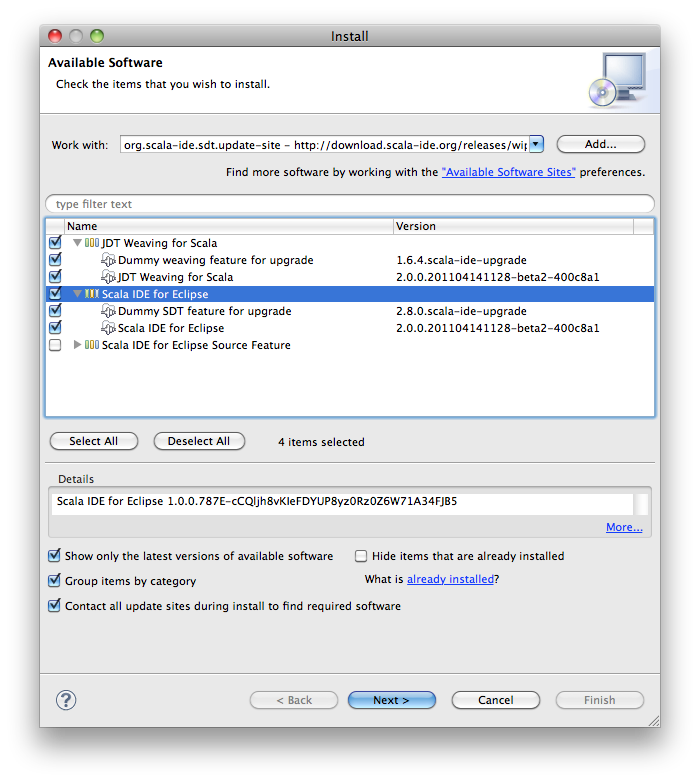
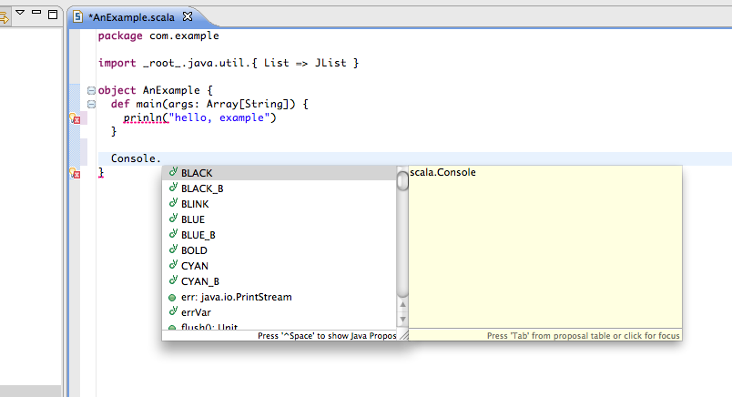
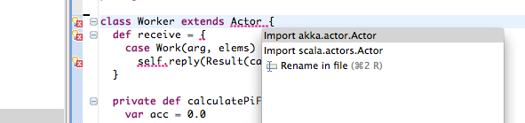

.. _getting-started-first-scala-eclipse:

Getting Started Tutorial (Scala with Eclipse): First Chapter
============================================================

Introduction
------------

Welcome to the first tutorial on how to get started with Akka and Scala. We
assume that you already know what Akka and Scala are and will now focus on the
steps necessary to start your first project.

There are two variations of this first tutorial:

- creating a standalone project and run it from the command line
- creating a SBT (Simple Build Tool) project and running it from within SBT

Since they are so similar we will present them both.

The sample application that we will create is using actors to calculate the
value of Pi. Calculating Pi is a CPU intensive operation and we will utilize
Akka Actors to write a concurrent solution that scales out to multi-core
processors. This sample will be extended in future tutorials to use Akka Remote
Actors to scale out on multiple machines in a cluster.

We will be using an algorithm that is called "embarrassingly parallel" which
just means that each job is completely isolated and not coupled with any other
job. Since this algorithm is so parallelizable it suits the actor model very
well.

Here is the formula for the algorithm we will use:

.. image:: ../images/pi-formula.png

In this particular algorithm the master splits the series into chunks which are
sent out to each worker actor to be processed. When each worker has processed
its chunk it sends a result back to the master which aggregates the total
result.

Tutorial source code
--------------------

If you want don't want to type in the code and/or set up an SBT project then you can
check out the full tutorial from the Akka GitHub repository. It is in the
``akka-tutorials/akka-tutorial-first`` module. You can also browse it online
`here`__, with the actual source code `here`__.

__ https://github.com/jboner/akka/tree/master/akka-tutorials/akka-tutorial-first
__ https://github.com/jboner/akka/blob/master/akka-tutorials/akka-tutorial-first/src/main/scala/Pi.scala

To check out the code using Git invoke the following::

    $ git clone git://github.com/jboner/akka.git

Then you can navigate down to the tutorial::

    $ cd akka/akka-tutorials/akka-tutorial-first

Prerequisites
-------------

This tutorial assumes that you have Java 1.6 or later installed on you machine
and ``java`` on your ``PATH``. You also need to know how to run commands in a
shell (ZSH, Bash, DOS etc.) and a decent text editor or IDE to type in the Scala
code.

You need to make sure that ``$JAVA_HOME`` environment variable is set to the
root of the Java distribution. You also need to make sure that the
``$JAVA_HOME/bin`` is on your ``PATH``::

    $ export JAVA_HOME=..root of java distribution..
    $ export PATH=$PATH:$JAVA_HOME/bin

You can test your installation by invoking ``java``::

    $ java -version
    java version "1.6.0_24"
    Java(TM) SE Runtime Environment (build 1.6.0_24-b07-334-10M3326)
    Java HotSpot(TM) 64-Bit Server VM (build 19.1-b02-334, mixed mode)

Downloading and installing Akka
-------------------------------

To build and run the tutorial sample from the command line, you have to download
Akka. If you prefer to use SBT to build and run the sample then you can skip this
section and jump to the next one.

Let's get the ``akka-2.0-SNAPSHOT.zip`` distribution of Akka from
http://akka.io/downloads/ which includes everything we need for this
tutorial. Once you have downloaded the distribution unzip it in the folder you
would like to have Akka installed in. In my case I choose to install it in
``/Users/jboner/tools/``, simply by unzipping it to this directory.

You need to do one more thing in order to install Akka properly: set the
``AKKA_HOME`` environment variable to the root of the distribution. In my case
I'm opening up a shell, navigating down to the distribution, and setting the
``AKKA_HOME`` variable::

    $ cd /Users/jboner/tools/akka-2.0-SNAPSHOT
    $ export AKKA_HOME=`pwd`
    $ echo $AKKA_HOME
    /Users/jboner/tools/akka-2.0-SNAPSHOT

The distribution looks like this::

    $ ls -1
    bin
    config
    deploy
    doc
    lib
    src

- In the ``bin`` directory we have scripts for starting the Akka Microkernel.
- In the ``config`` directory we have the Akka conf files.
- In the ``deploy`` directory we can place applications to be run with the microkernel.
- In the ``doc`` directory we have the documentation, API, and doc JARs.
- In the ``lib`` directory we have the Scala and Akka JARs.
- In the ``src`` directory we have the source JARs for Akka.

The only JAR we will need for this tutorial (apart from the
``scala-library.jar`` JAR) is the ``akka-actor-2.0-SNAPSHOT.jar`` JAR in the ``lib/akka``
directory. This is a self-contained JAR with zero dependencies and contains
everything we need to write a system using Actors.

Akka is very modular and has many JARs for containing different features. The
modules are:

- ``akka-actor`` -- Actors

- ``akka-remote`` -- Remote Actors

- ``akka-slf4j`` -- SLF4J Event Handler Listener for logging with SLF4J

- ``akka-testkit`` -- Toolkit for testing Actors

- ``akka-kernel`` -- Akka microkernel for running a bare-bones mini application server

- ``akka-durable-mailboxes`` -- Durable mailboxes: file-based, MongoDB, Redis, Zookeeper

.. - ``akka-amqp`` -- AMQP integration
.. - ``akka-stm-2.0-SNAPSHOT.jar`` -- STM (Software Transactional Memory), transactors and transactional datastructures
.. - ``akka-camel-2.0-SNAPSHOT.jar`` -- Apache Camel Actors integration (it's the best way to have your Akka application communicate with the rest of the world)
.. - ``akka-camel-typed-2.0-SNAPSHOT.jar`` -- Apache Camel Typed Actors integration
.. - ``akka-spring-2.0-SNAPSHOT.jar`` -- Spring framework integration

Downloading and installing the Scala IDE for Eclipse
----------------------------------------------------

If you want to use Eclipse for coding your Akka tutorial, you need to install the Scala plugin for Eclipse.
This plugin comes with its own version of Scala, so if you don't plan to run the example from the command line,
you don't need to download the Scala distribution (and you can skip the next section).

You can install this plugin using the regular update mechanism. First choose a version of the IDE from
`http://download.scala-ide.org <http://download.scala-ide.org>`_. We recommend you choose 2.0.x, which
comes with Scala 2.9. Copy the corresponding URL and then choose ``Help/Install New Software`` and paste
the URL you just copied. You should see something similar to the following image.

Once the installation is finished, you need to restart Eclipse. The first time the plugin starts it will
open a diagnostics window and offer to fix several settings, such as the delay for content assist (code-completion)
or the shown completion proposal types.

.. image:: ../images/diagnostics-window.png

Accept the recommended settings, and follow the instructions if you need to increase the heap size of Eclipse.

Check that the installation succeeded by creating a new Scala project (``File/New>Scala Project``), and typing some code.
You should have content-assist, hyperlinking to definitions, instant error reporting, and so on.

You are ready to code now!

Downloading and installing Scala
--------------------------------

To build and run the tutorial sample from the command line, you have to install
the Scala distribution. If you prefer to use SBT to build and run the sample
then you can skip this section and jump to the next one.

Scala can be downloaded from http://www.scala-lang.org/downloads. Browse there
and download the Scala 2.9.1 release. If you pick the ``tgz`` or ``zip``
distribution then just unzip it where you want it installed. If you pick the
IzPack Installer then double click on it and follow the instructions.

You also need to make sure that the ``scala-2.9.1/bin`` (if that is the
directory where you installed Scala) is on your ``PATH``::

    $ export PATH=$PATH:scala-2.9.1/bin

You can test your installation by invoking scala::

    $ scala -version
    Scala code runner version 2.9.1.final -- Copyright 2002-2011, LAMP/EPFL

Looks like we are all good. Finally let's create a source file ``Pi.scala`` for
the tutorial and put it in the root of the Akka distribution in the ``tutorial``
directory (you have to create it first).

Some tools require you to set the ``SCALA_HOME`` environment variable to the
root of the Scala distribution, however Akka does not require that.

Creating an Akka project in Eclipse
-----------------------------------

If you have not already done so, now is the time to create an Eclipse project for our tutorial.
Use the ``New Scala Project`` wizard and accept the default settings. Once the project is open,
we need to add the akka libraries to the *build path*. Right click on the project and choose ``Properties``,
then click on ``Java Build Path``. Go to ``Libraries`` and click on ``Add External Jars..``, then navigate
to the location where you installed akka and choose ``akka-actor.jar``. You should see something similar to this:

.. image:: ../images/build-path.png

Using SBT in Eclipse
^^^^^^^^^^^^^^^^^^^^

If you are an `SBT <https://github.com/harrah/xsbt/wiki>`_ user, you can follow the :ref:`getting-started-first-scala-download-sbt`
instruction and additionally install the ``sbteclipse`` plugin. This adds support for generating Eclipse project files
from your SBT project. You need to install the plugin as described in the `README of sbteclipse
<https://github.com/typesafehub/sbteclipse>`_

Then run the ``eclipse`` target to generate the Eclipse project::

    $ sbt
    > eclipse

The options `create-src` and `with-sources` are useful::

    $ sbt
    > eclipse create-src with-sources

* create-src to create the common source directories, e.g. src/main/scala, src/main/test
* with-sources to create source attachments for the library dependencies

Next you need to import this project in Eclipse, by choosing ``Eclipse/Import.. Existing Projects into Workspace``.
Navigate to the directory where you defined your SBT project and choose import:

.. image:: ../images/import-project.png

Now we have the basis for an Akka Eclipse application, so we can..

Start writing the code
----------------------

The design we are aiming for is to have one ``Master`` actor initiating the computation, creating a set of ``Worker`` actors. Then it splits up the work into discrete chunks, and sends these chunks to the different workers in a round-robin fashion. The master waits until all the workers have completed their work and sent back results for aggregation. When computation is completed the master prints out the result, shuts down all workers and then itself.

With this in mind, let's now create the messages that we want to have flowing in the system.

Creating the messages
---------------------

We start by creating a package for our application, let's call it ``akka.tutorial.first.scala``.
We start by creating case classes for each type of message in our application, so we can place them in a hierarchy,
call it ``PiMessage``. Right click on the package and choose ``New Scala Class``, and enter ``PiMessage`` as
the name of the class.

We need four different messages:

- ``Calculate`` -- sent to the ``Master`` actor to start the calculation
- ``Work`` -- sent from the ``Master`` actor to the ``Worker`` actors containing
  the work assignment
- ``Result`` -- sent from the ``Worker`` actors to the ``Master`` actor
  containing the result from the worker's calculation
- ``PiApproximation`` -- sent from the ``Master`` actor to the
  ``Listener`` actor containing the the final pi result and how long time
  the calculation took

Messages sent to actors should always be immutable to avoid sharing mutable state.
In Scala we have 'case classes' which make excellent messages. So let's start by creating three messages as case classes.
We also create a common base trait for our messages (that we define as being ``sealed`` in order to prevent creating messages
outside our control):

.. includecode:: ../../akka-tutorials/akka-tutorial-first/src/main/scala/akka/tutorial/first/scala/Pi.scala#messages

Creating the worker
-------------------

Now we can create the worker actor. This is done by mixing in the ``Actor``
trait and defining the ``receive`` method. The ``receive`` method defines our
message handler. We expect it to be able to handle the ``Work`` message so we
need to add a handler for this message:

.. includecode:: ../../akka-tutorials/akka-tutorial-first/src/main/scala/akka/tutorial/first/scala/Pi.scala#worker
   :exclude: calculatePiFor

The ``Actor`` trait is defined in ``akka.actor`` and you can either import it explicitly,
or let Eclipse do it for you when it cannot resolve the ``Actor`` trait.
The quick fix option (``Ctrl-F1``) will offer two options:

Choose the Akka Actor and move on.

As you can see we have now created an ``Actor`` with a ``receive`` method as a
handler for the ``Work`` message. In this handler we invoke the
``calculatePiFor(..)`` method, wrap the result in a ``Result`` message and send
it back asynchronously to the original sender using the ``sender`` reference.
In Akka the sender reference is implicitly passed along with the message so that
the receiver can always reply or store away the sender reference for future use.

The only thing missing in our ``Worker`` actor is the implementation on the
``calculatePiFor(..)`` method. While there are many ways we can implement this
algorithm in Scala, in this introductory tutorial we have chosen an imperative
style using a for comprehension and an accumulator:

.. includecode:: ../../akka-tutorials/akka-tutorial-first/src/main/scala/akka/tutorial/first/scala/Pi.scala#calculatePiFor

Creating the master
-------------------

Now create a new class for the master actor. The master actor is a little bit
more involved.  In its constructor we create a round-robin router to make it easier
to spread out the work evenly between the workers. First we need to add some imports:

.. includecode:: ../../akka-tutorials/akka-tutorial-first/src/main/scala/akka/tutorial/first/scala/Pi.scala#imports

and then we can create the router:

.. includecode:: ../../akka-tutorials/akka-tutorial-first/src/main/scala/akka/tutorial/first/scala/Pi.scala#create-router

Now we have a router that is representing all our workers in a single
abstraction. So now let's create the master actor. We pass it three integer variables:

- ``nrOfWorkers`` -- defining how many workers we should start up
- ``nrOfMessages`` -- defining how many number chunks to send out to the workers
- ``nrOfElements`` -- defining how big the number chunks sent to each worker should be

Here is the master actor:

.. includecode:: ../../akka-tutorials/akka-tutorial-first/src/main/scala/akka/tutorial/first/scala/Pi.scala#master
   :exclude: handle-messages

A couple of things are worth explaining further.

Note that we are passing in a ``ActorRef`` to the ``Master`` actor. This is used to
report the the final result to the outside world.

But we are not done yet. We are missing the message handler for the ``Master``
actor. This message handler needs to be able to react to two different messages:

- ``Calculate`` -- which should start the calculation
- ``Result`` -- which should aggregate the different results

The ``Calculate`` handler is sending out work to all the ``Worker`` via its router.

The ``Result`` handler gets the value from the ``Result`` message and aggregates it to
our ``pi`` member variable. We also keep track of how many results we have received back,
and if that matches the number of tasks sent out, the ``Master`` actor considers itself done and
sends the final result to the ``listener``. When done it also invokes the ``context.stop(self)``
method to stop itself *and* all its supervised actors.
In this case it has one supervised actor, the router, and this in turn has ``nrOfWorkers`` supervised actors.
All of them will be stopped automatically as the invocation of any supervisor's ``stop`` method
will propagate down to all its supervised 'children'.

Let's capture this in code:

.. includecode:: ../../akka-tutorials/akka-tutorial-first/src/main/scala/akka/tutorial/first/scala/Pi.scala#master-receive

Creating the result listener
----------------------------

The listener is straightforward. When it receives the ``PiApproximation`` from the ``Master`` it
prints the result and shuts down the ``ActorSystem``.

.. includecode:: ../../akka-tutorials/akka-tutorial-first/src/main/scala/akka/tutorial/first/scala/Pi.scala#result-listener

Bootstrap the calculation
-------------------------

Now the only thing that is left to implement is the runner that should bootstrap and run the calculation for us.
We do that by creating an object that we call ``Pi``, here we can extend the ``App`` trait in Scala,
which means that we will be able to run this as an application directly from the command line or using the Eclipse Runner.

The ``Pi`` object is a perfect container module for our actors and messages, so let's put them all there.
We also create a method ``calculate`` in which we start up the ``Master`` actor and wait for it to finish:

.. includecode:: ../../akka-tutorials/akka-tutorial-first/src/main/scala/akka/tutorial/first/scala/Pi.scala#app
   :exclude: actors-and-messages

As you can see the *calculate* method above it creates an ``ActorSystem`` and this is the Akka container which
will contain all actors created in that "context". An example of how to create actors in the container
is the *'system.actorOf(...)'* line in the calculate method. In this case we create two top level actors.
If you instead where in an actor context, i.e. inside an actor creating other actors, you should use
*context.actorOf(...)*. This is illustrated in the Master code above.

That's it. Now we are done.

Run it from Eclipse
-------------------

Eclipse builds your project on every save when ``Project/Build Automatically`` is set.
If not, bring you project up to date by clicking ``Project/Build Project``. If there are no compilation errors,
you can right-click in the editor where ``Pi`` is defined, and choose ``Run as.. /Scala application``.
If everything works fine, you should see::

    Pi approximation:   3.1435501812459323
    Calculation time:   359 millis

You can also define a new Run configuration, by going to ``Run/Run Configurations``. Create a new ``Scala application``
and choose the tutorial project and the main class to be ``akkatutorial.Pi``. You can pass additional command line
arguments to the JVM on the ``Arguments`` page, for instance to define where :ref:`configuration` is:

.. image:: ../images/run-config.png

Once you finished your run configuration, click ``Run``. You should see the same output in the ``Console`` window.
You can use the same configuration for debugging the application, by choosing ``Run/Debug History`` or just ``Debug As``.

Overriding Configuration Externally (Optional)
----------------------------------------------

The sample project includes an ``application.conf`` file in the resources directory:

.. includecode:: ../../akka-tutorials/akka-tutorial-first/src/main/resources/application.conf

If you uncomment the two lines, you should see a change in performance,
hopefully for the better (you might want to increase the number of messages in
the code to prolong the time the application runs). It should be noted that
overriding only works if a router type is given, so just uncommenting
``nr-of-instances`` does not work; see :ref:`routing-scala` for more details.

.. note::

  Make sure that your ``application.conf`` is on the class path when you run
  the application. If running from inside SBT that should already be the case,
  otherwise you need to add the directory containing this file to the JVM’s
  ``-classpath`` option.

Conclusion
----------

We have learned how to create our first Akka project using Akka's actors to
speed up a computation-intensive problem by scaling out on multi-core processors
(also known as scaling up). We have also learned to compile and run an Akka
project using either the tools on the command line or the SBT build system.

If you have a multi-core machine then I encourage you to try out different
number of workers (number of working actors) by tweaking the ``nrOfWorkers``
variable to for example; 2, 4, 6, 8 etc. to see performance improvement by
scaling up.

Happy hakking.
