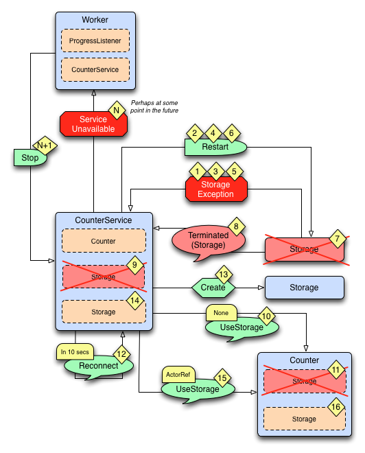

.. _fault-tolerance-sample-java:

Diagrams of the Fault Tolerance Sample (Java)
----------------------------------------------

.. image:: ../images/faulttolerancesample-normal-flow.png

*The above diagram illustrates the normal message flow.*

**Normal flow:**

======= ==================================================================================
Step    Description
======= ==================================================================================
1       The progress ``Listener`` starts the work.
2       The ``Worker`` schedules work by sending ``Do`` messages periodically to itself
3, 4, 5 When receiving ``Do`` the ``Worker`` tells the ``CounterService``
        to increment the counter, three times. The ``Increment`` message is forwarded
        to the ``Counter``, which updates its counter variable and sends current value
        to the ``Storage``.
6, 7    The ``Worker`` asks the ``CounterService`` of current value of the counter and pipes
        the result back to the ``Listener``.
======= ==================================================================================

*The above diagram illustrates what happens in case of storage failure.*

**Failure flow:**

=========== ==================================================================================
Step        Description
=========== ==================================================================================
1           The ``Storage`` throws ``StorageException``.
2           The ``CounterService`` is supervisor of the ``Storage`` and restarts the
            ``Storage`` when ``StorageException`` is thrown.
3, 4, 5, 6  The ``Storage`` continues to fail and is restarted.
7           After 3 failures and restarts within 5 seconds the ``Storage`` is stopped by its
            supervisor, i.e. the ``CounterService``.
8           The ``CounterService`` is also watching the ``Storage`` for termination and
            receives the ``Terminated`` message when the ``Storage`` has been stopped ...
9, 10, 11   and tells the ``Counter`` that there is no ``Storage``.
12          The ``CounterService`` schedules a ``Reconnect`` message to itself.
13, 14      When it receives the ``Reconnect`` message it creates a new ``Storage`` ...
15, 16      and tells the the ``Counter`` to use the new ``Storage``
=========== ==================================================================================

Full Source Code of the Fault Tolerance Sample (Java)
------------------------------------------------------

.. includecode:: code/akka/docs/actor/japi/FaultHandlingDocSample.java#all
   :exclude: imports,messages,dummydb

