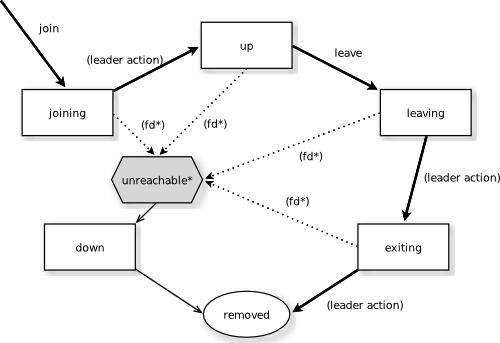

.. _cluster:

######################
 Cluster Specification
######################

.. note:: This document describes the design concepts of the clustering.
   It is divided into two parts, where the first part describes what is
   currently implemented and the second part describes what is planned as
   future enhancements/additions. References to unimplemented parts have
   been marked with the footnote :ref:`[*] <niy>`

The Current Cluster
*******************

Intro
=====

Akka Cluster provides a fault-tolerant decentralized peer-to-peer based cluster
`membership`_ service with no single point of failure or single point of bottleneck.
It does this using `gossip`_ protocols and an automatic `failure detector`_.

Terms
=====

**node**
  A logical member of a cluster. There could be multiple nodes on a physical
  machine. Defined by a `hostname:port:uid` tuple.

**cluster**
  A set of nodes joined together through the `membership`_ service.

**leader**
  A single node in the cluster that acts as the leader. Managing cluster convergence,
  partitions :ref:`[*] <niy>`, fail-over :ref:`[*] <niy>`, rebalancing :ref:`[*] <niy>`
  etc.

Membership
==========

A cluster is made up of a set of member nodes. The identifier for each node is a
``hostname:port:uid`` tuple. An Akka application can be distributed over a cluster with
each node hosting some part of the application. Cluster membership and partitioning
:ref:`[*] <niy>` of the application are decoupled. A node could be a member of a
cluster without hosting any actors. Joining a cluster is initiated
by issuing a ``Join`` command to one of the nodes in the cluster to join.

The node identifier internally also contains a UID that uniquely identifies this
actor system instance at that ``hostname:port``. Akka uses the UID to be able to
reliably trigger remote death watch. This means that the same actor system can never
join a cluster again once it's been removed from that cluster. To re-join an actor
system with the same ``hostname:port`` to a cluster you have to stop the actor system
and start a new one with the same ``hotname:port`` which will then receive a different
UID.

The cluster membership state is a specialized `CRDT`_, which means that it has a monotonic
merge function. When concurrent changes occur on different nodes the updates can always be
merged and converge to the same end result. 

.. _CRDT: http://hal.upmc.fr/docs/00/55/55/88/PDF/techreport.pdf

Gossip
------

The cluster membership used in Akka is based on Amazon's `Dynamo`_ system and
particularly the approach taken in Basho's' `Riak`_ distributed database.
Cluster membership is communicated using a `Gossip Protocol`_, where the current
state of the cluster is gossiped randomly through the cluster, with preference to
members that have not seen the latest version. 

.. _Gossip Protocol: http://en.wikipedia.org/wiki/Gossip_protocol
.. _Dynamo: http://www.allthingsdistributed.com/files/amazon-dynamo-sosp2007.pdf
.. _Riak: http://basho.com/technology/architecture/

Vector Clocks
^^^^^^^^^^^^^

`Vector clocks`_ are a type of data structure and algorithm for generating a partial
ordering of events in a distributed system and detecting causality violations.

We use vector clocks to reconcile and merge differences in cluster state
during gossiping. A vector clock is a set of (node, counter) pairs. Each update
to the cluster state has an accompanying update to the vector clock.

.. _Vector Clocks: http://en.wikipedia.org/wiki/Vector_clock

Gossip Convergence
^^^^^^^^^^^^^^^^^^

Information about the cluster converges locally at a node at certain points in time.
This is when a node can prove that the cluster state he is observing has been observed
by all other nodes in the cluster. Convergence is implemented by passing a set of nodes
that have seen current state version during gossip. This information is referred to as the
seen set in the gossip overview. When all nodes are included in the seen set there is
convergence.

Gossip convergence cannot occur while any nodes are ``unreachable``. The nodes need
to become ``reachable`` again, or moved to the ``down`` and ``removed`` states
(see the `Membership Lifecycle`_ section below). This only blocks the leader
from performing its cluster membership management and does not influence the application
running on top of the cluster. For example this means that during a network partition
it is not possible to add more nodes to the cluster. The nodes can join, but they
will not be moved to the ``up`` state until the partition has healed or the unreachable
nodes have been downed.

Failure Detector
^^^^^^^^^^^^^^^^

The failure detector is responsible for trying to detect if a node is
``unreachable`` from the rest of the cluster. For this we are using an
implementation of `The Phi Accrual Failure Detector`_ by Hayashibara et al.

An accrual failure detector decouple monitoring and interpretation. That makes
them applicable to a wider area of scenarios and more adequate to build generic
failure detection services. The idea is that it is keeping a history of failure
statistics, calculated from heartbeats received from other nodes, and is
trying to do educated guesses by taking multiple factors, and how they
accumulate over time, into account in order to come up with a better guess if a
specific node is up or down. Rather than just answering "yes" or "no" to the
question "is the node down?" it returns a ``phi`` value representing the
likelihood that the node is down.

The ``threshold`` that is the basis for the calculation is configurable by the
user. A low ``threshold`` is prone to generate many wrong suspicions but ensures
a quick detection in the event of a real crash. Conversely, a high ``threshold``
generates fewer mistakes but needs more time to detect actual crashes. The
default ``threshold`` is 8 and is appropriate for most situations. However in
cloud environments, such as Amazon EC2, the value could be increased to 12 in
order to account for network issues that sometimes occur on such platforms.

In a cluster each node is monitored by a few (default maximum 5) other nodes, and when
any of these detects the node as ``unreachable`` that information will spread to
the rest of the cluster through the gossip. In other words, only one node needs to
mark a node ``unreachable`` to have the rest of the cluster mark that node ``unreachable``.

The nodes to monitor are picked out of neighbors in a hashed ordered node ring.
This is to increase the likelihood to monitor across racks and data centers, but the order
is the same on all nodes, which ensures full coverage.

Heartbeats are sent out every second and every heartbeat is performed in a request/reply
handshake with the replies used as input to the failure detector.

The failure detector will also detect if the node becomes ``reachable`` again. When
all nodes that monitored the ``unreachable`` node detects it as ``reachable`` again
the cluster, after gossip dissemination, will consider it as ``reachable``.

If system messages cannot be delivered to a node it will be quarantined and then it
cannot come back from ``unreachable``. This can happen if the there are too many
unacknowledged system messages (e.g. watch, Terminated, remote actor deployment,
failures of actors supervised by remote parent). Then the node needs to be moved
to the ``down`` or ``removed`` states (see the `Membership Lifecycle`_ section below)
and the actor system must be restarted before it can join the cluster again.

.. _The Phi Accrual Failure Detector: http://ddg.jaist.ac.jp/pub/HDY+04.pdf

Leader
^^^^^^

After gossip convergence a ``leader`` for the cluster can be determined. There is no
``leader`` election process, the ``leader`` can always be recognised deterministically
by any node whenever there is gossip convergence. The leader is just a role, any node
can be the leader and it can change between convergence rounds. 
The ``leader`` is simply the first node in sorted order that is able to take the leadership role,
where the preferred member states for a ``leader`` are ``up`` and ``leaving`` 
(see the `Membership Lifecycle`_ section below for more  information about member states).

The role of the ``leader`` is to shift members in and out of the cluster, changing
``joining`` members to the ``up`` state or ``exiting`` members to the ``removed``
state. Currently ``leader`` actions are only triggered by receiving a new cluster
state with gossip convergence.

The ``leader`` also has the power, if configured so, to "auto-down" a node that
according to the `Failure Detector`_ is considered ``unreachable``. This means setting
the ``unreachable`` node status to ``down`` automatically after a configured time
of unreachability.

Seed Nodes
^^^^^^^^^^

The seed nodes are configured contact points for new nodes joining the cluster.
When a new node is started it sends a message to all seed nodes and then sends
a join command to the seed node that answers first.

The seed nodes configuration value does not have any influence on the running 
cluster itself, it is only relevant for new nodes joining the cluster as it 
helps them to find contact points to send the join command to; a new member 
can send this command to any current member of the cluster, not only to the seed nodes.

Gossip Protocol
^^^^^^^^^^^^^^^

A variation of *push-pull gossip* is used to reduce the amount of gossip
information sent around the cluster. In push-pull gossip a digest is sent
representing current versions but not actual values; the recipient of the gossip
can then send back any values for which it has newer versions and also request
values for which it has outdated versions. Akka uses a single shared state with
a vector clock for versioning, so the variant of push-pull gossip used in Akka
makes use of this version to only push the actual state as needed.

Periodically, the default is every 1 second, each node chooses another random
node to initiate a round of gossip with. If less than ½ of the nodes resides in the
seen set (have seen the new state) then the cluster gossips 3 times instead of once 
every second. This adjusted gossip interval is a way to speed up the convergence process
in the early dissemination phase after a state change. 

The choice of node to gossip with is random but it is biased to towards nodes that
might not have seen the current state version. During each round of gossip exchange when
no convergence it uses a probability of 0.8 (configurable) to gossip to a node not
part of the seen set, i.e. that probably has an older version of the state. Otherwise 
gossip to any random live node.

This biased selection is a way to speed up the convergence process in the late dissemination
phase after a state change.

For clusters larger than 400 nodes (configurable, and suggested by empirical evidence)
the 0.8 probability is gradually reduced to avoid overwhelming single stragglers with
too many concurrent gossip requests. The gossip receiver also has a mechanism to
protect itself from too many simultaneous gossip messages by dropping messages that 
have been enqueued in the mailbox for too long time.

While the cluster is in a converged state the gossiper only sends a small gossip status message containing the gossip
version to the chosen node. As soon as there is a change to the cluster (meaning non-convergence)
then it goes back to biased gossip again. 

The recipient of the gossip state or the gossip status can use the gossip version
(vector clock) to determine whether:

#. it has a newer version of the gossip state, in which case it sends that back
   to the gossiper

#. it has an outdated version of the state, in which case the recipient requests
   the current state from the gossiper by sending back its version of the gossip state

#. it has conflicting gossip versions, in which case the different versions are merged
   and sent back

If the recipient and the gossip have the same version then the gossip state is
not sent or requested.

The periodic nature of the gossip has a nice batching effect of state changes,
e.g. joining several nodes quickly after each other to one node will result in only
one state change to be spread to other members in the cluster.

The gossip messages are serialized with `protobuf`_ and also gzipped to reduce payload
size.

.. _protobuf: https://code.google.com/p/protobuf/

Membership Lifecycle
--------------------

A node begins in the ``joining`` state. Once all nodes have seen that the new
node is joining (through gossip convergence) the ``leader`` will set the member
state to ``up``.

If a node is leaving the cluster in a safe, expected manner then it switches to
the ``leaving`` state. Once the leader sees the convergence on the node in the
``leaving`` state, the leader will then move it to ``exiting``.  Once all nodes
have seen the exiting state (convergence) the ``leader`` will remove the node
from the cluster, marking it as ``removed``.

If a node is ``unreachable`` then gossip convergence is not possible and therefore
any ``leader`` actions are also not possible (for instance, allowing a node to
become a part of the cluster). To be able to move forward the state of the
``unreachable`` nodes must be changed. It must become ``reachable`` again or marked
as ``down``. If the node is to join the cluster again the actor system must be
restarted and go through the joining process again. The cluster can, through the
leader, also *auto-down* a node after a configured time of unreachability..

.. note:: If you have *auto-down* enabled and the failure detector triggers, you
   can over time end up with a lot of single node clusters if you don't put
   measures in place to shut down nodes that have become ``unreachable``. This
   follows from the fact that the ``unreachable`` node will likely see the rest of
   the cluster as ``unreachable``, become its own leader and form its own cluster.

State Diagram for the Member States
^^^^^^^^^^^^^^^^^^^^^^^^^^^^^^^^^^^

Member States
^^^^^^^^^^^^^

- **joining**
    transient state when joining a cluster

- **up**
    normal operating state

- **leaving** / **exiting**
    states during graceful removal

- **down**
    marked as down (no longer part of cluster decisions)

- **removed**
    tombstone state (no longer a member)

User Actions
^^^^^^^^^^^^

- **join**
    join a single node to a cluster - can be explicit or automatic on
    startup if a node to join have been specified in the configuration

- **leave**
    tell a node to leave the cluster gracefully

- **down**
    mark a node as down

Leader Actions
^^^^^^^^^^^^^^

The ``leader`` has the following duties:

- shifting members in and out of the cluster

  - joining -> up

  - exiting -> removed

Failure Detection and Unreachability
^^^^^^^^^^^^^^^^^^^^^^^^^^^^^^^^^^^^

- fd*
    the failure detector of one of the monitoring nodes has triggered
    causing the monitored node to be marked as unreachable

- unreachable*
    unreachable is not a real member states but more of a flag in addition
    to the state signaling that the cluster is unable to talk to this node,
    after beeing unreachable the failure detector may detect it as reachable
    again and thereby remove the flag

Future Cluster Enhancements and Additions
*****************************************

Goal
====

In addition to membership also provide automatic partitioning :ref:`[*] <niy>`,
handoff :ref:`[*] <niy>`, and cluster rebalancing :ref:`[*] <niy>` of actors.

Additional Terms
================

These additional terms are used in this section.

**partition** :ref:`[*] <niy>`
  An actor or subtree of actors in the Akka application that is distributed
  within the cluster.

**partition point** :ref:`[*] <niy>`
  The actor at the head of a partition. The point around which a partition is
  formed.

**partition path** :ref:`[*] <niy>`
  Also referred to as the actor address. Has the format `actor1/actor2/actor3`

**instance count** :ref:`[*] <niy>`
  The number of instances of a partition in the cluster. Also referred to as the
  ``N-value`` of the partition.

**instance node** :ref:`[*] <niy>`
  A node that an actor instance is assigned to.

**partition table** :ref:`[*] <niy>`
  A mapping from partition path to a set of instance nodes (where the nodes are
  referred to by the ordinal position given the nodes in sorted order).

Partitioning :ref:`[*] <niy>`
=============================

.. note:: Actor partitioning is not implemented yet.

Each partition (an actor or actor subtree) in the actor system is assigned to a
set of nodes in the cluster. The actor at the head of the partition is referred
to as the partition point. The mapping from partition path (actor address of the
format "a/b/c") to instance nodes is stored in the partition table and is
maintained as part of the cluster state through the gossip protocol. The
partition table is only updated by the ``leader`` node. Currently the only possible
partition points are *routed* actors.

Routed actors can have an instance count greater than one. The instance count is
also referred to as the ``N-value``. If the ``N-value`` is greater than one then
a set of instance nodes will be given in the partition table.

Note that in the first implementation there may be a restriction such that only
top-level partitions are possible (the highest possible partition points are
used and sub-partitioning is not allowed). Still to be explored in more detail.

The cluster ``leader`` determines the current instance count for a partition based
on two axes: fault-tolerance and scaling.

Fault-tolerance determines a minimum number of instances for a routed actor
(allowing N-1 nodes to crash while still maintaining at least one running actor
instance). The user can specify a function from current number of nodes to the
number of acceptable node failures: n: Int => f: Int where f < n.

Scaling reflects the number of instances needed to maintain good throughput and
is influenced by metrics from the system, particularly a history of mailbox
size, CPU load, and GC percentages. It may also be possible to accept scaling
hints from the user that indicate expected load.

The balancing of partitions can be determined in a very simple way in the first
implementation, where the overlap of partitions is minimized. Partitions are
spread over the cluster ring in a circular fashion, with each instance node in
the first available space. For example, given a cluster with ten nodes and three
partitions, A, B, and C, having N-values of 4, 3, and 5; partition A would have
instances on nodes 1-4; partition B would have instances on nodes 5-7; partition
C would have instances on nodes 8-10 and 1-2. The only overlap is on nodes 1 and
2.

The distribution of partitions is not limited, however, to having instances on
adjacent nodes in the sorted ring order. Each instance can be assigned to any
node and the more advanced load balancing algorithms will make use of this. The
partition table contains a mapping from path to instance nodes. The partitioning
for the above example would be::

   A -> { 1, 2, 3, 4 }
   B -> { 5, 6, 7 }
   C -> { 8, 9, 10, 1, 2 }

If 5 new nodes join the cluster and in sorted order these nodes appear after the
current nodes 2, 4, 5, 7, and 8, then the partition table could be updated to
the following, with all instances on the same physical nodes as before::

   A -> { 1, 2, 4, 5 }
   B -> { 7, 9, 10 }
   C -> { 12, 14, 15, 1, 2 }

When rebalancing is required the ``leader`` will schedule handoffs, gossiping a set
of pending changes, and when each change is complete the ``leader`` will update the
partition table.

Additional Leader Responsibilities
----------------------------------

After moving a member from joining to up, the leader can start assigning partitions
:ref:`[*] <niy>` to the new node, and when a node is ``leaving`` the ``leader`` will
reassign partitions :ref:`[*] <niy>` across the cluster (it is possible for a leaving
node to itself be the ``leader``). When all partition handoff :ref:`[*] <niy>` has
completed then the node will change to the ``exiting`` state.

On convergence the leader can schedule rebalancing across the cluster,
but it may also be possible for the user to explicitly rebalance the
cluster by specifying migrations :ref:`[*] <niy>`, or to rebalance :ref:`[*] <niy>`
the cluster automatically based on metrics from member nodes. Metrics may be spread
using the gossip protocol or possibly more efficiently using a *random chord* method,
where the ``leader`` contacts several random nodes around the cluster ring and each
contacted node gathers information from their immediate neighbours, giving a random
sampling of load information.

Handoff
-------

Handoff for an actor-based system is different than for a data-based system. The
most important point is that message ordering (from a given node to a given
actor instance) may need to be maintained. If an actor is a singleton actor
(only one instance possible throughout the cluster) then the cluster may also
need to assure that there is only one such actor active at any one time. Both of
these situations can be handled by forwarding and buffering messages during
transitions.

A *graceful handoff* (one where the previous host node is up and running during
the handoff), given a previous host node ``N1``, a new host node ``N2``, and an
actor partition ``A`` to be migrated from ``N1`` to ``N2``, has this general
structure:

  1. the ``leader`` sets a pending change for ``N1`` to handoff ``A`` to ``N2``

  2. ``N1`` notices the pending change and sends an initialization message to ``N2``

  3. in response ``N2`` creates ``A`` and sends back a ready message

  4. after receiving the ready message ``N1`` marks the change as
     complete and shuts down ``A``

  5. the ``leader`` sees the migration is complete and updates the partition table

  6. all nodes eventually see the new partitioning and use ``N2``

Transitions
^^^^^^^^^^^

There are transition times in the handoff process where different approaches can
be used to give different guarantees.

Migration Transition
~~~~~~~~~~~~~~~~~~~~

The first transition starts when ``N1`` initiates the moving of ``A`` and ends
when ``N1`` receives the ready message, and is referred to as the *migration
transition*.

The first question is; during the migration transition, should:

- ``N1`` continue to process messages for ``A``?

- Or is it important that no messages for ``A`` are processed on
  ``N1`` once migration begins?

If it is okay for the previous host node ``N1`` to process messages during
migration then there is nothing that needs to be done at this point.

If no messages are to be processed on the previous host node during migration
then there are two possibilities: the messages are forwarded to the new host and
buffered until the actor is ready, or the messages are simply dropped by
terminating the actor and allowing the normal dead letter process to be used.

Update Transition
~~~~~~~~~~~~~~~~~

The second transition begins when the migration is marked as complete and ends
when all nodes have the updated partition table (when all nodes will use ``N2``
as the host for ``A``, i.e. we have convergence) and is referred to as the
*update transition*.

Once the update transition begins ``N1`` can forward any messages it receives
for ``A`` to the new host ``N2``. The question is whether or not message
ordering needs to be preserved. If messages sent to the previous host node
``N1`` are being forwarded, then it is possible that a message sent to ``N1``
could be forwarded after a direct message to the new host ``N2``, breaking
message ordering from a client to actor ``A``.

In this situation ``N2`` can keep a buffer for messages per sending node. Each
buffer is flushed and removed when an acknowledgement (``ack``) message has been
received. When each node in the cluster sees the partition update it first sends
an ``ack`` message to the previous host node ``N1`` before beginning to use
``N2`` as the new host for ``A``. Any messages sent from the client node
directly to ``N2`` will be buffered. ``N1`` can count down the number of acks to
determine when no more forwarding is needed. The ``ack`` message from any node
will always follow any other messages sent to ``N1``. When ``N1`` receives the
``ack`` message it also forwards it to ``N2`` and again this ``ack`` message
will follow any other messages already forwarded for ``A``. When ``N2`` receives
an ``ack`` message, the buffer for the sending node can be flushed and removed.
Any subsequent messages from this sending node can be queued normally. Once all
nodes in the cluster have acknowledged the partition change and ``N2`` has
cleared all buffers, the handoff is complete and message ordering has been
preserved. In practice the buffers should remain small as it is only those
messages sent directly to ``N2`` before the acknowledgement has been forwarded
that will be buffered.

Graceful Handoff
^^^^^^^^^^^^^^^^

A more complete process for graceful handoff would be:

  1. the ``leader`` sets a pending change for ``N1`` to handoff ``A`` to ``N2``

  2. ``N1`` notices the pending change and sends an initialization message to
     ``N2``. Options:

     a. keep ``A`` on ``N1`` active and continuing processing messages as normal

     b. ``N1`` forwards all messages for ``A`` to ``N2``

     c. ``N1`` drops all messages for ``A`` (terminate ``A`` with messages
        becoming dead letters)

  3. in response ``N2`` creates ``A`` and sends back a ready message. Options:

     a. ``N2`` simply processes messages for ``A`` as normal

     b. ``N2`` creates a buffer per sending node for ``A``. Each buffer is
        opened (flushed and removed) when an acknowledgement for the sending
        node has been received (via ``N1``)

  4. after receiving the ready message ``N1`` marks the change as complete. Options:

     a. ``N1`` forwards all messages for ``A`` to ``N2`` during the update transition

     b. ``N1`` drops all messages for ``A`` (terminate ``A`` with messages
        becoming dead letters)

  5. the ``leader`` sees the migration is complete and updates the partition table

  6. all nodes eventually see the new partitioning and use ``N2``

     i. each node sends an acknowledgement message to ``N1``

     ii. when ``N1`` receives the acknowledgement it can count down the pending
         acknowledgements and remove forwarding when complete

     iii. when ``N2`` receives the acknowledgement it can open the buffer for the
          sending node (if buffers are used)

The default approach is to take options 2a, 3a, and 4a - allowing ``A`` on
``N1`` to continue processing messages during migration and then forwarding any
messages during the update transition. This assumes stateless actors that do not
have a dependency on message ordering from any given source.

- If an actor has persistent (durable) state then nothing needs to be done,
  other than migrating the actor.

- If message ordering needs to be maintained during the update transition then
  option 3b can be used, creating buffers per sending node.

- If the actors are robust to message send failures then the dropping messages
  approach can be used (with no forwarding or buffering needed).

- If an actor is a singleton (only one instance possible throughout the cluster)
  and state is transferred during the migration initialization, then options 2b
  and 3b would be required.

Stateful Actor Replication :ref:`[*] <niy>`
===========================================

.. note:: Stateful actor replication is not implemented yet.

.. _niy:

[*] Not Implemented Yet
=======================

* Actor partitioning
* Actor handoff
* Actor rebalancing
* Stateful actor replication
