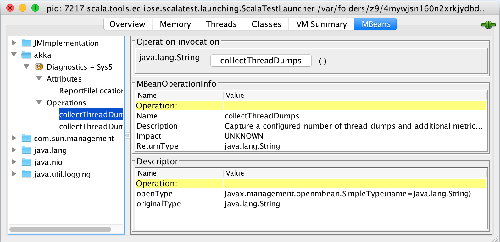

.. _diagnostics_recorder:

######################
 Diagnostics Recorder
######################

The Akka Diagnostics Recorder writes configuration and system information
to a file that can be attached to your `Typesafe support cases <http://support.typesafe.com/>`_.
The information will help us at Typesafe to give you the best possible support.

It will also register a MBean in the "akka" name space, which can be accessed
from a JMX console such as JConsole. From JMX you can trigger thread dumps
that will also be appended to the file.

.. note:: The Diagnostics Recorder is a feature of the `Typesafe Reactive Platform <http://www.typesafe.com/products/typesafe-reactive-platform>`_
          that is exclusively available for 
          `Typesafe Project Success Subscription <http://www.typesafe.com/subscription>`_ customers.

File Location
=============

The diagnostics report file is by default created in directory named ``akka-diagnostics`` in
the current working directory. This can be changed with configuration:

.. includecode:: ../../../akka-diagnostics-tests/src/test/scala/akka/diagnostics/DiagnosticsRecorderSpec.scala#dir

The report file name contains the name of the actor system name and remote address if any.

The file is overwritten if the actor system is restarted with same name and remote address.
If the actor system is configured with ``port=0`` a new file will be created for each
used port, which will lead to possibly quite a lot of files over time. It might make sense 
to clear the directory from such files before starting the actor system. 

Configuration and system information
====================================

When the actor system is started the Diagnostics Recorder collects configuration and system
information and writes to the diagnostics report file. This information includes:

* Start time in UTC
* Akka version
* full classpath
* configuration warnings reported by the :ref:`config_checker`
* application configuration and JVM system properties
* JVM and system metrics such as
  
  * heap and memory pool settings
  * available processors

Sensitive configuration
-----------------------

The diagnostics report file is in human readable JSON format so you can inspect it
before sending it to Typesafe.

Some configuration properties might not be appropriate to share with others
and such properties can be excluded from the diagnostics report by adding
the paths of the properties to the ``akka.diagnostics.recorder.sensitive-config-paths``
configuration string list. By default the following properties/sections are excluded:

.. includecode:: ../../../akka-actor/src/main/resources/reference.conf#diagnostics-recorder-sensitive

Thread Dumps
============

The Diagnostics Recorder registers a JMX MBean in the "akka" name space, which can be accessed
from a JMX console such as JConsole. From JMX you can trigger thread dumps
that will also be appended to the diagnostics report file.

When you click the ``collectThreadDumps`` button a number of thread dumps are collected.
The number of thread dumps can be configured with:

.. includecode:: ../../../akka-diagnostics-tests/src/test/scala/akka/diagnostics/DiagnosticsRecorderSpec.scala#thread-dumps-count

There is also a ``collectThreadDumps`` operation  with a ``count`` parameter in case you want to
collect more or less than the configured number of thread dumps.

There is a delay between each thread dump, which can be configured with:

.. includecode:: ../../../akka-diagnostics-tests/src/test/scala/akka/diagnostics/DiagnosticsRecorderSpec.scala#thread-dumps-interval

In addition to the thread dump some basic metrics are also captured and written to the file, such as:

* system load average
* heap memory and non-heap usage
* GC collection count and time

To be able to access JMX on remote machines (e.g. cluster nodes) you must enable remote 
monitoring and management when starting the JVMs, as described in 
`Monitoring and Management Using JMX Technology <http://docs.oracle.com/javase/7/docs/technotes/guides/management/agent.html>`_

Disable
=======

It is possible to disable the recorder completely with: 

.. includecode:: ../../../akka-diagnostics-tests/src/test/scala/akka/diagnostics/DiagnosticsRecorderSpec.scala#disabled

It is possible to disable the JMX feature but still enable other parts of the recorder:

.. includecode:: ../../../akka-diagnostics-tests/src/test/scala/akka/diagnostics/DiagnosticsRecorderSpec.scala#jmx-disabled

Configuration
=============

Below is the configuration of the Diagnostics Recorder, which you may amend to adjust its behavior.

.. includecode:: ../../../akka-actor/src/main/resources/reference.conf#diagnostics-recorder
