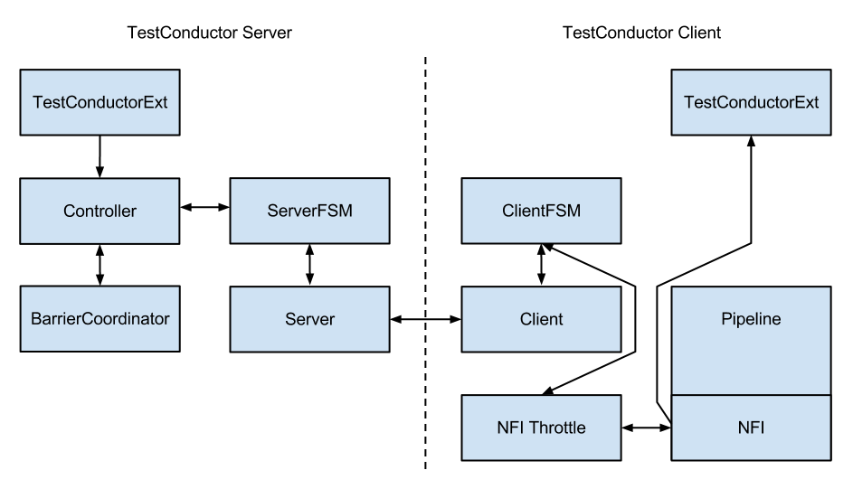

.. _multi-node-testing:

###################
 Multi Node Testing
###################

.. note:: This module is :ref:`experimental <experimental>`. This document describes how to use the features
 implemented so far. More features are coming in Akka Coltrane. Track progress of the Coltrane milestone in
 `Assembla <http://www.assembla.com/spaces/akka/milestones/418132-coltrane>`_.

Multi Node Testing Concepts
===========================

When we talk about multi node testing in Akka we mean the process of running coordinated tests on multiple actor
systems in different JVMs. The multi node testing kit consist of three main parts.

* `The Test Conductor`_. that coordinates and controls the nodes under test.
* `The Multi Node Spec`_. that is a convenience wrapper for starting the ``TestConductor`` and letting all
  nodes connect to it.
* `The SbtMultiJvm Plugin`_. that starts tests in multiple JVMs possibly on multiple machines.

The Test Conductor
==================

The basis for the multi node testing is the ``TestConductor``. It is an Akka Extension that plugs in to the
network stack and it is used to coordinate the nodes participating in the test and provides several features
including:

* Node Address Lookup: Finding out the full path to another test node (No need to share configuration between
  test nodes)
* Node Barrier Coordination: Waiting for other nodes at named barriers.
* Network Failure Injection: Throttling traffic, dropping packets, unplugging and plugging nodes back in.

This is a schematic overview of the test conductor.

The test conductor server is responsible for coordinating barriers and sending commands to the test conductor
clients that act upon them, e.g. throttling network traffic to/from another client. More information on the
possible operations is availible in the ``akka.remote.testconductor.Conductor`` API documentation.

The Multi Node Spec
===================

The Multi Node Spec consists of two parts. The ``MultiNodeConfig`` that is responsible for common
configuration and enumerating and naming the nodes under test. The ``MultiNodeSpec`` that contains a number
of convenience functions for making the test nodes interact with each other. More information on the possible
operations is available in the ``akka.remote.testkit.MultiNodeSpec`` API documentation.

The setup of the ``MultiNodeSpec`` is configured through java system properties that you set on all JVMs that's going to run a
node under test. These can easily be set on the JVM command line with ``-Dproperty=value``.

These are the available properties:
  * ``multinode.max-nodes``

    The maximum number of nodes that a test can have.

  * ``multinode.host``

    The host name or IP for this node. Must be resolvable using InetAddress.getByName.

  * ``multinode.port``

    The port number for this node. Defaults to 0 which will use a random port.

  * ``multinode.server-host``

    The host name or IP for the server node. Must be resolvable using InetAddress.getByName.

  * ``multinode.server-port``

    The port number for the server node. Defaults to 4711.

  * ``multinode.index``

    The index of this node in the sequence of roles defined for the test. The index 0 is special and that machine
    will be the server. All failure injection and throttling must be done from this node.

The SbtMultiJvm Plugin
======================

The :ref:`SbtMultiJvm Plugin <multi-jvm-testing>` has been updated to be able to run multi node tests, by
automatically generating the relevant ``multinode.*`` properties. This means that you can easily run multi node tests
on a single machine without any special configuration by just running them as normal multi-jvm tests. These tests can
then be run distributed over multiple machines without any changes simply by using the multi-node additions to the
plugin.

Multi Node Specific Additions
+++++++++++++++++++++++++++++

The plugin also has a number of new ``multi-node-*`` sbt tasks and settings to support running tests on multiple
machines. The necessary test classes and dependencies are packaged for distribution to other machines with
`SbtAssembly <https://github.com/sbt/sbt-assembly>`_ into a jar file with a name on the format
``<projectName>_<scalaVersion>-<projectVersion>-multi-jvm-assembly.jar``

.. note::

   To be able to distribute and kick off the tests on multiple machines, it is assumed that both host and target
   systems are POSIX like systems with ``ssh`` and ``rsync`` available.

These are the available sbt multi-node settings:
  * ``multiNodeHosts``

    A sequence of hosts to use for running the test, on the form ``user@host:java`` where host is the only required
    part. Will override settings from file.

  * ``multiNodeHostsFileName``

    A file to use for reading in the hosts to use for running the test. One per line on the same format as above.
    Defaults to ``multi-node-test.hosts`` in the base project directory.

  * ``multiNodeTargetDirName``

    A name for the directory on the target machine, where to copy the jar file. Defaults to ``multi-node-test`` in
    the base directory of the ssh user used to rsync the jar file.

  * ``multiNodeJavaName``

    The name of the default Java executable on the target machines. Defaults to ``java``.

Here are some examples of how you define hosts:
  * ``localhost``

    The current user on localhost using the default java.

  * ``user1@host1``

    User ``user1`` on host ``host1`` with the default java.

  * ``user2@host2:/usr/lib/jvm/java-7-openjdk-amd64/bin/java``

    User ``user2`` on host ``host2`` using java 7.

  * ``host3:/usr/lib/jvm/java-6-openjdk-amd64/bin/java``

    The current user on host ``host3`` using java 6.

Running the Multi Node Tests
++++++++++++++++++++++++++++

To run all the multi node test in multi-node mode (i.e. distributing the jar files and kicking off the tests
remotely) from inside sbt, use the ``multi-node-test`` task:

.. code-block:: none

  multi-node-test

To run all of them in multi-jvm mode (i.e. all JVMs on the local machine) do:

.. code-block:: none

  multi-jvm:test

To run individual tests use the ``multi-node-test-only`` task:

.. code-block:: none

  multi-node-test-only your.MultiNodeTest

To run individual tests in the multi-jvm mode do:

.. code-block:: none

  multi-jvm:test-only your.MultiNodeTest

More than one test name can be listed to run multiple specific tests. Tab completion in sbt makes it easy to
complete the test names.

Preparing Your Project for Multi Node Testing
=============================================

The multi node testing kit is a separate jar file. Make sure that you have the following dependency in your project:

.. parsed-literal::

  "com.typesafe.akka" %% "akka-remote-tests-experimental" % "@version@" @crossString@

If you are using the latest nightly build you should pick a timestamped Akka version from
`<http://repo.typesafe.com/typesafe/snapshots/com/typesafe/akka/akka-remote-tests-experimental_@binVersion@/>`_.
We recommend against using ``SNAPSHOT`` in order to obtain stable builds.

A Multi Node Testing Example
============================

First we need some scaffolding to hook up the ``MultiNodeSpec`` with your favorite test framework. Lets define a trait
``STMultiNodeSpec`` that uses ScalaTest to start and stop ``MultiNodeSpec``.

.. includecode:: ../../../akka-samples/akka-sample-multi-node/src/test/scala/sample/multinode/STMultiNodeSpec.scala#example

Then we need to define a configuration. Lets use two nodes ``"node1`` and ``"node2"`` and call it
``MultiNodeSampleConfig``.

.. includecode:: ../../../akka-samples/akka-sample-multi-node/src/multi-jvm/scala/sample/multinode/MultiNodeSample.scala
  :include: package,config

And then finally to the node test code. That starts the two nodes, and demonstrates a barrier, and a remote actor
message send/receive.

.. includecode:: ../../../akka-samples/akka-sample-multi-node/src/multi-jvm/scala/sample/multinode/MultiNodeSample.scala
  :include: package,spec

Things to Keep in Mind
======================

There are a couple of things to keep in mind when writing multi node tests or else your tests might behave in
surprising ways.

  * Don't issue a shutdown of the first node. The first node is the controller and if it shuts down your test will break.

  * Throttling, shutdown and other failure injections can only be done from the first node, which again is the controller.

  * Don't ask for the address of a node using ``node(address)`` after the node has been shut down. Grab the address before
    shutting down the node.

  * Don't use MultiNodeSpec methods like address lookup, barrier entry et.c. from other threads than the main test
    thread. This also means that you shouldn't use them from inside an actor, a future, or a scheduled task.
