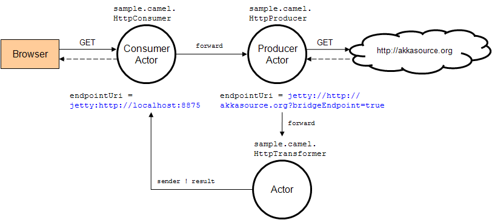
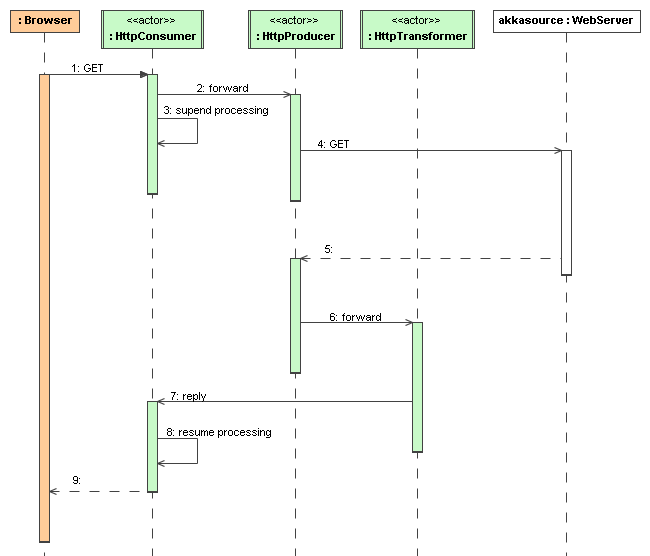
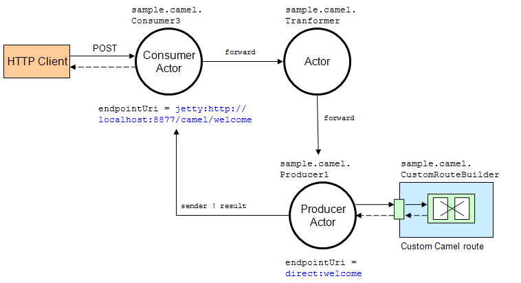

.. _camel-java:

#############
 Camel (Java)
#############

Additional Resources
====================
For an introduction to akka-camel 2, see also the Peter Gabryanczyk's talk `Migrating akka-camel module to Akka 2.x`_.

For an introduction to akka-camel 1, see also the `Appendix E - Akka and Camel`_
(pdf) of the book `Camel in Action`_.

.. _Appendix E - Akka and Camel: http://www.manning.com/ibsen/appEsample.pdf
.. _Camel in Action: http://www.manning.com/ibsen/
.. _Migrating akka-camel module to Akka 2.x: http://skillsmatter.com/podcast/scala/akka-2-x

Other, more advanced external articles (for version 1) are:

* `Akka Consumer Actors: New Features and Best Practices <http://krasserm.blogspot.com/2011/02/akka-consumer-actors-new-features-and.html>`_
* `Akka Producer Actors: New Features and Best Practices <http://krasserm.blogspot.com/2011/02/akka-producer-actor-new-features-and.html>`_

Introduction
============

The akka-camel module allows Untyped Actors to receive
and send messages over a great variety of protocols and APIs.
In addition to the native Scala and Java actor API, actors can now exchange messages with other systems over large number
of protocols and APIs such as HTTP, SOAP, TCP, FTP, SMTP or JMS, to mention a
few. At the moment, approximately 80 protocols and APIs are supported.

Apache Camel
------------
The akka-camel module is based on `Apache Camel`_, a powerful and light-weight
integration framework for the JVM. For an introduction to Apache Camel you may
want to read this `Apache Camel article`_. Camel comes with a
large number of `components`_ that provide bindings to different protocols and
APIs. The `camel-extra`_ project provides further components.

.. _Apache Camel: http://camel.apache.org/
.. _Apache Camel article: http://architects.dzone.com/articles/apache-camel-integration
.. _components: http://camel.apache.org/components.html
.. _camel-extra: http://code.google.com/p/camel-extra/

Consumer
--------
Here's an example of using Camel's integration components in Akka.

.. includecode:: code/docs/camel/MyEndpoint.java#Consumer-mina

The above example exposes an actor over a TCP endpoint via Apache
Camel's `Mina component`_. The actor implements the `getEndpointUri` method to define
an endpoint from which it can receive messages. After starting the actor, TCP
clients can immediately send messages to and receive responses from that
actor. If the message exchange should go over HTTP (via Camel's `Jetty
component`_), the actor's `getEndpointUri` method should return a different URI, for instance "jetty:http://localhost:8877/example".
In the above case an extra constructor is added that can set the endpoint URI, which would result in
the `getEndpointUri` returning the URI that was set using this constructor.

.. _Mina component: http://camel.apache.org/mina.html
.. _Jetty component: http://camel.apache.org/jetty.html

Producer
--------
Actors can also trigger message exchanges with external systems i.e. produce to
Camel endpoints.

.. includecode:: code/docs/camel/Orders.java#Producer

In the above example, any message sent to this actor will be sent to
the JMS queue ``Orders``. Producer actors may choose from the same set of Camel
components as Consumer actors do.
Below an example of how to send a message to the Orders producer.

.. includecode:: code/docs/camel/ProducerTestBase.java#TellProducer

CamelMessage
------------
The number of Camel components is constantly increasing. The akka-camel module
can support these in a plug-and-play manner. Just add them to your application's
classpath, define a component-specific endpoint URI and use it to exchange
messages over the component-specific protocols or APIs. This is possible because
Camel components bind protocol-specific message formats to a Camel-specific
`normalized message format`__. The normalized message format hides
protocol-specific details from Akka and makes it therefore very easy to support
a large number of protocols through a uniform Camel component interface. The
akka-camel module further converts mutable Camel messages into immutable
representations which are used by Consumer and Producer actors for pattern
matching, transformation, serialization or storage. In the above example of the Orders Producer,
the XML message is put in the body of a newly created Camel Message with an empty set of headers.
You can also create a CamelMessage yourself with the appropriate body and headers as you see fit.

__ https://svn.apache.org/repos/asf/camel/tags/camel-2.8.0/camel-core/src/main/java/org/apache/camel/Message.java

CamelExtension
--------------
The akka-camel module is implemented as an Akka Extension, the ``CamelExtension`` object.
Extensions will only be loaded once per ``ActorSystem``, which will be managed by Akka.
The ``CamelExtension`` object provides access to the `Camel`_ interface.
The `Camel`_ interface in turn provides access to two important Apache Camel objects, the `CamelContext`_ and the `ProducerTemplate`_.
Below you can see how you can get access to these Apache Camel objects.

.. includecode:: code/docs/camel/CamelExtensionTestBase.java#CamelExtension

One ``CamelExtension`` is only loaded once for every one ``ActorSystem``, which makes it safe to call the ``CamelExtension`` at any point in your code to get to the
Apache Camel objects associated with it. There is one `CamelContext`_ and one `ProducerTemplate`_ for every one ``ActorSystem`` that uses a ``CamelExtension``.
Below an example on how to add the ActiveMQ component to the `CamelContext`_, which is required when you would like to use the ActiveMQ component.

.. includecode:: code/docs/camel/CamelExtensionTestBase.java#CamelExtensionAddComponent

The `CamelContext`_ joins the lifecycle of the ``ActorSystem`` and ``CamelExtension`` it is associated with; the `CamelContext`_ is started when
the ``CamelExtension`` is created, and it is shut down when the associated ``ActorSystem`` is shut down. The same is true for the `ProducerTemplate`_.

The ``CamelExtension`` is used by both `Producer` and `Consumer` actors to interact with Apache Camel internally.
You can access the ``CamelExtension`` inside a `Producer` or a `Consumer` using the ``camel`` method, or get straight at the `CamelContext`
using the ``getCamelContext`` method or to the `ProducerTemplate` using the `getProducerTemplate` method.
Actors are created and started asynchronously. When a `Consumer` actor is created, the `Consumer` is published at its Camel endpoint
(more precisely, the route is added to the `CamelContext`_ from the `Endpoint`_ to the actor).
When a `Producer` actor is created, a `SendProcessor`_ and `Endpoint`_ are created so that the Producer can send messages to it.
Publication is done asynchronously; setting up an endpoint may still be in progress after you have
requested the actor to be created. Some Camel components can take a while to startup, and in some cases you might want to know when the endpoints are activated and ready to be used.
The `Camel`_ interface allows you to find out when the endpoint is activated or deactivated.

.. includecode:: code/docs/camel/ActivationTestBase.java#CamelActivation

The above code shows that you can get a ``Future`` to the activation of the route from the endpoint to the actor, or you can wait in a blocking fashion on the activation of the route.
An ``ActivationTimeoutException`` is thrown if the endpoint could not be activated within the specified timeout. Deactivation works in a similar fashion:

.. includecode:: code/docs/camel/ActivationTestBase.java#CamelDeactivation

Deactivation of a Consumer or a Producer actor happens when the actor is terminated. For a Consumer, the route to the actor is stopped. For a Producer, the `SendProcessor`_ is stopped.
A ``DeActivationTimeoutException`` is thrown if the associated camel objects could not be deactivated within the specified timeout.

.. _Camel: http://github.com/akka/akka/tree/v2.1.0-RC1/akka-camel/src/main/scala/akka/camel/Camel.scala
.. _CamelContext: https://svn.apache.org/repos/asf/camel/tags/camel-2.8.0/camel-core/src/main/java/org/apache/camel/CamelContext.java
.. _ProducerTemplate: https://svn.apache.org/repos/asf/camel/tags/camel-2.8.0/camel-core/src/main/java/org/apache/camel/ProducerTemplate.java
.. _SendProcessor: https://svn.apache.org/repos/asf/camel/tags/camel-2.8.0/camel-core/src/main/java/org/apache/camel/processor/SendProcessor.java
.. _Endpoint: https://svn.apache.org/repos/asf/camel/tags/camel-2.8.0/camel-core/src/main/java/org/apache/camel/Endpoint.java

Consumer Actors
================

For objects to receive messages, they must inherit from the `UntypedConsumerActor`_
class. For example, the following actor class (Consumer1) implements the
`getEndpointUri` method, which is declared in the `UntypedConsumerActor`_ class, in order to receive
messages from the ``file:data/input/actor`` Camel endpoint.

.. _UntypedConsumerActor: http://github.com/akka/akka/tree/v2.1.0-RC1/akka-camel/src/main/scala/akka/camel/javaapi/UntypedConsumer.scala

.. includecode:: code/docs/camel/Consumer1.java#Consumer1

Whenever a file is put into the data/input/actor directory, its content is
picked up by the Camel `file component`_ and sent as message to the
actor. Messages consumed by actors from Camel endpoints are of type
`CamelMessage`_. These are immutable representations of Camel messages.

.. _file component: http://camel.apache.org/file2.html
.. _Message: http://github.com/akka/akka/tree/v2.1.0-RC1/akka-camel/src/main/scala/akka/camel/CamelMessage.scala

Here's another example that sets the endpointUri to
``jetty:http://localhost:8877/camel/default``. It causes Camel's `Jetty
component`_ to start an embedded `Jetty`_ server, accepting HTTP connections
from localhost on port 8877.

.. _Jetty component: http://camel.apache.org/jetty.html
.. _Jetty: http://www.eclipse.org/jetty/

.. includecode:: code/docs/camel/Consumer2.java#Consumer2

After starting the actor, clients can send messages to that actor by POSTing to
``http://localhost:8877/camel/default``. The actor sends a response by using the
getSender().tell method. For returning a message body and headers to the HTTP
client the response type should be `CamelMessage`_. For any other response type, a
new CamelMessage object is created by akka-camel with the actor response as message
body.

.. _Message: http://github.com/akka/akka/tree/v2.1.0-RC1/akka-camel/src/main/scala/akka/camel/CamelMessage.scala

.. _camel-acknowledgements-java:

Delivery acknowledgements
-------------------------

With in-out message exchanges, clients usually know that a message exchange is
done when they receive a reply from a consumer actor. The reply message can be a
CamelMessage (or any object which is then internally converted to a CamelMessage) on
success, and a Failure message on failure.

With in-only message exchanges, by default, an exchange is done when a message
is added to the consumer actor's mailbox. Any failure or exception that occurs
during processing of that message by the consumer actor cannot be reported back
to the endpoint in this case. To allow consumer actors to positively or
negatively acknowledge the receipt of a message from an in-only message
exchange, they need to override the ``autoAck`` method to return false.
In this case, consumer actors must reply either with a
special akka.camel.Ack message (positive acknowledgement) or a akka.actor.Status.Failure (negative
acknowledgement).

.. includecode:: code/docs/camel/Consumer3.java#Consumer3

.. _camel-timeout-java:

Consumer timeout
----------------

Camel Exchanges (and their corresponding endpoints) that support two-way communications need to wait for a response from
an actor before returning it to the initiating client.
For some endpoint types, timeout values can be defined in an endpoint-specific
way which is described in the documentation of the individual `Camel
components`_. Another option is to configure timeouts on the level of consumer actors.

.. _Camel components: http://camel.apache.org/components.html

Two-way communications between a Camel endpoint and an actor are
initiated by sending the request message to the actor with the `ask`_ pattern
and the actor replies to the endpoint when the response is ready. The ask request to the actor can timeout, which will
result in the `Exchange`_ failing with a TimeoutException set on the failure of the `Exchange`_.
The timeout on the consumer actor can be overridden with the ``replyTimeout``, as shown below.

.. includecode:: code/docs/camel/Consumer4.java#Consumer4
.. _Exchange: https://svn.apache.org/repos/asf/camel/tags/camel-2.8.0/camel-core/src/main/java/org/apache/camel/Exchange.java
.. _ask: http://github.com/akka/akka/tree/v2.1.0-RC1/akka-actor/src/main/scala/akka/pattern/Patterns.scala

Producer Actors
===============

For sending messages to Camel endpoints, actors need to inherit from the `UntypedProducerActor`_ class and implement the getEndpointUri method.

.. includecode:: code/docs/camel/Producer1.java#Producer1

Producer1 inherits a default implementation of the onReceive method from the
`UntypedProducerActor`_ class. To customize a producer actor's default behavior you must override the `UntypedProducerActor`_.onTransformResponse and
`UntypedProducerActor`_.onTransformOutgoingMessage methods. This is explained later in more detail.
Producer Actors cannot override the `UntypedProducerActor`_.onReceive method.

Any message sent to a Producer actor will be sent to
the associated Camel endpoint, in the above example to
``http://localhost:8080/news``. The `UntypedProducerActor`_ always sends messages asynchronously. Response messages (if supported by the
configured endpoint) will, by default, be returned to the original sender. The
following example uses the ask pattern to send a message to a
Producer actor and waits for a response.

.. includecode:: code/docs/camel/ProducerTestBase.java#AskProducer

The future contains the response CamelMessage, or an ``AkkaCamelException`` when an error occurred, which contains the headers of the response.

.. _camel-custom-processing-java:

Custom Processing
-----------------

Instead of replying to the initial sender, producer actors can implement custom
response processing by overriding the onRouteResponse method. In the following example, the response
message is forwarded to a target actor instead of being replied to the original
sender.

.. includecode:: code/docs/camel/ResponseReceiver.java#RouteResponse
.. includecode:: code/docs/camel/Forwarder.java#RouteResponse
.. includecode:: code/docs/camel/OnRouteResponseTestBase.java#RouteResponse

Before producing messages to endpoints, producer actors can pre-process them by
overriding the `UntypedProducerActor`_.onTransformOutgoingMessage method.

.. includecode:: code/docs/camel/Transformer.java#TransformOutgoingMessage

Producer configuration options
------------------------------

The interaction of producer actors with Camel endpoints can be configured to be
one-way or two-way (by initiating in-only or in-out message exchanges,
respectively). By default, the producer initiates an in-out message exchange
with the endpoint. For initiating an in-only exchange, producer actors have to override the isOneway method to return true.

.. includecode:: code/docs/camel/OnewaySender.java#Oneway

Message correlation
-------------------

To correlate request with response messages, applications can set the
`Message.MessageExchangeId` message header.

.. includecode:: code/docs/camel/ProducerTestBase.java#Correlate

ProducerTemplate
----------------

The `UntypedProducerActor`_ class is a very convenient way for actors to produce messages to Camel endpoints.
Actors may also use a Camel `ProducerTemplate`_ for producing messages to endpoints.

.. includecode:: code/docs/camel/MyActor.java#ProducerTemplate

For initiating a a two-way message exchange, one of the
``ProducerTemplate.request*`` methods must be used.

.. includecode:: code/docs/camel/RequestBodyActor.java#RequestProducerTemplate

.. _UntypedProducerActor: http://github.com/akka/akka/tree/v2.1.0-RC1/akka-camel/src/main/scala/akka/camel/javaapi/UntypedProducerActor.scala
.. _ProducerTemplate: https://svn.apache.org/repos/asf/camel/tags/camel-2.8.0/camel-core/src/main/java/org/apache/camel/ProducerTemplate.java

.. _camel-asynchronous-routing-java:

Asynchronous routing
====================

In-out message exchanges between endpoints and actors are
designed to be asynchronous. This is the case for both, consumer and producer
actors.

* A consumer endpoint sends request messages to its consumer actor using the ``!``
  (tell) operator and the actor returns responses with ``sender !`` once they are
  ready.

* A producer actor sends request messages to its endpoint using Camel's
  asynchronous routing engine. Asynchronous responses are wrapped and added to the
  producer actor's mailbox for later processing. By default, response messages are
  returned to the initial sender but this can be overridden by Producer
  implementations (see also description of the ``onRouteResponse`` method
  in :ref:`camel-custom-processing-java`).

However, asynchronous two-way message exchanges, without allocating a thread for
the full duration of exchange, cannot be generically supported by Camel's
asynchronous routing engine alone. This must be supported by the individual
`Camel components`_ (from which endpoints are created) as well. They must be
able to suspend any work started for request processing (thereby freeing threads
to do other work) and resume processing when the response is ready. This is
currently the case for a `subset of components`_ such as the `Jetty component`_.
All other Camel components can still be used, of course, but they will cause
allocation of a thread for the duration of an in-out message exchange. There's
also a :ref:`camel-async-example-java` that implements both, an asynchronous
consumer and an asynchronous producer, with the jetty component.

.. _Camel components: http://camel.apache.org/components.html
.. _subset of components: http://camel.apache.org/asynchronous-routing-engine.html
.. _Jetty component: http://camel.apache.org/jetty.html

Custom Camel routes
===================

In all the examples so far, routes to consumer actors have been automatically
constructed by akka-camel, when the actor was started. Although the default
route construction templates, used by akka-camel internally, are sufficient for
most use cases, some applications may require more specialized routes to actors.
The akka-camel module provides two mechanisms for customizing routes to actors,
which will be explained in this section. These are:

* Usage of :ref:`camel-components-java` to access actors.
  Any Camel route can use these components to access Akka actors.

* :ref:`camel-intercepting-route-construction-java` to actors.
  This option gives you the ability to change routes that have already been added to Camel.
  Consumer actors have a hook into the route definition process which can be used to change the route.

.. _camel-components-java:

Akka Camel components
---------------------

Akka actors can be accessed from Camel routes using the `actor`_ Camel component. This component can be used to
access any Akka actor (not only consumer actors) from Camel routes, as described in the following sections.

.. _actor: http://github.com/akka/akka/tree/v2.1.0-RC1/akka-camel/src/main/scala/akka/camel/internal/component/ActorComponent.scala

.. _access-to-actors-java:

Access to actors
----------------

To access actors from custom Camel routes, the `actor`_ Camel
component should be used. It fully supports Camel's `asynchronous routing
engine`_.

.. _actor: http://github.com/akka/akka/tree/v2.1.0-RC1/akka-camel/src/main/scala/akka/camel/internal/component/ActorComponent.scala
.. _asynchronous routing engine: http://camel.apache.org/asynchronous-routing-engine.html

This component accepts the following endpoint URI format:

* ``[<actor-path>]?<options>``

where ``<actor-path>`` is the ``ActorPath`` to the actor. The ``<options>`` are
name-value pairs separated by ``&`` (i.e. ``name1=value1&name2=value2&...``).

URI options
^^^^^^^^^^^

The following URI options are supported:

+--------------+----------+---------+------------------------------------------------+
| Name         | Type     | Default | Description                                    |
+==============+==========+=========+================================================+
| replyTimeout | Duration | false   | The reply timeout, specified in the same       |
|              |          |         | way that you use the duration in akka,         |
|              |          |         | for instance ``10 seconds`` except that        |
|              |          |         | in the url it is handy to use a +              |
|              |          |         | between the amount and the unit, like          |
|              |          |         | for example ``200+millis``                     |
|              |          |         |                                                |
|              |          |         | See also :ref:`camel-timeout-java`.            |
+--------------+----------+---------+------------------------------------------------+
| autoAck      | Boolean  | true    | If set to true, in-only message exchanges      |
|              |          |         | are auto-acknowledged when the message is      |
|              |          |         | added to the actor's mailbox. If set to        |
|              |          |         | false, actors must acknowledge the             |
|              |          |         | receipt of the message.                        |
|              |          |         |                                                |
|              |          |         | See also :ref:`camel-acknowledgements-java`.   |
+--------------+----------+---------+------------------------------------------------+

Here's an actor endpoint URI example containing an actor uuid::

   akka://some-system/user/myconsumer?autoAck=false&replyTimeout=100+millis

In the following example, a custom route to an actor is created, using the
actor's path.

.. includecode:: code/docs/camel/Responder.java#CustomRoute
.. includecode:: code/docs/camel/CustomRouteBuilder.java#CustomRoute
.. includecode:: code/docs/camel/CustomRouteTestBase.java#CustomRoute

The `CamelPath.toCamelUri` converts the `ActorRef` to the Camel actor component URI format which points to the actor endpoint as described above.
When a message is received on the jetty endpoint, it is routed to the Responder actor, which in return replies back to the client of
the HTTP request.

.. _camel-intercepting-route-construction-java:

Intercepting route construction
-------------------------------

The previous section, :ref:`camel-components-java`, explained how to setup a route to
an actor manually.
It was the application's responsibility to define the route and add it to the current CamelContext.
This section explains a more convenient way to define custom routes: akka-camel is still setting up the routes to consumer actors
(and adds these routes to the current CamelContext) but applications can define extensions to these routes.
Extensions can be defined with Camel's `Java DSL`_ or `Scala DSL`_. For example, an extension could be a custom error handler that redelivers messages from an endpoint to an actor's bounded mailbox when the mailbox was full.

.. _Java DSL: http://camel.apache.org/dsl.html
.. _Scala DSL: http://camel.apache.org/scala-dsl.html

The following examples demonstrate how to extend a route to a consumer actor for
handling exceptions thrown by that actor.

.. includecode:: code/docs/camel/ErrorThrowingConsumer.java#ErrorThrowingConsumer

The above ErrorThrowingConsumer sends the Failure back to the sender in preRestart
because the Exception that is thrown in the actor would
otherwise just crash the actor, by default the actor would be restarted, and the response would never reach the client of the Consumer.

The akka-camel module creates a RouteDefinition instance by calling
from(endpointUri) on a Camel RouteBuilder (where endpointUri is the endpoint URI
of the consumer actor) and passes that instance as argument to the route
definition handler \*). The route definition handler then extends the route and
returns a ProcessorDefinition (in the above example, the ProcessorDefinition
returned by the end method. See the `org.apache.camel.model`__ package for
details). After executing the route definition handler, akka-camel finally calls
a to(targetActorUri) on the returned ProcessorDefinition to complete the
route to the consumer actor (where targetActorUri is the actor component URI as described in :ref:`access-to-actors-java`).
If the actor cannot be found, a `ActorNotRegisteredException` is thrown.

\*) Before passing the RouteDefinition instance to the route definition handler,
akka-camel may make some further modifications to it.

__ https://svn.apache.org/repos/asf/camel/tags/camel-2.8.0/camel-core/src/main/java/org/apache/camel/model/

.. _camel-examples-java:

Examples
========

.. _camel-async-example-java:

Asynchronous routing and transformation example
-----------------------------------------------

This example demonstrates how to implement consumer and producer actors that
support :ref:`camel-asynchronous-routing-java` with their Camel endpoints. The sample
application transforms the content of the Akka homepage, http://akka.io, by
replacing every occurrence of *Akka* with *AKKA*. To run this example, add
a Boot class that starts the actors. After starting
the :ref:`microkernel-java`, direct the browser to http://localhost:8875 and the
transformed Akka homepage should be displayed. Please note that this example
will probably not work if you're behind an HTTP proxy.

The following figure gives an overview how the example actors interact with
external systems and with each other. A browser sends a GET request to
http://localhost:8875 which is the published endpoint of the ``HttpConsumer``
actor. The ``HttpConsumer`` actor forwards the requests to the ``HttpProducer``
actor which retrieves the Akka homepage from http://akka.io. The retrieved HTML
is then forwarded to the ``HttpTransformer`` actor which replaces all occurrences
of *Akka* with *AKKA*. The transformation result is sent back the HttpConsumer
which finally returns it to the browser.

Implementing the example actor classes and wiring them together is rather easy
as shown in the following snippet.

.. includecode:: code/docs/camel/sample/http/HttpConsumer.java#HttpExample
.. includecode:: code/docs/camel/sample/http/HttpProducer.java#HttpExample
.. includecode:: code/docs/camel/sample/http/HttpTransformer.java#HttpExample
.. includecode:: code/docs/camel/sample/http/HttpSample.java#HttpExample

The `jetty endpoints`_ of HttpConsumer and HttpProducer support asynchronous
in-out message exchanges and do not allocate threads for the full duration of
the exchange. This is achieved by using `Jetty continuations`_ on the
consumer-side and by using `Jetty's asynchronous HTTP client`_ on the producer
side. The following high-level sequence diagram illustrates that.

.. _jetty endpoints: http://camel.apache.org/jetty.html
.. _Jetty continuations: http://wiki.eclipse.org/Jetty/Feature/Continuations
.. _Jetty's asynchronous HTTP client: http://wiki.eclipse.org/Jetty/Tutorial/HttpClient

Custom Camel route example
--------------------------

This section also demonstrates the combined usage of a ``Producer`` and a
``Consumer`` actor as well as the inclusion of a custom Camel route. The
following figure gives an overview.

* A consumer actor receives a message from an HTTP client

* It forwards the message to another actor that transforms the message (encloses
  the original message into hyphens)

* The transformer actor forwards the transformed message to a producer actor

* The producer actor sends the message to a custom Camel route beginning at the
  ``direct:welcome`` endpoint

* A processor (transformer) in the custom Camel route prepends "Welcome" to the
  original message and creates a result message

* The producer actor sends the result back to the consumer actor which returns
  it to the HTTP client

The consumer, transformer and
producer actor implementations are as follows.

.. includecode:: code/docs/camel/sample/route/Consumer3.java#CustomRouteExample
.. includecode:: code/docs/camel/sample/route/Transformer.java#CustomRouteExample
.. includecode:: code/docs/camel/sample/route/Producer1.java#CustomRouteExample
.. includecode:: code/docs/camel/sample/route/CustomRouteSample.java#CustomRouteExample

The producer actor knows where to reply the message to because the consumer and
transformer actors have forwarded the original sender reference as well. The
application configuration and the route starting from direct:welcome are done in the code above.

To run the example, add the lines shown in the example to a Boot class and the start the :ref:`microkernel-java` and POST a message to
``http://localhost:8877/camel/welcome``.

.. code-block:: none

   curl -H "Content-Type: text/plain" -d "Anke" http://localhost:8877/camel/welcome

The response should be:

.. code-block:: none

   Welcome - Anke -

Quartz Scheduler Example
------------------------

Here is an example showing how simple is to implement a cron-style scheduler by
using the Camel Quartz component in Akka.

The following example creates a "timer" actor which fires a message every 2
seconds:

.. includecode:: code/docs/camel/sample/quartz/MyQuartzActor.java#QuartzExample
.. includecode:: code/docs/camel/sample/quartz/QuartzSample.java#QuartzExample

For more information about the Camel Quartz component, see here:
http://camel.apache.org/quartz.html
