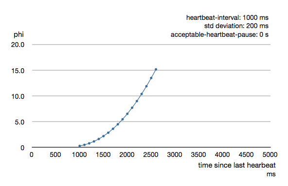
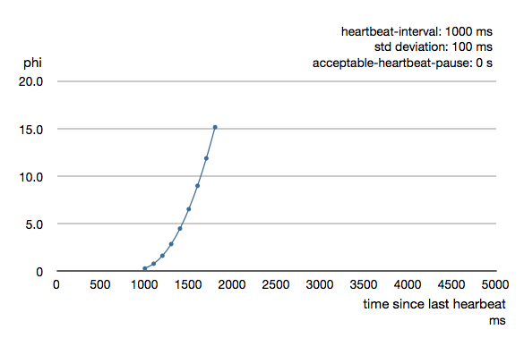
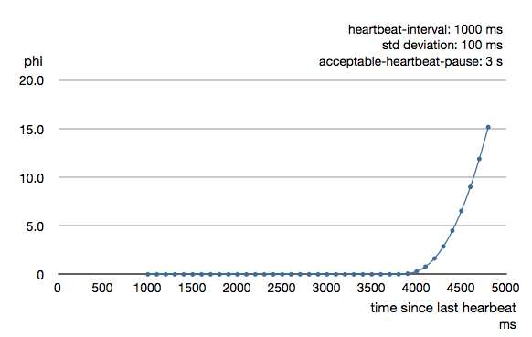

.. _cluster_usage_java:

#############
Cluster Usage
#############

For introduction to the Akka Cluster concepts please see :ref:`cluster`.

Preparing Your Project for Clustering
^^^^^^^^^^^^^^^^^^^^^^^^^^^^^^^^^^^^^

The Akka cluster is a separate jar file. Make sure that you have the following dependency in your project::

  <dependency>
    <groupId>com.typesafe.akka</groupId>
    <artifactId>akka-cluster_@binVersion@</artifactId>
    <version>@version@</version>
  </dependency>

.. _cluster_simple_example_java:

A Simple Cluster Example
^^^^^^^^^^^^^^^^^^^^^^^^

The following configuration enables the ``Cluster`` extension to be used.
It joins the cluster and an actor subscribes to cluster membership events and logs them.

The ``application.conf`` configuration looks like this:

.. includecode:: ../../../akka-samples/akka-sample-cluster-java/src/main/resources/application.conf#snippet

To enable cluster capabilities in your Akka project you should, at a minimum, add the :ref:`remoting-java`
settings, but with ``cluster``.
The ``akka.cluster.seed-nodes`` should normally also be added to your ``application.conf`` file.

.. note::
  If you are running Akka in a Docker container or the nodes for some other reason have separate internal and
  external ip addresses you must configure remoting according to :ref:`remote-configuration-nat-java`

The seed nodes are configured contact points for initial, automatic, join of the cluster.

Note that if you are going to start the nodes on different machines you need to specify the
ip-addresses or host names of the machines in ``application.conf`` instead of ``127.0.0.1``

An actor that uses the cluster extension may look like this:

.. literalinclude:: ../../../akka-samples/akka-sample-cluster-java/src/main/java/sample/cluster/simple/SimpleClusterListener.java
   :language: java

The actor registers itself as subscriber of certain cluster events. It receives events corresponding to the current state
of the cluster when the subscription starts and then it receives events for changes that happen in the cluster.

The easiest way to run this example yourself is to download `Lightbend Activator <http://www.lightbend.com/platform/getstarted>`_
and open the tutorial named `Akka Cluster Samples with Java <http://www.lightbend.com/activator/template/akka-sample-cluster-java>`_.
It contains instructions of how to run the ``SimpleClusterApp``.

Joining to Seed Nodes
^^^^^^^^^^^^^^^^^^^^^

You may decide if joining to the cluster should be done manually or automatically
to configured initial contact points, so-called seed nodes. When a new node is started
it sends a message to all seed nodes and then sends join command to the one that
answers first. If no one of the seed nodes replied (might not be started yet)
it retries this procedure until successful or shutdown.

You define the seed nodes in the :ref:`cluster_configuration_java` file (application.conf)::

  akka.cluster.seed-nodes = [
    "akka.tcp://ClusterSystem@host1:2552",
    "akka.tcp://ClusterSystem@host2:2552"]

This can also be defined as Java system properties when starting the JVM using the following syntax::

  -Dakka.cluster.seed-nodes.0=akka.tcp://ClusterSystem@host1:2552
  -Dakka.cluster.seed-nodes.1=akka.tcp://ClusterSystem@host2:2552

The seed nodes can be started in any order and it is not necessary to have all
seed nodes running, but the node configured as the first element in the ``seed-nodes``
configuration list must be started when initially starting a cluster, otherwise the
other seed-nodes will not become initialized and no other node can join the cluster.
The reason for the special first seed node is to avoid forming separated islands when
starting from an empty cluster.
It is quickest to start all configured seed nodes at the same time (order doesn't matter),
otherwise it can take up to the configured ``seed-node-timeout`` until the nodes
can join.

Once more than two seed nodes have been started it is no problem to shut down the first
seed node. If the first seed node is restarted, it will first try to join the other
seed nodes in the existing cluster.

If you don't configure seed nodes you need to join the cluster programmatically or manually.

Manual joining can be performed by using ref:`cluster_jmx_java` or :ref:`cluster_command_line_java`.
Joining programmatically can be performed with ``Cluster.get(system).join``. Unsuccessful join attempts are
automatically retried after the time period defined in configuration property ``retry-unsuccessful-join-after``.
Retries can be disabled by setting the property to ``off``.

You can join to any node in the cluster. It does not have to be configured as a seed node.
Note that you can only join to an existing cluster member, which means that for bootstrapping some
node must join itself,and then the following nodes could join them to make up a cluster.

You may also use ``Cluster.get(system).joinSeedNodes`` to join programmatically,
which is attractive when dynamically discovering other nodes at startup by using some external tool or API.
When using ``joinSeedNodes`` you should not include the node itself except for the node that is
supposed to be the first seed node, and that should be placed first in parameter to ``joinSeedNodes``.

Unsuccessful attempts to contact seed nodes are automatically retried after the time period defined in
configuration property ``seed-node-timeout``. Unsuccessful attempt to join a specific seed node is
automatically retried after the configured ``retry-unsuccessful-join-after``. Retrying means that it
tries to contact all seed nodes and then joins the node that answers first. The first node in the list
of seed nodes will join itself if it cannot contact any of the other seed nodes within the
configured ``seed-node-timeout``.

An actor system can only join a cluster once. Additional attempts will be ignored.
When it has successfully joined it must be restarted to be able to join another
cluster or to join the same cluster again. It can use the same host name and port
after the restart, when it come up as new incarnation of existing member in the cluster,
trying to join in, then the existing one will be removed from the cluster and then it will
be allowed to join.

.. note::

  The name of the ``ActorSystem`` must be the same for all members of a cluster. The name is given
  when you start the ``ActorSystem``.

.. _automatic-vs-manual-downing-java:

Downing
^^^^^^^

When a member is considered by the failure detector to be unreachable the
leader is not allowed to perform its duties, such as changing status of
new joining members to 'Up'. The node must first become reachable again, or the
status of the unreachable member must be changed to 'Down'. Changing status to 'Down'
can be performed automatically or manually. By default it must be done manually, using
:ref:`cluster_jmx_java` or :ref:`cluster_command_line_java`.

It can also be performed programmatically with ``Cluster.get(system).down(address)``.

A pre-packaged solution for the downing problem is provided by
`Split Brain Resolver <http://doc.akka.io/docs/akka/akka-commercial-addons-1.0/java/split-brain-resolver.html>`_,
which is part of the `Lightbend Reactive Platform <http://www.lightbend.com/platform>`_. 
If you don’t use RP, you should anyway carefully read the `documentation <http://doc.akka.io/docs/akka/akka-commercial-addons-1.0/java/split-brain-resolver.html>`_
of the Split Brain Resolver and make sure that the solution you are using handles the concerns
described there.

Auto-downing (DO NOT USE)
-------------------------

There is an atomatic downing feature that you should not use in production. For testing purpose you can enable it with configuration::

      akka.cluster.auto-down-unreachable-after = 120s

This means that the cluster leader member will change the ``unreachable`` node
status to ``down`` automatically after the configured time of unreachability.

This is a naïve approach to remove unreachable nodes from the cluster membership. It
works great for crashes and short transient network partitions, but not for long network
partitions. Both sides of the network partition will see the other side as unreachable
and after a while remove it from its cluster membership. Since this happens on both
sides the result is that two separate disconnected clusters have been created. This
can also happen because of long GC pauses or system overload.

.. warning::

  We recommend against using the auto-down feature of Akka Cluster in production.
  This is crucial for correct behavior if you use :ref:`cluster-singleton-java` or
  :ref:`cluster_sharding_java`, especially together with Akka :ref:`persistence-java`.
  For Akka Persistence with Cluster Sharding it can result in corrupt data in case
  of network partitions.

Leaving
^^^^^^^

There are two ways to remove a member from the cluster.

You can just stop the actor system (or the JVM process). It will be detected
as unreachable and removed after the automatic or manual downing as described
above.

A more graceful exit can be performed if you tell the cluster that a node shall leave.
This can be performed using :ref:`cluster_jmx_java` or :ref:`cluster_command_line_java`.
It can also be performed programmatically with:

.. includecode:: code/docs/cluster/ClusterDocTest.java#leave

Note that this command can be issued to any member in the cluster, not necessarily the
one that is leaving. The cluster extension, but not the actor system or JVM, of the
leaving member will be shutdown after the leader has changed status of the member to
`Exiting`. Thereafter the member will be removed from the cluster. Normally this is handled
automatically, but in case of network failures during this process it might still be necessary
to set the node’s status to ``Down`` in order to complete the removal.

.. _weakly_up_java:

WeaklyUp Members
^^^^^^^^^^^^^^^^

If a node is ``unreachable`` then gossip convergence is not possible and therefore any
``leader`` actions are also not possible. However, we still might want new nodes to join
the cluster in this scenario.

.. warning::

  The WeaklyUp feature is marked as **“experimental”** as of its introduction in Akka 2.4.0. We will continue to
  improve this feature based on our users’ feedback, which implies that while we try to keep incompatible
  changes to a minimum the binary compatibility guarantee for maintenance releases does not apply this feature.

This feature is disabled by default. With a configuration option you can allow this behavior::

    akka.cluster.allow-weakly-up-members = on

When ``allow-weakly-up-members`` is enabled and there is no gossip convergence,
``Joining`` members will be promoted to ``WeaklyUp`` and they will become part of the
cluster. Once gossip convergence is reached, the leader will move ``WeaklyUp``
members to ``Up``.

You can subscribe to the ``WeaklyUp`` membership event to make use of the members that are
in this state, but you should be aware of that members on the other side of a network partition
have no knowledge about the existence of the new members. You should for example not count
``WeaklyUp`` members in quorum decisions.

.. warning::

  This feature is only available from Akka 2.4.0 and cannot be used if some of your
  cluster members are running an older version of Akka.

.. _cluster_subscriber_java:

Subscribe to Cluster Events
^^^^^^^^^^^^^^^^^^^^^^^^^^^

You can subscribe to change notifications of the cluster membership by using
``Cluster.get(system).subscribe``.

.. includecode:: ../../../akka-samples/akka-sample-cluster-java/src/main/java/sample/cluster/simple/SimpleClusterListener2.java#subscribe

A snapshot of the full state, ``akka.cluster.ClusterEvent.CurrentClusterState``, is sent to the subscriber
as the first message, followed by events for incremental updates.

Note that you may receive an empty ``CurrentClusterState``, containing no members,
if you start the subscription before the initial join procedure has completed.
This is expected behavior. When the node has been accepted in the cluster you will
receive ``MemberUp`` for that node, and other nodes.

If you find it inconvenient to handle the ``CurrentClusterState`` you can use
``ClusterEvent.initialStateAsEvents()`` as parameter to ``subscribe``.
That means that instead of receiving ``CurrentClusterState`` as the first message you will receive
the events corresponding to the current state to mimic what you would have seen if you were
listening to the events when they occurred in the past. Note that those initial events only correspond
to the current state and it is not the full history of all changes that actually has occurred in the cluster.

.. includecode:: ../../../akka-samples/akka-sample-cluster-java/src/main/java/sample/cluster/simple/SimpleClusterListener.java#subscribe

The events to track the life-cycle of members are:

* ``ClusterEvent.MemberJoined`` - A new member has joined the cluster and its status has been changed to ``Joining``.
* ``ClusterEvent.MemberUp`` - A new member has joined the cluster and its status has been changed to ``Up``.
* ``ClusterEvent.MemberExited`` - A member is leaving the cluster and its status has been changed to ``Exiting``
  Note that the node might already have been shutdown when this event is published on another node.
* ``ClusterEvent.MemberRemoved`` - Member completely removed from the cluster.
* ``ClusterEvent.UnreachableMember`` - A member is considered as unreachable, detected by the failure detector
  of at least one other node.
* ``ClusterEvent.ReachableMember`` - A member is considered as reachable again, after having been unreachable.
  All nodes that previously detected it as unreachable has detected it as reachable again.

There are more types of change events, consult the API documentation
of classes that extends ``akka.cluster.ClusterEvent.ClusterDomainEvent``
for details about the events.

Instead of subscribing to cluster events it can sometimes be convenient to only get the full membership state with
``Cluster.get(system).state()``. Note that this state is not necessarily in sync with the events published to a
cluster subscription.

Worker Dial-in Example
----------------------

Let's take a look at an example that illustrates how workers, here named *backend*,
can detect and register to new master nodes, here named *frontend*.

The example application provides a service to transform text. When some text
is sent to one of the frontend services, it will be delegated to one of the
backend workers, which performs the transformation job, and sends the result back to
the original client. New backend nodes, as well as new frontend nodes, can be
added or removed to the cluster dynamically.

Messages:

.. includecode:: ../../../akka-samples/akka-sample-cluster-java/src/main/java/sample/cluster/transformation/TransformationMessages.java#messages

The backend worker that performs the transformation job:

.. includecode:: ../../../akka-samples/akka-sample-cluster-java/src/main/java/sample/cluster/transformation/TransformationBackend.java#backend

Note that the ``TransformationBackend`` actor subscribes to cluster events to detect new,
potential, frontend nodes, and send them a registration message so that they know
that they can use the backend worker.

The frontend that receives user jobs and delegates to one of the registered backend workers:

.. includecode:: ../../../akka-samples/akka-sample-cluster-java/src/main/java/sample/cluster/transformation/TransformationFrontend.java#frontend

Note that the ``TransformationFrontend`` actor watch the registered backend
to be able to remove it from its list of available backend workers.
Death watch uses the cluster failure detector for nodes in the cluster, i.e. it detects
network failures and JVM crashes, in addition to graceful termination of watched
actor. Death watch generates the ``Terminated`` message to the watching actor when the
unreachable cluster node has been downed and removed.

The `Lightbend Activator <http://www.lightbend.com/platform/getstarted>`_ tutorial named
`Akka Cluster Samples with Java <http://www.lightbend.com/activator/template/akka-sample-cluster-java>`_.
contains the full source code and instructions of how to run the **Worker Dial-in Example**.

Node Roles
^^^^^^^^^^

Not all nodes of a cluster need to perform the same function: there might be one sub-set which runs the web front-end,
one which runs the data access layer and one for the number-crunching. Deployment of actors—for example by cluster-aware
routers—can take node roles into account to achieve this distribution of responsibilities.

The roles of a node is defined in the configuration property named ``akka.cluster.roles``
and it is typically defined in the start script as a system property or environment variable.

The roles of the nodes is part of the membership information in ``MemberEvent`` that you can subscribe to.

.. _min-members_java:

How To Startup when Cluster Size Reached
^^^^^^^^^^^^^^^^^^^^^^^^^^^^^^^^^^^^^^^^

A common use case is to start actors after the cluster has been initialized,
members have joined, and the cluster has reached a certain size.

With a configuration option you can define required number of members
before the leader changes member status of 'Joining' members to 'Up'.

.. includecode:: ../../../akka-samples/akka-sample-cluster-java/src/main/resources/factorial.conf#min-nr-of-members

In a similar way you can define required number of members of a certain role
before the leader changes member status of 'Joining' members to 'Up'.

.. includecode:: ../../../akka-samples/akka-sample-cluster-java/src/main/resources/factorial.conf#role-min-nr-of-members

You can start the actors in a ``registerOnMemberUp`` callback, which will
be invoked when the current member status is changed to 'Up', i.e. the cluster
has at least the defined number of members.

.. includecode:: ../../../akka-samples/akka-sample-cluster-java/src/main/java/sample/cluster/factorial/FactorialFrontendMain.java#registerOnUp

This callback can be used for other things than starting actors.

How To Cleanup when Member is Removed
^^^^^^^^^^^^^^^^^^^^^^^^^^^^^^^^^^^^^

You can do some clean up in a ``registerOnMemberRemoved`` callback, which will
be invoked when the current member status is changed to 'Removed' or the cluster have been shutdown.

For example, this is how to shut down the ``ActorSystem`` and thereafter exit the JVM:

.. includecode:: ../../../akka-samples/akka-sample-cluster-java/src/main/java/sample/cluster/factorial/FactorialFrontendMain.java#registerOnRemoved

.. note::
   Register a OnMemberRemoved callback on a cluster that have been shutdown, the callback will be invoked immediately on
   the caller thread, otherwise it will be invoked later when the current member status changed to 'Removed'. You may
   want to install some cleanup handling after the cluster was started up, but the cluster might already be shutting
   down when you installing, and depending on the race is not healthy.

Cluster Singleton
^^^^^^^^^^^^^^^^^

For some use cases it is convenient and sometimes also mandatory to ensure that
you have exactly one actor of a certain type running somewhere in the cluster.

This can be implemented by subscribing to member events, but there are several corner
cases to consider. Therefore, this specific use case is made easily accessible by the
:ref:`cluster-singleton-java`.

Cluster Sharding
^^^^^^^^^^^^^^^^

Distributes actors across several nodes in the cluster and supports interaction
with the actors using their logical identifier, but without having to care about
their physical location in the cluster.

See :ref:`cluster_sharding_java`.

Distributed Publish Subscribe
^^^^^^^^^^^^^^^^^^^^^^^^^^^^^

Publish-subscribe messaging between actors in the cluster, and point-to-point messaging
using the logical path of the actors, i.e. the sender does not have to know on which
node the destination actor is running.

See :ref:`distributed-pub-sub-java`.

Cluster Client
^^^^^^^^^^^^^^

Communication from an actor system that is not part of the cluster to actors running
somewhere in the cluster. The client does not have to know on which node the destination
actor is running.

See :ref:`cluster-client-java`.

Distributed Data
^^^^^^^^^^^^^^^^

*Akka Distributed Data* is useful when you need to share data between nodes in an
Akka Cluster. The data is accessed with an actor providing a key-value store like API.

See :ref:`distributed_data_java`.

Failure Detector
^^^^^^^^^^^^^^^^

In a cluster each node is monitored by a few (default maximum 5) other nodes, and when
any of these detects the node as ``unreachable`` that information will spread to
the rest of the cluster through the gossip. In other words, only one node needs to
mark a node ``unreachable`` to have the rest of the cluster mark that node ``unreachable``.

The failure detector will also detect if the node becomes ``reachable`` again. When
all nodes that monitored the ``unreachable`` node detects it as ``reachable`` again
the cluster, after gossip dissemination, will consider it as ``reachable``.

If system messages cannot be delivered to a node it will be quarantined and then it
cannot come back from ``unreachable``. This can happen if the there are too many
unacknowledged system messages (e.g. watch, Terminated, remote actor deployment,
failures of actors supervised by remote parent). Then the node needs to be moved
to the ``down`` or ``removed`` states and the actor system of the quarantined node
must be restarted before it can join the cluster again.

The nodes in the cluster monitor each other by sending heartbeats to detect if a node is
unreachable from the rest of the cluster. The heartbeat arrival times is interpreted
by an implementation of
`The Phi Accrual Failure Detector <http://www.jaist.ac.jp/~defago/files/pdf/IS_RR_2004_010.pdf>`_.

The suspicion level of failure is given by a value called *phi*.
The basic idea of the phi failure detector is to express the value of *phi* on a scale that
is dynamically adjusted to reflect current network conditions.

The value of *phi* is calculated as::

  phi = -log10(1 - F(timeSinceLastHeartbeat))

where F is the cumulative distribution function of a normal distribution with mean
and standard deviation estimated from historical heartbeat inter-arrival times.

In the :ref:`cluster_configuration_java` you can adjust the ``akka.cluster.failure-detector.threshold``
to define when a *phi* value is considered to be a failure.

A low ``threshold`` is prone to generate many false positives but ensures
a quick detection in the event of a real crash. Conversely, a high ``threshold``
generates fewer mistakes but needs more time to detect actual crashes. The
default ``threshold`` is 8 and is appropriate for most situations. However in
cloud environments, such as Amazon EC2, the value could be increased to 12 in
order to account for network issues that sometimes occur on such platforms.

The following chart illustrates how *phi* increase with increasing time since the
previous heartbeat.

Phi is calculated from the mean and standard deviation of historical
inter arrival times. The previous chart is an example for standard deviation
of 200 ms. If the heartbeats arrive with less deviation the curve becomes steeper,
i.e. it is possible to determine failure more quickly. The curve looks like this for
a standard deviation of 100 ms.

To be able to survive sudden abnormalities, such as garbage collection pauses and
transient network failures the failure detector is configured with a margin,
``akka.cluster.failure-detector.acceptable-heartbeat-pause``. You may want to
adjust the :ref:`cluster_configuration_java` of this depending on you environment.
This is how the curve looks like for ``acceptable-heartbeat-pause`` configured to
3 seconds.

Death watch uses the cluster failure detector for nodes in the cluster, i.e. it detects
network failures and JVM crashes, in addition to graceful termination of watched
actor. Death watch generates the ``Terminated`` message to the watching actor when the
unreachable cluster node has been downed and removed.

If you encounter suspicious false positives when the system is under load you should
define a separate dispatcher for the cluster actors as described in :ref:`cluster_dispatcher_java`.

Cluster Aware Routers
^^^^^^^^^^^^^^^^^^^^^

All :ref:`routers <routing-java>` can be made aware of member nodes in the cluster, i.e.
deploying new routees or looking up routees on nodes in the cluster.
When a node becomes unreachable or leaves the cluster the routees of that node are
automatically unregistered from the router. When new nodes join the cluster additional
routees are added to the router, according to the configuration. Routees are also added
when a node becomes reachable again, after having been unreachable.

Cluster aware routers make use of members with status :ref:`WeaklyUp <weakly_up_java>` if that feature
is enabled.

There are two distinct types of routers.

* **Group - router that sends messages to the specified path using actor selection**
  The routees can be shared between routers running on different nodes in the cluster.
  One example of a use case for this type of router is a service running on some backend
  nodes in the cluster and used by routers running on front-end nodes in the cluster.

* **Pool - router that creates routees as child actors and deploys them on remote nodes.**
  Each router will have its own routee instances. For example, if you start a router
  on 3 nodes in a 10 nodes cluster you will have 30 routee actors in total if the router is
  configured to use one instance per node. The routees created by the different routers
  will not be shared between the routers. One example of a use case for this type of router
  is a single master that coordinate jobs and delegates the actual work to routees running
  on other nodes in the cluster.

Router with Group of Routees
----------------------------

When using a ``Group`` you must start the routee actors on the cluster member nodes.
That is not done by the router. The configuration for a group looks like this:

.. includecode:: ../../../akka-samples/akka-sample-cluster-java/src/multi-jvm/scala/sample/cluster/stats/StatsSampleSpec.scala#router-lookup-config

.. note::
  The routee actors should be started as early as possible when starting the actor system, because
  the router will try to use them as soon as the member status is changed to 'Up'.

The actor paths without address information that are defined in ``routees.paths`` are used for selecting the
actors to which the messages will be forwarded to by the router.
Messages will be forwarded to the routees using :ref:`ActorSelection <actorSelection-java>`, so the same delivery semantics should be expected.
It is possible to limit the lookup of routees to member nodes tagged with a certain role by specifying ``use-role``.

``max-total-nr-of-instances`` defines total number of routees in the cluster. By default ``max-total-nr-of-instances``
is set to a high value (10000) that will result in new routees added to the router when nodes join the cluster.
Set it to a lower value if you want to limit total number of routees.

The same type of router could also have been defined in code:

.. includecode:: ../../../akka-samples/akka-sample-cluster-java/src/main/java/sample/cluster/stats/Extra.java#router-lookup-in-code

See :ref:`cluster_configuration_java` section for further descriptions of the settings.

Router Example with Group of Routees
------------------------------------

Let's take a look at how to use a cluster aware router with a group of routees,
i.e. router sending to the paths of the routees.

The example application provides a service to calculate statistics for a text.
When some text is sent to the service it splits it into words, and delegates the task
to count number of characters in each word to a separate worker, a routee of a router.
The character count for each word is sent back to an aggregator that calculates
the average number of characters per word when all results have been collected.

Messages:

.. includecode:: ../../../akka-samples/akka-sample-cluster-java/src/main/java/sample/cluster/stats/StatsMessages.java#messages

The worker that counts number of characters in each word:

.. includecode:: ../../../akka-samples/akka-sample-cluster-java/src/main/java/sample/cluster/stats/StatsWorker.java#worker

The service that receives text from users and splits it up into words, delegates to workers and aggregates:

.. includecode:: ../../../akka-samples/akka-sample-cluster-java/src/main/java/sample/cluster/stats/StatsService.java#service

.. includecode:: ../../../akka-samples/akka-sample-cluster-java/src/main/java/sample/cluster/stats/StatsAggregator.java#aggregator

Note, nothing cluster specific so far, just plain actors.

All nodes start ``StatsService`` and ``StatsWorker`` actors. Remember, routees are the workers in this case.
The router is configured with ``routees.paths``:

.. includecode:: ../../../akka-samples/akka-sample-cluster-java/src/main/resources/stats1.conf#config-router-lookup

This means that user requests can be sent to ``StatsService`` on any node and it will use
``StatsWorker`` on all nodes.

The `Lightbend Activator <http://www.lightbend.com/platform/getstarted>`_ tutorial named
`Akka Cluster Samples with Java <http://www.lightbend.com/activator/template/akka-sample-cluster-java>`_.
contains the full source code and instructions of how to run the **Router Example with Group of Routees**.

Router with Pool of Remote Deployed Routees
-------------------------------------------

When using a ``Pool`` with routees created and deployed on the cluster member nodes
the configuration for a router looks like this:

.. includecode:: ../../../akka-samples/akka-sample-cluster-java/src/multi-jvm/scala/sample/cluster/stats/StatsSampleSingleMasterSpec.scala#router-deploy-config

It is possible to limit the deployment of routees to member nodes tagged with a certain role by
specifying ``use-role``.

``max-total-nr-of-instances`` defines total number of routees in the cluster, but the number of routees
per node, ``max-nr-of-instances-per-node``, will not be exceeded. By default ``max-total-nr-of-instances``
is set to a high value (10000) that will result in new routees added to the router when nodes join the cluster.
Set it to a lower value if you want to limit total number of routees.

The same type of router could also have been defined in code:

.. includecode:: ../../../akka-samples/akka-sample-cluster-java/src/main/java/sample/cluster/stats/Extra.java#router-deploy-in-code

See :ref:`cluster_configuration_java` section for further descriptions of the settings.

Router Example with Pool of Remote Deployed Routees
---------------------------------------------------

Let's take a look at how to use a cluster aware router on single master node that creates
and deploys workers. To keep track of a single master we use the :ref:`cluster-singleton-java`
in the contrib module. The ``ClusterSingletonManager`` is started on each node.

.. includecode:: ../../../akka-samples/akka-sample-cluster-java/src/main/java/sample/cluster/stats/StatsSampleOneMasterMain.java#create-singleton-manager

We also need an actor on each node that keeps track of where current single master exists and
delegates jobs to the ``StatsService``. That is provided by the ``ClusterSingletonProxy``.

.. includecode:: ../../../akka-samples/akka-sample-cluster-java/src/main/java/sample/cluster/stats/StatsSampleOneMasterMain.java#singleton-proxy

The ``ClusterSingletonProxy`` receives text from users and delegates to the current ``StatsService``, the single
master. It listens to cluster events to lookup the ``StatsService`` on the oldest node.

All nodes start ``ClusterSingletonProxy`` and the ``ClusterSingletonManager``. The router is now configured like this:

.. includecode:: ../../../akka-samples/akka-sample-cluster-java/src/main/resources/stats2.conf#config-router-deploy

The `Lightbend Activator <http://www.lightbend.com/platform/getstarted>`_ tutorial named
`Akka Cluster Samples with Java <http://www.lightbend.com/activator/template/akka-sample-cluster-java>`_.
contains the full source code and instructions of how to run the **Router Example with Pool of Remote Deployed Routees**.

Cluster Metrics
^^^^^^^^^^^^^^^

The member nodes of the cluster can collect system health metrics and publish that to other cluster nodes
and to the registered subscribers on the system event bus with the help of :doc:`cluster-metrics`.

.. _cluster_jmx_java:

JMX
^^^

Information and management of the cluster is available as JMX MBeans with the root name ``akka.Cluster``.
The JMX information can be displayed with an ordinary JMX console such as JConsole or JVisualVM.

From JMX you can:

* see what members that are part of the cluster
* see status of this node
* see roles of each member
* join this node to another node in cluster
* mark any node in the cluster as down
* tell any node in the cluster to leave

Member nodes are identified by their address, in format `akka.<protocol>://<actor-system-name>@<hostname>:<port>`.

.. _cluster_command_line_java:

Command Line Management
^^^^^^^^^^^^^^^^^^^^^^^

The cluster can be managed with the script `bin/akka-cluster` provided in the
Akka distribution.

Run it without parameters to see instructions about how to use the script::

  Usage: bin/akka-cluster <node-hostname> <jmx-port> <command> ...

  Supported commands are:
             join <node-url> - Sends request a JOIN node with the specified URL
            leave <node-url> - Sends a request for node with URL to LEAVE the cluster
             down <node-url> - Sends a request for marking node with URL as DOWN
               member-status - Asks the member node for its current status
                     members - Asks the cluster for addresses of current members
                 unreachable - Asks the cluster for addresses of unreachable members
              cluster-status - Asks the cluster for its current status (member ring,
                               unavailable nodes, meta data etc.)
                      leader - Asks the cluster who the current leader is
                is-singleton - Checks if the cluster is a singleton cluster (single
                               node cluster)
                is-available - Checks if the member node is available
  Where the <node-url> should be on the format of
    'akka.<protocol>://<actor-system-name>@<hostname>:<port>'

  Examples: bin/akka-cluster localhost 9999 is-available
            bin/akka-cluster localhost 9999 join akka.tcp://MySystem@darkstar:2552
            bin/akka-cluster localhost 9999 cluster-status

To be able to use the script you must enable remote monitoring and management when starting the JVMs of the cluster nodes,
as described in `Monitoring and Management Using JMX Technology <http://docs.oracle.com/javase/6/docs/technotes/guides/management/agent.html>`_

Example of system properties to enable remote monitoring and management::

  java -Dcom.sun.management.jmxremote.port=9999 \
  -Dcom.sun.management.jmxremote.authenticate=false \
  -Dcom.sun.management.jmxremote.ssl=false

.. _cluster_configuration_java:

Configuration
^^^^^^^^^^^^^

There are several configuration properties for the cluster. We refer to the
:ref:`reference configuration <config-akka-cluster>` for more information.

Cluster Info Logging
--------------------

You can silence the logging of cluster events at info level with configuration property::

  akka.cluster.log-info = off

.. _cluster_dispatcher_java:

Cluster Dispatcher
------------------

Under the hood the cluster extension is implemented with actors and it can be necessary
to create a bulkhead for those actors to avoid disturbance from other actors. Especially
the heartbeating actors that is used for failure detection can generate false positives
if they are not given a chance to run at regular intervals.
For this purpose you can define a separate dispatcher to be used for the cluster actors::

  akka.cluster.use-dispatcher = cluster-dispatcher

  cluster-dispatcher {
    type = "Dispatcher"
    executor = "fork-join-executor"
    fork-join-executor {
      parallelism-min = 2
      parallelism-max = 4
    }
  }

.. note::
    Normally it should not be necessary to configure a separate dispatcher for the Cluster.
    The default-dispatcher should be sufficient for performing the Cluster tasks, i.e. ``akka.cluster.use-dispatcher``
    should not be changed. If you have Cluster related problems when using the default-dispatcher that is typically an
    indication that you are running blocking or CPU intensive actors/tasks on the default-dispatcher.
    Use dedicated dispatchers for such actors/tasks instead of running them on the default-dispatcher,
    because that may starve system internal tasks.
    Related config properties: ``akka.cluster.use-dispatcher = akka.cluster.cluster-dispatcher``.
    Corresponding default values: ``akka.cluster.use-dispatcher =``.