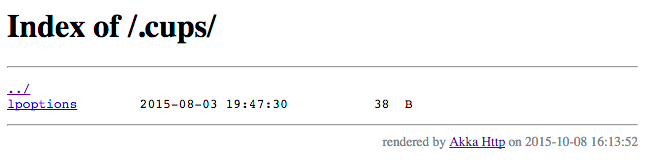

.. _-getFromBrowseableDirectory-java-:

getFromBrowseableDirectory
==========================

Description
-----------

The ``getFromBrowseableDirectories`` is a combination of serving files from the specified directories (like
``getFromDirectory``) and listing a browseable directory with ``listDirectoryContents``.

Nesting this directive beneath ``get`` is not necessary as this directive will only respond to ``GET`` requests.

Use ``getFromBrowseableDirectory`` to serve only one directory.

Use ``getFromDirectory`` if directory browsing isn't required.

For more details refer to :ref:`-getFromBrowseableDirectory-java-`.

Example
-------
TODO: Example snippets for JavaDSL are subject to community contributions! Help us complete the docs, read more about it here: `write example snippets for Akka HTTP Java DSL #20466 <https://github.com/akka/akka/issues/20466>`_.

Default file listing page example
^^^^^^^^^^^^^^^^^^^^^^^^^^^^^^^^^

Directives which list directories (e.g. ``getFromBrowsableDirectory``) use an implicit ``DirectoryRenderer``
instance to perfm the actual rendering of the file listing. This rendered can be easily overriden by simply
providing one in-scope for the directives to use, so you can build your custom directory listings.

The default renderer is ``akka.http.scaladsl.server.directives.FileAndResourceDirectives.defaultDirectoryRenderer``,
and renders a listing which looks like this:

   Example page rendered by the ``defaultDirectoryRenderer``.

It's possible to turn off rendering the footer stating which version of Akka HTTP is rendering this page by configuring
the ``akka.http.routing.render-vanity-footer`` configuration option to ``off``.
