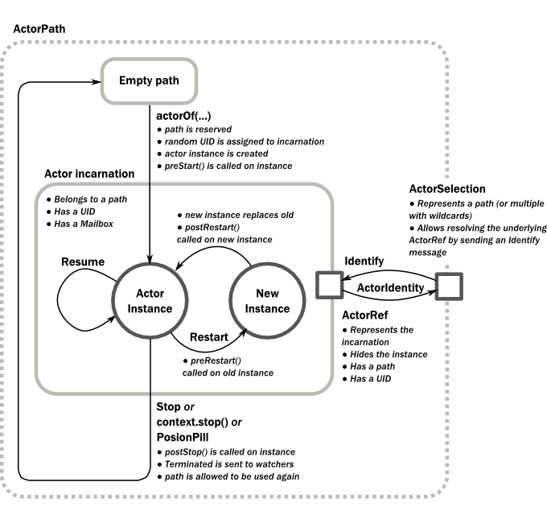

.. _lambda-actors-java:

###################################
 Actors (Java with Lambda Support)
###################################

The `Actor Model`_ provides a higher level of abstraction for writing concurrent
and distributed systems. It alleviates the developer from having to deal with
explicit locking and thread management, making it easier to write correct
concurrent and parallel systems. Actors were defined in the 1973 paper by Carl
Hewitt but have been popularized by the Erlang language, and used for example at
Ericsson with great success to build highly concurrent and reliable telecom
systems.

The API of Akka’s Actors is similar to Scala Actors which has borrowed some of
its syntax from Erlang.

.. _Actor Model: http://en.wikipedia.org/wiki/Actor_model

.. warning::

  The Java with lambda support part of Akka is marked as **“experimental”** as of its introduction in
  Akka 2.3.0. We will continue to improve this API based on our users’ feedback, which implies that
  while we try to keep incompatible changes to a minimum, but the binary compatibility guarantee for
  maintenance releases does not apply to the :class:`akka.actor.AbstractActor`, related classes and
  the :class:`akka.japi.pf` package.

Creating Actors
===============

.. note::

  Since Akka enforces parental supervision every actor is supervised and
  (potentially) the supervisor of its children, it is advisable that you
  familiarize yourself with :ref:`actor-systems` and :ref:`supervision` and it
  may also help to read :ref:`addressing`.

Defining an Actor class
-----------------------

Actor classes are implemented by extending the :class:`AbstractActor` class and setting
the “initial behavior” in the constructor by calling the :meth:`receive` method in
the :class:`AbstractActor`.

The argument to the :meth:`receive` method is a ``PartialFunction<Object,BoxedUnit>``
that defines which messages your Actor can handle, along with the implementation of
how the messages should be processed.

Don't let the type signature scare you. To allow you to easily build up a partial
function there is a builder named ``ReceiveBuilder`` that you can use.

Here is an example:

.. includecode:: ../../../akka-samples/akka-docs-java-lambda/src/test/java/docs/actor/MyActor.java
   :include: imports,my-actor

Please note that the Akka Actor ``receive`` message loop is exhaustive, which
is different compared to Erlang and the late Scala Actors. This means that you
need to provide a pattern match for all messages that it can accept and if you
want to be able to handle unknown messages then you need to have a default case
as in the example above. Otherwise an ``akka.actor.UnhandledMessage(message,
sender, recipient)`` will be published to the ``ActorSystem``'s
``EventStream``.

Note further that the return type of the behavior defined above is ``Unit``; if
the actor shall reply to the received message then this must be done explicitly
as explained below.

The argument to the :meth:`receive` method is a partial function object, which is
stored within the actor as its “initial behavior”, see `Become/Unbecome`_ for
further information on changing the behavior of an actor after its
construction.

Props
-----

:class:`Props` is a configuration class to specify options for the creation
of actors, think of it as an immutable and thus freely shareable recipe for
creating an actor including associated deployment information (e.g. which
dispatcher to use, see more below). Here are some examples of how to create a
:class:`Props` instance.

.. includecode:: ../../../akka-samples/akka-docs-java-lambda/src/test/java/docs/actor/ActorDocTest.java#import-props
.. includecode:: ../../../akka-samples/akka-docs-java-lambda/src/test/java/docs/actor/ActorDocTest.java#creating-props

The second variant shows how to pass constructor arguments to the
:class:`Actor` being created, but it should only be used outside of actors as
explained below.

The last line shows a possibility to pass constructor arguments regardless of
the context it is being used in. The presence of a matching constructor is
verified during construction of the :class:`Props` object, resulting in an
:class:`IllegalArgumentEception` if no or multiple matching constructors are
found.

Dangerous Variants
^^^^^^^^^^^^^^^^^^

.. includecode:: ../../../akka-samples/akka-docs-java-lambda/src/test/java/docs/actor/ActorDocTest.java#creating-props-deprecated

This method is not recommended to be used within another actor because it
encourages to close over the enclosing scope, resulting in non-serializable
:class:`Props` and possibly race conditions (breaking the actor encapsulation).
On the other hand using this variant in a :class:`Props` factory in the actor’s
companion object as documented under “Recommended Practices” below is completely
fine.

There were two use-cases for these methods: passing constructor arguments to
the actor—which is solved by the newly introduced
:meth:`Props.create(clazz, args)` method above or the recommended practice
below—and creating actors “on the spot” as anonymous classes. The latter should
be solved by making these actors named classes instead (if they are not
declared within a top-level ``object`` then the enclosing instance’s ``this``
reference needs to be passed as the first argument).

.. warning::

  Declaring one actor within another is very dangerous and breaks actor
  encapsulation. Never pass an actor’s ``this`` reference into :class:`Props`!

Recommended Practices
^^^^^^^^^^^^^^^^^^^^^

It is a good idea to provide factory methods on the companion object of each
:class:`Actor` which help keeping the creation of suitable :class:`Props` as
close to the actor definition as possible. This also avoids the pitfalls
associated with using the ``Props.create(...)`` method which takes a by-name
argument, since within a companion object the given code block will not retain
a reference to its enclosing scope:

.. includecode:: ../../../akka-samples/akka-docs-java-lambda/src/test/java/docs/actor/ActorDocTest.java#props-factory

Creating Actors with Props
--------------------------

Actors are created by passing a :class:`Props` instance into the
:meth:`actorOf` factory method which is available on :class:`ActorSystem` and
:class:`ActorContext`.

.. includecode:: ../../../akka-samples/akka-docs-java-lambda/src/test/java/docs/actor/ActorDocTest.java#import-actorRef
.. includecode:: ../../../akka-samples/akka-docs-java-lambda/src/test/java/docs/actor/ActorDocTest.java#system-actorOf

Using the :class:`ActorSystem` will create top-level actors, supervised by the
actor system’s provided guardian actor, while using an actor’s context will
create a child actor.

.. includecode:: ../../../akka-samples/akka-docs-java-lambda/src/test/java/docs/actor/ActorDocTest.java#context-actorOf
   :exclude: plus-some-behavior

It is recommended to create a hierarchy of children, grand-children and so on
such that it fits the logical failure-handling structure of the application,
see :ref:`actor-systems`.

The call to :meth:`actorOf` returns an instance of :class:`ActorRef`. This is a
handle to the actor instance and the only way to interact with it. The
:class:`ActorRef` is immutable and has a one to one relationship with the Actor
it represents. The :class:`ActorRef` is also serializable and network-aware.
This means that you can serialize it, send it over the wire and use it on a
remote host and it will still be representing the same Actor on the original
node, across the network.

The name parameter is optional, but you should preferably name your actors,
since that is used in log messages and for identifying actors. The name must
not be empty or start with ``$``, but it may contain URL encoded characters
(eg. ``%20`` for a blank space).  If the given name is already in use by
another child to the same parent an `InvalidActorNameException` is thrown.

Actors are automatically started asynchronously when created.

.. _actor-create-factory-lambda:

Dependency Injection
--------------------

If your UntypedActor has a constructor that takes parameters then those need to
be part of the :class:`Props` as well, as described `above`__. But there
are cases when a factory method must be used, for example when the actual
constructor arguments are determined by a dependency injection framework.

__ Props_

.. includecode:: code/docs/actor/UntypedActorDocTest.java#import-indirect
.. includecode:: code/docs/actor/UntypedActorDocTest.java
   :include: creating-indirectly
   :exclude: obtain-fresh-Actor-instance-from-DI-framework

.. warning::

  You might be tempted at times to offer an :class:`IndirectActorProducer`
  which always returns the same instance, e.g. by using a static field. This is
  not supported, as it goes against the meaning of an actor restart, which is
  described here: :ref:`supervision-restart`.

  When using a dependency injection framework, actor beans *MUST NOT* have
  singleton scope.

Techniques for dependency injection and integration with dependency injection frameworks
are described in more depth in the
`Using Akka with Dependency Injection <http://letitcrash.com/post/55958814293/akka-dependency-injection>`_
guideline and the `Akka Java Spring <http://www.typesafe.com/activator/template/akka-java-spring>`_ tutorial
in Typesafe Activator.

The Inbox
---------

When writing code outside of actors which shall communicate with actors, the
``ask`` pattern can be a solution (see below), but there are two thing it
cannot do: receiving multiple replies (e.g. by subscribing an :class:`ActorRef`
to a notification service) and watching other actors’ lifecycle. For these
purposes there is the :class:`Inbox` class:

.. includecode:: code/docs/actor/InboxDocTest.java#inbox

The :meth:`send` method wraps a normal :meth:`tell` and supplies the internal
actor’s reference as the sender. This allows the reply to be received on the
last line.  Watching an actor is quite simple as well:

.. includecode:: code/docs/actor/InboxDocTest.java#watch

Actor API
=========

The :class:`AbstractActor` class defines a method called :meth:`receive`,
that is used to set the “initial behavior” of the actor.

If the current actor behavior does not match a received message,
:meth:`unhandled` is called, which by default publishes an
``akka.actor.UnhandledMessage(message, sender, recipient)`` on the actor
system’s event stream (set configuration item
``akka.actor.debug.unhandled`` to ``on`` to have them converted into
actual Debug messages).

In addition, it offers:

* :meth:`self()` reference to the :class:`ActorRef` of the actor

* :meth:`sender()` reference sender Actor of the last received message, typically used as described in :ref:`LambdaActor.Reply`

* :meth:`supervisorStrategy()` user overridable definition the strategy to use for supervising child actors

  This strategy is typically declared inside the actor in order to have access
  to the actor’s internal state within the decider function: since failure is
  communicated as a message sent to the supervisor and processed like other
  messages (albeit outside of the normal behavior), all values and variables
  within the actor are available, as is the ``sender`` reference (which will
  be the immediate child reporting the failure; if the original failure
  occurred within a distant descendant it is still reported one level up at a
  time).

* :meth:`context()` exposes contextual information for the actor and the current message, such as:

  * factory methods to create child actors (:meth:`actorOf`)
  * system that the actor belongs to
  * parent supervisor
  * supervised children
  * lifecycle monitoring
  * hotswap behavior stack as described in :ref:`actor-hotswap-lambda`

The remaining visible methods are user-overridable life-cycle hooks which are
described in the following:

.. includecode:: code/docs/actor/UntypedActorDocTest.java#lifecycle-callbacks

The implementations shown above are the defaults provided by the :class:`AbstractActor`
class.

Actor Lifecycle
---------------

A path in an actor system represents a "place" which might be occupied
by a living actor. Initially (apart from system initialized actors) a path is
empty. When ``actorOf()`` is called it assigns an *incarnation* of the actor
described by the passed ``Props`` to the given path. An actor incarnation is
identified by the path *and a UID*. A restart only swaps the ``Actor``
instance defined by the ``Props`` but the incarnation and hence the UID remains
the same.

The lifecycle of an incarnation ends when the actor is stopped. At
that point the appropriate lifecycle events are called and watching actors
are notified of the termination. After the incarnation is stopped, the path can
be reused again by creating an actor with ``actorOf()``. In this case the
name of the new incarnation will be the same as the previous one but the
UIDs will differ.

An ``ActorRef`` always represents an incarnation (path and UID) not just a
given path. Therefore if an actor is stopped and a new one with the same
name is created an ``ActorRef`` of the old incarnation will not point
to the new one.

``ActorSelection`` on the other hand points to the path (or multiple paths
if wildcards are used) and is completely oblivious to which incarnation is currently
occupying it. ``ActorSelection`` cannot be watched for this reason. It is
possible to resolve the current incarnation's ``ActorRef`` living under the
path by sending an ``Identify`` message to the ``ActorSelection`` which
will be replied to with an ``ActorIdentity`` containing the correct reference
(see :ref:`actorSelection-lambda`). This can also be done with the ``resolveOne``
method of the :class:`ActorSelection`, which returns a ``Future`` of the matching
:class:`ActorRef`.

.. _deathwatch-lambda:

Lifecycle Monitoring aka DeathWatch
-----------------------------------

In order to be notified when another actor terminates (i.e. stops permanently,
not temporary failure and restart), an actor may register itself for reception
of the :class:`Terminated` message dispatched by the other actor upon
termination (see `Stopping Actors`_). This service is provided by the
:class:`DeathWatch` component of the actor system.

Registering a monitor is easy:

.. includecode:: ../../../akka-samples/akka-docs-java-lambda/src/test/java/docs/actor/ActorDocTest.java#watch

It should be noted that the :class:`Terminated` message is generated
independent of the order in which registration and termination occur.
In particular, the watching actor will receive a :class:`Terminated` message
even if the watched actor has already been terminated at the time of registration.

Registering multiple times does not necessarily lead to multiple messages being
generated, but there is no guarantee that only exactly one such message is
received: if termination of the watched actor has generated and queued the
message, and another registration is done before this message has been
processed, then a second message will be queued, because registering for
monitoring of an already terminated actor leads to the immediate generation of
the :class:`Terminated` message.

It is also possible to deregister from watching another actor’s liveliness
using ``context.unwatch(target)``. This works even if the :class:`Terminated`
message has already been enqueued in the mailbox; after calling :meth:`unwatch`
no :class:`Terminated` message for that actor will be processed anymore.

.. _start-hook-lambda:

Start Hook
----------

Right after starting the actor, its :meth:`preStart` method is invoked.

.. includecode:: ../../../akka-samples/akka-docs-java-lambda/src/test/java/docs/actor/ActorDocTest.java#preStart

This method is called when the actor is first created. During restarts it is
called by the default implementation of :meth:`postRestart`, which means that
by overriding that method you can choose whether the initialization code in
this method is called only exactly once for this actor or for every restart.
Initialization code which is part of the actor’s constructor will always be
called when an instance of the actor class is created, which happens at every
restart.

.. _restart-hook-lambda:

Restart Hooks
-------------

All actors are supervised, i.e. linked to another actor with a fault
handling strategy. Actors may be restarted in case an exception is thrown while
processing a message (see :ref:`supervision`). This restart involves the hooks
mentioned above:

1. The old actor is informed by calling :meth:`preRestart` with the exception
   which caused the restart and the message which triggered that exception; the
   latter may be ``None`` if the restart was not caused by processing a
   message, e.g. when a supervisor does not trap the exception and is restarted
   in turn by its supervisor, or if an actor is restarted due to a sibling’s
   failure. If the message is available, then that message’s sender is also
   accessible in the usual way (i.e. by calling ``sender``).

   This method is the best place for cleaning up, preparing hand-over to the
   fresh actor instance, etc.  By default it stops all children and calls
   :meth:`postStop`.

2. The initial factory from the ``actorOf`` call is used
   to produce the fresh instance.

3. The new actor’s :meth:`postRestart` method is invoked with the exception
   which caused the restart. By default the :meth:`preStart`
   is called, just as in the normal start-up case.

An actor restart replaces only the actual actor object; the contents of the
mailbox is unaffected by the restart, so processing of messages will resume
after the :meth:`postRestart` hook returns. The message
that triggered the exception will not be received again. Any message
sent to an actor while it is being restarted will be queued to its mailbox as
usual.

.. warning::

  Be aware that the ordering of failure notifications relative to user messages
  is not deterministic. In particular, a parent might restart its child before
  it has processed the last messages sent by the child before the failure.
  See :ref:`message-ordering` for details.

.. _stop-hook-lambda:

Stop Hook
---------

After stopping an actor, its :meth:`postStop` hook is called, which may be used
e.g. for deregistering this actor from other services. This hook is guaranteed
to run after message queuing has been disabled for this actor, i.e. messages
sent to a stopped actor will be redirected to the :obj:`deadLetters` of the
:obj:`ActorSystem`.

.. _actorSelection-lambda:

Identifying Actors via Actor Selection
======================================

As described in :ref:`addressing`, each actor has a unique logical path, which
is obtained by following the chain of actors from child to parent until
reaching the root of the actor system, and it has a physical path, which may
differ if the supervision chain includes any remote supervisors. These paths
are used by the system to look up actors, e.g. when a remote message is
received and the recipient is searched, but they are also useful more directly:
actors may look up other actors by specifying absolute or relative
paths—logical or physical—and receive back an :class:`ActorSelection` with the
result:

.. includecode:: ../../../akka-samples/akka-docs-java-lambda/src/test/java/docs/actor/ActorDocTest.java#selection-local

The supplied path is parsed as a :class:`java.net.URI`, which basically means
that it is split on ``/`` into path elements. If the path starts with ``/``, it
is absolute and the look-up starts at the root guardian (which is the parent of
``"/user"``); otherwise it starts at the current actor. If a path element equals
``..``, the look-up will take a step “up” towards the supervisor of the
currently traversed actor, otherwise it will step “down” to the named child.
It should be noted that the ``..`` in actor paths here always means the logical
structure, i.e. the supervisor.

The path elements of an actor selection may contain wildcard patterns allowing for
broadcasting of messages to that section:

.. includecode:: ../../../akka-samples/akka-docs-java-lambda/src/test/java/docs/actor/ActorDocTest.java#selection-wildcard

Messages can be sent via the :class:`ActorSelection` and the path of the
:class:`ActorSelection` is looked up when delivering each message. If the selection
does not match any actors the message will be dropped.

To acquire an :class:`ActorRef` for an :class:`ActorSelection` you need to send
a message to the selection and use the ``sender()`` reference of the reply from
the actor. There is a built-in ``Identify`` message that all Actors will
understand and automatically reply to with a ``ActorIdentity`` message
containing the :class:`ActorRef`. This message is handled specially by the
actors which are traversed in the sense that if a concrete name lookup fails
(i.e. a non-wildcard path element does not correspond to a live actor) then a
negative result is generated. Please note that this does not mean that delivery
of that reply is guaranteed, it still is a normal message.

.. includecode:: ../../../akka-samples/akka-docs-java-lambda/src/test/java/docs/actor/ActorDocTest.java#import-identify
.. includecode:: ../../../akka-samples/akka-docs-java-lambda/src/test/java/docs/actor/ActorDocTest.java#identify

You can also acquire an :class:`ActorRef` for an :class:`ActorSelection` with
the ``resolveOne`` method of the :class:`ActorSelection`. It returns a ``Future``
of the matching :class:`ActorRef` if such an actor exists. It is completed with
failure [[akka.actor.ActorNotFound]] if no such actor exists or the identification
didn't complete within the supplied `timeout`.

Remote actor addresses may also be looked up, if :ref:`remoting <remoting-java>` is enabled:

.. includecode:: ../../../akka-samples/akka-docs-java-lambda/src/test/java/docs/actor/ActorDocTest.java#selection-remote

An example demonstrating actor look-up is given in :ref:`remote-sample-java`.

.. note::

  ``actorFor`` is deprecated in favor of ``actorSelection`` because actor references
  acquired with ``actorFor`` behaves different for local and remote actors.
  In the case of a local actor reference, the named actor needs to exist before the
  lookup, or else the acquired reference will be an :class:`EmptyLocalActorRef`.
  This will be true even if an actor with that exact path is created after acquiring
  the actor reference. For remote actor references acquired with `actorFor` the
  behaviour is different and sending messages to such a reference will under the hood
  look up the actor by path on the remote system for every message send.

Messages and immutability
=========================

**IMPORTANT**: Messages can be any kind of object but have to be
immutable. Akka can’t enforce immutability (yet) so this has to be by
convention.

Here is an example of an immutable message:

.. includecode:: code/docs/actor/ImmutableMessage.java#immutable-message

Send messages
=============

Messages are sent to an Actor through one of the following methods.

* ``tell`` means “fire-and-forget”, e.g. send a message asynchronously and return
  immediately.
* ``ask`` sends a message asynchronously and returns a :class:`Future`
  representing a possible reply.

Message ordering is guaranteed on a per-sender basis.

.. note::

    There are performance implications of using ``ask`` since something needs to
    keep track of when it times out, there needs to be something that bridges
    a ``Promise`` into an ``ActorRef`` and it also needs to be reachable through
    remoting. So always prefer ``tell`` for performance, and only ``ask`` if you must.

In all these methods you have the option of passing along your own ``ActorRef``.
Make it a practice of doing so because it will allow the receiver actors to be able to respond
to your message, since the sender reference is sent along with the message.

.. _actors-tell-sender-lambda:

Tell: Fire-forget
-----------------

This is the preferred way of sending messages. No blocking waiting for a
message. This gives the best concurrency and scalability characteristics.

.. includecode:: ../../../akka-samples/akka-docs-java-lambda/src/test/java/docs/actor/ActorDocTest.java#tell

The sender reference is passed along with the message and available within the
receiving actor via its :meth:`sender()` method while processing this
message. Inside of an actor it is usually :meth:`self()` who shall be the
sender, but there can be cases where replies shall be routed to some other
actor—e.g. the parent—in which the second argument to :meth:`tell` would be a
different one. Outside of an actor and if no reply is needed the second
argument can be ``null``; if a reply is needed outside of an actor you can use
the ask-pattern described next..

Ask: Send-And-Receive-Future
----------------------------

The ``ask`` pattern involves actors as well as futures, hence it is offered as
a use pattern rather than a method on :class:`ActorRef`:

.. includecode:: code/docs/actor/UntypedActorDocTest.java#import-ask
.. includecode:: code/docs/actor/UntypedActorDocTest.java#ask-pipe

This example demonstrates ``ask`` together with the ``pipe`` pattern on
futures, because this is likely to be a common combination. Please note that
all of the above is completely non-blocking and asynchronous: ``ask`` produces
a :class:`Future`, two of which are composed into a new future using the
:meth:`Futures.sequence` and :meth:`map` methods and then ``pipe`` installs
an ``onComplete``-handler on the future to effect the submission of the
aggregated :class:`Result` to another actor.

Using ``ask`` will send a message to the receiving Actor as with ``tell``, and
the receiving actor must reply with ``sender().tell(reply, self())`` in order to
complete the returned :class:`Future` with a value. The ``ask`` operation
involves creating an internal actor for handling this reply, which needs to
have a timeout after which it is destroyed in order not to leak resources; see
more below.

.. warning::

    To complete the future with an exception you need send a Failure message to the sender.
    This is *not done automatically* when an actor throws an exception while processing a message.

.. includecode:: ../../../akka-samples/akka-docs-java-lambda/src/test/java/docs/actor/ActorDocTest.java#reply-exception

If the actor does not complete the future, it will expire after the timeout period,
specified as parameter to the ``ask`` method; this will complete the
:class:`Future` with an :class:`AskTimeoutException`.

See :ref:`futures-java` for more information on how to await or query a
future.

The ``onComplete``, ``onSuccess``, or ``onFailure`` methods of the ``Future`` can be
used to register a callback to get a notification when the Future completes.
Gives you a way to avoid blocking.

.. warning::

  When using future callbacks, inside actors you need to carefully avoid closing over
  the containing actor’s reference, i.e. do not call methods or access mutable state
  on the enclosing actor from within the callback. This would break the actor
  encapsulation and may introduce synchronization bugs and race conditions because
  the callback will be scheduled concurrently to the enclosing actor. Unfortunately
  there is not yet a way to detect these illegal accesses at compile time. See also:
  :ref:`jmm-shared-state`

Forward message
---------------

You can forward a message from one actor to another. This means that the
original sender address/reference is maintained even though the message is going
through a 'mediator'. This can be useful when writing actors that work as
routers, load-balancers, replicators etc.

.. includecode:: ../../../akka-samples/akka-docs-java-lambda/src/test/java/docs/actor/ActorDocTest.java#forward

Receive messages
================

An Actor either has to set its initial receive behavior in the constructor by
calling the :meth:`receive` method in the :class:`AbstractActor`:

.. includecode:: ../../../akka-samples/akka-docs-java-lambda/src/test/java/docs/actor/ActorDocTest.java
   :include: receive-constructor
   :exclude: and-some-behavior

or by implementing the :meth:`receive` method in the :class:`Actor` interface:

.. includecode:: ../../../akka-samples/akka-docs-java-lambda/src/test/java/docs/actor/ActorDocTest.java#receive

Both the argument to the :class:`AbstractActor` :meth:`receive` method and the return
type of the :class:`Actor` :meth:`receive` method is a ``PartialFunction<Object, BoxedUnit>``
that defines which messages your Actor can handle, along with the implementation of how the messages
should be processed.

Don't let the type signature scare you. To allow you to easily build up a partial
function there is a builder named ``ReceiveBuilder`` that you can use.

Here is an example:

.. includecode:: ../../../akka-samples/akka-docs-java-lambda/src/test/java/docs/actor/MyActor.java
   :include: imports,my-actor

.. _LambdaActor.Reply:

Reply to messages
=================

If you want to have a handle for replying to a message, you can use
``sender()``, which gives you an ActorRef. You can reply by sending to
that ActorRef with ``sender().tell(replyMsg, self())``. You can also store the ActorRef
for replying later, or passing on to other actors. If there is no sender (a
message was sent without an actor or future context) then the sender
defaults to a 'dead-letter' actor ref.

.. includecode:: ../../../akka-samples/akka-docs-java-lambda/src/test/java/docs/actor/MyActor.java#reply

Receive timeout
===============

The `ActorContext` :meth:`setReceiveTimeout` defines the inactivity timeout after which
the sending of a `ReceiveTimeout` message is triggered.
When specified, the receive function should be able to handle an `akka.actor.ReceiveTimeout` message.
1 millisecond is the minimum supported timeout.

Please note that the receive timeout might fire and enqueue the `ReceiveTimeout` message right after
another message was enqueued; hence it is **not guaranteed** that upon reception of the receive
timeout there must have been an idle period beforehand as configured via this method.

Once set, the receive timeout stays in effect (i.e. continues firing repeatedly after inactivity
periods). Pass in `Duration.Undefined` to switch off this feature.

.. includecode:: ../../../akka-samples/akka-docs-java-lambda/src/test/java/docs/actor/ActorDocTest.java#receive-timeout

.. _stopping-actors-lambda:

Stopping actors
===============

Actors are stopped by invoking the :meth:`stop` method of a ``ActorRefFactory``,
i.e. ``ActorContext`` or ``ActorSystem``. Typically the context is used for stopping
child actors and the system for stopping top level actors. The actual termination of
the actor is performed asynchronously, i.e. :meth:`stop` may return before the actor is
stopped.

Processing of the current message, if any, will continue before the actor is stopped,
but additional messages in the mailbox will not be processed. By default these
messages are sent to the :obj:`deadLetters` of the :obj:`ActorSystem`, but that
depends on the mailbox implementation.

Termination of an actor proceeds in two steps: first the actor suspends its
mailbox processing and sends a stop command to all its children, then it keeps
processing the internal termination notifications from its children until the last one is
gone, finally terminating itself (invoking :meth:`postStop`, dumping mailbox,
publishing :class:`Terminated` on the :ref:`DeathWatch <deathwatch-lambda>`, telling
its supervisor). This procedure ensures that actor system sub-trees terminate
in an orderly fashion, propagating the stop command to the leaves and
collecting their confirmation back to the stopped supervisor. If one of the
actors does not respond (i.e. processing a message for extended periods of time
and therefore not receiving the stop command), this whole process will be
stuck.

Upon :meth:`ActorSystem.shutdown()`, the system guardian actors will be
stopped, and the aforementioned process will ensure proper termination of the
whole system.

The :meth:`postStop()` hook is invoked after an actor is fully stopped. This
enables cleaning up of resources:

.. includecode:: ../../../akka-samples/akka-docs-java-lambda/src/test/java/docs/actor/ActorDocTest.java#postStop
   :exclude: clean-up-some-resources

.. note::

  Since stopping an actor is asynchronous, you cannot immediately reuse the
  name of the child you just stopped; this will result in an
  :class:`InvalidActorNameException`. Instead, :meth:`watch()` the terminating
  actor and create its replacement in response to the :class:`Terminated`
  message which will eventually arrive.

.. _poison-pill-lambda:

PoisonPill
----------

You can also send an actor the ``akka.actor.PoisonPill`` message, which will
stop the actor when the message is processed. ``PoisonPill`` is enqueued as
ordinary messages and will be handled after messages that were already queued
in the mailbox.

Graceful Stop
-------------

:meth:`gracefulStop` is useful if you need to wait for termination or compose ordered
termination of several actors:

.. includecode:: code/docs/actor/UntypedActorDocTest.java#import-gracefulStop

.. includecode:: code/docs/actor/UntypedActorDocTest.java#gracefulStop

.. includecode:: ../../../akka-samples/akka-docs-java-lambda/src/test/java/docs/actor/ActorDocTest.java#gracefulStop-actor

When ``gracefulStop()`` returns successfully, the actor’s ``postStop()`` hook
will have been executed: there exists a happens-before edge between the end of
``postStop()`` and the return of ``gracefulStop()``.

In the above example a custom ``Manager.Shutdown`` message is sent to the target
actor to initiate the process of stopping the actor. You can use ``PoisonPill`` for
this, but then you have limited possibilities to perform interactions with other actors
before stopping the target actor. Simple cleanup tasks can be handled in ``postStop``.

.. warning::

  Keep in mind that an actor stopping and its name being deregistered are
  separate events which happen asynchronously from each other. Therefore it may
  be that you will find the name still in use after ``gracefulStop()``
  returned. In order to guarantee proper deregistration, only reuse names from
  within a supervisor you control and only in response to a :class:`Terminated`
  message, i.e. not for top-level actors.

.. _actor-hotswap-lambda:

Become/Unbecome
===============

Upgrade
-------

Akka supports hotswapping the Actor’s message loop (e.g. its implementation) at
runtime: invoke the ``context.become`` method from within the Actor.
:meth:`become` takes a ``PartialFunction<Object, BoxedUnit>`` that implements the new
message handler. The hotswapped code is kept in a Stack which can be pushed and
popped.

.. warning::

  Please note that the actor will revert to its original behavior when restarted by its Supervisor.

To hotswap the Actor behavior using ``become``:

.. includecode:: ../../../akka-samples/akka-docs-java-lambda/src/test/java/docs/actor/ActorDocTest.java#hot-swap-actor

This variant of the :meth:`become` method is useful for many different things,
such as to implement a Finite State Machine (FSM, for an example see `Dining
Hakkers`_). It will replace the current behavior (i.e. the top of the behavior
stack), which means that you do not use :meth:`unbecome`, instead always the
next behavior is explicitly installed.

.. _Dining Hakkers: http://www.typesafe.com/activator/template/akka-sample-fsm-java-lambda

The other way of using :meth:`become` does not replace but add to the top of
the behavior stack. In this case care must be taken to ensure that the number
of “pop” operations (i.e. :meth:`unbecome`) matches the number of “push” ones
in the long run, otherwise this amounts to a memory leak (which is why this
behavior is not the default).

.. includecode:: ../../../akka-samples/akka-docs-java-lambda/src/test/java/docs/actor/ActorDocTest.java#swapper

Stash
=====

The ``AbstractActorWithStash`` class enables an actor to temporarily stash away messages
that can not or should not be handled using the actor's current
behavior. Upon changing the actor's message handler, i.e., right
before invoking ``context().become()`` or ``context().unbecome()``, all
stashed messages can be "unstashed", thereby prepending them to the actor's
mailbox. This way, the stashed messages can be processed in the same
order as they have been received originally. An actor that extends
``AbstractActorWithStash`` will automatically get a deque-based mailbox.

.. note::

    The abstract class ``AbstractActorWithStash`` implements the marker
    interface ``RequiresMessageQueue<DequeBasedMessageQueueSemantics>``
    which requests the system to automatically choose a deque based
    mailbox implementation for the actor. If you want more
    control over the mailbox, see the documentation on mailboxes: :ref:`mailboxes-java`.

Here is an example of the ``AbstractActorWithStash`` class in action:

.. includecode:: ../../../akka-samples/akka-docs-java-lambda/src/test/java/docs/actor/ActorDocTest.java#stash

Invoking ``stash()`` adds the current message (the message that the
actor received last) to the actor's stash. It is typically invoked
when handling the default case in the actor's message handler to stash
messages that aren't handled by the other cases. It is illegal to
stash the same message twice; to do so results in an
``IllegalStateException`` being thrown. The stash may also be bounded
in which case invoking ``stash()`` may lead to a capacity violation,
which results in a ``StashOverflowException``. The capacity of the
stash can be configured using the ``stash-capacity`` setting (an ``Int``) of the
mailbox's configuration.

Invoking ``unstashAll()`` enqueues messages from the stash to the
actor's mailbox until the capacity of the mailbox (if any) has been
reached (note that messages from the stash are prepended to the
mailbox). In case a bounded mailbox overflows, a
``MessageQueueAppendFailedException`` is thrown.
The stash is guaranteed to be empty after calling ``unstashAll()``.

The stash is backed by a ``scala.collection.immutable.Vector``. As a
result, even a very large number of messages may be stashed without a
major impact on performance.

Note that the stash is part of the ephemeral actor state, unlike the
mailbox. Therefore, it should be managed like other parts of the
actor's state which have the same property. The :class:`AbstractActorWithStash`
implementation of :meth:`preRestart` will call ``unstashAll()``, which is
usually the desired behavior.

.. note::

  If you want to enforce that your actor can only work with an unbounded stash,
  then you should use the ``AbstractActorWithUnboundedStash`` class instead.

.. _killing-actors-lambda:

Killing an Actor
================

You can kill an actor by sending a ``Kill`` message. This will cause the actor
to throw a :class:`ActorKilledException`, triggering a failure. The actor will
suspend operation and its supervisor will be asked how to handle the failure,
which may mean resuming the actor, restarting it or terminating it completely.
See :ref:`supervision-directives` for more information.

Use ``Kill`` like this:

.. includecode:: code/docs/actor/UntypedActorDocTest.java
   :include: kill

Actors and exceptions
=====================

It can happen that while a message is being processed by an actor, that some
kind of exception is thrown, e.g. a database exception.

What happens to the Message
---------------------------

If an exception is thrown while a message is being processed (i.e. taken out of
its mailbox and handed over to the current behavior), then this message will be
lost. It is important to understand that it is not put back on the mailbox. So
if you want to retry processing of a message, you need to deal with it yourself
by catching the exception and retry your flow. Make sure that you put a bound
on the number of retries since you don't want a system to livelock (so
consuming a lot of cpu cycles without making progress). Another possibility
would be to have a look at the :ref:`PeekMailbox pattern <mailbox-acking>`.

What happens to the mailbox
---------------------------

If an exception is thrown while a message is being processed, nothing happens to
the mailbox. If the actor is restarted, the same mailbox will be there. So all
messages on that mailbox will be there as well.

What happens to the actor
-------------------------

If code within an actor throws an exception, that actor is suspended and the
supervision process is started (see :ref:`supervision`). Depending on the
supervisor’s decision the actor is resumed (as if nothing happened), restarted
(wiping out its internal state and starting from scratch) or terminated.

Initialization patterns
=======================

The rich lifecycle hooks of Actors provide a useful toolkit to implement various initialization patterns. During the
lifetime of an ``ActorRef``, an actor can potentially go through several restarts, where the old instance is replaced by
a fresh one, invisibly to the outside observer who only sees the ``ActorRef``.

One may think about the new instances as "incarnations". Initialization might be necessary for every incarnation
of an actor, but sometimes one needs initialization to happen only at the birth of the first instance when the
``ActorRef`` is created. The following sections provide patterns for different initialization needs.

Initialization via constructor
------------------------------

Using the constructor for initialization has various benefits. First of all, it makes it possible to use ``val`` fields to store
any state that does not change during the life of the actor instance, making the implementation of the actor more robust.
The constructor is invoked for every incarnation of the actor, therefore the internals of the actor can always assume
that proper initialization happened. This is also the drawback of this approach, as there are cases when one would
like to avoid reinitializing internals on restart. For example, it is often useful to preserve child actors across
restarts. The following section provides a pattern for this case.

Initialization via preStart
---------------------------

The method ``preStart()`` of an actor is only called once directly during the initialization of the first instance, that
is, at creation of its ``ActorRef``. In the case of restarts, ``preStart()`` is called from ``postRestart()``, therefore
if not overridden, ``preStart()`` is called on every incarnation. However, overriding ``postRestart()`` one can disable
this behavior, and ensure that there is only one call to ``preStart()``.

One useful usage of this pattern is to disable creation of new ``ActorRefs`` for children during restarts. This can be
achieved by overriding ``preRestart()``:

.. includecode:: code/docs/actor/InitializationDocSpecJava.java#preStartInit

Please note, that the child actors are *still restarted*, but no new ``ActorRef`` is created. One can recursively apply
the same principles for the children, ensuring that their ``preStart()`` method is called only at the creation of their
refs.

For more information see :ref:`supervision-restart`.

Initialization via message passing
----------------------------------

There are cases when it is impossible to pass all the information needed for actor initialization in the constructor,
for example in the presence of circular dependencies. In this case the actor should listen for an initialization message,
and use ``become()`` or a finite state-machine state transition to encode the initialized and uninitialized states
of the actor.

.. includecode:: ../../../akka-samples/akka-docs-java-lambda/src/test/java/docs/actor/InitializationDocTest.java#messageInit

If the actor may receive messages before it has been initialized, a useful tool can be the ``Stash`` to save messages
until the initialization finishes, and replaying them after the actor became initialized.

.. warning::

  This pattern should be used with care, and applied only when none of the patterns above are applicable. One of
  the potential issues is that messages might be lost when sent to remote actors. Also, publishing an ``ActorRef`` in
  an uninitialized state might lead to the condition that it receives a user message before the initialization has been
  done.

.. _actor-performance-lambda:

Lambdas and Performance
=======================

There is one big difference between the optimized partial functions created by the Scala compiler and the ones created by the
``ReceiveBuilder``. The partial functions created by the ``ReceiveBuilder`` consist of multiple lambda expressions for every match
statement, where each lambda is an object referencing the code to be run. This is something that the JVM can have problems
optimizing and the resulting code might not be as performant as the Scala equivalent or the corresponding
:ref:`untyped actor <untyped-actors-java>` version.
