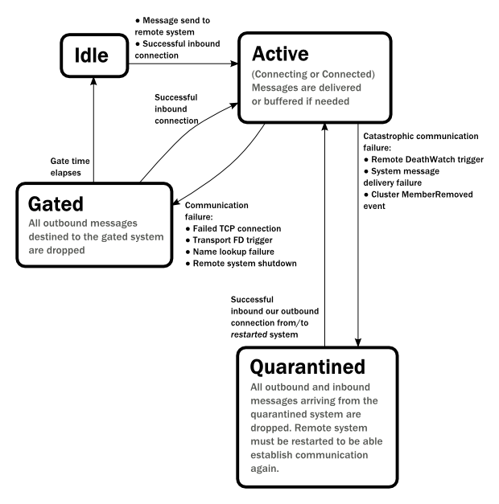

.. _remoting-java:

#####################
 Remoting
#####################

For an introduction of remoting capabilities of Akka please see :ref:`remoting`.

.. note::

  As explained in that chapter Akka remoting is designed for communication in a
  peer-to-peer fashion and it has limitations for client-server setups. In
  particular Akka Remoting does not work transparently with Network Address Translation,
  Load Balancers, or in Docker containers. For symmetric communication in these situations
  network and/or Akka configuration will have to be changed as described in
  :ref:`symmetric-communication`.

Preparing your ActorSystem for Remoting
^^^^^^^^^^^^^^^^^^^^^^^^^^^^^^^^^^^^^^^

The Akka remoting is a separate jar file. Make sure that you have the following dependency in your project::

  <dependency>
    <groupId>com.typesafe.akka</groupId>
    <artifactId>akka-remote_@binVersion@</artifactId>
    <version>@version@</version>
  </dependency>

To enable remote capabilities in your Akka project you should, at a minimum, add the following changes
to your ``application.conf`` file::

  akka {
    actor {
      provider = "akka.remote.RemoteActorRefProvider"
    }
    remote {
      enabled-transports = ["akka.remote.netty.tcp"]
      netty.tcp {
        hostname = "127.0.0.1"
        port = 2552
      }
   }
  }

As you can see in the example above there are four things you need to add to get started:

* Change provider from ``akka.actor.LocalActorRefProvider`` to ``akka.remote.RemoteActorRefProvider``
* Add host name - the machine you want to run the actor system on; this host
  name is exactly what is passed to remote systems in order to identify this
  system and consequently used for connecting back to this system if need be,
  hence set it to a reachable IP address or resolvable name in case you want to
  communicate across the network.
* Add port number - the port the actor system should listen on, set to 0 to have it chosen automatically

.. note::
  The port number needs to be unique for each actor system on the same machine even if the actor
  systems have different names. This is because each actor system has its own network subsystem
  listening for connections and handling messages as not to interfere with other actor systems.

The example above only illustrates the bare minimum of properties you have to add to enable remoting.
All settings are described in :ref:`remote-configuration-java`.

Looking up Remote Actors
^^^^^^^^^^^^^^^^^^^^^^^^

``actorSelection(path)`` will obtain an ``ActorSelection`` to an Actor on a remote node::

  ActorSelection selection =
    context.actorSelection("akka.tcp://app@10.0.0.1:2552/user/serviceA/worker");

As you can see from the example above the following pattern is used to find an actor on a remote node::

  akka.<protocol>://<actorsystemname>@<hostname>:<port>/<actor path>

Once you obtained a selection to the actor you can interact with it they same way you would with a local actor, e.g.::

  selection.tell("Pretty awesome feature", getSelf());

To acquire an :class:`ActorRef` for an :class:`ActorSelection` you need to
send a message to the selection and use the ``getSender`` reference of the reply from
the actor. There is a built-in ``Identify`` message that all Actors will understand
and automatically reply to with a ``ActorIdentity`` message containing the
:class:`ActorRef`. This can also be done with the ``resolveOne`` method of
the :class:`ActorSelection`, which returns a ``Future`` of the matching
:class:`ActorRef`.

.. note::

  For more details on how actor addresses and paths are formed and used, please refer to :ref:`addressing`.

.. note::

  Message sends to actors that are actually in the sending actor system do not
  get delivered via the remote actor ref provider. They're delivered directly,
  by the local actor ref provider.

  Aside from providing better performance, this also means that if the hostname
  you configure remoting to listen as cannot actually be resolved from within
  the very same actor system, such messages will (perhaps counterintuitively)
  be delivered just fine.

Creating Actors Remotely
^^^^^^^^^^^^^^^^^^^^^^^^

If you want to use the creation functionality in Akka remoting you have to further amend the
``application.conf`` file in the following way (only showing deployment section)::

  akka {
    actor {
      deployment {
        /sampleActor {
          remote = "akka.tcp://sampleActorSystem@127.0.0.1:2553"
        }
      }
    }
  }

The configuration above instructs Akka to react when an actor with path ``/sampleActor`` is created, i.e.
using ``system.actorOf(new Props(...), "sampleActor")``. This specific actor will not be directly instantiated,
but instead the remote daemon of the remote system will be asked to create the actor,
which in this sample corresponds to ``sampleActorSystem@127.0.0.1:2553``.

Once you have configured the properties above you would do the following in code:

.. includecode:: code/docs/remoting/RemoteDeploymentDocTest.java#sample-actor

The actor class ``SampleActor`` has to be available to the runtimes using it, i.e. the classloader of the
actor systems has to have a JAR containing the class.

.. note::

  In order to ensure serializability of ``Props`` when passing constructor
  arguments to the actor being created, do not make the factory a non-static
  inner class: this will inherently capture a reference to its enclosing
  object, which in most cases is not serializable. It is best to make a static
  inner class which implements :class:`Creator<T extends Actor>`.

  Serializability of all Props can be tested by setting the configuration item
  ``akka.actor.serialize-creators=on``. Only Props whose ``deploy`` has
  ``LocalScope`` are exempt from this check.

.. note::

  You can use asterisks as wildcard matches for the actor path sections, so you could specify:
  ``/*/sampleActor`` and that would match all ``sampleActor`` on that level in the hierarchy.
  You can also use wildcard in the last position to match all actors at a certain level:
  ``/someParent/*``. Non-wildcard matches always have higher priority to match than wildcards, so:
  ``/foo/bar`` is considered **more specific** than ``/foo/*`` and only the highest priority match is used.
  Please note that it **cannot** be used to partially match section, like this: ``/foo*/bar``, ``/f*o/bar`` etc.

Programmatic Remote Deployment
------------------------------

To allow dynamically deployed systems, it is also possible to include
deployment configuration in the :class:`Props` which are used to create an
actor: this information is the equivalent of a deployment section from the
configuration file, and if both are given, the external configuration takes
precedence.

With these imports:

.. includecode:: code/docs/remoting/RemoteDeploymentDocTest.java#import

and a remote address like this:

.. includecode:: code/docs/remoting/RemoteDeploymentDocTest.java#make-address

you can advise the system to create a child on that remote node like so:

.. includecode:: code/docs/remoting/RemoteDeploymentDocTest.java#deploy

Lifecycle and Failure Recovery Model
^^^^^^^^^^^^^^^^^^^^^^^^^^^^^^^^^^^^

Each link with a remote system can be in one of the four states as illustrated above. Before any communication
happens with a remote system at a given ``Address`` the state of the association is ``Idle``. The first time a message
is attempted to be sent to the remote system or an inbound connection is accepted the state of the link transitions to
``Active`` denoting that the two systems has messages to send or receive and no failures were encountered so far.
When a communication failure happens and the connection is lost between the two systems the link becomes ``Gated``.

In this state the system will not attempt to connect to the remote host and all outbound messages will be dropped. The time
while the link is in the ``Gated`` state is controlled by the setting ``akka.remote.retry-gate-closed-for``:
after this time elapses the link state transitions to ``Idle`` again. ``Gate`` is one-sided in the
sense that whenever a successful *inbound* connection is accepted from a remote system during ``Gate`` it automatically
transitions to ``Active`` and communication resumes immediately.

In the face of communication failures that are unrecoverable because the state of the participating systems are inconsistent,
the remote system becomes ``Quarantined``. Unlike ``Gate``, quarantining is permanent and lasts until one of the systems
is restarted. After a restart communication can be resumed again and the link can become ``Active`` again.

Watching Remote Actors
^^^^^^^^^^^^^^^^^^^^^^

Watching a remote actor is not different than watching a local actor, as described in
:ref:`deathwatch-java`.

Failure Detector
----------------

Under the hood remote death watch uses heartbeat messages and a failure detector to generate ``Terminated``
message from network failures and JVM crashes, in addition to graceful termination of watched
actor.

The heartbeat arrival times is interpreted by an implementation of
`The Phi Accrual Failure Detector <http://www.jaist.ac.jp/~defago/files/pdf/IS_RR_2004_010.pdf>`_.

The suspicion level of failure is given by a value called *phi*.
The basic idea of the phi failure detector is to express the value of *phi* on a scale that
is dynamically adjusted to reflect current network conditions.

The value of *phi* is calculated as::

  phi = -log10(1 - F(timeSinceLastHeartbeat))

where F is the cumulative distribution function of a normal distribution with mean
and standard deviation estimated from historical heartbeat inter-arrival times.

In the :ref:`remote-configuration-java` you can adjust the ``akka.remote.watch-failure-detector.threshold``
to define when a *phi* value is considered to be a failure.

A low ``threshold`` is prone to generate many false positives but ensures
a quick detection in the event of a real crash. Conversely, a high ``threshold``
generates fewer mistakes but needs more time to detect actual crashes. The
default ``threshold`` is 10 and is appropriate for most situations. However in
cloud environments, such as Amazon EC2, the value could be increased to 12 in
order to account for network issues that sometimes occur on such platforms.

The following chart illustrates how *phi* increase with increasing time since the
previous heartbeat.

.. image:: ../images/phi1.png

Phi is calculated from the mean and standard deviation of historical
inter arrival times. The previous chart is an example for standard deviation
of 200 ms. If the heartbeats arrive with less deviation the curve becomes steeper,
i.e. it is possible to determine failure more quickly. The curve looks like this for
a standard deviation of 100 ms.

.. image:: ../images/phi2.png

To be able to survive sudden abnormalities, such as garbage collection pauses and
transient network failures the failure detector is configured with a margin,
``akka.remote.watch-failure-detector.acceptable-heartbeat-pause``. You may want to
adjust the :ref:`remote-configuration-java` of this depending on you environment.
This is how the curve looks like for ``acceptable-heartbeat-pause`` configured to
3 seconds.

.. image:: ../images/phi3.png

Serialization
^^^^^^^^^^^^^

When using remoting for actors you must ensure that the ``props`` and ``messages`` used for
those actors are serializable. Failing to do so will cause the system to behave in an unintended way.

For more information please see :ref:`serialization-java`.

Routers with Remote Destinations
^^^^^^^^^^^^^^^^^^^^^^^^^^^^^^^^

It is absolutely feasible to combine remoting with :ref:`routing-java`.

A pool of remote deployed routees can be configured as:

.. includecode:: ../scala/code/docs/routing/RouterDocSpec.scala#config-remote-round-robin-pool

This configuration setting will clone the actor defined in the ``Props`` of the ``remotePool`` 10
times and deploy it evenly distributed across the two given target nodes.

A group of remote actors can be configured as:

.. includecode:: ../scala/code/docs/routing/RouterDocSpec.scala#config-remote-round-robin-group

This configuration setting will send messages to the defined remote actor paths.
It requires that you create the destination actors on the remote nodes with matching paths.
That is not done by the router. 

.. _remote-sample-java:

Remoting Sample
^^^^^^^^^^^^^^^

There is a more extensive remote example that comes with `Lightbend Activator <http://www.lightbend.com/platform/getstarted>`_.
The tutorial named `Akka Remote Samples with Java <http://www.lightbend.com/activator/template/akka-sample-remote-java>`_
demonstrates both remote deployment and look-up of remote actors.

Pluggable transport support
---------------------------

Akka can be configured to use various transports to communicate with remote systems. The core
component of this feature is the :meth:`akka.remote.transport.Transport` SPI. Transport implementations must extend this trait.
Transports can be loaded by setting the ``akka.remote.enabled-transports`` configuration key to point to one or
more configuration sections containing driver descriptions.

An example of setting up the default Netty based SSL driver as default::

  akka {
    remote {
      enabled-transports = [akka.remote.netty.ssl]

      netty.ssl.security {
        key-store = "mykeystore"
        trust-store = "mytruststore"
        key-store-password = "changeme"
        key-password = "changeme"
        trust-store-password = "changeme"
        protocol = "TLSv1.2"
        random-number-generator = "AES128CounterSecureRNG"
        enabled-algorithms = [TLS_RSA_WITH_AES_128_CBC_SHA]
      }
    }
  }

An example of setting up a custom transport implementation::

  akka {
    remote {
      applied-transports = ["akka.remote.mytransport"]

      mytransport {
        # The transport-class configuration entry is required, and
        # it must contain the fully qualified name of the transport
        # implementation
        transport-class = "my.package.MyTransport"

        # It is possible to decorate Transports with additional services.
        # Adapters should be registered in the "adapters" sections to
        # be able to apply them to transports
        applied-adapters = []

        # Driver specific configuration options has to be in the same
        # section:
        some-config = foo
        another-config = bar
      }

Remote Events
-------------

It is possible to listen to events that occur in Akka Remote, and to subscribe/unsubscribe to these events
you simply register as listener to the below described types in on the ``ActorSystem.eventStream``.

.. note::

    To subscribe to any remote event, subscribe to
    :meth:`RemotingLifecycleEvent`.  To subscribe to events related only to the
    lifecycle of associations, subscribe to
    :meth:`akka.remote.AssociationEvent`.

.. note::

    The use of term "Association" instead of "Connection" reflects that the
    remoting subsystem may use connectionless transports, but an association
    similar to transport layer connections is maintained between endpoints by
    the Akka protocol.

By default an event listener is registered which logs all of the events
described below. This default was chosen to help setting up a system, but it is
quite common to switch this logging off once that phase of the project is
finished.

.. note::

  In order to switch off the logging, set
  ``akka.remote.log-remote-lifecycle-events = off`` in your
  ``application.conf``.

To be notified when an association is over ("disconnected") listen to ``DisassociatedEvent`` which
holds the direction of the association (inbound or outbound) and the addresses of the involved parties.

To be notified  when an association is successfully established ("connected") listen to ``AssociatedEvent`` which
holds the direction of the association (inbound or outbound) and the addresses of the involved parties.

To intercept errors directly related to associations, listen to ``AssociationErrorEvent`` which
holds the direction of the association (inbound or outbound), the addresses of the involved parties and the
``Throwable`` cause.

To be notified  when the remoting subsystem is ready to accept associations, listen to ``RemotingListenEvent`` which
contains the addresses the remoting listens on.

To be notified  when the remoting subsystem has been shut down, listen to ``RemotingShutdownEvent``.

To be notified when the current system is quarantined by the remote system, listen to ``ThisActorSystemQuarantinedEvent``,
which includes the addresses of local and remote ActorSystems.

To intercept generic remoting related errors, listen to ``RemotingErrorEvent`` which holds the ``Throwable`` cause.

Remote Security
^^^^^^^^^^^^^^^

Akka provides a couple of ways to enhance security between remote nodes (client/server):

* Untrusted Mode
* Security Cookie Handshake

Untrusted Mode
--------------

As soon as an actor system can connect to another remotely, it may in principle
send any possible message to any actor contained within that remote system. One
example may be sending a :class:`PoisonPill` to the system guardian, shutting
that system down. This is not always desired, and it can be disabled with the
following setting::

    akka.remote.untrusted-mode = on

This disallows sending of system messages (actor life-cycle commands,
DeathWatch, etc.) and any message extending :class:`PossiblyHarmful` to the
system on which this flag is set. Should a client send them nonetheless they
are dropped and logged (at DEBUG level in order to reduce the possibilities for
a denial of service attack). :class:`PossiblyHarmful` covers the predefined
messages like :class:`PoisonPill` and :class:`Kill`, but it can also be added
as a marker trait to user-defined messages.

Messages sent with actor selection are by default discarded in untrusted mode, but
permission to receive actor selection messages can be granted to specific actors
defined in configuration::

    akka.remote.trusted-selection-paths = ["/user/receptionist", "/user/namingService"]

The actual message must still not be of type :class:`PossiblyHarmful`.

In summary, the following operations are ignored by a system configured in
untrusted mode when incoming via the remoting layer:

* remote deployment (which also means no remote supervision)
* remote DeathWatch
* ``system.stop()``, :class:`PoisonPill`, :class:`Kill`
* sending any message which extends from the :class:`PossiblyHarmful` marker
  interface, which includes :class:`Terminated`
* messages sent with actor selection, unless destination defined in ``trusted-selection-paths``.

.. note::

  Enabling the untrusted mode does not remove the capability of the client to
  freely choose the target of its message sends, which means that messages not
  prohibited by the above rules can be sent to any actor in the remote system.
  It is good practice for a client-facing system to only contain a well-defined
  set of entry point actors, which then forward requests (possibly after
  performing validation) to another actor system containing the actual worker
  actors. If messaging between these two server-side systems is done using
  local :class:`ActorRef` (they can be exchanged safely between actor systems
  within the same JVM), you can restrict the messages on this interface by
  marking them :class:`PossiblyHarmful` so that a client cannot forge them.

SSL
---

SSL can be used as the remote transport by adding ``akka.remote.netty.ssl``
to the ``enabled-transport`` configuration section. See a description of the settings
in the :ref:`remote-configuration-java` section.

The SSL support is implemented with Java Secure Socket Extension, please consult the official
`Java Secure Socket Extension documentation <http://docs.oracle.com/javase/7/docs/technotes/guides/security/jsse/JSSERefGuide.html>`_
and related resources for troubleshooting.

.. note::

  When using SHA1PRNG on Linux it's recommended specify ``-Djava.security.egd=file:/dev/./urandom`` as argument
  to the JVM to prevent blocking. It is NOT as secure because it reuses the seed.
  Use '/dev/./urandom', not '/dev/urandom' as that doesn't work according to
  `Bug ID: 6202721 <http://bugs.sun.com/view_bug.do?bug_id=6202721>`_.

.. _remote-configuration-java:

Remote Configuration
^^^^^^^^^^^^^^^^^^^^

There are lots of configuration properties that are related to remoting in Akka. We refer to the 
:ref:`reference configuration <config-akka-remote>` for more information.

.. note::

   Setting properties like the listening IP and port number programmatically is
   best done by using something like the following:

   .. includecode:: code/docs/remoting/RemoteDeploymentDocTest.java#programmatic

.. _remote-configuration-nat-java:

Akka behind NAT or in a Docker container
----------------------------------------

In setups involving Network Address Translation (NAT), Load Balancers or Docker
containers the hostname and port pair that akka binds to will be different than the "logical"
host name and port pair that is used to connect to the system from the outside. This requires
special configuration that sets both the logical and the bind pairs for remoting.

.. code-block:: ruby

  akka {
    remote {
      netty.tcp {
        hostname = my.domain.com      # external (logical) hostname
        port = 8000                   # external (logical) port

        bind-hostname = local.address # internal (bind) hostname
        bind-port = 2552              # internal (bind) port
      }
   }
  }
