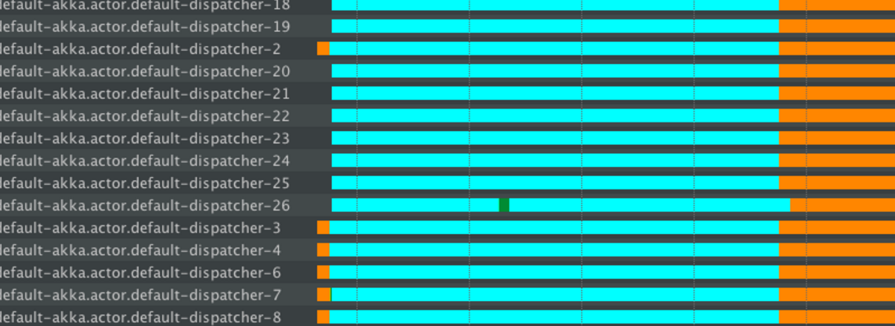

.. _handling-blocking-in-http-routes-scala:

Handling blocking operations in Akka HTTP
=========================================
Sometimes it is difficult to avoid performing the blocking operations and there
are good chances that the blocking is done inside a Future execute, which may
lead to problems. It is important to handle the blocking operations correctly.

Problem
-------
Using ``context.dispatcher`` as the dispatcher on which the blocking Future
executes, can be a problem. The same dispatcher is used by the routing
infrastructure to actually handle the incoming requests. 

If all of the available threads are blocked, the routing infrastructure will end up *starving*. 
Therefore, routing infrastructure should not be blocked. Instead, a dedicated dispatcher
for blocking operations should be used.

.. note:: 
  Blocking APIs should also be avoided if possible. Try to find or build Reactive APIs,
  such that blocking is minimised, or moved over to dedicated dispatchers.
  
  Often when integrating with existing libraries or systems it is not possible to 
  avoid blocking APIs, then following solution explains how to handle blocking
  operations properly. 
  
  Note that the same hints apply to managing blocking operations anywhere in Akka,
  including in Actors etc.

In the below thread state diagrams the colours have the following meaning:

* Turquoise - Sleeping state
* Orange - Waiting state
* Green - Runnable state

The thread information was recorded using the YourKit profiler, however any good JVM profiler 
has this feature (including the free and bundled with the Oracle JDK VisualVM as well as Oracle Flight Recorder). 

Problem example: blocking the default dispatcher
^^^^^^^^^^^^^^^^^^^^^^^^^^^^^^^^^^^^^^^^^^^^^^^^

.. includecode2:: ../code/docs/http/scaladsl/server/BlockingInHttpExamplesSpec.scala
   :snippet: blocking-example-in-default-dispatcher

Here the app is exposed to load of continous GET requests and large number
of akka.actor.default-dispatcher threads are handling requests. The orange
portion of the thread shows that they are idle. Idle threads are fine,
they're ready to accept new work. However large amounts of Turquoise (sleeping) threads are very bad!

After some time, the app is exposed to the load of requesting POST requests,
which will block these threads. For example "``default-akka.default-dispatcher2,3,4``"
are going into the blocking state, after being idle before. It can be observed
that the number of new threads increase, "``default-akka.actor.default-dispatcher 18,19,20,...``" 
however they go to sleep state immediately, thus wasting the
resources.

The number of such new threads depend on the default dispatcher configuration,
but likely will not exceed 50. Since many POST requests are done, the entire
thread pool is starved. The blocking operations dominate such that the routing
infra has no thread available to handle the other requests.

In essence, the ``Thread.sleep`` has dominated all threads and caused anything 
executing on the default dispatcher to starve for resources (including any Actors
that you have not configured an explicit dispatcher for (sic!)).

Solution: Dedicated dispatcher for blocking operations
------------------------------------------------------

In ``application.conf``, the dispatcher dedicated for blocking behaviour should
be configured as follows::

  my-blocking-dispatcher {
    type = Dispatcher
    executor = "thread-pool-executor"
    thread-pool-executer {
      // or in Akka 2.4.2+
      fixed-pool-size = 16
    }
      throughput = 100
  }

There are many dispatcher options available which can be found in :ref:`dispatchers-scala`.

Here ``thread-pool-executer`` is used, which has a hard limit of threads, it can
keep available for blocking operations. The size settings depend on the app
functionality and the number of cores the server has.

Whenever blocking has to be done, use the above configured dispatcher
instead of the default one:

.. includecode2:: ../code/docs/http/scaladsl/server/BlockingInHttpExamplesSpec.scala
   :snippet: blocking-example-in-dedicated-dispatcher

This forces the app to use the same load, initially normal requests and then
the blocking requests. The thread pool behaviour is shown in the figrue.

.. image:: DispatcherBehaviourOnGoodCode.png

Initially, the normal requests are easily handled by default dispatcher, the
green lines, which represents the actual execution.

When blocking operations are issued, the ``my-blocking-dispatcher``
starts up to the number of configured threads. It handles sleeping. After
certain period of nothing happening to the threads, it shuts them down.

If another bunch of operations have to be done, the pool will start new
threads that will take care of putting them into sleep state, but the
threads are not wasted.

In this case, the throughput of the normal GET requests are not impacted
they were still served on the default dispatcher.

This is the recommended way of dealing with any kind of blocking in reactive
applications. It is referred as "bulkheading" or "isolating" the bad behaving
parts of an app. In this case, bad behaviour of blocking operations.

There is good documentation availabe in Akka docs section, 
`Blocking needs careful management <http://doc.akka.io/docs/akka/current/general/actor-systems.html#Blocking_Needs_Careful_Management>`_.
