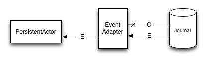

.. _persistence-schema-evolution-scala:

##############################
Persistence - Schema Evolution
##############################

When working on long running projects using :ref:`persistence-scala`, or any kind of `Event Sourcing`_ architectures,
schema evolution becomes one of the more important technical aspects of developing your application.
The requirements as well as our own understanding of the business domain may (and will) change in time.

In fact, if a project matures to the point where you need to evolve its schema to adapt to changing business
requirements you can view this as first signs of its success – if you wouldn't need to adapt anything over an apps
lifecycle that could mean that no-one is really using it actively.

In this chapter we will investigate various schema evolution strategies and techniques from which you can pick and
choose the ones that match your domain and challenge at hand.

.. note::
  This page proposes a number of possible solutions to the schema evolution problem and explains how some of the
  utilities Akka provides can be used to achieve this, it is by no means a complete (closed) set of solutions.

  Sometimes, based on the capabilities of your serialization formats, you may be able to evolve your schema in
  different ways than outlined in the sections below. If you discover useful patterns or techniques for schema
  evolution feel free to submit Pull Requests to this page to extend it.

Schema evolution in event-sourced systems
=========================================

In recent years we have observed a tremendous move towards immutable append-only datastores, with event-sourcing being
the prime technique successfully being used in these settings. For an excellent overview why and how immutable data makes scalability
and systems design much simpler you may want to read Pat Helland's excellent `Immutability Changes Everything`_ whitepaper.

Since with `Event Sourcing`_ the **events are immutable** and usually never deleted – the way schema evolution is handled
differs from how one would go about it in a mutable database setting (e.g. in typical CRUD database applications).
The system needs to be able to continue to work in the presence of "old" events which were stored under the "old" schema.
We also want to limit complexity in the business logic layer, exposing a consistent view over all of the events of a given
type to :class:`PersistentActor` s and :ref:`persistence queries <persistence-query-scala>`. This allows the business logic layer to focus on solving business problems
instead of having to explicitly deal with different schemas.

The system needs to be able to continue to work in the presence of "old" events which were stored under the "old" schema,
and we want to limit the complexity to the data layer, exposing a consistent view over all of the events of a given type
to :class:`PersistentActor` s and persistence queries, which allows these layers to focus on the business problems instead
handling the different schemas explicitly in the business logic layers.

In summary, schema evolution in event sourced systems exposes the following characteristics:
  - Allow the system to continue operating without large scale migrations to be applied,
  - Allow the system to read "old" events from the underlying storage, however present them in a "new" view to the application logic,
  - Transparently promote events to the latest versions during recovery (or queries) such that the business logic need not consider multiple versions of events

.. _Immutability Changes Everything: http://www.cidrdb.org/cidr2015/Papers/CIDR15_Paper16.pdf
.. _Event Sourcing: http://martinfowler.com/eaaDev/EventSourcing.html

Types of schema evolution
-------------------------
Before we explain the various techniques that can be used to safely evolve the schema of your persistent events
over time, we first need to define what the actual problem is, and what the typical styles of changes are.

Since events are never deleted, we need to have a way to be able to replay (read) old events, in such way
that does not force the ``PersistentActor`` to be aware of all possible versions of an event that it may have
persisted in the past. Instead, we want the Actors to work on some form of "latest" version of the event and provide some
means of either converting old "versions" of stored events into this "latest" event type, or constantly evolve the event
definition - in a backwards compatible way - such that the new deserialization code can still read old events.

The most common schema changes you will likely are:

- :ref:`adding a field to an event type <add-field-scala>`,
- :ref:`remove or rename field in event type <rename-field-scala>`,
- :ref:`remove event type <remove-event-class-scala>`,
- :ref:`split event into multiple smaller events <split-large-event-into-smaller-scala>`.

The following sections will explain some patterns which can be used to safely evolve your schema when facing those changes.

Picking the right serialization format
======================================

Picking the serialization format is a very important decision you will have to make while building your application.
It affects which kind of evolutions are simple (or hard) to do, how much work is required to add a new datatype, and,
last but not least, serialization performance.

If you find yourself realising you have picked "the wrong" serialization format, it is always possible to change
the format used for storing new events, however you would have to keep the old deserialization code in order to
be able to replay events that were persisted using the old serialization scheme. It is possible to "rebuild"
an event-log from one serialization format to another one, however it may be a more involved process if you need
to perform this on a live system.

Binary serialization formats that we have seen work well for long-lived applications include the very flexible IDL based:
`Google Protobuf`_, `Apache Thrift`_ or `Apache Avro`_. Avro schema evolution is more "entire schema" based, instead of
single fields focused like in protobuf or thrift, and usually requires using some kind of schema registry.

Users who want their data to be human-readable directly in the write-side
datastore may opt to use plain-old `JSON`_ as the storage format, though that comes at a cost of lacking support for schema
evolution and relatively large marshalling latency.

There are plenty excellent blog posts explaining the various trade-offs between popular serialization formats,
one post we would like to highlight is the very well illustrated `Schema evolution in Avro, Protocol Buffers and Thrift`_
by Martin Kleppmann.

.. _Google Protobuf: https://developers.google.com/protocol-buffers
.. _Apache Avro: https://avro.apache.org
.. _JSON: http://json.org
.. _Schema evolution in Avro, Protocol Buffers and Thrift: http://martin.kleppmann.com/2012/12/05/schema-evolution-in-avro-protocol-buffers-thrift.html

Provided default serializers
----------------------------

Akka Persistence provides `Google Protocol Buffers`_ based serializers (using :ref:`Akka Serialization <serialization-scala>`)
for it's own message types such as ``PersistentRepr``, ``AtomicWrite`` and snapshots. Journal plugin implementations
*may* choose to use those provided serializers, or pick a serializer which suits the underlying database better.

.. note::
  Serialization is **NOT** handled automatically by Akka Persistence itself. Instead, it only provides the above described
  serializers, and in case a ``AsyncWriteJournal`` plugin implementation chooses to use them directly, the above serialization
  scheme will be used.

  Please refer to your write journal's documentation to learn more about how it handles serialization!

  For example, some journals may choose to not use Akka Serialization *at all* and instead store the data in a format
  that is more "native" for the underlying datastore, e.g. using JSON or some other kind of format that the target
  datastore understands directly.

The below figure explains how the default serialization scheme works, and how it fits together with serializing the
user provided message itself, which we will from here on refer to as the ``payload`` (highlighted in yellow):

.. figure:: ../images/persistent-message-envelope.png
   :align: center

   Akka Persistence provided serializers wrap the user payload in an envelope containing all persistence-relevant information.
   **If the Journal uses provided Protobuf serializers for the wrapper types (e.g. PersistentRepr), then the payload will
   be serialized using the user configured serializer, and if none is provided explicitly, Java serialization will be used for it.**

The blue colored regions of the ``PersistentMessage`` indicate what is serialized using the generated protocol buffers
serializers, and the yellow payload indicates the user provided event (by calling ``persist(payload)(...)``).
As you can see, the ``PersistentMessage`` acts as an envelope around the payload, adding various fields related to the
origin of the event (``persistenceId``, ``sequenceNr`` and more).

More advanced techniques (e.g. :ref:`remove-event-class-scala`) will dive into using the manifests for increasing the
flexibility of the persisted vs. exposed types even more. However for now we will focus on the simpler evolution techniques,
concerning simply configuring the payload serializers.

By default the ``payload`` will be serialized using Java Serialization. This is fine for testing and initial phases
of your development (while you're still figuring out things and the data will not need to stay persisted forever).
However, once you move to production you should really *pick a different serializer for your payloads*.

.. warning::
  Do not rely on Java serialization (which will be picked by Akka by default if you don't specify any serializers)
  for *serious* application development! It does not lean itself well to evolving schemas over long periods of time,
  and its performance is also not very high (it never was designed for high-throughput scenarios).

.. _Google Protocol Buffers: https://developers.google.com/protocol-buffers/
.. _Apache Thrift: https://thrift.apache.org/

Configuring payload serializers
-------------------------------
This section aims to highlight the complete basics on how to define custom serializers using :ref:`Akka Serialization <serialization-scala>`.
Many journal plugin implementations use Akka Serialization, thus it is tremendously important to understand how to configure
it to work with your event classes.

.. note::
  Read the :ref:`Akka Serialization <serialization-scala>` docs to learn more about defining custom serializers,
  to improve performance and maintainability of your system. Do not depend on Java serialization for production deployments.

The below snippet explains in the minimal amount of lines how a custom serializer can be registered.
For more in-depth explanations on how serialization picks the serializer to use etc, please refer to its documentation.

First we start by defining our domain model class, here representing a person:

.. includecode:: code/docs/persistence/PersistenceSchemaEvolutionDocSpec.scala#simplest-custom-serializer-model

Next we implement a serializer (or extend an existing one to be able to handle the new ``Person`` class):

.. includecode:: code/docs/persistence/PersistenceSchemaEvolutionDocSpec.scala#simplest-custom-serializer

And finally we register the serializer and bind it to handle the ``docs.persistence.Person`` class:

.. includecode:: code/docs/persistence/PersistenceSchemaEvolutionDocSpec.scala#simplest-custom-serializer-config

Deserialization will be performed by the same serializer which serialized the message initially
because of the ``identifier`` being stored together with the message.

Please refer to the :ref:`Akka Serialization <serialization-scala>` documentation for more advanced use of serializers,
especially the :ref:`string-manifest-serializer-scala` section since it is very useful for Persistence based applications
dealing with schema evolutions, as we will see in some of the examples below.

Schema evolution in action
==========================

In this section we will discuss various schema evolution techniques using concrete examples and explaining
some of the various options one might go about handling the described situation. The list below is by no means
a complete guide, so feel free to adapt these techniques depending on your serializer's capabilities
and/or other domain specific limitations.

.. _add-field-scala:

Add fields
----------

**Situation:**
You need to add a field to an existing message type. For example, a ``SeatReservation(letter:String, row:Int)`` now
needs to have an associated code which indicates if it is a window or aisle seat.

**Solution:**
Adding fields is the most common change you'll need to apply to your messages so make sure the serialization format
you picked for your payloads can handle it apropriately, i.e. such changes should be *binary compatible*.
This is easily achieved using the right serializer toolkit – we recommend something like `Google Protocol Buffers`_ or
`Apache Thrift`_ however other tools may fit your needs just as well – picking a serializer backend is something
you should research before picking one to run with. In the following examples we will be using protobuf, mostly because
we are familiar with it, it does its job well and Akka is using it internally as well.

While being able to read messages with missing fields is half of the solution, you also need to deal with the missing
values somehow. This is usually modeled as some kind of default value, or by representing the field as an ``Option[T]``
See below for an example how reading an optional field from a serialized protocol buffers message might look like.

.. includecode:: code/docs/persistence/PersistenceSchemaEvolutionDocSpec.scala#protobuf-read-optional-model

Next we prepare an protocol definition using the protobuf Interface Description Language, which we'll use to generate
the serializer code to be used on the Akka Serialization layer (notice that the schema aproach allows us to easily rename
fields, as long as the numeric identifiers of the fields do not change):

.. includecode:: ../../src/main/protobuf/FlightAppModels.proto#protobuf-read-optional-proto

The serializer implementation uses the protobuf generated classes to marshall the payloads.
Optional fields can be handled explicitly or missing values by calling the ``has...`` methods on the protobuf object,
which we do for ``seatType`` in order to use a ``Unknown`` type in case the event was stored before we had introduced
the field to this event type:

.. includecode:: code/docs/persistence/PersistenceSchemaEvolutionDocSpec.scala#protobuf-read-optional

.. _rename-field-scala:

Rename fields
-------------

**Situation:**
When first designing the system the ``SeatReverved`` event featured an ``code`` field.
After some time you discover that what was originally called ``code`` actually means ``seatNr``, thus the model
should be changed to reflect this concept more accurately.

**Solution 1 - using IDL based serializers:**
First, we will discuss the most efficient way of dealing with such kinds of schema changes – IDL based serializers.

IDL stands for Interface Description Language, and means that the schema of the messages that will be stored is based
on this description. Most IDL based serializers also generate the serializer / deserializer code so that using them
is not too hard. Examples of such serializers are protobuf or thrift.

Using these libraries rename operations are "free", because the field name is never actually stored in the binary
representation of the message. This is one of the advantages of schema based serializers, even though that they
add the overhead of having to maintain the schema. When using serializers like this, no additional code change
(except renaming the field and method used during serialization) is needed to perform such evolution:

.. figure:: ../images/persistence-serializer-rename.png
   :align: center

This is how such a rename would look in protobuf:

.. includecode:: code/docs/persistence/PersistenceSchemaEvolutionDocSpec.scala#protobuf-rename-proto

It is important to learn about the strengths and limitations of your serializers, in order to be able to move
swiftly and refactor your models fearlessly as you go on with the project.

.. note::
  Learn in-depth about the serialization engine you're using as it will impact how you can aproach schema evolution.

  Some operations are "free" in certain serialization formats (more often than not: removing/adding optional fields,
  sometimes renaming fields etc.), while some other operations are strictly not possible.

**Solution 2 - by manually handling the event versions:**
Another solution, in case your serialization format does not support renames as easily as the above mentioned formats,
is versioning your schema. For example, you could have made your events carry an additional field called ``_version``
which was set to ``1`` (because it was the initial schema), and once you change the schema you bump this number to ``2``,
and write an adapter which can perform the rename.

This approach is popular when your serialization format is something like JSON, where renames can not be performed
automatically by the serializer. You can do these kinds of "promotions" either manually (as shown in the example below)
or using a library like `Stamina`_ which helps to create those ``V1->V2->V3->...->Vn`` promotion chains without much boilerplate.

.. figure:: ../images/persistence-manual-rename.png
   :align: center

The following snippet showcases how one could apply renames if working with plain JSON (using ``spray.json.JsObject``):

.. includecode:: code/docs/persistence/PersistenceSchemaEvolutionDocSpec.scala#rename-plain-json

As you can see, manually handling renames induces some boilerplate onto the EventAdapter, however much of it
you will find is common infrastructure code that can be either provided by an external library (for promotion management)
or put together in a simple helper trait.

.. note::
  The technique of versioning events and then promoting them to the latest version using JSON transformations
  can of course be applied to more than just field renames – it also applies to adding fields and all kinds of
  changes in the message format.

.. _Stamina: https://github.com/scalapenos/stamina

.. _remove-event-class-scala:

Remove event class and ignore events
------------------------------------

**Situation:**
While investigating app performance you notice that insane amounts of ``CustomerBlinked`` events are being stored
for every customer each time he/she blinks. Upon investigation you decide that the event does not add any value
and should be deleted. You still have to be able to replay from a journal which contains those old CustomerBlinked events though.

**Naive solution - drop events in EventAdapter:**

The problem of removing an event type from the domain model is not as much its removal, as the implications
for the recovery mechanisms that this entails. For example, a naive way of filtering out certain kinds of events from
being delivered to a recovering ``PersistentActor`` is pretty simple, as one can simply filter them out in an :ref:`EventAdapter <event-adapters-scala>`:

   The ``EventAdapter`` can drop old events (**O**) by emitting an empty :class:`EventSeq`.
   Other events can simply be passed through (**E**).

This however does not address the underlying cost of having to deserialize all the events during recovery,
even those which will be filtered out by the adapter. In the next section we will improve the above explained mechanism
to avoid deserializing events which would be filtered out by the adapter anyway, thus allowing to save precious time
during a recovery containing lots of such events (without actually having to delete them).

**Improved solution - deserialize into tombstone:**

In the just described technique we have saved the PersistentActor from receiving un-wanted events by filtering them
out in the ``EventAdapter``, however the event itself still was deserialized and loaded into memory.
This has two notable *downsides*:

  - first, that the deserialization was actually performed, so we spent some of out time budget on the
    deserialization, even though the event does not contribute anything to the persistent actors state.
  - second, that we are *unable to remove the event class* from the system – since the serializer still needs to create
    the actuall instance of it, as it does not know it will not be used.

The solution to these problems is to use a serializer that is aware of that event being no longer needed, and can notice
this before starting to deserialize the object.

This aproach allows us to *remove the original class from our classpath*, which makes for less "old" classes lying around in the project.
This can for example be implemented by using an ``SerializerWithStringManifest``
(documented in depth in :ref:`string-manifest-serializer-scala`). By looking at the string manifest, the serializer can notice
that the type is no longer needed, and skip the deserialization all-together:

.. figure:: ../images/persistence-drop-event-serializer.png
   :align: center

   The serializer is aware of the old event types that need to be skipped (**O**), and can skip deserializing them alltogether
   by simply returning a "tombstone" (**T**), which the EventAdapter converts into an empty EventSeq.
   Other events (**E**) can simply be passed through.

The serializer detects that the string manifest points to a removed event type and skips attempting to deserialize it:

.. includecode:: code/docs/persistence/PersistenceSchemaEvolutionDocSpec.scala#string-serializer-skip-deleved-event-by-manifest

The EventAdapter we implemented is aware of ``EventDeserializationSkipped`` events (our "Tombstones"),
and emits and empty ``EventSeq`` whenever such object is encoutered:

.. includecode:: code/docs/persistence/PersistenceSchemaEvolutionDocSpec.scala#string-serializer-skip-deleved-event-by-manifest-adapter

.. _detach-domain-from-data-model-scala:

Detach domain model from data model
-----------------------------------

**Situation:**
You want to separate the application model (often called the "*domain model*") completely from the models used to
persist the corresponding events (the "*data model*"). For example because the data representation may change
independently of the domain model.

Another situation where this technique may be useful is when your serialization tool of choice requires generated
classes to be used for serialization and deserialization of objects, like for example `Google Protocol Buffers`_ do,
yet you do not want to leak this implementation detail into the domain model itself, which you'd like to model as
plain Scala case classes.

**Solution:**
In order to detach the domain model, which is often represented using pure scala (case) classes, from the data model
classes which very often may be less user-friendly yet highly optimised for throughput and schema evolution
(like the classes generated by protobuf for example), it is possible to use a simple EventAdapter which maps between
these types in a 1:1 style as illustrated below:

.. figure:: ../images/persistence-detach-models.png
   :align: center

   Domain events (**A**) are adapted to the data model events (**D**) by the ``EventAdapter``.
   The data model can be a format natively understood by the journal, such that it can store it more efficiently or
   include additional data for the event (e.g. tags), for ease of later querying.

We will use the following domain and data models to showcase how the separation can be implemented by the adapter:

.. includecode:: code/docs/persistence/PersistenceSchemaEvolutionDocSpec.scala#detach-models

The :class:`EventAdapter` takes care of converting from one model to the other one (in both directions),
alowing the models to be completely detached from each other, such that they can be optimised independently
as long as the mapping logic is able to convert between them:

.. includecode:: code/docs/persistence/PersistenceSchemaEvolutionDocSpec.scala#detach-models-adapter

The same technique could also be used directly in the Serializer if the end result of marshalling is bytes.
Then the serializer can simply convert the bytes do the domain object by using the generated protobuf builders.

.. _store-human-readable-scala:

Store events as human-readable data model
-----------------------------------------
**Situation:**
You want to keep your persisted events in a human-readable format, for example JSON.

**Solution:**
This is a special case of the :ref:`detach-domain-from-data-model-scala` pattern, and thus requires some co-operation
from the Journal implementation to achieve this.

An example of a Journal which may implement this pattern is MongoDB, however other databases such as PostgreSQL
and Cassandra could also do it because of their built-in JSON capabilities.

In this aproach, the :class:`EventAdapter` is used as the marshalling layer: it serializes the events to/from JSON.
The journal plugin notices that the incoming event type is JSON (for example by performing a ``match`` on the incoming
event) and stores the incoming object directly.

.. includecode:: code/docs/persistence/PersistenceSchemaEvolutionDocSpec.scala#detach-models-adapter-json

.. note::
  This technique only applies if the Akka Persistence plugin you are using provides this capability.
  Check the documentation of your favourite plugin to see if it supports this style of persistence.

  If it doesn't, you may want to skim the `list of existing journal plugins`_, just in case some other plugin
  for your favourite datastore *does* provide this capability.

**Alternative solution:**

In fact, an AsyncWriteJournal implementation could natively decide to not use binary serialization at all,
and *always* serialize the incoming messages as JSON - in which case the ``toJournal`` implementation of the
:class:`EventAdapter` would be an identity function, and the ``fromJournal`` would need to de-serialize messages
from JSON.

.. note::
  If in need of human-readable events on the *write-side* of your application reconsider whether preparing materialized views
  using :ref:`persistence-query-scala` would not be an efficient way to go about this, without compromising the
  write-side's throughput characteristics.

  If indeed you want to use a human-readable representation on the write-side, pick a Persistence plugin
  that provides that functionality, or – implement one yourself.

.. _list of existing journal plugins: http://akka.io/community/#journal-plugins

.. _split-large-event-into-smaller-scala:

Split large event into fine-grained events
------------------------------------------

**Situation:**
While refactoring your domain events, you find that one of the events has become too large (coarse-grained)
and needs to be split up into multiple fine-grained events.

**Solution:**
Let us consider a situation where an event represents "user details changed". After some time we discover that this
event is too coarse, and needs to be split into "user name changed" and "user address changed", because somehow
users keep changing their usernames a lot and we'd like to keep this as a separate event.

The write side change is very simple, we simply persist ``UserNameChanged`` or ``UserAddressChanged`` depending
on what the user actually intended to change (instead of the composite ``UserDetailsChanged`` that we had in version 1
of our model).

.. figure:: ../images/persistence-event-adapter-1-n.png
   :align: center

   The ``EventAdapter`` splits the incoming event into smaller more fine grained events during recovery.

During recovery however, we now need to convert the old ``V1`` model into the ``V2`` representation of the change.
Depending if the old event contains a name change, we either emit the ``UserNameChanged`` or we don't,
and the address change is handled similarily:

.. includecode:: code/docs/persistence/PersistenceSchemaEvolutionDocSpec.scala#split-events-during-recovery

By returning an :class:`EventSeq` from the event adapter, the recovered event can be converted to multiple events before
being delivered to the persistent actor.
