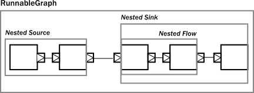
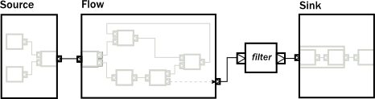

.. _composition-scala:

Modularity, Composition and Hierarchy
=====================================

Akka Streams provide a uniform model of stream processing graphs, which allows flexible composition of reusable
components. In this chapter we show how these look like from the conceptual and API perspective, demonstrating
the modularity aspects of the library.

Basics of composition and modularity
------------------------------------

Every processing stage used in Akka Streams can be imagined as a "box" with input and output ports where elements to
be processed arrive and leave the stage. In this view, a :class:`Source` is nothing else than a "box" with a single
output port, or, a :class:`BidiFlow` is a "box" with exactly two input and two output ports. In the figure below
we illustrate the most common used stages viewed as "boxes".

|

.. image:: ../../images/compose_shapes.png
   :align: center

|

The *linear* stages are :class:`Source`, :class:`Sink`
and :class:`Flow`, as these can be used to compose strict chains of processing stages.
Fan-in and Fan-out stages have usually multiple input or multiple output ports, therefore they allow to build
more complex graph layouts, not just chains. :class:`BidiFlow` stages are usually useful in IO related tasks, where
there are input and output channels to be handled. Due to the specific shape of :class:`BidiFlow` it is easy to
stack them on top of each other to build a layered protocol for example. The ``TLS`` support in Akka is for example
implemented as a :class:`BidiFlow`.

These reusable components already allow the creation of complex processing networks. What we
have seen so far does not implement modularity though. It is desirable for example to package up a larger graph entity into
a reusable component which hides its internals only exposing the ports that are meant to the users of the module
to interact with. One good example is the ``Http`` server component, which is encoded internally as a
:class:`BidiFlow` which interfaces with the client TCP connection using an input-output port pair accepting and sending
:class:`ByteString` s, while its upper ports emit and receive :class:`HttpRequest` and :class:`HttpResponse` instances.

The following figure demonstrates various composite stages, that contain various other type of stages internally, but
hiding them behind a *shape* that looks like a :class:`Source`, :class:`Flow`, etc.

|

.. image:: ../../images/compose_composites.png
   :align: center

|

One interesting example above is a :class:`Flow` which is composed of a disconnected :class:`Sink` and :class:`Source`.
This can be achieved by using the ``fromSinkAndSource()`` constructor method on :class:`Flow` which takes the two parts as
parameters.

The example :class:`BidiFlow` demonstrates that internally a module can be of arbitrary complexity, and the exposed
ports can be wired in flexible ways. The only constraint is that all the ports of enclosed modules must be either
connected to each other, or exposed as interface ports, and the number of such ports needs to match the requirement
of the shape, for example a :class:`Source` allows only one exposed output port, the rest of the internal ports must
be properly connected.

These mechanics allow arbitrary nesting of modules. For example the following figure demonstrates a :class:`RunnableGraph`
that is built from a composite :class:`Source` and a composite :class:`Sink` (which in turn contains a composite
:class:`Flow`).

|

|

The above diagram contains one more shape that we have not seen yet, which is called :class:`RunnableGraph`. It turns
out, that if we wire all exposed ports together, so that no more open ports remain, we get a module that is *closed*.
This is what the :class:`RunnableGraph` class represents. This is the shape that a :class:`Materializer` can take
and turn into a network of running entities that perform the task described. In fact, a :class:`RunnableGraph` is a
module itself, and (maybe somewhat surprisingly) it can be used as part of larger graphs. It is rarely useful to embed
a closed graph shape in a larger graph (since it becomes an isolated island as there are no open port for communication
with the rest of the graph), but this demonstrates the uniform underlying model.

If we try to build a code snippet that corresponds to the above diagram, our first try might look like this:

.. includecode:: ../code/docs/stream/CompositionDocSpec.scala#non-nested-flow

It is clear however that there is no nesting present in our first attempt, since the library cannot figure out
where we intended to put composite module boundaries, it is our responsibility to do that. If we are using the
DSL provided by the :class:`Flow`, :class:`Source`, :class:`Sink` classes then nesting can be achieved by calling one of the
methods ``withAttributes()`` or ``named()`` (where the latter is just a shorthand for adding a name attribute).

The following code demonstrates how to achieve the desired nesting:

.. includecode:: ../code/docs/stream/CompositionDocSpec.scala#nested-flow

Once we have hidden the internals of our components, they act like any other built-in component of similar shape. If
we hide some of the internals of our composites, the result looks just like if any other predefine component has been
used:

|

.. image:: ../../images/compose_nested_flow_opaque.png
   :align: center

|

If we look at usage of built-in components, and our custom components, there is no difference in usage as the code
snippet below demonstrates.

.. includecode:: ../code/docs/stream/CompositionDocSpec.scala#reuse

Composing complex systems
-------------------------

In the previous section we explored the possibility of composition, and hierarchy, but we stayed away from non-linear,
generalized graph components. There is nothing in Akka Streams though that enforces that stream processing layouts
can only be linear. The DSL for :class:`Source` and friends is optimized for creating such linear chains, as they are
the most common in practice. There is a more advanced DSL for building complex graphs, that can be used if more
flexibility is needed. We will see that the difference between the two DSLs is only on the surface: the concepts they
operate on are uniform across all DSLs and fit together nicely.

As a first example, let's look at a more complex layout:

|

.. image:: ../../images/compose_graph.png
   :align: center

|

The diagram shows a :class:`RunnableGraph` (remember, if there are no unwired ports, the graph is closed, and therefore
can be materialized) that encapsulates a non-trivial stream processing network. It contains fan-in, fan-out stages,
directed and non-directed cycles. The ``runnable()`` method of the :class:`GraphDSL` object allows the creation of a
general, closed, and runnable graph. For example the network on the diagram can be realized like this:

.. includecode:: ../code/docs/stream/CompositionDocSpec.scala#complex-graph

In the code above we used the implicit port numbering feature (to make the graph more readable and similar to the diagram)
and we imported :class:`Source` s, :class:`Sink` s and :class:`Flow` s explicitly. It is possible to refer to the ports
explicitly, and it is not necessary to import our linear stages via ``add()``, so another version might look like this:

.. includecode:: ../code/docs/stream/CompositionDocSpec.scala#complex-graph-alt

|

Similar to the case in the first section, so far we have not considered modularity. We created a complex graph, but
the layout is flat, not modularized. We will modify our example, and create a reusable component with the graph DSL.
The way to do it is to use the ``create()`` factory method on :class:`GraphDSL`. If we remove the sources and sinks
from the previous example, what remains is a partial graph:

|

.. image:: ../../images/compose_graph_partial.png
   :align: center

|

We can recreate a similar graph in code, using the DSL in a similar way than before:

.. includecode:: ../code/docs/stream/CompositionDocSpec.scala#partial-graph

The only new addition is the return value of the builder block, which is a :class:`Shape`. All graphs (including
:class:`Source`, :class:`BidiFlow`, etc) have a shape, which encodes the *typed* ports of the module. In our example
there is exactly one input and output port left, so we can declare it to have a :class:`FlowShape` by returning an
instance of it. While it is possible to create new :class:`Shape` types, it is usually recommended to use one of the
matching built-in ones.

The resulting graph is already a properly wrapped module, so there is no need to call `named()` to encapsulate the graph, but
it is a good practice to give names to modules to help debugging.

|

.. image:: ../../images/compose_graph_shape.png
   :align: center

|

Since our partial graph has the right shape, it can be already used in the simpler, linear DSL:

.. includecode:: ../code/docs/stream/CompositionDocSpec.scala#partial-use

It is not possible to use it as a :class:`Flow` yet, though (i.e. we cannot call ``.filter()`` on it), but :class:`Flow`
has a ``fromGraph()`` method that just adds the DSL to a :class:`FlowShape`. There are similar methods on :class:`Source`,
:class:`Sink` and :class:`BidiShape`, so it is easy to get back to the simpler DSL if a graph has the right shape.
For convenience, it is also possible to skip the partial graph creation, and use one of the convenience creator methods.
To demonstrate this, we will create the following graph:

|

|

The code version of the above closed graph might look like this:

.. includecode:: ../code/docs/stream/CompositionDocSpec.scala#partial-flow-dsl

.. note::
  All graph builder sections check if the resulting graph has all ports connected except the exposed ones and will
  throw an exception if this is violated.

We are still in debt of demonstrating that :class:`RunnableGraph` is a component just like any other, which can
be embedded in graphs. In the following snippet we embed one closed graph in another:

.. includecode:: ../code/docs/stream/CompositionDocSpec.scala#embed-closed

The type of the imported module indicates that the imported module has a :class:`ClosedShape`, and so we are not
able to wire it to anything else inside the enclosing closed graph. Nevertheless, this "island" is embedded properly,
and will be materialized just like any other module that is part of the graph.

As we have demonstrated, the two DSLs are fully interoperable, as they encode a similar nested structure of "boxes with
ports", it is only the DSLs that differ to be as much powerful as possible on the given abstraction level. It is possible
to embed complex graphs in the fluid DSL, and it is just as easy to import and embed a :class:`Flow`, etc, in a larger,
complex structure.

We have also seen, that every module has a :class:`Shape` (for example a :class:`Sink` has a :class:`SinkShape`)
independently which DSL was used to create it. This uniform representation enables the rich composability of various
stream processing entities in a convenient way.

Materialized values
-------------------

After realizing that :class:`RunnableGraph` is nothing more than a module with no unused ports (it is an island), it becomes clear that
after materialization the only way to communicate with the running stream processing logic is via some side-channel.
This side channel is represented as a *materialized value*. The situation is similar to :class:`Actor` s, where the
:class:`Props` instance describes the actor logic, but it is the call to ``actorOf()`` that creates an actually running
actor, and returns an :class:`ActorRef` that can be used to communicate with the running actor itself. Since the
:class:`Props` can be reused, each call will return a different reference.

When it comes to streams, each materialization creates a new running network corresponding to the blueprint that was
encoded in the provided :class:`RunnableGraph`. To be able to interact with the running network, each materialization
needs to return a different object that provides the necessary interaction capabilities. In other words, the
:class:`RunnableGraph` can be seen as a factory, which creates:

  * a network of running processing entities, inaccessible from the outside
  * a materialized value, optionally providing a controlled interaction capability with the network

Unlike actors though, each of the processing stages might provide a materialized value, so when we compose multiple
stages or modules, we need to combine the materialized value as well (there are default rules which make this easier,
for example `to()` and `via()` takes care of the most common case of taking the materialized value to the left.
See :ref:`flow-combine-mat-scala` for details). We demonstrate how this works by a code example and a diagram which
graphically demonstrates what is happening.

The propagation of the individual materialized values from the enclosed modules towards the top will look like this:

|

.. image:: ../../images/compose_mat.png
  :align: center

|

To implement the above, first, we create a composite :class:`Source`, where the enclosed :class:`Source` have a
materialized type of :class:`Promise[Unit]`. By using the combiner function ``Keep.left``, the resulting materialized
type is of the nested module (indicated by the color *red* on the diagram):

.. includecode:: ../code/docs/stream/CompositionDocSpec.scala#mat-combine-1

Next, we create a composite :class:`Flow` from two smaller components. Here, the second enclosed :class:`Flow` has a
materialized type of :class:`Future[OutgoingConnection]`, and we propagate this to the parent by using ``Keep.right``
as the combiner function (indicated by the color *yellow* on the diagram):

.. includecode:: ../code/docs/stream/CompositionDocSpec.scala#mat-combine-2

As a third step, we create a composite :class:`Sink`, using our ``nestedFlow`` as a building block. In this snippet, both
the enclosed :class:`Flow` and the folding :class:`Sink` has a materialized value that is interesting for us, so
we use ``Keep.both`` to get a :class:`Pair` of them as the materialized type of ``nestedSink`` (indicated by the color
*blue* on the diagram)

.. includecode:: ../code/docs/stream/CompositionDocSpec.scala#mat-combine-3

As the last example, we wire together ``nestedSource`` and ``nestedSink`` and we use a custom combiner function to
create a yet another materialized type of the resulting :class:`RunnableGraph`. This combiner function just ignores
the :class:`Future[Sink]` part, and wraps the other two values in a custom case class :class:`MyClass`
(indicated by color *purple* on the diagram):

.. includecode:: ../code/docs/stream/CompositionDocSpec.scala#mat-combine-4

.. note::
  The nested structure in the above example is not necessary for combining the materialized values, it just
  demonstrates how the two features work together. See :ref:`flow-combine-mat-scala` for further examples
  of combining materialized values without nesting and hierarchy involved.

Attributes
----------

We have seen that we can use ``named()`` to introduce a nesting level in the fluid DSL (and also explicit nesting by using
``create()`` from :class:`GraphDSL`). Apart from having the effect of adding a nesting level, ``named()`` is actually
a shorthand for calling ``withAttributes(Attributes.name("someName"))``. Attributes provide a way to fine-tune certain
aspects of the materialized running entity. For example buffer sizes for asynchronous stages can be controlled via
attributes (see :ref:`async-stream-buffers-scala`). When it comes to hierarchic composition, attributes are inherited
by nested modules, unless they override them with a custom value.

The code below, a modification of an earlier example sets the ``inputBuffer`` attribute on certain modules, but not
on others:

.. includecode:: ../code/docs/stream/CompositionDocSpec.scala#attributes-inheritance

The effect is, that each module inherits the ``inputBuffer`` attribute from its enclosing parent, unless it has
the same attribute explicitly set. ``nestedSource`` gets the default attributes from the materializer itself. ``nestedSink``
on the other hand has this attribute set, so it will be used by all nested modules. ``nestedFlow`` will inherit from ``nestedSink``
except the ``map`` stage which has again an explicitly provided attribute overriding the inherited one.

|

.. image:: ../../images/compose_attributes.png
   :align: center

|

This diagram illustrates the inheritance process for the example code (representing the materializer default attributes
as the color *red*, the attributes set on ``nestedSink`` as *blue* and the attributes set on ``nestedFlow`` as *green*).
