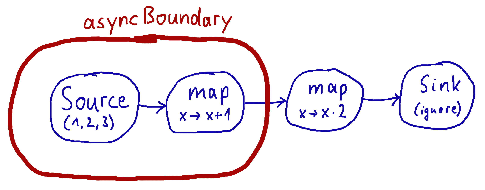

.. _stream-flow-scala:

#############################
Basics and working with Flows
#############################

.. _core-concepts-scala:

Core concepts
=============

Akka Streams is a library to process and transfer a sequence of elements using bounded buffer space. This
latter property is what we refer to as *boundedness* and it is the defining feature of Akka Streams. Translated to
everyday terms it is possible to express a chain (or as we see later, graphs) of processing entities, each executing
independently (and possibly concurrently) from the others while only buffering a limited number of elements at any given
time. This property of bounded buffers is one of the differences from the actor model, where each actor usually has
an unbounded, or a bounded, but dropping mailbox. Akka Stream processing entities have bounded "mailboxes" that
do not drop.

Before we move on, let's define some basic terminology which will be used throughout the entire documentation:

Stream
  An active process that involves moving and transforming data.
Element
  An element is the processing unit of streams. All operations transform and transfer elements from upstream to
  downstream. Buffer sizes are always expressed as number of elements independently form the actual size of the elements.
Back-pressure
  A means of flow-control, a way for consumers of data to notify a producer about their current availability, effectively
  slowing down the upstream producer to match their consumption speeds.
  In the context of Akka Streams back-pressure is always understood as *non-blocking* and *asynchronous*.
Non-Blocking
  Means that a certain operation does not hinder the progress of the calling thread, even if it takes long time to
  finish the requested operation.
Graph
  A description of a stream processing topology, defining the pathways through which elements shall flow when the stream
  is running.
Processing Stage
  The common name for all building blocks that build up a Graph.
  Examples of a processing stage would be  operations like ``map()``, ``filter()``, custom ``GraphStage`` s and graph
  junctions like ``Merge`` or ``Broadcast``. For the full list of built-in processing stages see :ref:`stages-overview_scala`

When we talk about *asynchronous, non-blocking backpressure* we mean that the processing stages available in Akka
Streams will not use blocking calls but asynchronous message passing to exchange messages between each other, and they
will use asynchronous means to slow down a fast producer, without blocking its thread. This is a thread-pool friendly
design, since entities that need to wait (a fast producer waiting on a slow consumer) will not block the thread but
can hand it back for further use to an underlying thread-pool.

.. _defining-and-running-streams-scala:

Defining and running streams
============================

Linear processing pipelines can be expressed in Akka Streams using the following core abstractions:

Source
  A processing stage with *exactly one output*, emitting data elements whenever downstream processing stages are
  ready to receive them.
Sink
  A processing stage with *exactly one input*, requesting and accepting data elements possibly slowing down the upstream
  producer of elements
Flow
  A processing stage which has *exactly one input and output*, which connects its up- and downstreams by
  transforming the data elements flowing through it.
RunnableGraph
  A Flow that has both ends "attached" to a Source and Sink respectively, and is ready to be ``run()``.

It is possible to attach a ``Flow`` to a ``Source`` resulting in a composite source, and it is also possible to prepend
a ``Flow`` to a ``Sink`` to get a new sink. After a stream is properly terminated by having both a source and a sink,
it will be represented by the ``RunnableGraph`` type, indicating that it is ready to be executed.

It is important to remember that even after constructing the ``RunnableGraph`` by connecting all the source, sink and
different processing stages, no data will flow through it until it is materialized. Materialization is the process of
allocating all resources needed to run the computation described by a Graph (in Akka Streams this will often involve
starting up Actors). Thanks to Flows being simply a description of the processing pipeline they are *immutable,
thread-safe, and freely shareable*, which means that it is for example safe to share and send them between actors, to have
one actor prepare the work, and then have it be materialized at some completely different place in the code.

.. includecode:: ../code/docs/stream/FlowDocSpec.scala#materialization-in-steps

After running (materializing) the ``RunnableGraph[T]`` we get back the materialized value of type T. Every stream processing
stage can produce a materialized value, and it is the responsibility of the user to combine them to a new type.
In the above example we used ``toMat`` to indicate that we want to transform the materialized value of the source and
sink, and we used the convenience function ``Keep.right`` to say that we are only interested in the materialized value
of the sink.
In our example the ``FoldSink`` materializes a value of type ``Future`` which will represent the result
of the folding process over the stream.  In general, a stream can expose multiple materialized values,
but it is quite common to be interested in only the value of the Source or the Sink in the stream. For this reason
there is a convenience method called ``runWith()`` available for ``Sink``, ``Source`` or ``Flow`` requiring, respectively,
a supplied ``Source`` (in order to run a ``Sink``), a ``Sink`` (in order to run a ``Source``) or
both a ``Source`` and a ``Sink`` (in order to run a ``Flow``, since it has neither attached yet).

.. includecode:: ../code/docs/stream/FlowDocSpec.scala#materialization-runWith

It is worth pointing out that since processing stages are *immutable*, connecting them returns a new processing stage,
instead of modifying the existing instance, so while constructing long flows, remember to assign the new value to a variable or run it:

.. includecode:: ../code/docs/stream/FlowDocSpec.scala#source-immutable

.. note::
   By default Akka Streams elements support **exactly one** downstream processing stage.
   Making fan-out (supporting multiple downstream processing stages) an explicit opt-in feature allows default stream elements to
   be less complex and more efficient. Also it allows for greater flexibility on *how exactly* to handle the multicast scenarios,
   by providing named fan-out elements such as broadcast (signals all down-stream elements) or balance (signals one of available down-stream elements).

In the above example we used the ``runWith`` method, which both materializes the stream and returns the materialized value
of the given sink or source.

Since a stream can be materialized multiple times, the materialized value will also be calculated anew for each such
materialization, usually leading to different values being returned each time.
In the example below we create two running materialized instance of the stream that we described in the ``runnable``
variable, and both materializations give us a different ``Future`` from the map even though we used the same ``sink``
to refer to the future:

.. includecode:: ../code/docs/stream/FlowDocSpec.scala#stream-reuse

Defining sources, sinks and flows
---------------------------------

The objects :class:`Source` and :class:`Sink` define various ways to create sources and sinks of elements. The following
examples show some of the most useful constructs (refer to the API documentation for more details):

.. includecode:: ../code/docs/stream/FlowDocSpec.scala#source-sink

There are various ways to wire up different parts of a stream, the following examples show some of the available options:

.. includecode:: ../code/docs/stream/FlowDocSpec.scala#flow-connecting

Illegal stream elements
-----------------------

In accordance to the Reactive Streams specification (`Rule 2.13 <https://github.com/reactive-streams/reactive-streams-jvm#2.13>`_)
Akka Streams do not allow ``null`` to be passed through the stream as an element. In case you want to model the concept
of absence of a value we recommend using ``scala.Option`` or ``scala.util.Either``.

.. _back-pressure-explained-scala:

Back-pressure explained
=======================

Akka Streams implement an asynchronous non-blocking back-pressure protocol standardised by the `Reactive Streams`_
specification, which Akka is a founding member of.

.. _Reactive Streams: http://reactive-streams.org/

The user of the library does not have to write any explicit back-pressure handling code — it is built in
and dealt with automatically by all of the provided Akka Streams processing stages. It is possible however to add
explicit buffer stages with overflow strategies that can influence the behaviour of the stream. This is especially important
in complex processing graphs which may even contain loops (which *must* be treated with very special
care, as explained in :ref:`graph-cycles-scala`).

The back pressure protocol is defined in terms of the number of elements a downstream ``Subscriber`` is able to receive
and buffer, referred to as ``demand``.
The source of data, referred to as ``Publisher`` in Reactive Streams terminology and implemented as ``Source`` in Akka
Streams, guarantees that it will never emit more elements than the received total demand for any given ``Subscriber``.

.. note::

   The Reactive Streams specification defines its protocol in terms of ``Publisher`` and ``Subscriber``.
   These types are **not** meant to be user facing API, instead they serve as the low level building blocks for
   different Reactive Streams implementations.

   Akka Streams implements these concepts as ``Source``, ``Flow`` (referred to as ``Processor`` in Reactive Streams)
   and ``Sink`` without exposing the Reactive Streams interfaces directly.
   If you need to integrate with other Reactive Stream libraries read :ref:`reactive-streams-integration-scala`.

The mode in which Reactive Streams back-pressure works can be colloquially described as "dynamic push / pull mode",
since it will switch between push and pull based back-pressure models depending on the downstream being able to cope
with the upstream production rate or not.

To illustrate this further let us consider both problem situations and how the back-pressure protocol handles them:

Slow Publisher, fast Subscriber
-------------------------------

This is the happy case of course – we do not need to slow down the Publisher in this case. However signalling rates are
rarely constant and could change at any point in time, suddenly ending up in a situation where the Subscriber is now
slower than the Publisher. In order to safeguard from these situations, the back-pressure protocol must still be enabled
during such situations, however we do not want to pay a high penalty for this safety net being enabled.

The Reactive Streams protocol solves this by asynchronously signalling from the Subscriber to the Publisher
``Request(n:Int)`` signals. The protocol guarantees that the Publisher will never signal *more* elements than the
signalled demand. Since the Subscriber however is currently faster, it will be signalling these Request messages at a higher
rate (and possibly also batching together the demand - requesting multiple elements in one Request signal). This means
that the Publisher should not ever have to wait (be back-pressured) with publishing its incoming elements.

As we can see, in this scenario we effectively operate in so called push-mode since the Publisher can continue producing
elements as fast as it can, since the pending demand will be recovered just-in-time while it is emitting elements.

Fast Publisher, slow Subscriber
-------------------------------

This is the case when back-pressuring the ``Publisher`` is required, because the ``Subscriber`` is not able to cope with
the rate at which its upstream would like to emit data elements.

Since the ``Publisher`` is not allowed to signal more elements than the pending demand signalled by the ``Subscriber``,
it will have to abide to this back-pressure by applying one of the below strategies:

- not generate elements, if it is able to control their production rate,
- try buffering the elements in a *bounded* manner until more demand is signalled,
- drop elements until more demand is signalled,
- tear down the stream if unable to apply any of the above strategies.

As we can see, this scenario effectively means that the ``Subscriber`` will *pull* the elements from the Publisher –
this mode of operation is referred to as pull-based back-pressure.

.. _stream-materialization-scala:

Stream Materialization
======================

When constructing flows and graphs in Akka Streams think of them as preparing a blueprint, an execution plan.
Stream materialization is the process of taking a stream description (the graph) and allocating all the necessary resources
it needs in order to run. In the case of Akka Streams this often means starting up Actors which power the processing,
but is not restricted to that—it could also mean opening files or socket connections etc.—depending on what the stream needs.

Materialization is triggered at so called "terminal operations". Most notably this includes the various forms of the ``run()``
and ``runWith()`` methods defined on :class:`Source` and :class:`Flow` elements as well as a small number of special syntactic sugars for running with
well-known sinks, such as ``runForeach(el => ...)`` (being an alias to ``runWith(Sink.foreach(el => ...))``.

Materialization is currently performed synchronously on the materializing thread.
The actual stream processing is handled by actors started up during the streams materialization,
which will be running on the thread pools they have been configured to run on - which defaults to the dispatcher set in
:class:`MaterializationSettings` while constructing the :class:`ActorMaterializer`.

.. note::
   Reusing *instances* of linear computation stages (Source, Sink, Flow) inside composite Graphs is legal,
   yet will materialize that stage multiple times.

Operator Fusion
---------------

Akka Streams 2.0 contains an initial version of stream operator fusion support. This means that
the processing steps of a flow or stream graph can be executed within the same Actor and has three
consequences:

  * starting up a stream may take longer than before due to executing the fusion algorithm
  * passing elements from one processing stage to the next is a lot faster between fused
    stages due to avoiding the asynchronous messaging overhead
  * fused stream processing stages do no longer run in parallel to each other, meaning that
    only up to one CPU core is used for each fused part

The first point can be countered by pre-fusing and then reusing a stream blueprint as sketched below:

.. includecode:: ../code/docs/stream/FlowDocSpec.scala#explicit-fusing

In order to balance the effects of the second and third bullet points you will have to insert asynchronous
boundaries manually into your flows and graphs by way of adding ``Attributes.asyncBoundary`` using the method
``async`` on ``Source``, ``Sink`` and ``Flow`` to pieces that shall communicate with the rest of the graph in an
asynchronous fashion.

.. includecode:: ../code/docs/stream/FlowDocSpec.scala#flow-async

In this example we create two regions within the flow which will be executed in one Actor each—assuming that adding
and multiplying integers is an extremely costly operation this will lead to a performance gain since two CPUs can
work on the tasks in parallel. It is important to note that asynchronous boundaries are not singular places within a
flow where elements are passed asynchronously (as in other streaming libraries), but instead attributes always work
by adding information to the flow graph that has been constructed up to this point:

|

|

This means that everything that is inside the red bubble will be executed by one actor and everything outside of it
by another. This scheme can be applied successively, always having one such boundary enclose the previous ones plus all
processing stages that have been added since them.

.. warning::

  Without fusing (i.e. up to version 2.0-M2) each stream processing stage had an implicit input buffer
  that holds a few elements for efficiency reasons. If your flow graphs contain cycles then these buffers
  may have been crucial in order to avoid deadlocks. With fusing these implicit buffers are no longer
  there, data elements are passed without buffering between fused stages. In those cases where buffering
  is needed in order to allow the stream to run at all, you will have to insert explicit buffers with the
  ``.buffer()`` combinator—typically a buffer of size 2 is enough to allow a feedback loop to function.

The new fusing behavior can be disabled by setting the configuration parameter ``akka.stream.materializer.auto-fusing=off``.
In that case you can still manually fuse those graphs which shall run on less Actors. With the exception of the
:class:`SslTlsStage` and the ``groupBy`` operator all built-in processing stages can be fused.

.. _flow-combine-mat-scala:

Combining materialized values
-----------------------------

Since every processing stage in Akka Streams can provide a materialized value after being materialized, it is necessary
to somehow express how these values should be composed to a final value when we plug these stages together. For this,
many combinator methods have variants that take an additional argument, a function, that will be used to combine the
resulting values. Some examples of using these combiners are illustrated in the example below.

.. includecode:: ../code/docs/stream/FlowDocSpec.scala#flow-mat-combine

.. note::

   In Graphs it is possible to access the materialized value from inside the stream processing graph. For details see :ref:`graph-matvalue-scala`.

Stream ordering
===============
In Akka Streams almost all computation stages *preserve input order* of elements. This means that if inputs ``{IA1,IA2,...,IAn}``
"cause" outputs ``{OA1,OA2,...,OAk}`` and inputs ``{IB1,IB2,...,IBm}`` "cause" outputs ``{OB1,OB2,...,OBl}`` and all of
``IAi`` happened before all ``IBi`` then ``OAi`` happens before ``OBi``.

This property is even uphold by async operations such as ``mapAsync``, however an unordered version exists
called ``mapAsyncUnordered`` which does not preserve this ordering.

However, in the case of Junctions which handle multiple input streams (e.g. :class:`Merge`) the output order is,
in general, *not defined* for elements arriving on different input ports. That is a merge-like operation may emit ``Ai``
before emitting ``Bi``, and it is up to its internal logic to decide the order of emitted elements. Specialized elements
such as ``Zip`` however *do guarantee* their outputs order, as each output element depends on all upstream elements having
been signalled already – thus the ordering in the case of zipping is defined by this property.

If you find yourself in need of fine grained control over order of emitted elements in fan-in
scenarios consider using :class:`MergePreferred` or :class:`GraphStage` – which gives you full control over how the
merge is performed.
