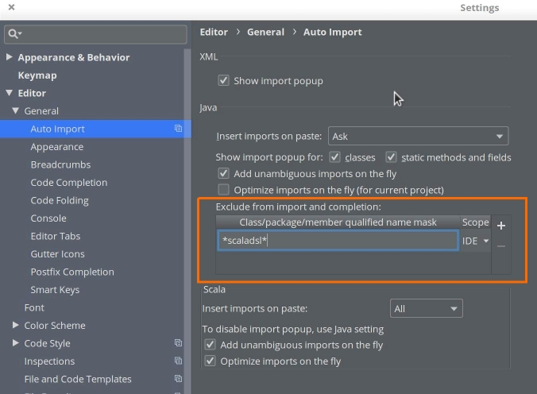

# IDE Tips 
 
## Configure the auto-importer in IntelliJ / Eclipse 

For a smooth development experience, when using an IDE such as Eclipse or IntelliJ, you can disable the auto-importer from suggesting `javadsl` imports when working in Scala, or viceversa.

In IntelliJ, the auto-importer settings are under "Editor" / "General" / "Auto Import". Use a name mask such as `akka.stream.javadsl*` or `akka.stream.scaladsl*` or `*javadsl*` or `*scaladsl*` to indicate the DSL you want to exclude from import/completion. See screenshot below: 

Eclipse users can configure this aspect of the IDE by going to "Window" / "Preferences" / "Java" / "Appearance" / "Type Filters".   
