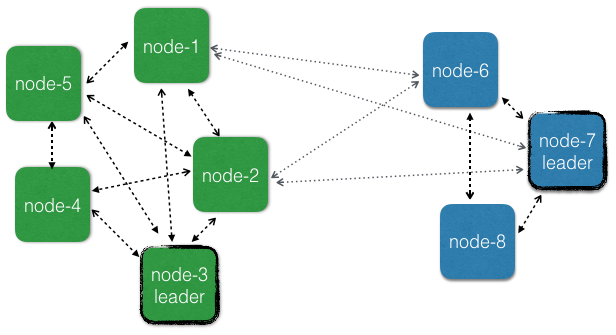

# Cluster across multiple data centers

This chapter describes how @ref[Akka Cluster](cluster-usage.md) can be used across
multiple data centers, availability zones or regions.

The reason for making the Akka Cluster aware of data center boundaries is that
communication across data centers typically has much higher latency and higher failure
rate than communication between nodes in the same data center.

However, the grouping of nodes is not limited to the physical boundaries of data centers,
even though that is the primary use case. It could also be used as a logical grouping
for other reasons, such as isolation of certain nodes to improve stability or splitting
up a large cluster into smaller groups of nodes for better scalability.

## Motivation

There can be many reasons for using more than one data center, such as:

* Redundancy to tolerate failures in one location and still be operational.
* Serve requests from a location near the user to provide better responsiveness.
* Balance the load over many servers.

It's possible to run an ordinary Akka Cluster with default settings that spans multiple
data centers but that may result in problems like:

* Management of Cluster membership is stalled during network partitions as described in a 
  separate section below. This means that nodes would not be able to be added and removed 
  during network partitions between data centers.
* More frequent false positive failure detection for network connections across data centers.
  It's not possible to have different settings for the failure detection within vs. across
  data centers.
* Downing/removal of nodes in the case of network partitions should typically be treated
  differently for failures within vs. across data centers. For network partitions between
  data centers the system should typically not down the unreachable nodes, but instead wait until it heals or
  a decision is made by a human or external monitoring system. For failures within same
  data center automatic, more aggressive, downing mechanisms can be employed for quick fail over.
* Quick fail over of Cluster Singleton and Cluster Sharding from one data center to another
  is difficult to do in a safe way. There is a risk that singletons or sharded entities become 
  active on both sides of a network partition.
* Lack of location information makes it difficult to optimize communication to prefer nodes
  that are close over distant nodes. E.g. a cluster aware router would be more efficient
  if it would prefer routing messages to nodes in the own data center. 

To avoid some of these problems one can run a separate Akka Cluster per data center and use another
communication channel between the data centers, such as HTTP, an external message broker or
@ref[Cluster Client](cluster-singleton.md). However, many of the nice tools that are built on
top of the Cluster membership information are lost. For example, it wouldn't be possible
to use @ref[Distributed Data](distributed-data.md) across the separate clusters.

We often recommend implementing a micro-service as one Akka Cluster. The external API of the
service would be HTTP, gRPC or a message broker, and not Akka Remoting or Cluster (see additional discussion
 in the Lagom Framework docs: 
@scala[[Internal and External Communication](https://www.lagomframework.com/documentation/current/scala/InternalAndExternalCommunication.html)]
@java[[Internal and External Communication](https://www.lagomframework.com/documentation/current/java/InternalAndExternalCommunication.html)]), 
but the internal communication within the service that is running on several nodes would use ordinary actor 
messaging or the tools based on Akka Cluster. When deploying this service to multiple data
centers it would be inconvenient if the internal communication could not use ordinary actor 
messaging because it was separated into several Akka Clusters. The benefit of using Akka
messaging internally is performance as well as ease of development and reasoning about
your domain in terms of Actors.

Therefore, it's possible to make the Akka Cluster aware of data centers so that one Akka
Cluster can span multiple data centers and still be tolerant to network partitions.

## Defining the data centers

The features are based on the idea that nodes can be assigned to a group of nodes
by setting the `akka.cluster.multi-data-center.self-data-center` configuration property.
A node can only belong to one data center and if nothing is specified a node will belong 
to the `default` data center.

The grouping of nodes is not limited to the physical boundaries of data centers,
even though that is the primary use case. It could also be used as a logical grouping
for other reasons, such as isolation of certain nodes to improve stability or splitting
up a large cluster into smaller groups of nodes for better scalability. 

## Membership

Some @ref[membership transitions](common/cluster.md#membership-lifecycle) are managed by 
one node called the @ref[leader](common/cluster.md#leader). There is one leader per data center
and it is responsible for these transitions for the members within the same data center. Members of
other data centers are managed independently by the leader of the respective data center. These actions
cannot be performed while there are any unreachability observations among the nodes in the data center, 
but unreachability across different data centers don't influence the progress of membership management
within a data center. Nodes can be added and removed also when there are network partitions between
data centers, which is impossible if nodes are not grouped into data centers.

User actions like joining, leaving, and downing can be sent to any node in the cluster,
not only to the nodes in the data center of the node. Seed nodes are also global.

The data center membership is implemented by adding the data center name prefixed with `"dc-"` to the 
@ref[roles](cluster-usage.md#node-roles) of the member and thereby this information is known
by all other members in the cluster. This is an implementation detail, but it can be good to know
if you see this in log messages.

You can retrieve information about what data center a member belongs to:

Scala
:  @@snip [ClusterDocSpec.scala](/akka-docs/src/test/scala/docs/cluster/ClusterDocSpec.scala) { #dcAccess }

Java
:  @@snip [ClusterDocTest.java](/akka-docs/src/test/java/jdocs/cluster/ClusterDocTest.java) { #dcAccess }

## Failure Detection

@ref[Failure detection](cluster-usage.md#failure-detector) is performed by sending heartbeat messages
to detect if a node is unreachable. This is done more frequently and with more certainty among
the nodes in the same data center than across data centers. The failure detection across different data centers should
be interpreted as an indication of problem with the network link between the data centers.

Two different failure detectors can be configured for these two purposes:

* `akka.cluster.failure-detector` for failure detection within own data center
* `akka.cluster.multi-data-center.failure-detector` for failure detection across different data centers

When @ref[subscribing to cluster events](cluster-usage.md#cluster-subscriber) the `UnreachableMember` and
`ReachableMember` events are for observations within the own data center. The same data center as where the
subscription was registered.

For cross data center unreachability notifications you can subscribe to `UnreachableDataCenter` and `ReachableDataCenter`
events.

Heartbeat messages for failure detection across data centers are only performed between a number of the
oldest nodes on each side. The number of nodes is configured with `akka.cluster.multi-data-center.cross-data-center-connections`.
The reason for only using a limited number of nodes is to keep the number of connections across data
centers low. The same nodes are also used for the gossip protocol when disseminating the membership
information across data centers. Within a data center all nodes are involved in gossip and failure detection.

This influence how rolling upgrades should be performed. Don't stop all of the oldest that are used for gossip
at the same time. Stop one or a few at a time so that new nodes can take over the responsibility.
It's best to leave the oldest nodes until last.

## Cluster Singleton

The @ref[Cluster Singleton](cluster-singleton.md) is a singleton per data center. If you start the 
`ClusterSingletonManager` on all nodes and you have defined 3 different data centers there will be
3 active singleton instances in the cluster, one in each data center. This is taken care of automatically,
but is important to be aware of. Designing the system for one singleton per data center makes it possible
for the system to be available also during network partitions between data centers.

The reason why the singleton is per data center and not global is that membership information is not
guaranteed to be consistent across data centers when using one leader per data center and that makes it
difficult to select a single global singleton. 

If you need a global singleton you have to pick one data center to host that singleton and only start the
`ClusterSingletonManager` on nodes of that data center. If the data center is unreachable from another data center the
singleton is inaccessible, which is a reasonable trade-off when selecting consistency over availability.

The `ClusterSingletonProxy` is by default routing messages to the singleton in the own data center, but
it can be started with a `data-center` parameter in the `ClusterSingletonProxySettings` to define that 
it should route messages to a singleton located in another data center. That is useful for example when
having a global singleton in one data center and accessing it from other data centers.

This is how to create a singleton proxy for a specific data center:

Scala
:  @@snip [ClusterSingletonManagerSpec.scala](/akka-cluster-tools/src/multi-jvm/scala/akka/cluster/singleton/ClusterSingletonManagerSpec.scala) { #create-singleton-proxy-dc }

Java
:  @@snip [ClusterSingletonManagerTest.java](/akka-cluster-tools/src/test/java/akka/cluster/singleton/ClusterSingletonManagerTest.java) { #create-singleton-proxy-dc }

If using the own data center as the `withDataCenter` parameter that would be a proxy for the singleton in the own data center, which
is also the default if `withDataCenter` is not given.

## Cluster Sharding

The coordinator in @ref[Cluster Sharding](cluster-sharding.md) is a Cluster Singleton and therefore,
as explained above, Cluster Sharding is also per data center. Each data center will have its own coordinator
and regions, isolated from other data centers. If you start an entity type with the same name on all 
nodes and you have defined 3 different data centers and then send messages to the same entity id to
sharding regions in all data centers you will end up with 3 active entity instances for that entity id,
one in each data center. This is because the region/coordinator is only aware of its own data center
and will activate the entity there. It's unaware of the existence of corresponding entities in the 
other data centers.

Especially when used together with Akka Persistence that is based on the single-writer principle
it is important to avoid running the same entity at multiple locations at the same time with a
shared data store. That would result in corrupt data since the events stored by different instances
may be interleaved and would be interpreted differently in a later replay. For active active persistent
entities see Lightbend's [Multi-DC Persistence](https://doc.akka.io/docs/akka-enhancements/current/persistence-dc/index.html)

If you need global entities you have to pick one data center to host that entity type and only start
`ClusterSharding` on nodes of that data center. If the data center is unreachable from another data center the
entities are inaccessible, which is a reasonable trade-off when selecting consistency over availability.

The Cluster Sharding proxy is by default routing messages to the shard regions in their own data center, but
it can be started with a `data-center` parameter to define that it should route messages to a shard region
located in another data center. That is useful for example when having global entities in one data center and 
accessing them from other data centers.

This is how to create a sharding proxy for a specific data center:

Scala
:  @@snip [ClusterShardingSpec.scala](/akka-cluster-sharding/src/multi-jvm/scala/akka/cluster/sharding/ClusterShardingSpec.scala) { #proxy-dc }

Java
:  @@snip [ClusterShardingTest.java](/akka-docs/src/test/java/jdocs/sharding/ClusterShardingTest.java) { #proxy-dc }

Another way to manage global entities is to make sure that certain entity ids are located in 
only one data center by routing the messages to the right region. For example, the routing function
could be that odd entity ids are routed to data center A and even entity ids to data center B.
Before sending the message to the local region actor you make the decision of which data center it should
be routed to. Messages for another data center can be sent with a sharding proxy as explained above and
messages for the own data center are sent to the local region.
