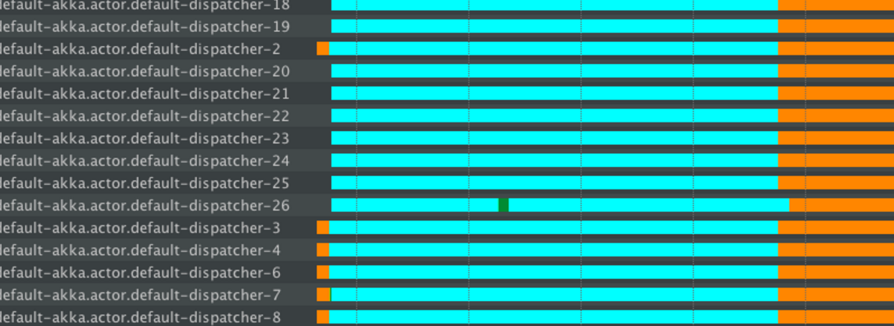

# Dispatchers

## Dependency

Dispatchers are part of core akka, which means that they are part of the akka-actor dependency:

@@dependency[sbt,Maven,Gradle] {
  group="com.typesafe.akka"
  artifact="akka-actor_$scala.binary_version$"
  version="$akka.version$"
}

## Introduction

An Akka `MessageDispatcher` is what makes Akka Actors "tick", it is the engine of the machine so to speak.
All `MessageDispatcher` implementations are also an `ExecutionContext`, which means that they can be used
to execute arbitrary code, for instance @ref:[Futures](futures.md).

## Default dispatcher

Every `ActorSystem` will have a default dispatcher that will be used in case nothing else is configured for an `Actor`.
The default dispatcher can be configured, and is by default a `Dispatcher` with the specified `default-executor`.
If an ActorSystem is created with an ExecutionContext passed in, this ExecutionContext will be used as the default executor for all
dispatchers in this ActorSystem. If no ExecutionContext is given, it will fallback to the executor specified in
`akka.actor.default-dispatcher.default-executor.fallback`. By default this is a "fork-join-executor", which
gives excellent performance in most cases.

<a id="dispatcher-lookup"></a>
## Looking up a Dispatcher

Dispatchers implement the `ExecutionContext` interface and can thus be used to run `Future` invocations etc.

Scala
:  @@snip [DispatcherDocSpec.scala](/akka-docs/src/test/scala/docs/dispatcher/DispatcherDocSpec.scala) { #lookup }

Java
:  @@snip [DispatcherDocTest.java](/akka-docs/src/test/java/jdocs/dispatcher/DispatcherDocTest.java) { #lookup }
## Setting the dispatcher for an Actor

So in case you want to give your `Actor` a different dispatcher than the default, you need to do two things, of which the first
is to configure the dispatcher:

<!--same config text for Scala & Java-->
@@snip [DispatcherDocSpec.scala](/akka-docs/src/test/scala/docs/dispatcher/DispatcherDocSpec.scala) { #my-dispatcher-config }

@@@ note

Note that the `parallelism-max` does not set the upper bound on the total number of threads
allocated by the ForkJoinPool. It is a setting specifically talking about the number of *hot*
threads the pool keep running in order to reduce the latency of handling a new incoming task.
You can read more about parallelism in the JDK's [ForkJoinPool documentation](https://docs.oracle.com/javase/8/docs/api/java/util/concurrent/ForkJoinPool.html).

@@@

Another example that uses the "thread-pool-executor":

<!--same config text for Scala & Java-->
@@snip [DispatcherDocSpec.scala](/akka-docs/src/test/scala/docs/dispatcher/DispatcherDocSpec.scala) { #fixed-pool-size-dispatcher-config }

@@@ note

The thread pool executor dispatcher is implemented using by a `java.util.concurrent.ThreadPoolExecutor`.
You can read more about it in the JDK's [ThreadPoolExecutor documentation](https://docs.oracle.com/javase/8/docs/api/java/util/concurrent/ThreadPoolExecutor.html).

@@@

For more options, see the default-dispatcher section of the @ref:[configuration](general/configuration.md).

Then you create the actor as usual and define the dispatcher in the deployment configuration.

Scala
:  @@snip [DispatcherDocSpec.scala](/akka-docs/src/test/scala/docs/dispatcher/DispatcherDocSpec.scala) { #defining-dispatcher-in-config }

Java
:  @@snip [DispatcherDocTest.java](/akka-docs/src/test/java/jdocs/dispatcher/DispatcherDocTest.java) { #defining-dispatcher-in-config }

<!--same config text for Scala & Java-->
@@snip [DispatcherDocSpec.scala](/akka-docs/src/test/scala/docs/dispatcher/DispatcherDocSpec.scala) { #dispatcher-deployment-config } 

An alternative to the deployment configuration is to define the dispatcher in code.
If you define the `dispatcher` in the deployment configuration then this value will be used instead
of programmatically provided parameter.

Scala
:  @@snip [DispatcherDocSpec.scala](/akka-docs/src/test/scala/docs/dispatcher/DispatcherDocSpec.scala) { #defining-dispatcher-in-code }

Java
:  @@snip [DispatcherDocTest.java](/akka-docs/src/test/java/jdocs/dispatcher/DispatcherDocTest.java) { #defining-dispatcher-in-code }

@@@ note

The dispatcher you specify in `withDispatcher` and the `dispatcher` property in the deployment
configuration is in fact a path into your configuration.
So in this example it's a top-level section, but you could for instance put it as a sub-section,
where you'd use periods to denote sub-sections, like this: `"foo.bar.my-dispatcher"`

@@@

## Types of dispatchers

There are 3 different types of message dispatchers:

* **Dispatcher**

    This is an event-based dispatcher that binds a set of Actors to a thread
    pool. It is the default dispatcher used if one is not specified.

    * Sharability: Unlimited
    * Mailboxes: Any, creates one per Actor
    * Use cases: Default dispatcher, Bulkheading
    * Driven by: `java.util.concurrent.ExecutorService`.
      Specify using "executor" using "fork-join-executor", "thread-pool-executor" or the FQCN of
      an `akka.dispatcher.ExecutorServiceConfigurator`.

* **PinnedDispatcher**

    This dispatcher dedicates a unique thread for each actor using it; i.e.
    each actor will have its own thread pool with only one thread in the pool.

    * Sharability: None
    * Mailboxes: Any, creates one per Actor
    * Use cases: Bulkheading
    * Driven by: Any `akka.dispatch.ThreadPoolExecutorConfigurator`.
      By default a "thread-pool-executor".

* **CallingThreadDispatcher**
    
    This dispatcher runs invocations on the current thread only. This 
    dispatcher does not create any new threads, but it can be used from
    different threads concurrently for the same actor.
    See @ref:[CallingThreadDispatcher](testing.md#callingthreaddispatcher)
    for details and restrictions.

    * Sharability: Unlimited
    * Mailboxes: Any, creates one per Actor per Thread (on demand)
    * Use cases: Testing
    * Driven by: The calling thread (duh)

### More dispatcher configuration examples

Configuring a dispatcher with fixed thread pool size, e.g. for actors that perform blocking IO:

@@snip [DispatcherDocSpec.scala](/akka-docs/src/test/scala/docs/dispatcher/DispatcherDocSpec.scala) { #fixed-pool-size-dispatcher-config }

And then using it:

Scala
:  @@snip [DispatcherDocSpec.scala](/akka-docs/src/test/scala/docs/dispatcher/DispatcherDocSpec.scala) { #defining-fixed-pool-size-dispatcher }

Java
:  @@snip [DispatcherDocTest.java](/akka-docs/src/test/java/jdocs/dispatcher/DispatcherDocTest.java) { #defining-fixed-pool-size-dispatcher }

Another example that uses the thread pool based on the number of cores (e.g. for CPU bound tasks)

<!--same config text for Scala & Java-->
@@snip [DispatcherDocSpec.scala](/akka-docs/src/test/scala/docs/dispatcher/DispatcherDocSpec.scala) {#my-thread-pool-dispatcher-config }

A different kind of dispatcher that uses an affinity pool may increase throughput in cases where there is relatively small
number of actors that maintain some internal state. The affinity pool tries its best to ensure that an actor is always
scheduled to run on the same thread. This actor to thread pinning aims to decrease CPU cache misses which can result 
in significant throughput improvement.

@@snip [DispatcherDocSpec.scala](/akka-docs/src/test/scala/docs/dispatcher/DispatcherDocSpec.scala) { #affinity-pool-dispatcher-config }

Configuring a `PinnedDispatcher`:

<!--same config text for Scala & Java-->
@@snip [DispatcherDocSpec.scala](/akka-docs/src/test/scala/docs/dispatcher/DispatcherDocSpec.scala) {#my-pinned-dispatcher-config }

And then using it:

Scala
:  @@snip [DispatcherDocSpec.scala](/akka-docs/src/test/scala/docs/dispatcher/DispatcherDocSpec.scala) { #defining-pinned-dispatcher }

Java
:  @@snip [DispatcherDocTest.java](/akka-docs/src/test/java/jdocs/dispatcher/DispatcherDocTest.java) { #defining-pinned-dispatcher }

Note that `thread-pool-executor` configuration as per the above `my-thread-pool-dispatcher` example is
NOT applicable. This is because every actor will have its own thread pool when using `PinnedDispatcher`,
and that pool will have only one thread.

Note that it's not guaranteed that the *same* thread is used over time, since the core pool timeout
is used for `PinnedDispatcher` to keep resource usage down in case of idle actors. To use the same
thread all the time you need to add `thread-pool-executor.allow-core-timeout=off` to the
configuration of the `PinnedDispatcher`.

## Blocking Needs Careful Management

In some cases it is unavoidable to do blocking operations, i.e. to put a thread
to sleep for an indeterminate time, waiting for an external event to occur.
Examples are legacy RDBMS drivers or messaging APIs, and the underlying reason
is typically that (network) I/O occurs under the covers.


Scala
:   @@snip [BlockingDispatcherSample.scala](/akka-docs/src/test/scala/docs/actor/BlockingDispatcherSample.scala) { #blocking-in-actor }

Java
:   @@snip [BlockingDispatcherSample.java](/akka-docs/src/test/java/jdocs/actor/BlockingActor.java) { #blocking-in-actor  }


When facing this, you
may be tempted to wrap the blocking call inside a `Future` and work
with that instead, but this strategy is too simple: you are quite likely to
find bottlenecks or run out of memory or threads when the application runs
under increased load.

Scala
:   @@snip [BlockingDispatcherSample.scala](/akka-docs/src/test/scala/docs/actor/BlockingDispatcherSample.scala) { #blocking-in-future }

Java
:   @@snip [BlockingDispatcherSample.java](/akka-docs/src/test/java/jdocs/actor/BlockingFutureActor.java) { #blocking-in-future  }


### Problem: Blocking on default dispatcher

The key here is this line:

@@@ div { .group-scala }

```scala
implicit val executionContext: ExecutionContext = context.dispatcher
```

@@@

@@@ div { .group-java }

```java
ExecutionContext ec = getContext().getDispatcher();
```

@@@

Using @scala[`context.dispatcher`] @java[`getContext().getDispatcher()`] as the dispatcher on which the blocking `Future`
executes can be a problem, since this dispatcher is by default used for all other actor processing
unless you @ref:[set up a separate dispatcher for the actor](dispatchers.md#setting-the-dispatcher-for-an-actor).

If all of the available threads are blocked, then all the actors on the same dispatcher will starve for threads and
will not be able to process incoming messages.

@@@ note

Blocking APIs should also be avoided if possible. Try to find or build Reactive APIs,
such that blocking is minimised, or moved over to dedicated dispatchers.

Often when integrating with existing libraries or systems it is not possible to
avoid blocking APIs. The following solution explains how to handle blocking
operations properly.

Note that the same hints apply to managing blocking operations anywhere in Akka,
including Streams, Http and other reactive libraries built on top of it.

@@@

Let's set up an application with the above `BlockingFutureActor` and the following `PrintActor`.

Scala
:   @@snip [BlockingDispatcherSample.scala](/akka-docs/src/test/scala/docs/actor/BlockingDispatcherSample.scala) { #print-actor }

Java
:   @@snip [BlockingDispatcherSample.java](/akka-docs/src/test/java/jdocs/actor/PrintActor.java) { #print-actor }


Scala
:   @@snip [BlockingDispatcherSample.scala](/akka-docs/src/test/scala/docs/actor/BlockingDispatcherSample.scala) { #blocking-main }

Java
:   @@snip [BlockingDispatcherSample.java](/akka-docs/src/test/java/jdocs/actor/BlockingDispatcherTest.java) { #blocking-main }


Here the app is sending 100 messages to `BlockingFutureActor` and `PrintActor` and large numbers
of `akka.actor.default-dispatcher` threads are handling requests. When you run the above code,
you will likely to see the entire application gets stuck somewhere like this:

```
>　PrintActor: 44
>　PrintActor: 45
```

`PrintActor` is considered non-blocking, however it is not able to proceed with handling the remaining messages,
since all the threads are occupied and blocked by the other blocking actor - thus leading to thread starvation.

In the thread state diagrams below the colours have the following meaning:

 * Turquoise - Sleeping state
 * Orange - Waiting state
 * Green - Runnable state

The thread information was recorded using the YourKit profiler, however any good JVM profiler
has this feature (including the free and bundled with the Oracle JDK VisualVM, as well as Oracle Flight Recorder).

The orange portion of the thread shows that it is idle. Idle threads are fine -
they're ready to accept new work. However, large amount of turquoise (blocked, or sleeping as in our example) threads
is very bad and leads to thread starvation.

@@@ note

If you own a Lightbend subscription you can use the commercial [Thread Starvation Detector](http://developer.lightbend.com/docs/akka-commercial-addons/current/starvation-detector.html)
which will issue warning log statements if it detects any of your dispatchers suffering from starvation and other.
It is a helpful first step to identify the problem is occurring in a production system,
and then you can apply the proposed solutions as explained below.

@@@



In the above example we put the code under load by sending hundreds of messages to the blocking actor
which causes threads of the default dispatcher to be blocked.
The fork join pool based dispatcher in Akka then attempts to compensate for this blocking by adding more threads to the pool
(`default-akka.actor.default-dispatcher 18,19,20,...`).
This however is not able to help if those too will immediately get blocked,
and eventually the blocking operations will dominate the entire dispatcher.

In essence, the `Thread.sleep` operation has dominated all threads and caused anything
executing on the default dispatcher to starve for resources (including any actor
that you have not configured an explicit dispatcher for).

### Solution: Dedicated dispatcher for blocking operations

One of the most efficient methods of isolating the blocking behavior such that it does not impact the rest of the system
is to prepare and use a dedicated dispatcher for all those blocking operations.
This technique is often referred to as as "bulk-heading" or simply "isolating blocking".

In `application.conf`, the dispatcher dedicated to blocking behavior should
be configured as follows:

<!--same config text for Scala & Java-->
@@snip [BlockingDispatcherSample.scala](/akka-docs/src/test/scala/docs/actor/BlockingDispatcherSample.scala) { #my-blocking-dispatcher-config }

A `thread-pool-executor` based dispatcher allows us to set a limit on the number of threads it will host,
and this way we gain tight control over how at-most-how-many blocked threads will be in the system.

The exact size should be fine tuned depending on the workload you're expecting to run on this dispatcher
as well as the number of cores of the machine you're running the application on.
Usually a small number around the number of cores is a good default to start from.

Whenever blocking has to be done, use the above configured dispatcher
instead of the default one:

Scala
:   @@snip [BlockingDispatcherSample.scala](/akka-docs/src/test/scala/docs/actor/BlockingDispatcherSample.scala) { #separate-dispatcher }

Java
:   @@snip [BlockingDispatcherSample.java](/akka-docs/src/test/java/jdocs/actor/SeparateDispatcherFutureActor.java) { #separate-dispatcher }

The thread pool behavior is shown in the below diagram.


Messages sent to `SeparateDispatcherFutureActor` and `PrintActor` are handled by the default dispatcher - the
green lines, which represent the actual execution.

When blocking operations are run on the `my-blocking-dispatcher`,
it uses the threads (up to the configured limit) to handle these operations.
The sleeping in this case is nicely isolated to just this dispatcher, and the default one remains unaffected,
allowing the rest of the application to proceed as if nothing bad was happening. After
a certain period idleness, threads started by this dispatcher will be shut down.

In this case, the throughput of other actors was not impacted -
they were still served on the default dispatcher.

This is the recommended way of dealing with any kind of blocking in reactive
applications.

For a similar discussion specific about Akka HTTP refer to, @scala[@extref[Handling blocking operations in Akka HTTP](akka.http:scala/http/handling-blocking-operations-in-akka-http-routes.html#handling-blocking-operations-in-akka-http)]@java[@extref[Handling blocking operations in Akka HTTP](akka.http:java/http/handling-blocking-operations-in-akka-http-routes.html#handling-blocking-operations-in-akka-http)].

### Available solutions to blocking operations

The non-exhaustive list of adequate solutions to the “blocking problem”
includes the following suggestions:

 * Do the blocking call within an actor (or a set of actors) managed by a
@ref:[router](routing.md),  making sure to
configure a thread pool which is either dedicated for this purpose or
sufficiently sized.
 * Do the blocking call within a `Future`, ensuring an upper bound on
the number of such calls at any point in time (submitting an unbounded
number of tasks of this nature will exhaust your memory or thread limits).
 * Do the blocking call within a `Future`, providing a thread pool with
an upper limit on the number of threads which is appropriate for the
hardware on which the application runs, as explained in detail in this section.
 * Dedicate a single thread to manage a set of blocking resources (e.g. a NIO
selector driving multiple channels) and dispatch events as they occur as
actor messages.

The first possibility is especially well-suited for resources which are
single-threaded in nature, like database handles which traditionally can only
execute one outstanding query at a time and use internal synchronization to
ensure this. A common pattern is to create a router for N actors, each of which
wraps a single DB connection and handles queries as sent to the router. The
number N must then be tuned for maximum throughput, which will vary depending
on which DBMS is deployed on what hardware.

@@@ note

Configuring thread pools is a task best delegated to Akka, configure
it in `application.conf` and instantiate through an
@ref:[`ActorSystem`](#dispatcher-lookup)

@@@
 


