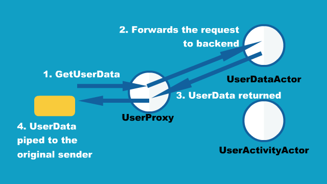
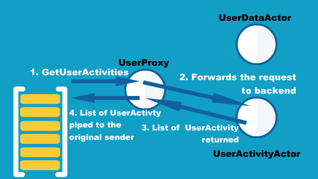

# Futures

## Dependency

This section explains using plain Scala Futures but focuses on their interop with Akka Actors, so to follow those examples you will want to depend on:

@@dependency[sbt,Maven,Gradle] {
  group="com.typesafe.akka"
  artifact="akka-actor_$scala.binary_version$"
  version="$akka.version$"
}

## Introduction

In the Scala Standard Library, a [Future](http://en.wikipedia.org/wiki/Futures_and_promises) is a data structure
used to retrieve the result of some concurrent operation. This result can be accessed synchronously (blocking)
or asynchronously (non-blocking).

@@@ div { .group-java }

To be able to use this from Java, Akka provides a java friendly interface
in `akka.dispatch.Futures`.

See also @ref:[Java 8 Compatibility](java8-compat.md) for Java compatibility.

@@@

## Execution Contexts

In order to execute callbacks and operations, Futures need something called an `ExecutionContext`,
which is very similar to a `java.util.concurrent.Executor`. If you have an `ActorSystem` in scope,
it will use its default dispatcher as the `ExecutionContext`, or you can use the factory methods provided
by the @scala[`ExecutionContext` companion object]@java[`ExecutionContexts` class] to wrap `Executors` and `ExecutorServices`, or even create your own.

Scala
:  @@snip [FutureDocSpec.scala](/akka-docs/src/test/scala/docs/future/FutureDocSpec.scala) { #diy-execution-context }

Java
:  @@snip [FutureDocTest.java](/akka-docs/src/test/java/jdocs/future/FutureDocTest.java) { #imports1 #diy-execution-context }

### Within Actors

Each actor is configured to be run on a `MessageDispatcher`, and that
dispatcher doubles as an `ExecutionContext`. If the nature of the Future
calls invoked by the actor matches or is compatible with the activities of that
actor (e.g. all CPU bound and no latency requirements), then it may be easiest
to reuse the dispatcher for running the Futures by importing
@scala[`context.dispatcher`]@java[`getContext().getDispatcher()`].

Scala
:  @@snip [FutureDocSpec.scala](/akka-docs/src/test/scala/docs/future/FutureDocSpec.scala) { #context-dispatcher }

Java
:  @@snip [ActorWithFuture.java](/akka-docs/src/test/java/jdocs/future/ActorWithFuture.java) { #context-dispatcher }

## Use with Actors

There are generally two ways of getting a reply from an @scala[`Actor`]@java[`AbstractActor`]: the first is by a sent message (@scala[`actor ! msg`]@java[`actorRef.tell(msg, sender)`]),
which only works if the original sender was an @scala[`Actor`]@java[`AbstractActor`]) and the second is through a `Future`.

Using @scala[an `Actor`'s `?`]@java[the `ActorRef`'s `ask`] method to send a message will return a `Future`.
To wait for and retrieve the actual result the simplest method is:

Scala
:  @@snip [FutureDocSpec.scala](/akka-docs/src/test/scala/docs/future/FutureDocSpec.scala) { #ask-blocking }

Java
:  @@snip [FutureDocTest.java](/akka-docs/src/test/java/jdocs/future/FutureDocTest.java) { #imports1 #ask-blocking }

This will cause the current thread to block and wait for the @scala[`Actor`]@java[`AbstractActor`] to 'complete' the `Future` with its reply.
Blocking is discouraged though as it will cause performance problems.
The blocking operations are located in `Await.result` and `Await.ready` to make it easy to spot where blocking occurs.
Alternatives to blocking are discussed further within this documentation. Also note that the `Future` returned by
an @scala[`Actor`]@java[`AbstractActor`] is a @scala[`Future[Any]`]@java[`Future<Object>`] since an @scala[`Actor`]@java[`AbstractActor`] is dynamic.
That is why the @scala[`asInstanceOf`]@java[cast to `String`] is used in the above sample.

@@@ warning

`Await.result` and `Await.ready` are provided for exceptional situations where you **must** block,
a good rule of thumb is to only use them if you know why you **must** block. For all other cases, use
asynchronous composition as described below.

@@@

@@@ div { .group-scala }

When using non-blocking it is better to use the `mapTo` method to safely try to cast a `Future` to an expected type:

@@snip [FutureDocSpec.scala](/akka-docs/src/test/scala/docs/future/FutureDocSpec.scala) { #map-to }

The `mapTo` method will return a new `Future` that contains the result if the cast was successful,
or a `ClassCastException` if not. Handling `Exception`s will be discussed further within this documentation.

@@@

## Use the pipe pattern

Another useful message-transfer pattern is "pipe", which is to send the result of @scala[`Future`]@java[`CompletableFuture`] to another actor, upon completion of the @scala[`Future`]@java[`CompletableFuture`].
The pipe pattern can be used by importing @java[`akka.pattern.Patterns.pipe`.]@scala[`akka.pattern.pipe`, and define or import an implicit instance of `ExecutionContext` in the scope.]

Scala
:  @@snip [FutureDocSpec.scala](/akka-docs/src/test/scala/docs/future/FutureDocSpec.scala) { #pipe-to-usage }

Java
:  @@snip [FutureDocTest.java](/akka-docs/src/test/java/jdocs/future/FutureDocTest.java) { #imports-ask #imports-pipe #pipe-to-usage }

To see how this works in more detail, let's introduce a small example consisting of three different actors,
`UserProxyActor`, `UserDataActor` and `UserActivityActor`.
In this example, when you need information about a user, you send a request message to `UserProxyActor`,
then it gets the corresponding result from the appropriate backend actor based on the request message type.

  

  

The message types you send to `UserProxyActor` are `GetUserData` and `GetUserActivities`:

Scala
:  @@snip [FutureDocSpec.scala](/akka-docs/src/test/scala/docs/future/FutureDocSpec.scala) { #pipe-to-proxy-messages }

Java
:  @@snip [FutureDocTest.java](/akka-docs/src/test/java/jdocs/future/FutureDocTest.java) {  #pipe-to-proxy-messages }

and `UserData` and @scala[`List[UserActivity]`]@java[`ArrayList<UserActivity>`] are returned to the original sender in the end.

Scala
:  @@snip [FutureDocSpec.scala](/akka-docs/src/test/scala/docs/future/FutureDocSpec.scala) { #pipe-to-returned-data }

Java
:  @@snip [FutureDocTest.java](/akka-docs/src/test/java/jdocs/future/FutureDocTest.java) { #pipe-to-returned-data }

The backend `UserDataActor` and `UserActivityActor` are defined as follows:

Scala
:  @@snip [FutureDocSpec.scala](/akka-docs/src/test/scala/docs/future/FutureDocSpec.scala) { #pipe-to-user-data-actor }

Java
:  @@snip [FutureDocTest.java](/akka-docs/src/test/java/jdocs/future/FutureDocTest.java) { #pipe-to-user-data-actor }

`UserDataActor` holds the data in memory, so that it can return the current state of the user data quickly upon a request.

On the other hand, `UserActivityActor` queries into a `repository` to retrieve historical user activities then
sends the result to the `sender()` which is `UserProxy` in this case, with the pipe pattern.

Scala
:  @@snip [FutureDocSpec.scala](/akka-docs/src/test/scala/docs/future/FutureDocSpec.scala) { #pipe-to-user-activity-actor }

Java
:  @@snip [FutureDocTest.java](/akka-docs/src/test/java/jdocs/future/FutureDocTest.java) { #imports-pipe #pipe-to-user-activity-actor }

Since it needs to talk to the separate `repository`, it takes time to retrieve the list of `UserActivity`,
hence the return type of `queryHistoricalActivities` is @scala[`Future`]@java[`CompletableFuture`].
To send back the result to the `sender()` we used the @scala[`pipeTo`]@java[`pipe`] method,
so that the result of the @scala[`Future`]@java[`CompletableFuture`] is sent to `sender()` upon @scala[`Future`]@java[`CompletableFuture`]'s completion.

Finally, the definition of `UserProxyActor` is as below.

Scala
:  @@snip [FutureDocSpec.scala](/akka-docs/src/test/scala/docs/future/FutureDocSpec.scala) { #pipe-to-proxy-actor }

Java
:  @@snip [FutureDocTest.java](/akka-docs/src/test/java/jdocs/future/FutureDocTest.java) { #imports-ask #imports-pipe #pipe-to-proxy-actor }

Note that the @scala[`pipeTo`]@java[`pipe`] method used with the @scala[`?`]@java[`ask`] method.
Using @scala[`pipeTo`]@java[`pipe`] with the @scala[`?`]@java[`ask`] method is a common practice when you want to relay a message from one actor to another.

## Use Directly

A common use case within Akka is to have some computation performed concurrently without needing the extra utility of an @scala[`Actor`]@java[`AbstractActor`].
If you find yourself creating a pool of @scala[`Actor`s]@java[`AbstractActor`s] for the sole reason of performing a calculation in parallel,
there is an easier (and faster) way:

Scala
:  @@snip [FutureDocSpec.scala](/akka-docs/src/test/scala/docs/future/FutureDocSpec.scala) { #future-eval }

Java
:  @@snip [FutureDocTest.java](/akka-docs/src/test/java/jdocs/future/FutureDocTest.java) { #imports2 #future-eval }

In the above code the block passed to `Future` will be executed by the default `Dispatcher`,
with the return value of the block used to complete the `Future` (in this case, the result would be the string: "HelloWorld").
Unlike a `Future` that is returned from an @scala[`Actor`]@java[`AbstractActor`], this `Future` is properly typed,
and we also avoid the overhead of managing an @scala[`Actor`]@java[`AbstractActor`].

You can also create already completed Futures using the @scala[`Future` companion]@java[`Futures` class], which can be either successes:

Scala
:  @@snip [FutureDocSpec.scala](/akka-docs/src/test/scala/docs/future/FutureDocSpec.scala) { #successful }

Java
:  @@snip [FutureDocTest.java](/akka-docs/src/test/java/jdocs/future/FutureDocTest.java) { #successful }

Or failures:

Scala
:  @@snip [FutureDocSpec.scala](/akka-docs/src/test/scala/docs/future/FutureDocSpec.scala) { #failed }

Java
:  @@snip [FutureDocTest.java](/akka-docs/src/test/java/jdocs/future/FutureDocTest.java) { #failed }

It is also possible to create an empty `Promise`, to be filled later, and obtain the corresponding `Future`:

Scala
:  @@snip [FutureDocSpec.scala](/akka-docs/src/test/scala/docs/future/FutureDocSpec.scala) { #promise }

Java
:  @@snip [FutureDocTest.java](/akka-docs/src/test/java/jdocs/future/FutureDocTest.java) { #promise }

@@@ div { .group-java }

For these examples `PrintResult` is defined as follows:

@@snip [FutureDocTest.java](/akka-docs/src/test/java/jdocs/future/FutureDocTest.java) { #print-result }

@@@

## Functional Futures

Scala's `Future` has several monadic methods that are very similar to the ones used by Scala's collections.
These allow you to create 'pipelines' or 'streams' that the result will travel through.

The first method for working with `Future` functionally is `map`. This method takes a @scala[`Function`]@java[`Mapper`]
which performs some operation on the result of the `Future`, and returning a new result.
The return value of the `map` method is another `Future` that will contain the new result:

Scala
:  @@snip [FutureDocSpec.scala](/akka-docs/src/test/scala/docs/future/FutureDocSpec.scala) { #map }

Java
:  @@snip [FutureDocTest.java](/akka-docs/src/test/java/jdocs/future/FutureDocTest.java) { #imports2 #map }

In this example we are joining two strings together within a `Future`. Instead of waiting for @scala[`this`]@java[`f1`] to complete,
we apply our function that calculates the length of the string using the `map` method.
Now we have a second `Future`, `f2`, that will eventually contain an @scala[`Int`]@java[`Integer`].
When our original `Future`, `f1`, completes, it will also apply our function and complete the second `Future` with its result.
When we finally get the result, it will contain the number 10. Our original `Future` still contains the
string "HelloWorld" and is unaffected by the `map`.

Something to note when using these methods: passed work is always dispatched on the provided `ExecutionContext`. Even if
the `Future` has already been completed, when one of these methods is called.

@@@ div { .group-scala }

The `map` method is fine if we are modifying a single `Future`,
but if 2 or more `Future`s are involved `map` will not allow you to combine them together:

@@snip [FutureDocSpec.scala](/akka-docs/src/test/scala/docs/future/FutureDocSpec.scala) { #wrong-nested-map }

`f3` is a `Future[Future[Int]]` instead of the desired `Future[Int]`. Instead, the `flatMap` method should be used:

@@snip [FutureDocSpec.scala](/akka-docs/src/test/scala/docs/future/FutureDocSpec.scala) { #flat-map }

Composing futures using nested combinators it can sometimes become quite complicated and hard to read, in these cases using Scala's
'for comprehensions' usually yields more readable code. See next section for examples.

If you need to do conditional propagation, you can use `filter`:

@@snip [FutureDocSpec.scala](/akka-docs/src/test/scala/docs/future/FutureDocSpec.scala) { #filter }

### For Comprehensions

Since `Future` has a `map`, `filter` and `flatMap` method it can be used in a 'for comprehension':

@@snip [FutureDocSpec.scala](/akka-docs/src/test/scala/docs/future/FutureDocSpec.scala) { #for-comprehension }

Something to keep in mind when doing this is even though it looks like parts of the above example can run in parallel,
each step of the for comprehension is run sequentially. This will happen on separate threads for each step but
there isn't much benefit over running the calculations all within a single `Future`.
The real benefit comes when the `Future`s are created first, and then combining them together.

@@@

### Composing Futures

@@@ div { .group-scala }

The example for comprehension above is an example of composing `Future`s.
A common use case for this is combining the replies of several `Actor`s into a single calculation
without resorting to calling `Await.result` or `Await.ready` to block for each result.
First an example of using `Await.result`:

@@snip [FutureDocSpec.scala](/akka-docs/src/test/scala/docs/future/FutureDocSpec.scala) { #composing-wrong }

Here we wait for the results from the first 2 `Actor`s before sending that result to the third `Actor`.
We called `Await.result` 3 times, which caused our little program to block 3 times before getting our final result.
Now compare that to this example:

@@snip [FutureDocSpec.scala](/akka-docs/src/test/scala/docs/future/FutureDocSpec.scala) { #composing }

Here we have 2 actors processing a single message each. Once the 2 results are available
(note that we don't block to get these results!), they are being added together and sent to a third `Actor`,
which replies with a string, which we assign to 'result'.

This is fine when dealing with a known amount of Actors, but can grow unwieldy if we have more than a handful.
The `sequence` and `traverse` helper methods can make it easier to handle more complex use cases.
Both of these methods are ways of turning, for a subclass `T` of `Traversable`, `T[Future[A]]` into a `Future[T[A]]`.
For example:

@@@

@@@ div { .group-java }

It is very often desirable to be able to combine different Futures with each other,
below are some examples on how that can be done in a non-blocking fashion.

@@@

Scala
:  @@snip [FutureDocSpec.scala](/akka-docs/src/test/scala/docs/future/FutureDocSpec.scala) { #sequence-ask }

Java
:  @@snip [FutureDocTest.java](/akka-docs/src/test/java/jdocs/future/FutureDocTest.java) { #imports3 #sequence }

To better explain what happened in the example, `Future.sequence` is taking the @scala[`List[Future[Int]]`]@java[`Iterable<Future<Integer>>`]
and turning it into a @scala[`Future[List[Int]]`]@java[`Future<Iterable<Integer>>`]. We can then use `map` to work with the @scala[`List[Int]`]@java[`Iterable<Integer>`] directly,
and we aggregate the sum of the @scala[`List`]@java[`Iterable`].

The `traverse` method is similar to `sequence`, but it takes a sequence of `A` and applies a function @scala[`A => Future[B]`]@java[from `A` to `Future<B>`]
@scala[to return a `Future[T[B]]` where `T` is again a subclass of Traversable. For example, to use `traverse` to sum the first 100 odd numbers:]
@java[and returns a `Future<Iterable<B>>`, enabling parallel map over the sequence, if you use `Futures.future` to create the `Future`.]

Scala
:  @@snip [FutureDocSpec.scala](/akka-docs/src/test/scala/docs/future/FutureDocSpec.scala) { #traverse }

Java
:  @@snip [FutureDocTest.java](/akka-docs/src/test/java/jdocs/future/FutureDocTest.java) { #imports4 #traverse }

@@@ div { .group-scala } 

This is the same result as this example:

@@snip [FutureDocSpec.scala](/akka-docs/src/test/scala/docs/future/FutureDocSpec.scala) { #sequence }

But it may be faster to use `traverse` as it doesn't have to create an intermediate `List[Future[Int]]`.

@@@

Then there's a method that's called `fold` that takes a start-value,
a sequence of `Future`s and a function from the type of the start-value, a timeout,
and the type of the futures and returns something with the same type as the start-value,
and then applies the function to all elements in the sequence of futures, non-blockingly,
the execution will be started when the last of the Futures is completed.

Scala
:  @@snip [FutureDocSpec.scala](/akka-docs/src/test/scala/docs/future/FutureDocSpec.scala) { #fold }

Java
:  @@snip [FutureDocTest.java](/akka-docs/src/test/java/jdocs/future/FutureDocTest.java) { #imports5 #fold }

That's all it takes!

If the sequence passed to `fold` is empty, it will return the start-value, in the case above, that will be 0.
In some cases you don't have a start-value and you're able to use the value of the first completing `Future` in the sequence
as the start-value, you can use `reduce`, it works like this:

Scala
:  @@snip [FutureDocSpec.scala](/akka-docs/src/test/scala/docs/future/FutureDocSpec.scala) { #reduce }

Java
:  @@snip [FutureDocTest.java](/akka-docs/src/test/java/jdocs/future/FutureDocTest.java) { #imports6 #reduce }

Same as with `fold`, the execution will be done asynchronously when the last of the `Future` is completed,
you can also parallelize it by chunking your futures into sub-sequences and reduce them, and then reduce the reduced results again.

## Callbacks

Sometimes you just want to listen to a `Future` being completed, and react to that not by creating a new `Future`, but by side-effecting.
For this, `Future` supports `onComplete`:

Scala
:  @@snip [FutureDocSpec.scala](/akka-docs/src/test/scala/docs/future/FutureDocSpec.scala) { #onComplete }

Java
:  @@snip [FutureDocTest.java](/akka-docs/src/test/java/jdocs/future/FutureDocTest.java) { #onComplete }

## Define Ordering

Since callbacks are executed in any order and potentially in parallel,
it can be tricky at the times when you need sequential ordering of operations.
But there's a solution and its name is `andThen`. It creates a new `Future` with
the specified callback, a `Future` that will have the same result as the `Future` it's called on,
which allows for ordering like in the following sample:

Scala
:  @@snip [FutureDocSpec.scala](/akka-docs/src/test/scala/docs/future/FutureDocSpec.scala) { #and-then }

Java
:  @@snip [FutureDocTest.java](/akka-docs/src/test/java/jdocs/future/FutureDocTest.java) { #and-then }

## Auxiliary Methods

`Future` `fallbackTo` combines 2 Futures into a new `Future`, and will hold the successful value of the second `Future`
if the first `Future` fails.

Scala
:  @@snip [FutureDocSpec.scala](/akka-docs/src/test/scala/docs/future/FutureDocSpec.scala) { #fallback-to }

Java
:  @@snip [FutureDocTest.java](/akka-docs/src/test/java/jdocs/future/FutureDocTest.java) { #fallback-to }

You can also combine two Futures into a new `Future` that will hold a tuple of the two Futures successful results,
using the `zip` operation.

Scala
:  @@snip [FutureDocSpec.scala](/akka-docs/src/test/scala/docs/future/FutureDocSpec.scala) { #zip }

Java
:  @@snip [FutureDocTest.java](/akka-docs/src/test/java/jdocs/future/FutureDocTest.java) { #zip }

## Exceptions

Since the result of a `Future` is created concurrently to the rest of the program, exceptions must be handled differently.
It doesn't matter if an @scala[`Actor`]@java[`AbstractActor`] or the dispatcher is completing the `Future`,
if an `Exception` is caught the `Future` will contain it instead of a valid result.
If a `Future` does contain an `Exception`, calling `Await.result` will cause it to be thrown again so it can be handled properly.

It is also possible to handle an `Exception` by returning a different result.
This is done with the `recover` method. For example:

Scala
:  @@snip [FutureDocSpec.scala](/akka-docs/src/test/scala/docs/future/FutureDocSpec.scala) { #recover }

Java
:  @@snip [FutureDocTest.java](/akka-docs/src/test/java/jdocs/future/FutureDocTest.java) { #recover }

In this example, if the actor replied with a `akka.actor.Status.Failure` containing the `ArithmeticException`,
our `Future` would have a result of 0. The `recover` method works very similarly to the standard try/catch blocks,
so multiple `Exception`s can be handled in this manner, and if an `Exception` is not handled this way
it will behave as if we hadn't used the `recover` method.

You can also use the `recoverWith` method, which has the same relationship to `recover` as `flatMap` has to `map`,
and is use like this:

Scala
:  @@snip [FutureDocSpec.scala](/akka-docs/src/test/scala/docs/future/FutureDocSpec.scala) { #try-recover }

Java
:  @@snip [FutureDocTest.java](/akka-docs/src/test/java/jdocs/future/FutureDocTest.java) { #try-recover }

## After

`akka.pattern.after` makes it easy to complete a `Future` with a value or exception after a timeout.

Scala
:  @@snip [FutureDocSpec.scala](/akka-docs/src/test/scala/docs/future/FutureDocSpec.scala) { #after }

Java
:  @@snip [FutureDocTest.java](/akka-docs/src/test/java/jdocs/future/FutureDocTest.java) { #imports7 #after }

## Retry

@scala[`akka.pattern.retry`]@java[`akka.pattern.Patterns.retry`] will retry a @scala[`Future` class]@java[`CompletionStage` class] some number of times with a delay between each attempt.

Scala
:   @@snip [FutureDocSpec.scala](/akka-docs/src/test/scala/docs/future/FutureDocSpec.scala) { #retry }

Java
:   @@snip [FutureDocTest.java](/akka-docs/src/test/java/jdocs/future/FutureDocTest.java) { #imports8 #retry }

@@@ div { .group-java }

## Java 8, CompletionStage and CompletableFuture

Starting with Akka 2.4.2 we have begun to introduce Java 8 `java.util.concurrent.CompletionStage` in Java APIs.
It's a `scala.concurrent.Future` counterpart in Java; conversion from `scala.concurrent.Future` is done using
`scala-java8-compat` library.

Unlike `scala.concurrent.Future` which has async methods only, `CompletionStage` has *async* and *non-async* methods.

The `scala-java8-compat` library returns its own implementation of `CompletionStage` which delegates all *non-async*
methods to their *async* counterparts. The implementation extends standard Java `CompletableFuture`.
Java 8 `CompletableFuture` creates a new instance of `CompletableFuture` for any new stage,
which means `scala-java8-compat` implementation is not used after the first mapping method.

@@@

@@@ note { .group-java }

After adding any additional computation stage to `CompletionStage` returned by `scala-java8-compat`
(e.g. `CompletionStage` instances returned by Akka) it falls back to standard behavior of Java `CompletableFuture`.

@@@

@@@ div { .group-java }

Actions supplied for dependent completions of *non-async* methods may be performed by the thread
that completes the current `CompletableFuture`, or by any other caller of a completion method.

All *async* methods without an explicit Executor are performed using the `ForkJoinPool.commonPool()` executor.

@@@

@@@ div { .group-java }

### Non-async methods

When non-async methods are applied on a not yet completed `CompletionStage`, they are completed by
the thread which completes initial `CompletionStage`:

@@snip [FutureDocTest.java](/akka-docs/src/test/java/jdocs/future/FutureDocTest.java) { #apply-completion-thread }

In this example Scala `Future` is converted to `CompletionStage` just like Akka does.
The completion is delayed: we are calling `thenApply` multiple times on a not yet complete `CompletionStage`, then
complete the `Future`.

First `thenApply` is actually performed on `scala-java8-compat` instance and computational stage (lambda) execution
is delegated to default Java `thenApplyAsync` which is executed on `ForkJoinPool.commonPool()`.

Second and third `thenApply` methods are executed on Java 8 `CompletableFuture` instance which executes computational
stages on the thread which completed the first stage. It is never executed on a thread of Scala `Future` because
default `thenApply` breaks the chain and executes on `ForkJoinPool.commonPool()`.

In the next example `thenApply` methods are executed on an already completed `Future`/`CompletionStage`:

@@snip [FutureDocTest.java](/akka-docs/src/test/java/jdocs/future/FutureDocTest.java) { #apply-main-thread }

First `thenApply` is still executed on `ForkJoinPool.commonPool()` (because it is actually `thenApplyAsync`
which is always executed on global Java pool).

Then we wait for stages to complete so second and third `thenApply` are executed on completed `CompletionStage`,
and stages are executed on the current thread - the thread which called second and third `thenApply`.

@@@

@@@ div { .group-java }

### Async methods

As mentioned above, default *async* methods are always executed on `ForkJoinPool.commonPool()`:

@@snip [FutureDocTest.java](/akka-docs/src/test/java/jdocs/future/FutureDocTest.java) { #apply-async-default }

`CompletionStage` also has *async* methods which take `Executor` as a second parameter, just like `Future`:

@@snip [FutureDocTest.java](/akka-docs/src/test/java/jdocs/future/FutureDocTest.java) { #apply-async-executor }

This example is behaving like `Future`: every stage is executed on an explicitly specified `Executor`.

@@@ 

@@@ note { .group-java }

When in doubt, async methods with explicit executor should be used. Always async methods with a dedicated
executor/dispatcher for long-running or blocking computations, such as IO operations.

@@@

@@@ div { .group-java }

See also:

 * [CompletionStage](https://docs.oracle.com/javase/8/docs/api/java/util/concurrent/CompletionStage.html)
 * [CompletableFuture](https://docs.oracle.com/javase/8/docs/api/java/util/concurrent/CompletableFuture.html)
 * [scala-java8-compat](https://github.com/scala/scala-java8-compat)

@@@
