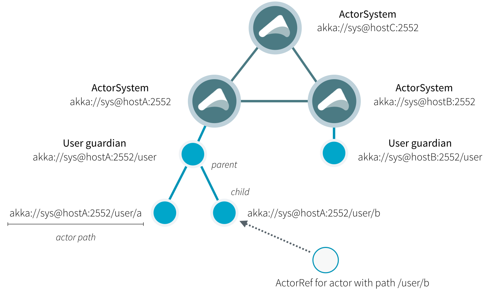

# Actor References, Paths and Addresses

This chapter describes how actors are identified and located within a possibly
distributed Akka application. 



The above image displays the relationship between the most important entities
within an actor system, please read on for the details.

## What is an Actor Reference

An actor reference is a subtype of `ActorRef`, whose foremost purpose is
to support sending messages to the actor it represents. Each actor has access
to its canonical (local) reference through the `ActorContext.self` field; this
reference can be included in messages to other actors to get replies back.

There are several different types of actor references that are supported
depending on the configuration of the actor system:

 * Purely local actor references are used by actor systems which are not
configured to support networking functions. These actor references will not
function if sent across a network connection to a remote JVM.
 * Local actor references when remoting is enabled are used by actor systems
which support networking functions for those references which represent
actors within the same JVM. In order to also be reachable when sent to
other network nodes, these references include protocol and remote addressing
information.
 * Remote actor references represent actors which are reachable using remote
communication, i.e. sending messages to them will serialize the messages
transparently and send them to the remote JVM.
 * There are several special types of actor references which behave like local
actor references for all practical purposes:
    * `PromiseActorRef` is the special representation of a `Promise`
for the purpose of being completed by the response from an actor.
`akka.pattern.ask` creates this actor reference.
    * `DeadLetterActorRef` is the default implementation of the dead
letters service to which Akka routes all messages whose destinations
are shut down or non-existent.
    * `EmptyLocalActorRef` is what Akka returns when looking up a
non-existent local actor path: it is equivalent to a
`DeadLetterActorRef`, but it retains its path so that Akka can send
it over the network and compare it to other existing actor references for
that path, some of which might have been obtained before the actor died.
 * And then there are some one-off internal implementations which you should
never really see:
    * There is an actor reference which does not represent an actor but acts only
as a pseudo-supervisor for the root guardian, we call it “the one who walks
the bubbles of space-time”.
    * The first logging service started before actually firing up actor creation
facilities is a fake actor reference which accepts log events and prints
them directly to standard output; it is `Logging.StandardOutLogger`.

## What is an Actor Path?

Since actors are created in a strictly hierarchical fashion, there exists a
unique sequence of actor names given by recursively following the supervision
links between child and parent down towards the root of the actor system. This
sequence can be seen as enclosing folders in a file system, hence we adopted
the name “path” to refer to it, although actor hierarchy has some fundamental difference from file system hierarchy.

An actor path consists of an anchor, which identifies the actor system,
followed by the concatenation of the path elements, from root guardian to the
designated actor; the path elements are the names of the traversed actors and
are separated by slashes.

### What is the Difference Between Actor Reference and Path?

An actor reference designates a single actor and the life-cycle of the reference
matches that actor’s life-cycle; an actor path represents a name which may or
may not be inhabited by an actor and the path itself does not have a life-cycle,
it never becomes invalid. You can create an actor path without creating an actor,
but you cannot create an actor reference without creating corresponding actor.

You can create an actor, terminate it, and then create a new actor with the same
actor path. The newly created actor is a new incarnation of the actor. It is not
the same actor. An actor reference to the old incarnation is not valid for the new
incarnation. Messages sent to the old actor reference will not be delivered
to the new incarnation even though they have the same path.

### Actor Path Anchors

Each actor path has an address component, describing the protocol and location
by which the corresponding actor is reachable, followed by the names of the
actors in the hierarchy from the root up. Examples are:

```
"akka://my-sys/user/service-a/worker1"               // purely local
"akka://my-sys@host.example.com:5678/user/service-b" // remote
```

The interpretation of the host and port part (i.e. `host.example.com:5678` in the example)
depends on the transport mechanism used, but it must abide by the URI structural rules.

### Logical Actor Paths

The unique path obtained by following the parental supervision links towards
the root guardian is called the logical actor path. This path matches exactly
the creation ancestry of an actor, so it is completely deterministic as soon as
the actor system’s remoting configuration (and with it the address component of
the path) is set.

### Actor path alias or symbolic link?

As in some real file-systems you might think of a “path alias” or “symbolic link” for an actor,
i.e. one actor may be reachable using more than one path.
However, you should note that actor hierarchy is different from file system hierarchy.
You cannot freely create actor paths like symbolic links to refer to arbitrary actors.

## How are Actor References obtained?

There are two general categories to how actor references may be obtained: by
@ref:[creating actors](../typed/actor-lifecycle.md#creating-actors) or by looking them up through the @ref:[Receptionist](../typed/actor-discovery.md#receptionist).

## Actor Reference and Path Equality

Equality of `ActorRef` match the intention that an `ActorRef` corresponds to
the target actor incarnation. Two actor references are compared equal when they have
the same path and point to the same actor incarnation. A reference pointing to a
terminated actor does not compare equal to a reference pointing to another (re-created)
actor with the same path. Note that a restart of an actor caused by a failure still
means that it is the same actor incarnation, i.e. a restart is not visible for the
consumer of the `ActorRef`.

If you need to keep track of actor references in a collection and do not care about
the exact actor incarnation you can use the `ActorPath` as key, because the identifier
of the target actor is not taken into account when comparing actor paths.

## Reusing Actor Paths

When an actor is terminated, its reference will point to the dead letter mailbox,
DeathWatch will publish its final transition and in general it is not expected
to come back to life again (since the actor life cycle does not allow this).

## What is the Address part used for?

When sending an actor reference across the network, it is represented by its
path. Hence, the path must fully encode all information necessary to send
messages to the underlying actor. This is achieved by encoding protocol, host
and port in the address part of the path string. When an actor system receives
an actor path from a remote node, it checks whether that path’s address matches
the address of this actor system, in which case it will be resolved to the
actor’s local reference. Otherwise, it will be represented by a remote actor
reference.

<a id="toplevel-paths"></a>
## Top-Level Scopes for Actor Paths

At the root of the path hierarchy resides the root guardian above which all
other actors are found; its name is `"/"`. The next level consists of the
following:

 * `"/user"` is the guardian actor for all user-created top-level actors;
actors created using `ActorSystem.actorOf` are found below this one.
 * `"/system"` is the guardian actor for all system-created top-level actors,
e.g. logging listeners or actors automatically deployed by configuration at
the start of the actor system.
 * `"/deadLetters"` is the dead letter actor, which is where all messages sent to
stopped or non-existing actors are re-routed (on a best-effort basis: messages
may be lost even within the local JVM).
 * `"/temp"` is the guardian for all short-lived system-created actors, e.g.
those which are used in the implementation of `ActorRef.ask`.
 * `"/remote"` is an artificial path below which all actors reside whose
supervisors are remote actor references

The need to structure the name space for actors like this arises from a central
and very simple design goal: everything in the hierarchy is an actor, and all
actors function in the same way. 
