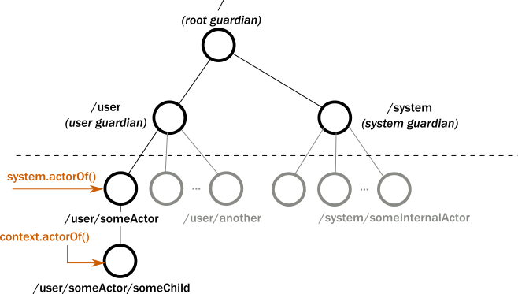

# Part 1: Actor Architecture

## Dependency

Add the following dependency in your project:

@@dependency[sbt,Maven,Gradle] {
  group="com.typesafe.akka"
  artifact="akka-actor_$scala.binary_version$"
  version="$akka.version$"
}

## Introduction

Use of Akka relieves you from creating the infrastructure for an actor system and from writing the low-level code necessary to control basic behavior. To appreciate this, let's look at the relationships between actors you create in your code and those that Akka creates and manages for you internally, the actor lifecycle, and failure handling.

## The Akka actor hierarchy

An actor in Akka always belongs to a parent. Typically, you create an actor by calling  @java[`getContext().actorOf()`]@scala[`context.actorOf()`]. Rather than creating a "freestanding" actor, this injects the new actor as a child into an already existing tree: the creator actor becomes the
_parent_ of the newly created _child_ actor. You might ask then, who is the parent of the _first_ actor you create?

As illustrated below, all actors have a common parent, the user guardian. New actor instances can be created under this actor using `system.actorOf()`. As we covered in the @scala[[Quickstart Guide](https://developer.lightbend.com/guides/akka-quickstart-scala/)]@java[[Quickstart Guide](https://developer.lightbend.com/guides/akka-quickstart-java/)], creation of an actor returns a reference that is a valid URL. So, for example, if we create an actor named `someActor` with `system.actorOf(…, "someActor")`, its reference will include the path `/user/someActor`.



In fact, before you create an actor in your code, Akka has already created three actors in the system. The names of these built-in actors contain _guardian_ because they _supervise_ every child actor in their path. The guardian actors include:

 - `/` the so-called _root guardian_. This is the parent of all actors in the system, and the last one to stop when the system itself is terminated.
 - `/user` the _guardian_. **This is the parent actor for all user created actors**. Don't let the name `user` confuse
   you, it has nothing to do with end users, nor with user handling. Every actor you create using the Akka library will have the constant path `/user/` prepended to it.
 - `/system` the _system guardian_.

In the Hello World example, we have already seen how `system.actorOf()`, creates an actor directly under `/user`. We call this a _top level_ actor, even though, in practice it is only on the top of the
_user defined_ hierarchy. You typically have only one (or very few) top level actors in your `ActorSystem`.
We create child, or non-top-level, actors by invoking `context.actorOf()` from an existing actor. The `context.actorOf()` method has a signature identical to `system.actorOf()`, its top-level counterpart.

The easiest way to see the actor hierarchy in action is to print `ActorRef` instances. In this small experiment, we create an actor, print its reference, create a child of this actor, and print the child's reference. We start with the Hello World project, if you have not downloaded it, download the Quickstart project from the @scala[[Lightbend Tech Hub](http://developer.lightbend.com/start/?group=akka&amp;project=akka-quickstart-scala)]@java[[Lightbend Tech Hub](http://developer.lightbend.com/start/?group=akka&amp;project=akka-quickstart-java)].


In your Hello World project, navigate to the `com.example` package and create a new @scala[Scala file called `ActorHierarchyExperiments.scala`]@java[Java file called `ActorHierarchyExperiments.java`] here. Copy and paste the code from the snippet below to this new source file. Save your file and run `sbt "runMain com.example.ActorHierarchyExperiments"` to observe the output.

Scala
:   @@snip [ActorHierarchyExperiments.scala](/akka-docs/src/test/scala/tutorial_1/ActorHierarchyExperiments.scala) { #print-refs }

Java
:   @@snip [ActorHierarchyExperiments.java](/akka-docs/src/test/java/jdocs/tutorial_1/ActorHierarchyExperiments.java) { #print-refs }

Note the way a message asked the first actor to do its work. We sent the message by using the parent's reference: @scala[`firstRef ! "printit"`]@java[`firstRef.tell("printit", ActorRef.noSender())`]. When the code executes, the output includes the references for the first actor and the child it created as part of the `printit` case. Your output should look similar to the following:

```
First: Actor[akka://testSystem/user/first-actor#1053618476]
Second: Actor[akka://testSystem/user/first-actor/second-actor#-1544706041]
```

Notice the structure of the references:

* Both paths start with `akka://testSystem/`. Since all actor references are valid URLs, `akka://` is the value of the protocol field.
* Next, just like on the World Wide Web, the URL identifies the system. In this example, the system is named `testSystem`, but it could be any other name. If remote communication between multiple systems is enabled, this part of the URL includes the hostname so other systems can find it on the network.
* Because the second actor's reference includes the path `/first-actor/`, it identifies it as a child of the first.
* The last part of the actor reference, `#1053618476` or `#-1544706041`  is a unique identifier that you can ignore in most cases.

Now that you understand what the actor hierarchy
looks like, you might be wondering: _Why do we need this hierarchy? What is it used for?_

An important role of the hierarchy is to safely manage actor lifecycles. Let's consider this next and see how that knowledge can help us write better code.

### The actor lifecycle
Actors pop into existence when created, then later, at user requests, they are stopped. Whenever an actor is stopped, all of its children are _recursively stopped_ too.
This behavior greatly simplifies resource cleanup and helps avoid resource leaks such as those caused by open sockets and files. In fact, a commonly overlooked difficulty when dealing with low-level multi-threaded code is the lifecycle management of various concurrent resources.

To stop an actor, the recommended pattern is to call @scala[`context.stop(self)`]@java[`getContext().stop(getSelf())`] inside the actor to stop itself, usually as a response to some user defined stop message or when the actor is done with its job. Stopping another actor is technically possible by calling @scala[`context.stop(actorRef)`]@java[`getContext().stop(actorRef)`], but **It is considered a bad practice to stop arbitrary actors this way**: try sending them a `PoisonPill` or custom stop message instead.

The Akka actor API exposes many lifecycle hooks that you can override in an actor implementation. The most commonly used are
`preStart()` and `postStop()`.

 * `preStart()` is invoked after the actor has started but before it processes its first message.
 * `postStop()` is invoked just before the actor stops. No messages are processed after this point.

Let's use the `preStart()` and `postStop()` lifecycle hooks in a simple experiment to observe the behavior when we stop an actor. First, add the following 2 actor classes to your project:

Scala
:   @@snip [ActorHierarchyExperiments.scala](/akka-docs/src/test/scala/tutorial_1/ActorHierarchyExperiments.scala) { #start-stop }

Java
:   @@snip [ActorHierarchyExperiments.java](/akka-docs/src/test/java/jdocs/tutorial_1/ActorHierarchyExperiments.java) { #start-stop }

And create a 'main' class like above to start the actors and then send them a `"stop"` message:

Scala
:   @@snip [ActorHierarchyExperiments.scala](/akka-docs/src/test/scala/tutorial_1/ActorHierarchyExperiments.scala) { #start-stop-main }

Java
:   @@snip [ActorHierarchyExperiments.java](/akka-docs/src/test/java/jdocs/tutorial_1/ActorHierarchyExperiments.java) { #start-stop-main }

You can again use `sbt` to start this program. The output should look like this:

```
first started
second started
second stopped
first stopped
```

When we stopped actor `first`, it stopped its child actor, `second`, before stopping itself. This ordering is strict, _all_ `postStop()` hooks of the children are called before the `postStop()` hook of the parent
is called.

The @ref:[Actor Lifecycle](../actors.md#actor-lifecycle) section of the Akka reference manual provides details on the full set of lifecyle hooks.

### Failure handling

Parents and children are connected throughout their lifecycles. Whenever an actor fails (throws an exception or an unhandled exception bubbles out from `receive`) it is temporarily suspended. As mentioned earlier, the failure information is propagated
to the parent, which then decides how to handle the exception caused by the child actor. In this way, parents act as supervisors for their children. The default _supervisor strategy_ is to
stop and restart the child. If you don't change the default strategy all failures result in a restart.

Let's observe the default strategy in a simple experiment. Add the following classes to your project, just as you did with the previous ones:

Scala
:   @@snip [ActorHierarchyExperiments.scala](/akka-docs/src/test/scala/tutorial_1/ActorHierarchyExperiments.scala) { #supervise }

Java
:   @@snip [ActorHierarchyExperiments.java](/akka-docs/src/test/java/jdocs/tutorial_1/ActorHierarchyExperiments.java) { #supervise }

And run with:

Scala
:   @@snip [ActorHierarchyExperiments.scala](/akka-docs/src/test/scala/tutorial_1/ActorHierarchyExperiments.scala) { #supervise-main }

Java
:   @@snip [ActorHierarchyExperiments.java](/akka-docs/src/test/java/jdocs/tutorial_1/ActorHierarchyExperiments.java) { #supervise-main }

You should see output similar to the following:

```
supervised actor started
supervised actor fails now
supervised actor stopped
supervised actor started
[ERROR] [03/29/2017 10:47:14.150] [testSystem-akka.actor.default-dispatcher-2] [akka://testSystem/user/supervising-actor/supervised-actor] I failed!
java.lang.Exception: I failed!
        at tutorial_1.SupervisedActor$$anonfun$receive$4.applyOrElse(ActorHierarchyExperiments.scala:57)
        at akka.actor.Actor$class.aroundReceive(Actor.scala:513)
        at tutorial_1.SupervisedActor.aroundReceive(ActorHierarchyExperiments.scala:47)
        at akka.actor.ActorCell.receiveMessage(ActorCell.scala:519)
        at akka.actor.ActorCell.invoke(ActorCell.scala:488)
        at akka.dispatch.Mailbox.processMailbox(Mailbox.scala:257)
        at akka.dispatch.Mailbox.run(Mailbox.scala:224)
        at akka.dispatch.Mailbox.exec(Mailbox.scala:234)
        at java.util.concurrent.ForkJoinTask.doExec(ForkJoinTask.java:260)
        at java.util.concurrent.ForkJoinPool$WorkQueue.runTask(ForkJoinPool.java:1339)
        at java.util.concurrent.ForkJoinPool.runWorker(ForkJoinPool.java:1979)
        at java.util.concurrent.ForkJoinWorkerThread.run(ForkJoinWorkerThread.java:107)
```

We see that after failure the supervised actor is stopped and immediately restarted. We also see a log entry reporting the exception that was handled, in this case, our test exception. In this example we used `preStart()` and `postStop()` hooks
which are the default to be called after and before restarts, so we cannot distinguish from inside the actor whether it was started for the first time or restarted. This is usually the right thing to do, the purpose of the restart is to set the actor in a known-good state, which usually means a clean starting stage. **What actually happens though is
that the `preRestart()` and `postRestart()` methods are called which, if not overridden, by default delegate to `postStop()` and `preStart()` respectively**. You can experiment with overriding these additional methods and see how the output changes.

For the impatient, we also recommend looking into the @ref:[supervision reference page](../general/supervision.md) for more in-depth
details.

# Summary
We've learned about how Akka manages actors in hierarchies where parents supervise their children and handle exceptions. We saw how to create a very simple actor and child. Next, we'll apply this knowledge to our example use case by modeling the communication necessary to get information from device actors. Later, we'll deal with how to manage the actors in groups.

