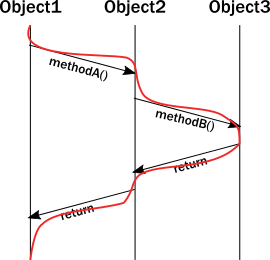

# Why modern systems need a new programming model

The actor model was proposed decades ago by @extref[Carl Hewitt](wikipedia:Carl_Hewitt#Actor_model) as a way to handle parallel processing in a high performance network &#8212; an environment that was not available at the time. Today, hardware and infrastructure capabilities have caught up with and exceeded Hewitt's vision. Consequently, organizations building distributed systems with demanding requirements encounter challenges that cannot fully be solved with a traditional object-oriented programming (OOP) model, but that can benefit from the actor model.

Today, the actor model is not only recognized as a highly effective solution &#8212; it has been proven in production for some of the world's most demanding applications. To highlight issues that the actor model addresses, this topic discusses the following mismatches between traditional programming assumptions and the reality of modern multi-threaded, multi-CPU architectures:

* [The challenge of encapsulation](#the-illusion-of-encapsulation)
* [The illusion of shared memory on modern computer architectures](#The-illusion-of-shared-memory-on-modern-computer-architectures)
* [The illustion of a call stack](#the-illusion-of-a-call-stack)

## The challenge of encapsulation

A core pillar of OOP is _encapsulation_. Encapsulation dictates that the internal data of an object is not accessible directly from the outside;
it can only be modified by invoking a set of curated methods. The object is responsible for exposing safe operations
that protect the invariant nature of its encapsulated data.

For example, operations on an ordered binary tree implementation must not allow violation of the tree ordering
invariant. Callers expect the ordering to be intact and when querying the tree for a certain piece of
data, they need to be able to rely on this constraint.

When we analyze OOP runtime behavior, we sometimes draw a message sequence chart showing the interactions of
method calls. For example:

Unfortunately, the above diagram does not accurately represent the _lifelines_ of the instances during execution.
In reality, a _thread_ executes all these calls, and the enforcement of invariants occurs on the same thread from
which the method was called. Updating the diagram with the thread of execution, it looks like this:

The significance of this clarification becomes clear when you try to model what happens with _multiple threads_.
Suddenly, our neatly drawn diagram becomes inadequate. We can try to illustrate multiple threads accessing
the same instance:

There is a section of execution where two threads enter the same method. Unfortunately, the encapsulation model
of objects does not guarantee anything about what happens in that section. Instructions of the two invocations
can be interleaved in arbitrary ways which eliminate any hope for keeping the invariants intact without some
type of coordination between two threads. Now, imagine this issue compounded by the existence of many threads.

The common approach to solving this problem is to add a lock around these methods. While this ensures that at most
one thread will enter the method at any given time, this is a very costly strategy:

 * Locks _seriously limit_ concurrency, they are very costly on modern CPU architectures,
   requiring heavy-lifting from the operating system to suspend the thread and restore it later.
 * The caller thread is now blocked, so it cannot do any other meaningful work. Even in desktop applications this is
   unacceptable, we want to keep user-facing parts of applications (its UI) to be responsive even when a
   long background job is running. In the backend, blocking is outright wasteful.
   One might think that this can be compensated by launching new threads, but threads are also a costly abstraction.
 * Locks introduce a new menace: deadlocks.

These realities result in a no-win situation:

 * Without sufficient locks, the state gets corrupted.
 * With many locks in place, performance suffers and very easily leads to deadlocks.

Additionally, locks only really work well locally. When it comes to coordinating across multiple machines,
the only alternative is distributed locks. Unfortunately, distributed locks are several magnitudes less efficient
than local locks and usually impose a hard limit on scaling out. Distributed lock protocols require several
communication round-trips over the network across multiple machines, so latency goes through the roof.

In Object Oriented languages we rarely think about threads or linear execution paths in general.
We often envision a system as a network of object instances that react to method calls, modify their internal state,
then communicate with each other via method calls driving the whole application state forward:

However, in a multi-threaded distributed environment, what actually happens is that threads "traverse" this network of object instances by following method calls.
As a result, threads are what really drive execution:

**In summary**:

 * **Objects can only guarantee encapsulation (protection of invariants) in the face of single-threaded access,
   multi-thread execution almost always leads to corrupted internal state. Every invariant can be violated by
   having two contending threads in the    same code segment.**
 * **While locks seem to be the natural remedy to uphold encapsulation with multiple threads, in practice they
   are inefficient and easily lead to deadlocks in any application of real-world scale.**
 * **Locks work locally, attempts to make them distributed exist, but offer limited potential for scaling out.**

## The illusion of shared memory on modern computer architectures

Programming models of the 80'-90's conceptualize that writing to a variable means writing to a memory location directly
(which somewhat muddies the water that local variables might exist only in registers). On modern architectures -
if we simplify things a bit - CPUs are writing to [cache lines](https://en.wikipedia.org/wiki/CPU_cache)
instead of writing to memory directly. Most of these caches are local to the CPU core, that is, writes by one core
are not visible by another. In order to make local changes visible to another core, and hence to another thread,
the cache line needs to be shipped to the other core's cache.

On the JVM, we have to explicitly denote memory locations to be shared across threads by using _volatile_ markers
or `Atomic` wrappers. Otherwise, we can access them only in a locked section. Why don't we just mark all variables as
volatile? Because shipping cache lines across cores is a very costly operation! Doing so would implicitly stall the cores
involved from doing additional work, and result in bottlenecks on the cache coherence protocol (the protocol CPUs
use to transfer cache lines between main memory and other CPUs).
The result is magnitudes of slowdown.

Even for developers aware of this situation, figuring out which memory locations should be marked as volatile,
or which atomic structures to use is a dark art.

**In summary**:

 * **There is no real shared memory anymore, CPU cores pass chunks of data (cache lines) explicitly to each other
   just as computers on a network do. Inter-CPU communication and network communication have more in common than many realize. Passing messages is the norm now be it across CPUs or networked computers.**
 * **Instead of hiding the message passing aspect through variables marked as shared or using atomic data structures,
   a more disciplined and principled approach is to keep state local to a concurrent entity and propagate data or events
   between concurrent entities explicitly via messages.**

## The illusion of a call stack

Today, we often take call stacks for granted. But, they were invented in an era where concurrent programming
was not as important because multi-CPU systems were not common. Call stacks do not cross threads and hence,
do not model asynchronous call chains.

The problem arises when a thread intends to delegate a task to the "background". In practice, this really means
delegating to another thread. This cannot be a simple method/function call because calls are strictly local to the
thread. What usually happens, is that the "caller" puts an object into a memory location shared by a worker thread
("callee"), which in turn, picks it up in some event loop. This allows the "caller" thread to move on and do other tasks.

The first issue is, how can the "caller" be notified of the completion of the task? But a more serious issue arises
when a task fails with an exception. Where does the exception propagate to? It will propagate to the exception handler
of the worker thread completely ignoring who the actual "caller" was:

This is a serious problem. How does the worker thread deal with the situation? It likely cannot fix the issue as it is
usually oblivious of the purpose of the failed task. The "caller" thread needs to be notified somehow,
but there is no call stack to unwind with an exception. Failure notification can only be done via a side-channel,
for example putting an error code where the "caller" thread otherwise expects the result once ready.
If this notification is not in place, the "caller" never gets notified of a failure and the task is lost!
**This is surprisingly similar to how networked systems work where messages/requests can get lost/fail without any
notification.**

This bad situation gets worse when things go really wrong and a worker backed by a thread encounters a bug and ends
up in an unrecoverable situation. For example, an internal exception caused by a bug bubbles up to the root of
the thread and makes the thread shut down. This immediately raises the question, who should restart the normal operation
of the service hosted by the thread, and how should it be restored to a known-good state? At first glance,
this might seem manageable, but we are suddenly faced by a new, unexpected phenomena: the actual task,
that the thread was currently working on, is no longer in the shared memory location where tasks are taken from
(usually a queue). In fact, due to the exception reaching to the top, unwinding all of the call stack,
the task state is fully lost! **We have lost a message even though this is local communication with no networking
involved (where message losses are to be expected).**

**In summary:**

 * **To achieve any meaningful concurrency and performance on current systems, threads must delegate tasks among each
   other in an efficient way without blocking. With this style of task-delegating concurrency
   (and even more so with networked/distributed computing) call stack-based error handling breaks down and new,
   explicit error signaling mechanisms need to be introduced. Failures become part of the domain model.**
 * **Concurrent systems with work delegation needs to handle service faults and have principled means to recover from them.
   Clients of such services need to be aware that tasks/messages might get lost during restarts.
   Even if loss does not happen, a response might be delayed arbitrarily due to previously enqueued tasks
   (a long queue), delays caused by garbage collection, etc. In face of these, concurrent systems should handle response
   deadlines in the form of timeouts, just like networked/distributed systems.**

Next, let's see how use of the actor model can overcome these challenges.
