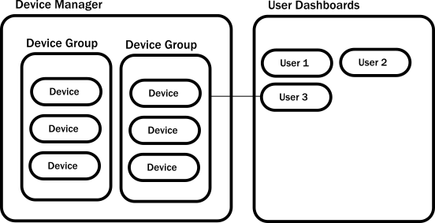

# Introduction to the Example

When writing prose, the hardest part is often composing the first few sentences. There is a similar "blank canvas" feeling
when starting to build an Akka system. You might wonder: Which should be the first actor? Where should it live? What should it do?
Fortunately &#8212; unlike with prose &#8212; established best practices can guide us through these initial steps. In the remainder of this guide, we examine the core logic of a simple Akka application to introduce you to actors and show you how to formulate solutions with them. The example demonstrates common patterns that will help you kickstart your Akka projects.

## Prerequisites
You should have already followed the instructions in the @scala[[Akka Quickstart with Scala guide](http://developer.lightbend.com/guides/akka-quickstart-scala/)] @java[[Akka Quickstart with Java guide](http://developer.lightbend.com/guides/akka-quickstart-java/)] to download and run the Hello World example. You will use this as a seed project and add the functionality described in this tutorial.

## IoT example use case

In this tutorial, we'll use Akka to build out part of an Internet of Things (IoT) system that reports data from sensor devices installed in customers' homes. The example focuses on temperature readings. The target use case simply allows customers to log in and view the last reported temperature from different areas of their homes. You can imagine that such sensors could also collect relative humidity or other interesting data and an application would likely support reading and changing device configuration, maybe even alerting home owners when sensor state falls outside of a particular range.

In a real system, the application would be exposed to customers through a mobile app or browser. This guide concentrates only on the core logic for storing temperaturs that would be called over a network protocol, such as HTTP. It also includes writing tests to help you get comfortable and proficient with testing actors.

The tutorial application consists of two main components:

 * **Device data collection:** &#8212; maintains a local representation of the
    remote devices. Multiple sensor devices for a home are organized into one device group.
 * **User dashboard:** &#8212; periodically collects data from the devices for a
   logged in user's home and presents the results as a report.

The following diagram illustrates the example application architecture. Since we are interested in the state of each sensor device, we will model devices as actors. The running application will create as many instances of device actors and device groups as necessary.

## What you will learn in this tutorial
This tutorial introduces and illustrates:

* The actor hierarchy and how it influences actor behavior
* How to choose the right granularity for actors
* How to define protocols as messages
* Typical conversational styles

Let's get started by learning more about actors.

