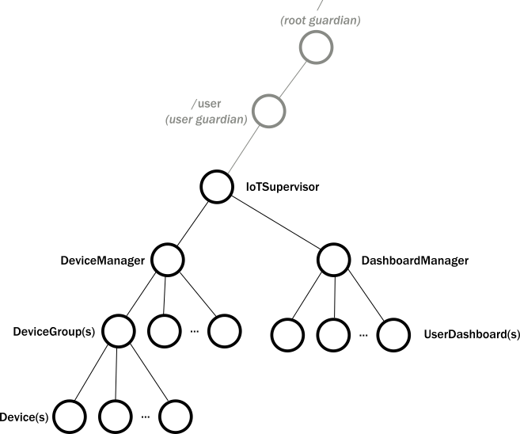

# Part 2: Creating the First Actor

With an understanding of actor hierarchy and behavior, the remaining question is how to map the top-level components of our IoT system to actors. It might be tempting to make the actors that
represent devices and dashboards at the top level. Instead, we recommend creating an explicit component that represents the whole application. In other words, we will have a single top-level actor in our IoT system. The components that create and manage devices and dashboards will be children of this actor. This allows us to refactor the example use case architecture diagram into a tree of actors:

We can define the first actor, the IotSupervisor, with a few simple lines of code. To start your tutorial application:

1. Create a new `IotApp` source file in the @scala[`src\main\scala\com\lightbend\akka\sample\`]@java[`src\main\java\com\lightbend\akka\sample\`] directory.
1. Paste the following code into the new file to define the IotSupervisor.

Scala
:   @@snip [IotSupervisor.scala]($code$/scala/tutorial_2/IotSupervisor.scala) { #iot-supervisor }

Java
:   @@snip [IotSupervisor.java]($code$/java/jdocs/tutorial_2/IotSupervisor.java) { #iot-supervisor }

The code is similar to the actor examples we used in the previous experiments, but notice:

* Instead of `println()` we use @scala[the `ActorLogging` helper trait] @java[`akka.event.Logging`], which directly invokes Akka's built in logging facility.
* We use the recommended pattern for creating actors by defining a `props()` @scala[method in the [companion object](http://docs.scala-lang.org/tutorials/tour/singleton-objects.html#companions) of] @java[static method on] the actor.

To provide the `main` entry point that creates the actor system, add the following code to the new `IotApp` source file.

Scala
:   @@snip [IotApp.scala]($code$/scala/tutorial_2/IotApp.scala) { #iot-app }

Java
:   @@snip [IotMain.java]($code$/java/jdocs/tutorial_2/IotMain.java) { #iot-app }

The application does little, other than print out that it is started. But, we have the first actor in place and we are ready to add other actors.

## What's next?

In the following chapters we will grow the application gradually, by:

 1. Creating the representation for a device.
 2. Creating the device management component.
 3. Adding query capabilities to device groups.

