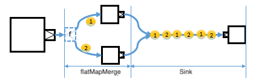

# Substreams

Substreams are represented as `SubSource` or `SubFlow` instances, on which you can multiplex a single `Source` or `Flow`
into a stream of streams.

SubFlows cannot contribute to the super-flow’s materialized value since they are materialized later,
during the runtime of the flow graph processing.

Stages that creates substreams are listed on @ref:[Nesting and flattening stages](stages-overview.md#nesting-and-flattening-stages)

## Nesting stages

### groupBy

A typical operation that generates substreams is `groupBy`.

Scala
:   ```
    Source(1 to 10).groupBy(3, _ % 3)
    ```

Java
:   ```
    Source.from((Arrays.asList(1,2,3,4,5,6,7,8,9,10)).groupBy(3, elem -> elem % 3);
    ```


This operation split the incoming stream into separate output
streams, one for each element key. The key is computed for each element
using the given function, which is `f` in the above diagram. When a new key is encountered for the first time
a new substream is opened and subsequently fed with all elements belonging to that key.

If you add a `Sink` or `Flow` right after the `groupBy` stage,
all transformations are applied to all encountered substreams in the same fashion.
So, if you add the following `Sink`, that is added to each of the substreams as in the below diagram.

Scala
:   ```
    Source(1 to 10).groupBy(3, _ % 3).runWith(Sink.ignore)
    ```

Java
:   ```
    Source.from(Arrays.asList(1,2,3,4,5,6,7,8,9,10))
      .groupBy(3, elem -> elem % 3)
      .to(Sink.ignore())
      .run(mat);
    ```


Also substreams, more precisely, `SubFlow` and `SubSource` have methods that allow you
merge or concat substreams into the master stream again.

The `mergeSubstreams` method merge an unbounded number of substreams back to the master stream.

Scala
:   ```
    Source(1 to 10).groupBy(3, _ % 3).mergeSubstreams.runWith(Sink.ignore)
    ```

Java
:   ```
    Source.from(Arrays.asList(1,2,3,4,5,6,7,8,9,10))
      .groupBy(3, elem -> elem % 3)
      .mergeSubstreams()
      .runWith(Sink.ignore(), mat);
    ```

The `mergeSubstreams` method merge an unbounded number of active substreams back to the master stream.


You can limit the number of active substreams running amd being merged at a time,
with either the `mergeSubstreamsWithParallelism` or `concatSubstreams` method.

Scala
:   ```
    Source(1 to 10).groupBy(3, _ % 3).mergeSubstreamsWithParallelism(2).runWith(Sink.ignore)
    //concatSubstreams is equivalent to mergeSubstreamsWithParallelism(1)
    Source(1 to 10).groupBy(3, _ % 3).concatSubstreams.runWith(Sink.ignore)
    ```

Java
:   ```
    Source.from(Arrays.asList(1,2,3,4,5,6,7,8,9,10))
      .groupBy(3, elem -> elem % 3)
      .mergeSubstreamsWithParallelism(2)
      .runWith(Sink.ignore(), mat);
    //concatSubstreams is equivalent to mergeSubstreamsWithParallelism(1)
    Source.from(Arrays.asList(1,2,3,4,5,6,7,8,9,10))
      .groupBy(3, elem -> elem % 3)
      .concatSubstreams()
      .runWith(Sink.ignore(), mat);
    ```

However, since the number of active substreams is capped,
be careful so that these methods do not cause deadlocks with back pressure like in the below diagram.


### splitWhen and splitAfter

`splitWhen` and `splitAfter` are two other operations which generate substreams.

The difference from `groupBy` is that, if the predicate for `splitWhen` and `splitAfter` returns true,
and a new substream is generated, the following elements will flow into the new substream.

`splitWhen` flows the element on which the predicate returned true to a new substream,
 whereas `splitAfter` flows the next element to the new substream after the element on which predicate returned true.

Scala
:   ```
    Source(1 to 10).splitWhen(SubstreamCancelStrategy.drain)(_ == 3)
    ```

Java
:   ```
    Source.from(Arrays.asList(1,2,3,4,5,6,7,8,9,10)).splitWhen(elem -> elem == 3);
    ```


## Flattening stages

### flatMapConcat

`flatMapConcat` and `flatMapMerge` are substream operations in a different from `groupBy` and `splitWhen/After`.

`flatMapConcat` takes a so-called predicate, which is `f` in the following diagram.
The predicate `f` of `flatMapConcat` transforms each input element into a `Source` that is then flattened
into the output stream by concatnation.

Scala
:   ```
    Source(1 to 2).flatMapConcat(i => Source(List.fill(3)(i))).runWith(Sink.ignore)
    ```

Java
:   ```
    Source.from(Arrays.asList(1, 2))
      .flatMapConcat(i -> Source.from(Arrays.asList(i, i, i)))
      .runWith(Sink.ignore(), mat);
    ```


Like the `concat` operation on `Flow`, it fully consumes one `Source` after the other.
So, there is only one substream actively running at a given time.

Then once the active substream is fully consumed, the next substream can start running.
Elements from all the substreams are concatnated to the sink.


### flatMapMerge

`flatMapMerge` is similar to `flatMapConcat`, but it doesn't wait one `Source`to be fully consumed.
 Instead, up to `breadth` number of streams emit elements at any given time.

```
Scala
:   ```
    Source(1 to 2).flatMapMerge(i => Source(List.fill(3)(i))).runWith(Sink.ignore)
    ```

Java
:   ```
    Source.from(Arrays.asList(1, 2))
      .flatMapMerge(2, i -> Source.from(Arrays.asList(i, i, i)))
      .runWith(Sink.ignore(), mat);
    ```

