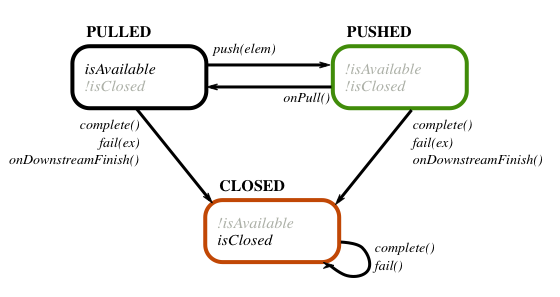
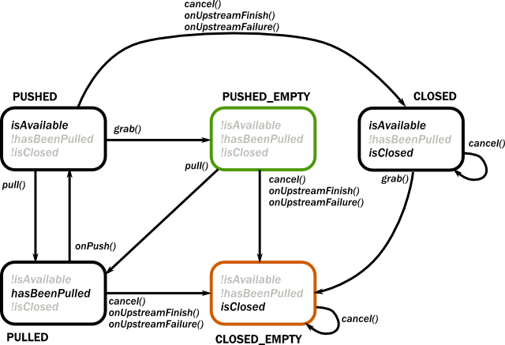
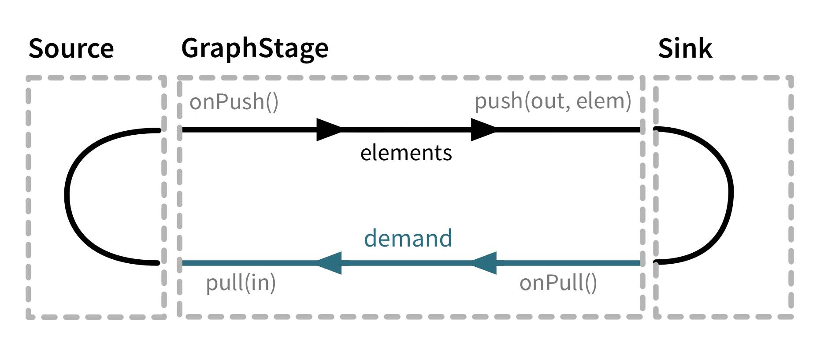
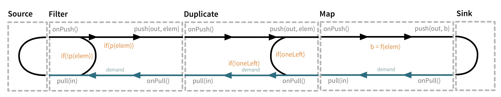
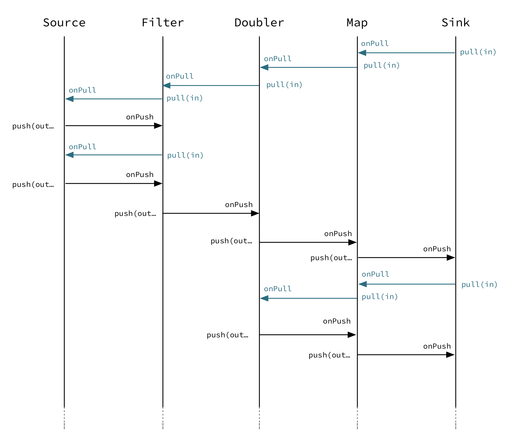
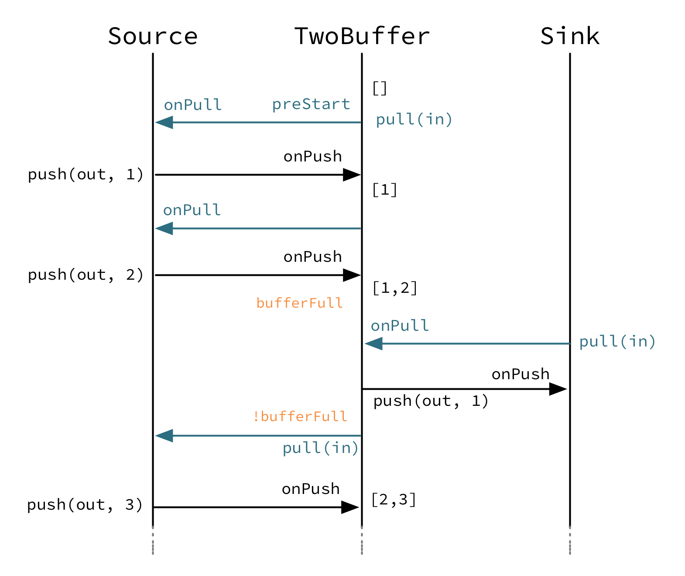
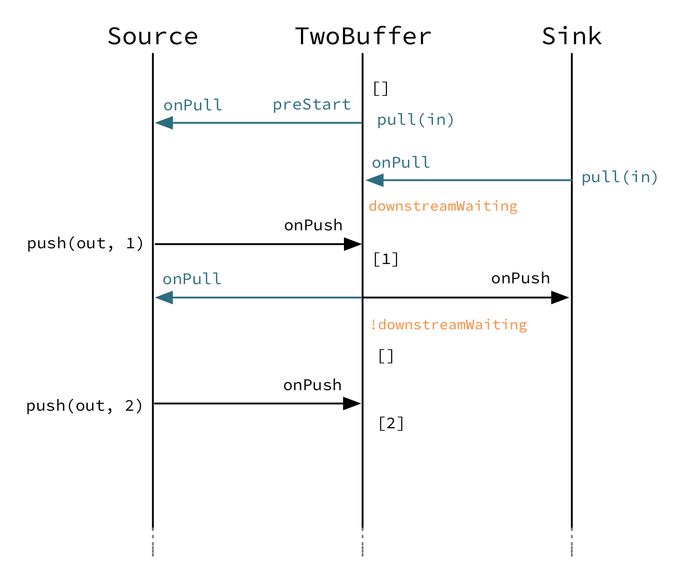

# Custom stream processing

## Dependency

To use Akka Streams, add the module to your project:

@@dependency[sbt,Maven,Gradle] {
  group="com.typesafe.akka"
  artifact="akka-stream_$scala.binary_version$"
  version="$akka.version$"
}

## Introduction

While the processing vocabulary of Akka Streams is quite rich (see the @ref:[Streams Cookbook](stream-cookbook.md) for examples) it
is sometimes necessary to define new transformation operators either because some functionality is missing from the
stock operations, or for performance reasons. In this part we show how to build custom operators and graph
junctions of various kinds.

@@@ note

A custom operator should not be the first tool you reach for, defining operators using flows
and the graph DSL is in general easier and does to a larger extent protect you from mistakes that
might be easy to make with a custom @ref[`GraphStage`](stream-customize.md)

@@@

## Custom processing with GraphStage

The `GraphStage` abstraction can be used to create arbitrary operators with any number of input
or output ports. It is a counterpart of the `GraphDSL.create()` method which creates new stream processing
operators by composing others. Where `GraphStage` differs is that it creates an operator that is itself not divisible into
smaller ones, and allows state to be maintained inside it in a safe way.

As a first motivating example, we will build a new `Source` that will emit numbers from 1 until it is
cancelled. To start, we need to define the "interface" of our operator, which is called *shape* in Akka Streams terminology
(this is explained in more detail in the section @ref:[Modularity, Composition and Hierarchy](stream-composition.md)). This is how this looks like:

Scala
:   @@snip [GraphStageDocSpec.scala](/akka-docs/src/test/scala/docs/stream/GraphStageDocSpec.scala) { #boilerplate-example }

Java
:   @@snip [GraphStageDocTest.java](/akka-docs/src/test/java/jdocs/stream/GraphStageDocTest.java) { #simple-source }

As you see, in itself the `GraphStage` only defines the ports of this operator and a shape that contains the ports.
It also has, a currently unimplemented method called `createLogic`. If you recall, operators are reusable in multiple
materializations, each resulting in a different executing entity. In the case of `GraphStage` the actual running
logic is modeled as an instance of a `GraphStageLogic` which will be created by the materializer by calling
the `createLogic` method. In other words, all we need to do is to create a suitable logic that will emit the
numbers we want.

@@@ note

It is very important to keep the GraphStage object itself immutable and reusable. All mutable state needs to be
confined to the GraphStageLogic that is created for every materialization.

@@@

In order to emit from a `Source` in a backpressured stream one needs first to have demand from downstream.
To receive the necessary events one needs to register a subclass of @scala[`OutHandler`] @java[`AbstractOutHandler`] with the output port
(`Outlet`). This handler will receive events related to the lifecycle of the port. In our case we need to
override `onPull()` which indicates that we are free to emit a single element. There is another callback,
`onDownstreamFinish()` which is called if the downstream cancelled. Since the default behavior of that callback is
to stop the operator, we don't need to override it. In the `onPull` callback we will emit the next number. This
is how it looks like in the end:

Scala
:   @@snip [GraphStageDocSpec.scala](/akka-docs/src/test/scala/docs/stream/GraphStageDocSpec.scala) { #custom-source-example }

Instances of the above `GraphStage` are subclasses of @scala[`Graph[SourceShape[Int],NotUsed]`] @java[`Graph<SourceShape<Integer>,NotUsed>`] which means
that they are already usable in many situations, but do not provide the DSL methods we usually have for other
`Source` s. In order to convert this `Graph` to a proper `Source` we need to wrap it using
`Source.fromGraph` (see @ref:[Modularity, Composition and Hierarchy](stream-composition.md) for more details about operators and DSLs). Now we can use the
source as any other built-in one:

Scala
:   @@snip [GraphStageDocSpec.scala](/akka-docs/src/test/scala/docs/stream/GraphStageDocSpec.scala) { #simple-source-usage }

Java
:   @@snip [GraphStageDocTest.java](/akka-docs/src/test/java/jdocs/stream/GraphStageDocTest.java) { #simple-source-usage }

Similarly, to create a custom `Sink` one can register a subclass `InHandler` with the operator `Inlet`.
The `onPush()` callback is used to signal the handler a new element has been pushed to the operator,
and can hence be grabbed and used. `onPush()` can be overridden to provide custom behavior.
Please note, most Sinks would need to request upstream elements as soon as they are created: this can be
done by calling `pull(inlet)` in the `preStart()` callback.

Scala
:   @@snip [GraphStageDocSpec.scala](/akka-docs/src/test/scala/docs/stream/GraphStageDocSpec.scala) { #custom-sink-example }

Java
:   @@snip [GraphStageDocTest.java](/akka-docs/src/test/java/jdocs/stream/GraphStageDocTest.java) { #simple-sink }

### Port states, @scala[InHandler] @java[AbstractInHandler] and @scala[OutHandler] @java[AbstractOutHandler]

In order to interact with a port (`Inlet` or `Outlet`) of the operator we need to be able to receive events
and generate new events belonging to the port.

#### Output port

From the `GraphStageLogic` the following operations are available on an output port:

 * `push(out,elem)` pushes an element to the output port. Only possible after the port has been pulled by downstream.
 * `complete(out)` closes the output port normally.
 * `fail(out,exception)` closes the port with a failure signal.

The events corresponding to an *output* port can be received in an @scala[`OutHandler`] @java[`AbstractOutHandler`] instance registered to the
output port using `setHandler(out,handler)`. This handler has two callbacks:

 * `onPull()` is called when the output port is ready to emit the next element, `push(out, elem)` is now allowed
to be called on this port.
 * `onDownstreamFinish()` is called once the downstream has cancelled and no longer allows messages to be pushed to it.
No more `onPull()` will arrive after this event. If not overridden this will default to stopping the operator.

Also, there are two query methods available for output ports:

 * `isAvailable(out)` returns true if the port can be pushed
 * `isClosed(out)` returns true if the port is closed. At this point the port can not be pushed and will not be pulled anymore.

The relationship of the above operations, events and queries are summarized in the state machine below. Green shows
the initial state while orange indicates the end state. If an operation is not listed for a state, then it is invalid
to call it while the port is in that state. If an event is not listed for a state, then that event cannot happen
in that state.

#### Input port

The following operations are available for *input* ports:

 * `pull(in)` requests a new element from an input port. This is only possible after the port has been pushed by upstream.
 * `grab(in)` acquires the element that has been received during an `onPush()`. It cannot be called again until the
port is pushed again by the upstream.
 * `cancel(in)` closes the input port.

The events corresponding to an *input* port can be received in an @scala[`InHandler`] @java[`AbstractInHandler`] instance registered to the
input port using `setHandler(in, handler)`. This handler has three callbacks:

 * `onPush()` is called when the input port has now a new element. Now it is possible to acquire this element using
`grab(in)` and/or call `pull(in)` on the port to request the next element. It is not mandatory to grab the
element, but if it is pulled while the element has not been grabbed it will drop the buffered element.
 * `onUpstreamFinish()` is called once the upstream has completed and no longer can be pulled for new elements.
No more `onPush()` will arrive after this event. If not overridden this will default to stopping the operator.
 * `onUpstreamFailure()` is called if the upstream failed with an exception and no longer can be pulled for new elements.
No more `onPush()` will arrive after this event. If not overridden this will default to failing the operator.

Also, there are three query methods available for input ports:

 * `isAvailable(in)` returns true if the port can be grabbed.
 * `hasBeenPulled(in)` returns true if the port has been already pulled. Calling `pull(in)` in this state is illegal.
 * `isClosed(in)` returns true if the port is closed. At this point the port can not be pulled and will not be pushed anymore.

The relationship of the above operations, events and queries are summarized in the state machine below. Green shows
the initial state while orange indicates the end state. If an operation is not listed for a state, then it is invalid
to call it while the port is in that state. If an event is not listed for a state, then that event cannot happen
in that state.

#### Complete and fail

Finally, there are two methods available for convenience to complete the operator and all of its ports:

 * `completeStage()` is equivalent to closing all output ports and cancelling all input ports.
 * `failStage(exception)` is equivalent to failing all output ports and cancelling all input ports.

#### Emit

In some cases it is inconvenient and error prone to react on the regular state machine events with the
signal based API described above. For those cases there is an API which allows for a more declarative sequencing
of actions which will greatly simplify some use cases at the cost of some extra allocations. The difference
between the two APIs could be described as that the first one is signal driven from the outside, while this API
is more active and drives its surroundings.

The operations of this part of the `GraphStage` API are:

 * `emit(out, elem)` and `emitMultiple(out, Iterable(elem1, elem2))` replaces the `OutHandler` with a handler that emits
one or more elements when there is demand, and then reinstalls the current handlers
 * `read(in)(andThen)` and `readN(in, n)(andThen)` replaces the `InHandler` with a handler that reads one or
more elements as they are pushed and allows the handler to react once the requested number of elements has been read.
 * `abortEmitting()` and `abortReading()` which will cancel an ongoing emit or read

Note that since the above methods are implemented by temporarily replacing the handlers of the operator you should never
call `setHandler` while they are running `emit` or `read` as that interferes with how they are implemented.
The following methods are safe to call after invoking `emit` and `read` (and will lead to actually running the
operation when those are done): `complete(out)`, `completeStage()`, `emit`, `emitMultiple`, `abortEmitting()`
and `abortReading()`

An example of how this API simplifies an operator can be found below in the second version of the `Duplicator`.

### Custom linear operators using GraphStage

To define custom linear operators, you should extend `GraphStage` using `FlowShape` which has one input and one output.

Such an operator can be illustrated as a box with two flows as it is
seen in the illustration below. Demand flowing upstream leading to elements
flowing downstream.

To illustrate these concepts we create a small `GraphStage` that implements the `map` transformation.

Map calls `push(out)` from the `onPush()` handler and it also calls `pull()` from the `onPull` handler resulting in the
conceptual wiring above, and fully expressed in code below:

Scala
:   @@snip [GraphStageDocSpec.scala](/akka-docs/src/test/scala/docs/stream/GraphStageDocSpec.scala) { #one-to-one }

Java
:   @@snip [GraphStageDocTest.java](/akka-docs/src/test/java/jdocs/stream/GraphStageDocTest.java) { #one-to-one }

Map is a typical example of a one-to-one transformation of a stream where
demand is passed along upstream elements passed on downstream.

To demonstrate a many-to-one operator we will implement
filter. The conceptual wiring of `Filter` looks like this:

As we see above, if the given predicate matches the current element we are propagating it downwards, otherwise
we return the “ball” to our upstream so that we get the new element. This is achieved by modifying the map
example by adding a conditional in the `onPush` handler and decide between a `pull(in)` or `push(out)` call
(and not having a mapping `f` function).

Scala
:   @@snip [GraphStageDocSpec.scala](/akka-docs/src/test/scala/docs/stream/GraphStageDocSpec.scala) { #many-to-one }

Java
:   @@snip [GraphStageDocTest.java](/akka-docs/src/test/java/jdocs/stream/GraphStageDocTest.java) { #many-to-one }

To complete the picture we define a one-to-many transformation as the next step. We chose a straightforward example operator
that emits every upstream element twice downstream. The conceptual wiring of this operator looks like this:

This is an operator that has state: an option with the last element it has seen indicating if it
has duplicated this last element already or not. We must also make sure to emit the extra element
if the upstream completes.

Scala
:   @@snip [GraphStageDocSpec.scala](/akka-docs/src/test/scala/docs/stream/GraphStageDocSpec.scala) { #one-to-many }

Java
:   @@snip [GraphStageDocTest.java](/akka-docs/src/test/java/jdocs/stream/GraphStageDocTest.java) { #one-to-many }

In this case a pull from downstream might be consumed by the operator itself rather
than passed along upstream as the operator might contain an element it wants to
push. Note that we also need to handle the case where the upstream closes while
the operator still has elements it wants to push downstream. This is done by
overriding *onUpstreamFinish* in the @scala[*InHandler*] @java[*AbstractInHandler*] and provide custom logic
that should happen when the upstream has been finished.

This example can be simplified by replacing the usage of a mutable state with calls to
`emitMultiple` which will replace the handlers, emit each of multiple elements and then
reinstate the original handlers:

Scala
:   @@snip [GraphStageDocSpec.scala](/akka-docs/src/test/scala/docs/stream/GraphStageDocSpec.scala) { #simpler-one-to-many }

Java
:   @@snip [GraphStageDocTest.java](/akka-docs/src/test/java/jdocs/stream/GraphStageDocTest.java) { #simpler-one-to-many }

Finally, to demonstrate all of the operators above, we put them together into a processing chain,
which conceptually would correspond to the following structure:

In code this is only a few lines, using the `via` use our custom operators in a stream:

Scala
:   @@snip [GraphStageDocSpec.scala](/akka-docs/src/test/scala/docs/stream/GraphStageDocSpec.scala) { #graph-operator-chain }

Java
:   @@snip [GraphStageDocTest.java](/akka-docs/src/test/java/jdocs/stream/GraphStageDocTest.java) { #graph-operator-chain }

If we attempt to draw the sequence of events, it shows that there is one "event token"
in circulation in a potential chain of operators, just like our conceptual "railroad tracks" representation predicts.

### Completion

Completion handling usually (but not exclusively) comes into the picture when operators need to emit
a few more elements after their upstream source has been completed. We have seen an example of this in our
first `Duplicator` implementation where the last element needs to be doubled even after the upstream neighbor
operator has been completed. This can be done by overriding the `onUpstreamFinish` method in @scala[`InHandler`]@java[`AbstractInHandler`].

Operators by default automatically stop once all of their ports (input and output) have been closed externally or internally.
It is possible to opt out from this behavior by invoking `setKeepGoing(true)` (which is not supported from the operator’s
constructor and usually done in `preStart`). In this case the operator **must** be explicitly closed by calling `completeStage()`
or `failStage(exception)`. This feature carries the risk of leaking streams and actors, therefore it should be used
with care.

### Logging inside GraphStages

Logging debug or other important information in your operators is often a very good idea, especially when developing
more advanced operators which may need to be debugged at some point.

@@@ div { .group-scala }

The helper trait `akka.stream.operator.StageLogging` is provided to enable you to obtain a `LoggingAdapter`
inside of a `GraphStage` as long as the `Materializer` you're using is able to provide you with a logger.
In that sense, it serves a very similar purpose as `ActorLogging` does for Actors. 

@@@

@@@ div { .group-java }

You can extend the @apidoc[GraphStageLogicWithLogging] or @apidoc[TimerGraphStageLogicWithLogging] classes
instead of the usual `GraphStageLogic` to enable you to obtain a `LoggingAdapter` inside your operator as long as 
the `Materializer` you're using is able to provide you with a logger.

@@@

@@@ note

Please note that you can always use a logging library directly inside an operator.
Make sure to use an asynchronous appender however, to not accidentally block the operator when writing to files etc.
See @ref:[Using the SLF4J API directly](../logging.md#slf4j-directly) for more details on setting up async appenders in SLF4J.

@@@

The operator then gets access to the `log` field which it can safely use from any `GraphStage` callbacks:

Scala
:   @@snip [GraphStageLoggingDocSpec.scala](/akka-docs/src/test/scala/docs/stream/GraphStageLoggingDocSpec.scala) { #operator-with-logging }

Java
:   @@snip [GraphStageLoggingDocTest.java](/akka-docs/src/test/java/jdocs/stream/GraphStageLoggingDocTest.java) { #operator-with-logging }

@@@ note

**SPI Note:** If you're implementing a Materializer, you can add this ability to your materializer by implementing
`MaterializerLoggingProvider` in your `Materializer`.

@@@

### Using timers

It is possible to use timers in `GraphStages` by using `TimerGraphStageLogic` as the base class for
the returned logic. Timers can be scheduled by calling one of `scheduleOnce(key,delay)`, `schedulePeriodically(key,period)` or
`schedulePeriodicallyWithInitialDelay(key,delay,period)` and passing an object as a key for that timer (can be any object, for example
a `String`). The `onTimer(key)` method needs to be overridden and it will be called once the timer of `key`
fires. It is possible to cancel a timer using `cancelTimer(key)` and check the status of a timer with
`isTimerActive(key)`. Timers will be automatically cleaned up when the operator completes.

Timers can not be scheduled from the constructor of the logic, but it is possible to schedule them from the
`preStart()` lifecycle hook.

In this sample the operator toggles between open and closed, where open means no elements are passed through. The
operator starts out as closed but as soon as an element is pushed downstream the gate becomes open for a duration
of time during which it will consume and drop upstream messages:

Scala
:   @@snip [GraphStageDocSpec.scala](/akka-docs/src/test/scala/docs/stream/GraphStageDocSpec.scala) { #timed }

Java
:   @@snip [GraphStageDocTest.java](/akka-docs/src/test/java/jdocs/stream/GraphStageDocTest.java) { #timed }

### Using asynchronous side-channels

In order to receive asynchronous events that are not arriving as stream elements (for example a completion of a future
or a callback from a 3rd party API) one must acquire a `AsyncCallback` by calling `getAsyncCallback()` from the
operator logic. The method `getAsyncCallback` takes as a parameter a callback that will be called once the asynchronous
event fires. It is important to **not call the callback directly**, instead, the external API must call the
`invoke(event)` method on the returned `AsyncCallback`. The execution engine will take care of calling the
provided callback in a thread-safe way. The callback can safely access the state of the `GraphStageLogic`
implementation.

Sharing the AsyncCallback from the constructor risks race conditions, therefore it is recommended to use the
`preStart()` lifecycle hook instead.

This example shows an asynchronous side channel operator that starts dropping elements
when a future completes:

Scala
:   @@snip [GraphStageDocSpec.scala](/akka-docs/src/test/scala/docs/stream/GraphStageDocSpec.scala) { #async-side-channel }

Java
:   @@snip [GraphStageDocTest.java](/akka-docs/src/test/java/jdocs/stream/GraphStageDocTest.java) { #async-side-channel }

### Integration with actors

**This section is a stub and will be extended in the next release**
**This is a @ref:[may change](../common/may-change.md) feature***

It is possible to acquire an ActorRef that can be addressed from the outside of the operator, similarly how
`AsyncCallback` allows injecting asynchronous events into an operator logic. This reference can be obtained
by calling `getStageActor(receive)` passing in a function that takes a `Pair` of the sender
`ActorRef` and the received message. This reference can be used to watch other actors by calling its `watch(ref)`
or `unwatch(ref)` methods. The reference can be also watched by external actors. The current limitations of this
`ActorRef` are:

 * they are not location transparent, they cannot be accessed via remoting.
 * they cannot be returned as materialized values.
 * they cannot be accessed from the constructor of the `GraphStageLogic`, but they can be accessed from the
`preStart()` method.

### Custom materialized values

Custom operators can return materialized values instead of `NotUsed` by inheriting from `GraphStageWithMaterializedValue`
instead of the simpler `GraphStage`. The difference is that in this case the method
`createLogicAndMaterializedValue(inheritedAttributes)` needs to be overridden, and in addition to the
operator logic the materialized value must be provided

@@@ warning

There is no built-in synchronization of accessing this value from both of the thread where the logic runs and
the thread that got hold of the materialized value. It is the responsibility of the programmer to add the
necessary (non-blocking) synchronization and visibility guarantees to this shared object.

@@@

In this sample the materialized value is a future containing the first element to go through the stream:

Scala
:   @@snip [GraphStageDocSpec.scala](/akka-docs/src/test/scala/docs/stream/GraphStageDocSpec.scala) { #materialized }

Java
:   @@snip [GraphStageDocTest.java](/akka-docs/src/test/java/jdocs/stream/GraphStageDocTest.java) { #materialized }

### Using attributes to affect the behavior of an operator

**This section is a stub and will be extended in the next release**

Operators can access the `Attributes` object created by the materializer. This contains all the applied (inherited)
attributes applying to the operator, ordered from least specific (outermost) towards the most specific (innermost)
attribute. It is the responsibility of the operator to decide how to reconcile this inheritance chain to a final effective
decision.

See @ref:[Modularity, Composition and Hierarchy](stream-composition.md) for an explanation on how attributes work.

### Rate decoupled operators

Sometimes it is desirable to *decouple* the rate of the upstream and downstream of an operator, synchronizing only
when needed.

This is achieved in the model by representing a `GraphStage` as a *boundary* between two regions where the
demand sent upstream is decoupled from the demand that arrives from downstream. One immediate consequence of this
difference is that an `onPush` call does not always lead to calling `push` and an `onPull`  call does not always
lead to calling `pull`.

One of the important use-case for this is to build buffer-like entities, that allow independent progress
of upstream and downstream operators when the buffer is not full or empty, and slowing down the appropriate side if the
buffer becomes empty or full.

The next diagram illustrates the event sequence for a buffer with capacity of two elements in a setting where
the downstream demand is slow to start and the buffer will fill up with upstream elements before any demand
is seen from downstream.

Another scenario would be where the demand from downstream starts coming in before any element is pushed
into the buffer operator.

The first difference we can notice is that our `Buffer` operator is automatically pulling its upstream on
initialization. The buffer has demand for up to two elements without any downstream demand.

The following code example demonstrates a buffer class corresponding to the message sequence chart above.

Scala
:   @@snip [GraphStageDocSpec.scala](/akka-docs/src/test/scala/docs/stream/GraphStageDocSpec.scala) { #detached }

Java
:   @@snip [GraphStageDocTest.java](/akka-docs/src/test/java/jdocs/stream/GraphStageDocTest.java) { #detached }

## Thread safety of custom operators

All of the above custom operators (linear or graph) provide a few simple guarantees that implementors can rely on.
: 
 * The callbacks exposed by all of these classes are never called concurrently.
 * The state encapsulated by these classes can be safely modified from the provided callbacks, without any further
synchronization.

In essence, the above guarantees are similar to what `Actor` s provide, if one thinks of the state of a custom
operator as state of an actor, and the callbacks as the `receive` block of the actor.

@@@ warning

It is **not safe** to access the state of any custom operator outside of the callbacks that it provides, just like it
is unsafe to access the state of an actor from the outside. This means that Future callbacks should **not close over**
internal state of custom operators because such access can be concurrent with the provided callbacks, leading to undefined
behavior.

@@@

## Resources and the operator lifecycle

If an operator manages a resource with a lifecycle, for example objects that need to be shutdown when they are not
used anymore it is important to make sure this will happen in all circumstances when the operator shuts down.

Cleaning up resources should be done in `GraphStageLogic.postStop` and not in the `InHandler` and `OutHandler`
callbacks. The reason for this is that when the operator itself completes or is failed there is no signal from the upstreams
or the downstreams. Even for operators that do not complete or fail in this manner, this can happen when the
`Materializer` is shutdown or the `ActorSystem` is terminated while a stream is still running, what is called an
"abrupt termination".

@@@ div { .group-scala }

## Extending Flow Operators with Custom Operators

The most general way of extending any `Source`, `Flow` or `SubFlow` (e.g. from `groupBy`) is
demonstrated above: create an operator of flow-shape like the `Duplicator` example given above and use the `.via(...)`
operator to integrate it into your stream topology. This works with all `FlowOps` sub-types, including the
ports that you connect with the graph DSL.

Advanced Scala users may wonder whether it is possible to write extension methods that enrich `FlowOps` to
allow nicer syntax. The short answer is that Scala 2 does not support this in a fully generic fashion, the problem is
that it is impossible to abstract over the kind of stream that is being extended because `Source`, `Flow`
and `SubFlow` differ in the number and kind of their type parameters. While it would be possible to write
an implicit class that enriches them generically, this class would require explicit instantiation with all type
parameters due to [SI-2712](https://issues.scala-lang.org/browse/SI-2712). For a partial workaround that unifies
extensions to `Source` and `Flow` see [this sketch by R. Kuhn](https://gist.github.com/rkuhn/2870fcee4937dda2cad5).

A lot simpler is the task of adding an extension method to `Source` as shown below:

@@snip [GraphStageDocSpec.scala](/akka-docs/src/test/scala/docs/stream/GraphStageDocSpec.scala) { #extending-source }

The analog works for `Flow` as well:

@@snip [GraphStageDocSpec.scala](/akka-docs/src/test/scala/docs/stream/GraphStageDocSpec.scala) { #extending-flow }

If you try to write this for `SubFlow`, though, you will run into the same issue as when trying to unify
the two solutions above, only on a higher level (the type constructors needed for that unification would have rank
two, meaning that some of their type arguments are type constructors themselves—when trying to extend the solution
shown in the linked sketch the author encountered such a density of compiler StackOverflowErrors and IDE failures
that he gave up).

It is interesting to note that a simplified form of this problem has found its way into the [dotty test suite](https://github.com/lampepfl/dotty/pull/1186/files).
Dotty is the development version of Scala on its way to Scala 3.

@@@
