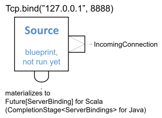

# Working with streaming IO

## Dependency

To use Akka Streams, add the module to your project:

@@dependency[sbt,Maven,Gradle] {
  group="com.typesafe.akka"
  artifact="akka-stream_$scala.binary_version$"
  version="$akka.version$"
}

## Introduction

Akka Streams provides a way of handling File IO and TCP connections with Streams.
While the general approach is very similar to the @ref:[Actor based TCP handling](../io-tcp.md) using Akka IO,
by using Akka Streams you are freed of having to manually react to back-pressure signals,
as the library does it transparently for you.

## Streaming TCP

### Accepting connections: Echo Server

In order to implement a simple EchoServer we `bind` to a given address, which returns a @scala[`Source[IncomingConnection, Future[ServerBinding]]`]@java[`Source<IncomingConnection, CompletionStage<ServerBinding>>`],
which will emit an `IncomingConnection` element for each new connection that the Server should handle:

Scala
:   @@snip [StreamTcpDocSpec.scala](/akka-docs/src/test/scala/docs/stream/io/StreamTcpDocSpec.scala) { #echo-server-simple-bind }

Java
:   @@snip [StreamTcpDocTest.java](/akka-docs/src/test/java/jdocs/stream/io/StreamTcpDocTest.java) { #echo-server-simple-bind }



Next, we handle *each* incoming connection using a `Flow` which will be used as the operator
to handle and emit `ByteString` s from and to the TCP Socket. Since one `ByteString` does not have to necessarily
correspond to exactly one line of text (the client might be sending the line in chunks) we use the @scala[`Framing.delimiter`]@java[`delimiter`]
helper Flow @java[from `akka.stream.javadsl.Framing`] to chunk the inputs up into actual lines of text. The last boolean
argument indicates that we require an explicit line ending even for the last message before the connection is closed.
In this example we add exclamation marks to each incoming text message and push it through the flow:

Scala
:   @@snip [StreamTcpDocSpec.scala](/akka-docs/src/test/scala/docs/stream/io/StreamTcpDocSpec.scala) { #echo-server-simple-handle }

Java
:   @@snip [StreamTcpDocTest.java](/akka-docs/src/test/java/jdocs/stream/io/StreamTcpDocTest.java) { #echo-server-simple-handle }


Notice that while most building blocks in Akka Streams are reusable and freely shareable, this is *not* the case for the
incoming connection Flow, since it directly corresponds to an existing, already accepted connection its handling can
only ever be materialized *once*.

Closing connections is possible by cancelling the *incoming connection* `Flow` from your server logic (e.g. by
connecting its downstream to a @scala[`Sink.cancelled`]@java[`Sink.cancelled()`] and its upstream to a @scala[`Source.empty`]@java[`Source.empty()`]).
It is also possible to shut down the server's socket by cancelling the `IncomingConnection` source `connections`.

We can then test the TCP server by sending data to the TCP Socket using `netcat`:

```
$ echo -n "Hello World" | netcat 127.0.0.1 8888
Hello World!!!
```

### Connecting: REPL Client

In this example we implement a rather naive Read Evaluate Print Loop client over TCP.
Let's say we know a server has exposed a simple command line interface over TCP,
and would like to interact with it using Akka Streams over TCP. To open an outgoing connection socket we use
the `outgoingConnection` method:

Scala
:   @@snip [StreamTcpDocSpec.scala](/akka-docs/src/test/scala/docs/stream/io/StreamTcpDocSpec.scala) { #repl-client }

Java
:   @@snip [StreamTcpDocTest.java](/akka-docs/src/test/java/jdocs/stream/io/StreamTcpDocTest.java) { #repl-client }

The `repl` flow we use to handle the server interaction first prints the servers response, then awaits on input from
the command line (this blocking call is used here for the sake of simplicity) and converts it to a
`ByteString` which is then sent over the wire to the server. Then we connect the TCP pipeline to this
operator–at this point it will be materialized and start processing data once the server responds with
an *initial message*.

A resilient REPL client would be more sophisticated than this, for example it should split out the input reading into
a separate mapAsync step and have a way to let the server write more data than one ByteString chunk at any given time,
these improvements however are left as exercise for the reader.

### Avoiding deadlocks and liveness issues in back-pressured cycles

When writing such end-to-end back-pressured systems you may sometimes end up in a situation of a loop,
in which *either side is waiting for the other one to start the conversation*. One does not need to look far
to find examples of such back-pressure loops. In the two examples shown previously, we always assumed that the side we
are connecting to would start the conversation, which effectively means both sides are back-pressured and can not get
the conversation started. There are multiple ways of dealing with this which are explained in depth in @ref:[Graph cycles, liveness and deadlocks](stream-graphs.md#graph-cycles),
however in client-server scenarios it is often the simplest to make either side send an initial message.

@@@ note

In case of back-pressured cycles (which can occur even between different systems) sometimes you have to decide
which of the sides has start the conversation in order to kick it off. This can be often done by injecting an
initial message from one of the sides–a conversation starter.

@@@

To break this back-pressure cycle we need to inject some initial message, a "conversation starter".
First, we need to decide which side of the connection should remain passive and which active.
Thankfully in most situations finding the right spot to start the conversation is rather simple, as it often is inherent
to the protocol we are trying to implement using Streams. In chat-like applications, which our examples resemble,
it makes sense to make the Server initiate the conversation by emitting a "hello" message:

Scala
:   @@snip [StreamTcpDocSpec.scala](/akka-docs/src/test/scala/docs/stream/io/StreamTcpDocSpec.scala) { #welcome-banner-chat-server }

Java
:   @@snip [StreamTcpDocTest.java](/akka-docs/src/test/java/jdocs/stream/io/StreamTcpDocTest.java) { #welcome-banner-chat-server }

To emit the initial message we merge a `Source` with a single element, after the command processing but before the
framing and transformation to `ByteString` s this way we do not have to repeat such logic.

In this example both client and server may need to close the stream based on a parsed command - `BYE` in the case
of the server, and `q` in the case of the client. This is implemented by @scala[taking from the stream until `q` and
and concatenating a `Source` with a single `BYE` element which will then be sent after the original source completed]@java[using a custom operator extending @ref[`GraphStage`](stream-customize.md)
which completes the stream once it encounters such command].

### Using framing in your protocol

Streaming transport protocols like TCP only pass streams of bytes, and does not know what is a logical chunk of bytes from the
application's point of view. Often when implementing network protocols you will want to introduce your own framing.
This can be done in two ways:
An end-of-frame marker, e.g. end line `\n`, can do framing via `Framing.delimiter`.
Or a length-field can be used to build a framing protocol.
There is a bidi implementing this protocol provided by `Framing.simpleFramingProtocol`,
see
@scala[[ScalaDoc](http://doc.akka.io/api/akka/current/akka/stream/scaladsl/Framing$.html)]
@java[[Javadoc](http://doc.akka.io/japi/akka/current/akka/stream/javadsl/Framing.html#simpleFramingProtocol-int-)]
for more information.

@scala[[JsonFraming](http://doc.akka.io/api/akka/current/akka/stream/scaladsl/JsonFraming$.html)]@java[[JsonFraming](http://doc.akka.io/japi/akka/current/akka/stream/javadsl/JsonFraming.html#objectScanner-int-)] separates valid JSON objects from incoming `ByteString` objects:

Scala
:  @@snip [JsonFramingSpec.scala](/akka-stream-tests/src/test/scala/akka/stream/scaladsl/JsonFramingSpec.scala) { #using-json-framing }

Java
:  @@snip [JsonFramingTest.java](/akka-stream-tests/src/test/java/akka/stream/javadsl/JsonFramingTest.java) { #using-json-framing }

### TLS

Similar factories as shown above for raw TCP but where the data is encrypted using TLS are available from `Tcp`
through `outgoingConnectionWithTls`, `bindWithTls` and `bindAndHandleWithTls`,
see the @scala[@scaladoc[`Tcp Scaladoc`](akka.stream.scaladsl.Tcp)]@java[@javadoc[`Tcp Javadoc`](akka.stream.javadsl.Tcp)]  for details.

Using TLS requires a keystore and a truststore and then a somewhat involved dance of configuring the SSLEngine and the details for how the session should be negotiated:

Scala
:  @@snip [TcpSpec.scala](/akka-stream-tests/src/test/scala/akka/stream/io/TcpSpec.scala) { #setting-up-ssl-engine }

Java
:  @@snip [TcpTest.java](/akka-stream-tests/src/test/java/akka/stream/javadsl/TcpTest.java) { #setting-up-ssl-engine }


The `SSLEngine` instance can then be used with the binding or outgoing connection factory methods.

## Streaming File IO

Akka Streams provide simple Sources and Sinks that can work with `ByteString` instances to perform IO operations
on files.

Streaming data from a file is as easy as creating a *FileIO.fromPath* given a target path, and an optional
`chunkSize` which determines the buffer size determined as one "element" in such stream:

Scala
:   @@snip [StreamFileDocSpec.scala](/akka-docs/src/test/scala/docs/stream/io/StreamFileDocSpec.scala) { #file-source }

Java
:   @@snip [StreamFileDocTest.java](/akka-docs/src/test/java/jdocs/stream/io/StreamFileDocTest.java) { #file-source } 

Please note that these operators are backed by Actors and by default are configured to run on a pre-configured
threadpool-backed dispatcher dedicated for File IO. This is very important as it isolates the blocking file IO operations from the rest
of the ActorSystem allowing each dispatcher to be utilised in the most efficient way. If you want to configure a custom
dispatcher for file IO operations globally, you can do so by changing the `akka.stream.materializer.blocking-io-dispatcher`,
or for a specific operator by specifying a custom Dispatcher in code, like this:

Scala
:   @@snip [StreamFileDocSpec.scala](/akka-docs/src/test/scala/docs/stream/io/StreamFileDocSpec.scala) { #custom-dispatcher-code }

Java
:   @@snip [StreamFileDocTest.java](/akka-docs/src/test/java/jdocs/stream/io/StreamFileDocTest.java) { #custom-dispatcher-code }
