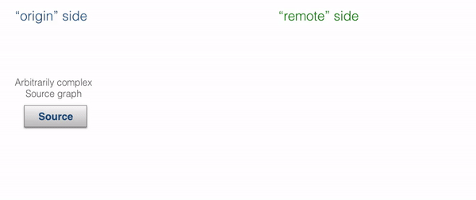

# StreamRefs - Reactive Streams over the network

## Dependency

To use Akka Streams, add the module to your project:

@@dependency[sbt,Maven,Gradle] {
  group="com.typesafe.akka"
  artifact="akka-stream_$scala.binary_version$"
  version="$akka.version$"
}

## Introduction

@@@ warning
  This module is currently marked as @ref:[may change](../common/may-change.md) in the sense
  of being the subject of final development. This means that the API or semantics can
  change without warning or deprecation period, and it is not recommended to use
  this module in production just yet.
@@@

Stream references, or "stream refs" for short, allow running Akka Streams across multiple nodes within 
an Akka Cluster. 

Unlike heavier "streaming data processing" frameworks, Akka Streams are neither "deployed" nor automatically distributed.
Akka stream refs are, as the name implies, references to existing parts of a stream, and can be used to create a 
distributed processing framework or to introduce such capabilities in specific parts of your application.
  
Stream refs are trivial to use in existing clustered Akka applications and require no additional configuration
or setup. They automatically maintain flow-control / back-pressure over the network and employ Akka's failure detection
mechanisms to fail-fast ("let it crash!") in the case of failures of remote nodes. They can be seen as an implementation 
of the [Work Pulling Pattern](http://www.michaelpollmeier.com/akka-work-pulling-pattern), which one would otherwise 
implement manually.

@@@ note
  A useful way to think about stream refs is: 
  "like an `ActorRef`, but for Akka Streams's `Source` and `Sink`".
  
  Stream refs refer to an already existing, possibly remote, `Sink` or `Source`.
  This is not to be mistaken with deploying streams remotely, which this feature is not intended for.
@@@

@@@ warning { title=IMPORTANT }
  Use stream refs with Akka Cluster. The failure detector can cause quarantining if plain Akka remoting is used.
@@@

## Stream References

The prime use case for stream refs is to replace raw actor or HTTP messaging in systems that expect long-running streams
of data between two entities. Often they can be used to effectively achieve point-to-point streaming without the need to
set up additional message brokers or similar secondary clusters.

Stream refs are well-suited for any system in which you need to send messages between nodes in a flow-controlled fashion.
Typical examples include sending work requests to worker nodes as fast as possible, but not faster than the worker nodes
can process them, or sending data elements that the downstream may be slow at processing.
It is recommended to mix and introduce stream refs in actor-messaging-based systems, where the actor messaging is used to
orchestrate and prepare such message flows, and later the stream refs are used to do the flow-controlled message transfer.  

Stream refs are not persistent. However, it is simple to build a resumable stream by introducing such a protocol
in the actor messaging layer. Stream refs are absolutely expected to be sent over Akka remoting to other nodes
within a cluster using Akka Cluster, and therefore complement, instead of compete, with plain Actor messaging.
Actors would usually be used to establish the stream via some initial message saying, "I want to offer you many log
elements (the stream ref)," or conversely, "if you need to send me much data, here is the stream ref you can use to do so".

Since the two sides ("local" and "remote") of each reference may be confusing to refer to as
"remote" and "local" -- since either side can be seen as "local" or "remote" depending how we look at it --
we propose using the terminology "origin" and "target", which is defined by where the stream ref was created.
For `SourceRef`s, the "origin" is the side which has the data that it is going to stream out. For `SinkRef`s,
the "origin" side is the actor system that is ready to receive the data and has allocated the ref. Those
two may be seen as duals of each other. However, to explain patterns about sharing references, we found this
wording to be rather useful.

### Source Refs - offering streaming data to a remote system

A @scala[@scaladoc[`SourceRef`](akka.stream.SourceRef)]@java[@javadoc[`SourceRef`](akka.stream.SourceRef)]
can be offered to a remote actor system in order for it to consume some source of data that we have prepared
locally. 

In order to share a `Source` with a remote endpoint you need to materialize it by running it into the `Sink.sourceRef`.
That `Sink` materializes the `SourceRef` that you can then send to other nodes. Please note that it materializes into a
`Future` so you will have to use `pipeTo`.

Scala
:   @@snip [FlowStreamRefsDocSpec.scala](/akka-docs/src/test/scala/docs/stream/FlowStreamRefsDocSpec.scala) { #offer-source }

Java
:   @@snip [FlowStreamRefsDocTest.java](/akka-docs/src/test/java/jdocs/stream/FlowStreamRefsDocTest.java) { #offer-source }

The origin actor which creates and owns the `Source` could also perform some validation or additional setup
when preparing the `Source`. Once it has handed out the `SourceRef`, the remote side can run it like this:

Scala
:   @@snip [FlowStreamRefsDocSpec.scala](/akka-docs/src/test/scala/docs/stream/FlowStreamRefsDocSpec.scala) { #offer-source-use }

Java
:   @@snip [FlowStreamRefsDocTest.java](/akka-docs/src/test/java/jdocs/stream/FlowStreamRefsDocTest.java) { #offer-source-use }

The process of preparing and running a `SourceRef`-powered distributed stream is shown by the animation below:

@@@ warning
  A `SourceRef` is *by design* "single-shot"; i.e., it may only be materialized once.
  This is in order to not complicate the mental model of what materialization means.
  
  Multicast can be mimicked by starting a `BroadcastHub` operator once, then attaching multiple new streams to it, each
  emitting a new stream ref. This way, materialization of the `BroadcastHub`s Source creates a unique single-shot
  stream ref, however they can all be powered using a single `Source` -- located before the `BroadcastHub` operator.
@@@

### Sink Refs - offering to receive streaming data from a remote system

The dual of @scala[@scaladoc[`SourceRef`](akka.stream.SinkRef)]@java[@javadoc[`SourceRef`](akka.stream.SinkRef)]s.

They can be used to offer the other side the capability to 
send to the *origin* side data in a streaming, flow-controlled fashion. The origin here allocates a `Sink`,
which could be as simple as a `Sink.foreach` or as advanced as a complex `Sink` which streams the incoming data
into various other systems (e.g., any of the Alpakka-provided `Sink`s).

@@@ note
  To form a good mental model of `SinkRef`s, you can think of them as being similar to "passive mode" in FTP.
@@@

Scala
:   @@snip [FlowStreamRefsDocSpec.scala](/akka-docs/src/test/scala/docs/stream/FlowStreamRefsDocSpec.scala) { #offer-sink }

Java
:   @@snip [FlowStreamRefsDocTest.java](/akka-docs/src/test/java/jdocs/stream/FlowStreamRefsDocTest.java) { #offer-sink }

Using the offered `SinkRef` to send data to the origin of the `Sink` is also simple, as we can treat the
`SinkRef` as any other `Sink` and directly `runWith` or `run` with it.

Scala
:   @@snip [FlowStreamRefsDocSpec.scala](/akka-docs/src/test/scala/docs/stream/FlowStreamRefsDocSpec.scala) { #offer-sink-use }

Java
:   @@snip [FlowStreamRefsDocTest.java](/akka-docs/src/test/java/jdocs/stream/FlowStreamRefsDocTest.java) { #offer-sink-use }

The process of preparing and running a `SinkRef`-powered distributed stream is shown by the animation below:

@@@ warning
  A `SinkRef` is *by design* "single-shot"; i.e., it may only be materialized once.
  This is in order to not complicate the mental model of what materialization means.
  
  If you have a use case for building a fan-in operation that accepts writes from multiple remote nodes,
  you can build your `Sink` and prepend it with a `MergeHub` operator, each time materializing a new `SinkRef`
  targeting that `MergeHub`. This has the added benefit of giving you full control of how to merge these streams
  (i.e., by using "merge preferred" or any other variation of the fan-in operators).
@@@

### Delivery guarantees

Stream refs utilise normal actor messaging for their trainsport, and therefore provide the same level of basic delivery guarantees. Stream refs do extend the semantics somewhat, through demand re-delivery and sequence fault detection. In other words:

- messages are sent over actor remoting
    - which relies on TCP (classic remoting or Artery TCP) or Aeron UDP for basic redelivery mechanisms
- messages are guaranteed to to be in-order
- messages can be lost, however:
    - a *dropped demand signal* will be re-delivered automatically (similar to system messages)
    - a *dropped element signal* will cause the stream to *fail*
  
## Bulk Stream References

@@@ warning
  Bulk stream references are not implemented yet.
  See ticket [Bulk Transfer Stream Refs #24276](https://github.com/akka/akka/issues/24276) to track progress or signal demand for this feature.  
@@@

Bulk stream refs can be used to create simple side-channels to transfer humongous amounts
of data such as huge log files, messages or even media, with as much ease as if it was a trivial local stream.

## Configuration

### Stream reference subscription timeouts

All stream references have a subscription timeout, which is intended to prevent resource leaks
in case a remote node requests the allocation of many streams but never actually runs
them. In order to prevent this, each stream reference has a default timeout (of 30 seconds), after which the
origin will abort the stream offer if the target has not materialized the stream ref. After the
timeout has triggered, materialization of the target side will fail, pointing out that the origin is missing.

Since these timeouts are often very different based on the kind of stream offered, and there can be 
many different kinds of them in the same application, it is possible to not only configure this setting
globally (`akka.stream.materializer.stream-ref.subscription-timeout`), but also via attributes:

Scala
:   @@snip [FlowStreamRefsDocSpec.scala](/akka-docs/src/test/scala/docs/stream/FlowStreamRefsDocSpec.scala) { #attr-sub-timeout }

Java
:   @@snip [FlowStreamRefsDocTest.java](/akka-docs/src/test/java/jdocs/stream/FlowStreamRefsDocTest.java) { #attr-sub-timeout }

## General configuration

Other settings can be set globally in your `application.conf`, by overriding any of the following values
in the `akka.stream.materializer.stream-ref.*` keyspace:

@@snip [reference.conf](/akka-stream/src/main/resources/reference.conf) { #stream-ref }
