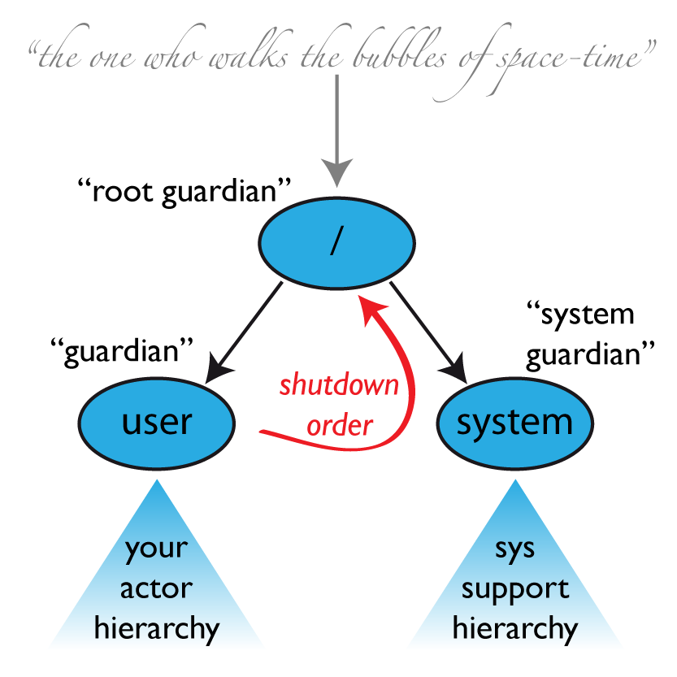

# Classic Supervision

This chapter outlines the concept behind the supervision in Akka Classic, for the
corresponding overview of the new APIs see @ref:[supervision](general/supervision.md)

## What Supervision Means

Supervision describes a dependency relationship between actors: the supervisor delegates tasks to subordinates and
therefore must respond to their failures.  When a subordinate detects a failure
(i.e. throws an exception), it suspends itself and all its subordinates and
sends a message to its supervisor, signaling failure.  Depending on the nature
of the work to be supervised and the nature of the failure, the supervisor has
a choice of the following four options:

 1. Resume the subordinate, keeping its accumulated internal state
 2. Restart the subordinate, clearing out its accumulated internal state
 3. Stop the subordinate permanently
 4. Escalate the failure, thereby failing itself

It is important to always view an actor as part of a supervision hierarchy,
which explains the existence of the fourth choice (as a supervisor also is
subordinate to another supervisor higher up) and has implications on the first
three: resuming an actor resumes all its subordinates, restarting an actor
entails restarting all its subordinates (but see below for more details),
similarly terminating an actor will also terminate all its subordinates. It
should be noted that the default behavior of the `preRestart` hook of the
`Actor` class is to terminate all its children before restarting, but
this hook can be overridden; the recursive restart applies to all children left
after this hook has been executed.

Each supervisor is configured with a function translating all possible failure
causes (i.e. exceptions) into one of the four choices given above; notably,
this function does not take the failed actor’s identity as an input. It is
quite easy to come up with examples of structures where this might not seem
flexible enough, e.g. wishing for different strategies to be applied to
different subordinates. At this point, it is vital to understand that
supervision is about forming a recursive fault handling structure. If you try
to do too much at one level, it will become hard to reason about, hence the
recommended way, in this case, is to add a level of supervision.

Akka implements a specific form called “parental supervision”. Actors can only
be created by other actors—where the top-level actor is provided by the
library—and each created actor is supervised by its parent. This restriction
makes the formation of actor supervision hierarchies implicit and encourages
sound design decisions. It should be noted that this also guarantees that
actors cannot be orphaned or attached to supervisors from the outside, which
might otherwise catch them unawares. Besides, this yields a natural and
clean shutdown procedure for (sub-trees of) actor applications.

@@@ warning

Supervision-related communication happens by special system
messages that have their mailboxes separate from user messages. This
implies that supervision related events are not deterministically
ordered relative to ordinary messages. In general, the user cannot influence
the order of normal messages and failure notifications. For details and
example see the @ref:[Discussion: Message Ordering](general/message-delivery-reliability.md#message-ordering) section.

@@@

## The Top-Level Supervisors

An actor system will during its creation start at least three actors, shown in
the image above. For more information about the consequences for actor paths
see @ref:[Top-Level Scopes for Actor Paths](general/addressing.md#toplevel-paths).

### `/user`: The Guardian Actor

The actor which is probably most interacted with is the parent of all
user-created actors, the guardian named `"/user"`. Actors created using
`system.actorOf()` are children of this actor. This means that when this
guardian terminates, all normal actors in the system will be shutdown, too. It
also means that this guardian’s supervisor strategy determines how the
top-level normal actors are supervised. Since Akka 2.1 it is possible to
configure this using the setting `akka.actor.guardian-supervisor-strategy`,
which takes the fully-qualified class-name of a
`SupervisorStrategyConfigurator`. When the guardian escalates a failure,
the root guardian’s response will be to terminate the guardian, which in effect
will shut down the whole actor system.

### `/system`: The System Guardian

This special guardian has been introduced to achieve an orderly
shut-down sequence where logging remains active while all normal actors
terminate, even though logging itself is implemented using actors. This is
realized by having the system guardian watch the user guardian and initiate its shut-down upon reception of the `Terminated` message. The top-level
system actors are supervised using a strategy which will restart indefinitely
upon all types of `Exception` except for
`ActorInitializationException` and `ActorKilledException`, which
will terminate the child in question.  All other throwables are escalated,
which will shut down the whole actor system.

### `/`: The Root Guardian

The root guardian is the grand-parent of all so-called “top-level” actors and
supervises all the special actors mentioned in @ref:[Top-Level Scopes for Actor Paths](general/addressing.md#toplevel-paths) using the
`SupervisorStrategy.stoppingStrategy`, whose purpose is to terminate the
child upon any type of `Exception`. All other throwables will be
escalated … but to whom? Since every real actor has a supervisor, the
supervisor of the root guardian cannot be a real actor. And because this means
that it is “outside of the bubble”, it is called the “bubble-walker”. This is a
synthetic `ActorRef` which in effect stops its child upon the first sign
of trouble and sets the actor system’s `isTerminated` status to `true` as
soon as the root guardian is fully terminated (all children recursively
stopped).

## One-For-One Strategy vs. All-For-One Strategy

There are two classes of supervision strategies which come with Akka:
`OneForOneStrategy` and `AllForOneStrategy`. Both are configured
with a mapping from exception type to supervision directive (see
[above](#supervision-directives)) and limits on how often a child is allowed to fail
before terminating it. The difference between them is that the former applies
the obtained directive only to the failed child, whereas the latter applies it
to all siblings as well. Normally, you should use the
`OneForOneStrategy`, which also is the default if none is specified
explicitly.

The `AllForOneStrategy` is applicable in cases where the ensemble of
children has such tight dependencies among them, that a failure of one child
affects the function of the others, i.e. they are inextricably linked. Since a
restart does not clear out the mailbox, it often is best to terminate the children
upon failure and re-create them explicitly from the supervisor (by watching the
children’s lifecycle); otherwise, you have to make sure that it is no problem
for any of the actors to receive a message which was queued before the restart
but processed afterwards.

Normally stopping a child (i.e. not in response to a failure) will not
automatically terminate the other children in an all-for-one strategy; this can
be done by watching their lifecycle: if the `Terminated` message
is not handled by the supervisor, it will throw a `DeathPactException`
which (depending on its supervisor) will restart it, and the default
`preRestart` action will terminate all children. Of course, this can be
handled explicitly as well.

Please note that creating one-off actors from an all-for-one supervisor entails
that failures escalated by the temporary actor will affect all the permanent
ones. If this is not desired, install an intermediate supervisor; this can very
be done by declaring a router of size 1 for the worker, see
@ref:[Routing](routing.md).
