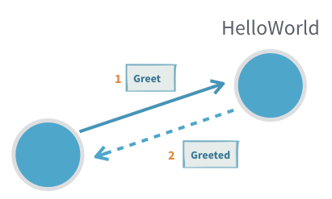
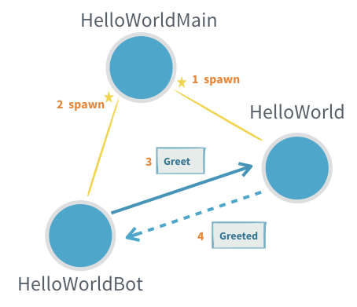
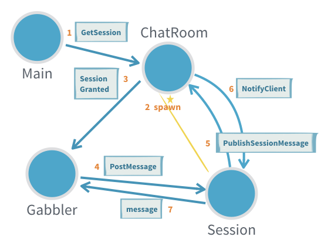

# Introduction to Actors

@@@ note
For the Akka Classic documentation of this feature see @ref:[Classic Actors](../actors.md).
@@@

@@@ note
Both the Java and Scala DSLs of Akka modules bundled in the same JAR. For a smooth development experience,
when using an IDE such as Eclipse or IntelliJ, you can disable the auto-importer from suggesting `javadsl`
imports when working in Scala, or viceversa. See @ref:[IDE Tips](../additional/ide.md). 
@@@

@@project-info{ projectId="akka-actor-typed" }

## Dependency

To use Akka Actors, add the following dependency in your project:

@@dependency[sbt,Maven,Gradle] {
  group=com.typesafe.akka
  artifact=akka-actor-typed_$scala.binary_version$
  version=$akka.version$
}

## Akka Actors

The [Actor Model](http://en.wikipedia.org/wiki/Actor_model) provides a higher level of abstraction for writing concurrent
and distributed systems. It alleviates the developer from having to deal with
explicit locking and thread management, making it easier to write correct
concurrent and parallel systems. Actors were defined in the 1973 paper by Carl
Hewitt but have been popularized by the Erlang language, and used for example at
Ericsson with great success to build highly concurrent and reliable telecom
systems. The API of Akka’s Actors has borrowed some of its syntax from Erlang.
 
## First example

If you are new to Akka you might want to start with reading the @ref:[Getting Started Guide](guide/introduction.md)
and then come back here to learn more. 

It is helpful to become familiar with the foundational, external and internal
ecosystem of your Actors, to see what you can leverage and customize as needed, see
@ref:[Actor Systems](../general/actor-systems.md) and @ref:[Actor References, Paths and Addresses](../general/addressing.md).

As discussed in @ref:[Actor Systems](../general/actor-systems.md) Actors are about
sending messages between independent units of computation, but what does that
look like?

In all of the following these imports are assumed:

Scala
:  @@snip [IntroSpec.scala](/akka-actor-typed-tests/src/test/scala/docs/akka/typed/IntroSpec.scala) { #imports }

Java
:  @@snip [IntroSpec.java](/akka-actor-typed-tests/src/test/java/jdocs/akka/typed/IntroTest.java) { #imports }

With these in place we can define our first Actor, and it will say
hello!



Scala
:  @@snip [IntroSpec.scala](/akka-actor-typed-tests/src/test/scala/docs/akka/typed/IntroSpec.scala) { #hello-world-actor }

Java
:  @@snip [IntroSpec.java](/akka-actor-typed-tests/src/test/java/jdocs/akka/typed/IntroTest.java) { #hello-world-actor }

This small piece of code defines two message types, one for commanding the
Actor to greet someone and one that the Actor will use to confirm that it has
done so. The `Greet` type contains not only the information of whom to
greet, it also holds an `ActorRef` that the sender of the message
supplies so that the `HelloWorld` Actor can send back the confirmation
message.

The behavior of the Actor is defined as the `Greeter` with the help
of the `receive` behavior factory. Processing the next message then results
in a new behavior that can potentially be different from this one. State is
updated by returning a new behavior that holds the new immutable state. In this
case we don't need to update any state, so we return @scala[`same`]@java[`this`], which means
the next behavior is "the same as the current one".

The type of the messages handled by this behavior is declared to be of class
`Greet`@java[.]@scala[, meaning that `message` argument is also typed as such.
This is why we can access the `whom` and `replyTo` members without needing to use a pattern match.]
Typically, an actor handles more than one specific message type and then there
is one common @scala[`trait`]@java[`interface`] that all messages that the
actor can handle @scala[`extends`]@java[`implements`].

On the last line we see the `HelloWorld` Actor send a message to another
Actor, which is done using the @scala[`!` operator (pronounced “bang” or “tell”)]@java[`tell` method].
It is an asynchronous operation that doesn't block the caller's thread.

Since the `replyTo` address is declared to be of type @scala[`ActorRef[Greeted]`]@java[`ActorRef<Greeted>`], the
compiler will only permit us to send messages of this type, other usage will
be a compiler error.

The accepted message types of an Actor together with all reply types defines
the protocol spoken by this Actor; in this case it is a simple request–reply
protocol but Actors can model arbitrarily complex protocols when needed. The
protocol is bundled together with the behavior that implements it in a nicely
wrapped scope—the `HelloWorld` @scala[object]@java[class].

As Carl Hewitt said, one Actor is no Actor — it would be quite lonely with
nobody to talk to. We need another Actor that interacts with the `Greeter`.
Let's make a `HelloWorldBot` that receives the reply from the `Greeter` and sends a number
of additional greeting messages and collect the replies until a given max number
of messages have been reached.



Scala
:  @@snip [IntroSpec.scala](/akka-actor-typed-tests/src/test/scala/docs/akka/typed/IntroSpec.scala) { #hello-world-bot }

Java
:  @@snip [IntroSpec.scala](/akka-actor-typed-tests/src/test/java/jdocs/akka/typed/IntroTest.java) { #hello-world-bot }

@scala[Note how this Actor manages the counter by changing the behavior for each `Greeted` reply
rather than using any variables.]@java[Note how this Actor manages the counter with an instance variable.]
No concurrency guards such as `synchronized` or `AtomicInteger` are needed since an actor instance processes one
message at a time.

A third actor spawns the `Greeter` and the `HelloWorldBot` and starts the interaction between those.

Scala
:  @@snip [IntroSpec.scala](/akka-actor-typed-tests/src/test/scala/docs/akka/typed/IntroSpec.scala) { #hello-world-main }

Java
:  @@snip [IntroSpec.scala](/akka-actor-typed-tests/src/test/java/jdocs/akka/typed/IntroTest.java) { #hello-world-main }

Now we want to try out this Actor, so we must start an ActorSystem to host it:

Scala
:  @@snip [IntroSpec.scala](/akka-actor-typed-tests/src/test/scala/docs/akka/typed/IntroSpec.scala) { #hello-world }

Java
:  @@snip [IntroSpec.scala](/akka-actor-typed-tests/src/test/java/jdocs/akka/typed/IntroTest.java) { #hello-world }

We start an Actor system from the defined `HelloWorldMain` behavior and send two `Start` messages that
will kick-off the interaction between two separate `HelloWorldBot` actors and the single `Greeter` actor.

An application normally consists of a single `ActorSystem`, running many actors, per JVM. 

The console output may look like this:

```
[INFO] [03/13/2018 15:50:05.814] [hello-akka.actor.default-dispatcher-4] [akka://hello/user/greeter] Hello World!
[INFO] [03/13/2018 15:50:05.815] [hello-akka.actor.default-dispatcher-4] [akka://hello/user/greeter] Hello Akka!
[INFO] [03/13/2018 15:50:05.815] [hello-akka.actor.default-dispatcher-2] [akka://hello/user/World] Greeting 1 for World
[INFO] [03/13/2018 15:50:05.815] [hello-akka.actor.default-dispatcher-4] [akka://hello/user/Akka] Greeting 1 for Akka
[INFO] [03/13/2018 15:50:05.815] [hello-akka.actor.default-dispatcher-5] [akka://hello/user/greeter] Hello World!
[INFO] [03/13/2018 15:50:05.815] [hello-akka.actor.default-dispatcher-5] [akka://hello/user/greeter] Hello Akka!
[INFO] [03/13/2018 15:50:05.815] [hello-akka.actor.default-dispatcher-4] [akka://hello/user/World] Greeting 2 for World
[INFO] [03/13/2018 15:50:05.815] [hello-akka.actor.default-dispatcher-5] [akka://hello/user/greeter] Hello World!
[INFO] [03/13/2018 15:50:05.815] [hello-akka.actor.default-dispatcher-4] [akka://hello/user/Akka] Greeting 2 for Akka
[INFO] [03/13/2018 15:50:05.816] [hello-akka.actor.default-dispatcher-5] [akka://hello/user/greeter] Hello Akka!
[INFO] [03/13/2018 15:50:05.816] [hello-akka.actor.default-dispatcher-4] [akka://hello/user/World] Greeting 3 for World
[INFO] [03/13/2018 15:50:05.816] [hello-akka.actor.default-dispatcher-6] [akka://hello/user/Akka] Greeting 3 for Akka
```

@@@ div { .group-scala }

#### Here is another example that you can edit and run in the browser:

@@fiddle [IntroSpec.scala](/akka-actor-typed-tests/src/test/scala/docs/akka/typed/IntroSpec.scala) { #fiddle_code template=Akka layout=v75 minheight=400px }

@@@


## A More Complex Example

The next example is more realistic and demonstrates some important patterns:

* Using @scala[a sealed trait and case class/objects]@java[an interface and classes implementing that interface] to represent multiple messages an actor can receive
* Handle sessions by using child actors
* Handling state by changing behavior
* Using multiple actors to represent different parts of a protocol in a type safe way



### Functional Style

First we will show this example in a functional style, and then the same example is shown with an
@ref:[Object-oriented style](#object-oriented-style). Which style you choose to use is a matter of
taste and both styles can be mixed depending on which is best for a specific actor. Considerations
for the choice is provided in the @ref:[Style Guide](style-guide.md#functional-versus-object-oriented-style).

Consider an Actor that runs a chat room: client Actors may connect by sending
a message that contains their screen name and then they can post messages. The
chat room Actor will disseminate all posted messages to all currently connected
client Actors. The protocol definition could look like the following:

Scala
:  @@snip [IntroSpec.scala](/akka-actor-typed-tests/src/test/scala/docs/akka/typed/IntroSpec.scala) { #chatroom-protocol }

Java
:  @@snip [IntroSpec.scala](/akka-actor-typed-tests/src/test/java/jdocs/akka/typed/IntroTest.java) { #chatroom-protocol }

Initially the client Actors only get access to an @scala[`ActorRef[GetSession]`]@java[`ActorRef<GetSession>`]
which allows them to make the first step. Once a client’s session has been
established it gets a `SessionGranted` message that contains a `handle` to
unlock the next protocol step, posting messages. The `PostMessage`
command will need to be sent to this particular address that represents the
session that has been added to the chat room. The other aspect of a session is
that the client has revealed its own address, via the `replyTo` argument, so that subsequent
`MessagePosted` events can be sent to it.

This illustrates how Actors can express more than just the equivalent of method
calls on Java objects. The declared message types and their contents describe a
full protocol that can involve multiple Actors and that can evolve over
multiple steps. Here's the implementation of the chat room protocol:

Scala
:  @@snip [IntroSpec.scala](/akka-actor-typed-tests/src/test/scala/docs/akka/typed/IntroSpec.scala) { #chatroom-behavior }

Java
:  @@snip [IntroSpec.scala](/akka-actor-typed-tests/src/test/java/jdocs/akka/typed/IntroTest.java) { #chatroom-behavior }


The state is managed by changing behavior rather than using any variables.

When a new `GetSession` command comes in we add that client to the
list that is in the returned behavior. Then we also need to create the session’s
`ActorRef` that will be used to post messages. In this case we want to
create a very simple Actor that repackages the `PostMessage`
command into a `PublishSessionMessage` command which also includes the
screen name.

The behavior that we declare here can handle both subtypes of `RoomCommand`.
`GetSession` has been explained already and the
`PublishSessionMessage` commands coming from the session Actors will
trigger the dissemination of the contained chat room message to all connected
clients. But we do not want to give the ability to send
`PublishSessionMessage` commands to arbitrary clients, we reserve that
right to the internal session actors we create—otherwise clients could pose as completely
different screen names (imagine the `GetSession` protocol to include
authentication information to further secure this). Therefore `PublishSessionMessage`
has `private` visibility and can't be created outside the `ChatRoom` @scala[object]@java[class].

If we did not care about securing the correspondence between a session and a
screen name then we could change the protocol such that `PostMessage` is
removed and all clients just get an @scala[`ActorRef[PublishSessionMessage]`]@java[`ActorRef<PublishSessionMessage>`] to
send to. In this case no session actor would be needed and we could use
@scala[`context.self`]@java[`context.getSelf()`]. The type-checks work out in that case because
@scala[`ActorRef[-T]`]@java[`ActorRef<T>`] is contravariant in its type parameter, meaning that we
can use a @scala[`ActorRef[RoomCommand]`]@java[`ActorRef<RoomCommand>`] wherever an
@scala[`ActorRef[PublishSessionMessage]`]@java[`ActorRef<PublishSessionMessage>`] is needed—this makes sense because the
former simply speaks more languages than the latter. The opposite would be
problematic, so passing an @scala[`ActorRef[PublishSessionMessage]`]@java[`ActorRef<PublishSessionMessage>`] where
@scala[`ActorRef[RoomCommand]`]@java[`ActorRef<RoomCommand>`] is required will lead to a type error.

#### Trying it out

In order to see this chat room in action we need to write a client Actor that can use it:

Scala
:  @@snip [IntroSpec.scala](/akka-actor-typed-tests/src/test/scala/docs/akka/typed/IntroSpec.scala) { #chatroom-gabbler }

Java
:  @@snip [IntroSpec.scala](/akka-actor-typed-tests/src/test/java/jdocs/akka/typed/IntroTest.java) { #chatroom-gabbler }

From this behavior we can create an Actor that will accept a chat room session,
post a message, wait to see it published, and then terminate. The last step
requires the ability to change behavior, we need to transition from the normal
running behavior into the terminated state. This is why here we do not return
`same`, as above, but another special value `stopped`.

@@@ div {.group-scala}

Since `SessionEvent` is a sealed trait the Scala compiler will warn us
if we forget to handle one of the subtypes; in this case it reminded us that
alternatively to `SessionGranted` we may also receive a
`SessionDenied` event.

@@@

Now to try things out we must start both a chat room and a gabbler and of
course we do this inside an Actor system. Since there can be only one user guardian
we could either start the chat room from the gabbler (which we don’t
want—it complicates its logic) or the gabbler from the chat room (which is
nonsensical) or we start both of them from a third Actor—our only sensible
choice:

Scala
:  @@snip [IntroSpec.scala](/akka-actor-typed-tests/src/test/scala/docs/akka/typed/IntroSpec.scala) { #chatroom-main }

Java
:  @@snip [IntroSpec.scala](/akka-actor-typed-tests/src/test/java/jdocs/akka/typed/IntroTest.java) { #chatroom-main }

In good tradition we call the `Main` Actor what it is, it directly
corresponds to the `main` method in a traditional Java application. This
Actor will perform its job on its own accord, we do not need to send messages
from the outside, so we declare it to be of type @scala[`NotUsed`]@java[`Void`]. Actors receive not
only external messages, they also are notified of certain system events,
so-called Signals. In order to get access to those we choose to implement this
particular one using the `receive` behavior decorator. The
provided `onSignal` function will be invoked for signals (subclasses of `Signal`)
or the `onMessage` function for user messages.

This particular `Main` Actor is created using `Behaviors.setup`, which is like a factory for a behavior.
Creation of the behavior instance is deferred until the actor is started, as opposed to `Behaviors.receive`
that creates the behavior instance immediately before the actor is running. The factory function in
`setup` is passed the `ActorContext` as parameter and that can for example be used for spawning child actors.
This `Main` Actor creates the chat room and the gabbler and the session between them is initiated, and when the
gabbler is finished we will receive the `Terminated` event due to having
called `context.watch` for it. This allows us to shut down the Actor system: when
the `Main` Actor terminates there is nothing more to do.

Therefore after creating the Actor system with the `Main` Actor’s
`Behavior` we can let the `main` method return, the `ActorSystem` will continue running and 
the JVM alive until the root actor stops.


### Object-oriented style

The above sample used the functional programming style where you pass a function to a factory which
then constructs a behavior, for stateful actors this means passing immutable state around as
parameters and switching to a new behavior whenever you need to act on a changed state.
An alternative way to express the same is a more object oriented style where a concrete class
for the actor behavior is defined and mutable state is kept inside of it as fields.

Which style you choose to use is a matter of taste and both styles can be mixed depending on which
is best for a specific actor. Considerations for the choice is provided in the
@ref:[Style Guide](style-guide.md#functional-versus-object-oriented-style).

#### AbstractBehavior API

Defining a class based actor behavior starts with extending 
@scala[`akka.actor.typed.scaladsl.AbstractBehavior[T]`]
@java[`akka.actor.typed.javadsl.AbstractBehavior<T>`] where `T` is the type of messages
the behavior will accept.

Let's repeat the chat room sample from @ref:[A more complex example above](#a-more-complex-example) but implemented
using `AbstractBehavior`. The protocol for interacting with the actor looks the same:

Scala
:  @@snip [OOIntroSpec.scala](/akka-actor-typed-tests/src/test/scala/docs/akka/typed/OOIntroSpec.scala) {  #chatroom-protocol }

Java
:  @@snip [OOIntroTest.java](/akka-actor-typed-tests/src/test/java/jdocs/akka/typed/OOIntroTest.java) {  #chatroom-protocol }

Initially the client Actors only get access to an @scala[`ActorRef[GetSession]`]@java[`ActorRef<GetSession>`]
which allows them to make the first step. Once a client’s session has been
established it gets a `SessionGranted` message that contains a `handle` to
unlock the next protocol step, posting messages. The `PostMessage`
command will need to be sent to this particular address that represents the
session that has been added to the chat room. The other aspect of a session is
that the client has revealed its own address, via the `replyTo` argument, so that subsequent
`MessagePosted` events can be sent to it.

This illustrates how Actors can express more than just the equivalent of method
calls on Java objects. The declared message types and their contents describe a
full protocol that can involve multiple Actors and that can evolve over
multiple steps. Here's the `AbstractBehavior` implementation of the chat room protocol:

Scala
:  @@snip [OOIntroSpec.scala](/akka-actor-typed-tests/src/test/scala/docs/akka/typed/OOIntroSpec.scala) {  #chatroom-behavior }

Java
:  @@snip [OOIntroTest.java](/akka-actor-typed-tests/src/test/java/jdocs/akka/typed/OOIntroTest.java) {  #chatroom-behavior }

The state is managed through fields in the class, just like with a regular object oriented class.
As the state is mutable, we never return a different behavior from the message logic, but can return
the `AbstractBehavior` instance itself (`this`) as a behavior to use for processing the next message coming in.
We could also return `Behavior.same` to achieve the same.

@java[In this sample we make separate statements for creating the behavior builder, but it also returns the builder
itself from each step so a more fluent behavior definition style is also possible. What you should prefer depends on
how big the set of messages the actor accepts is.]

It is also possible to return a new different `AbstractBehavior`, for example to represent a different state in a
finite state machine (FSM), or use one of the functional behavior factories to combine the object oriented 
with the functional style for different parts of the lifecycle of the same Actor behavior.

When a new `GetSession` command comes in we add that client to the
list of current sessions. Then we also need to create the session’s
`ActorRef` that will be used to post messages. In this case we want to
create a very simple Actor that repackages the `PostMessage`
command into a `PublishSessionMessage` command which also includes the
screen name.

To implement the logic where we spawn a child for the session we need access 
to the `ActorContext`. This is injected as a constructor parameter upon creation 
of the behavior, note how we combine the `AbstractBehavior` with  `Behaviors.setup`
to do this in the @scala[`apply`]@java[`create`] factory method.

The behavior that we declare here can handle both subtypes of `RoomCommand`.
`GetSession` has been explained already and the
`PublishSessionMessage` commands coming from the session Actors will
trigger the dissemination of the contained chat room message to all connected
clients. But we do not want to give the ability to send
`PublishSessionMessage` commands to arbitrary clients, we reserve that
right to the internal session actors we create—otherwise clients could pose as completely
different screen names (imagine the `GetSession` protocol to include
authentication information to further secure this). Therefore `PublishSessionMessage`
has `private` visibility and can't be created outside the `ChatRoom` @scala[object]@java[class].

If we did not care about securing the correspondence between a session and a
screen name then we could change the protocol such that `PostMessage` is
removed and all clients just get an @scala[`ActorRef[PublishSessionMessage]`]@java[`ActorRef<PublishSessionMessage>`] to
send to. In this case no session actor would be needed and we could use
@scala[`context.self`]@java[`context.getSelf()`]. The type-checks work out in that case because
@scala[`ActorRef[-T]`]@java[`ActorRef<T>`] is contravariant in its type parameter, meaning that we
can use a @scala[`ActorRef[RoomCommand]`]@java[`ActorRef<RoomCommand>`] wherever an
@scala[`ActorRef[PublishSessionMessage]`]@java[`ActorRef<PublishSessionMessage>`] is needed—this makes sense because the
former simply speaks more languages than the latter. The opposite would be
problematic, so passing an @scala[`ActorRef[PublishSessionMessage]`]@java[`ActorRef<PublishSessionMessage>`] where
@scala[`ActorRef[RoomCommand]`]@java[`ActorRef<RoomCommand>`] is required will lead to a type error.

#### Try it out

In order to see this chat room in action we need to write a client Actor that can use it
@scala[, for this stateless actor it doesn't make much sense to use the `AbstractBehavior` so let's just reuse the functional style gabbler from the sample above]:

Scala
:  @@snip [OOIntroSpec.scala](/akka-actor-typed-tests/src/test/scala/docs/akka/typed/OOIntroSpec.scala) {  #chatroom-gabbler }

Java
:  @@snip [OOIntroTest.java](/akka-actor-typed-tests/src/test/java/jdocs/akka/typed/OOIntroTest.java) {  #chatroom-gabbler }

Now to try things out we must start both a chat room and a gabbler and of
course we do this inside an Actor system. Since there can be only one user guardian
we could either start the chat room from the gabbler (which we don’t
want—it complicates its logic) or the gabbler from the chat room (which is
nonsensical) or we start both of them from a third Actor—our only sensible
choice:


Scala
:  @@snip [OOIntroSpec.scala](/akka-actor-typed-tests/src/test/scala/docs/akka/typed/OOIntroSpec.scala) {  #chatroom-main }

Java
:  @@snip [OOIntroTest.java](/akka-actor-typed-tests/src/test/java/jdocs/akka/typed/OOIntroTest.java) {  #chatroom-main }

In good tradition we call the `Main` Actor what it is, it directly
corresponds to the `main` method in a traditional Java application. This
Actor will perform its job on its own accord, we do not need to send messages
from the outside, so we declare it to be of type @scala[`NotUsed`]@java[`Void`]. Actors receive not
only external messages, they also are notified of certain system events,
so-called Signals. In order to get access to those we choose to implement this
particular one using the `receive` behavior decorator. The
provided `onSignal` function will be invoked for signals (subclasses of `Signal`)
or the `onMessage` function for user messages.

This particular `Main` Actor is created using `Behaviors.setup`, which is like a factory for a behavior.
Creation of the behavior instance is deferred until the actor is started, as opposed to `Behaviors.receive`
that creates the behavior instance immediately before the actor is running. The factory function in
`setup` is passed the `ActorContext` as parameter and that can for example be used for spawning child actors.
This `Main` Actor creates the chat room and the gabbler and the session between them is initiated, and when the
gabbler is finished we will receive the `Terminated` event due to having
called `context.watch` for it. This allows us to shut down the Actor system: when
the `Main` Actor terminates there is nothing more to do.

Therefore after creating the Actor system with the `Main` Actor’s
`Behavior` we can let the `main` method return, the `ActorSystem` will continue running and 
the JVM alive until the root actor stops.
