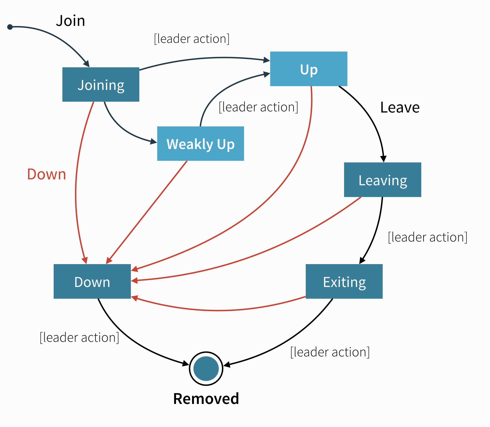

# Cluster Membership Service

The core of Akka Cluster is the cluster membership, to keep track of what nodes are part of the cluster and
their health. Cluster membership is communicated using @ref:[gossip](cluster-concepts.md#gossip) and
@ref:[failure detection](cluster-concepts.md#failure-detector).

There are several @ref:[Higher level Cluster tools](../typed/cluster.md#higher-level-cluster-tools) that are built
on top of the cluster membership service.

## Introduction

A cluster is made up of a set of member nodes. The identifier for each node is a
`hostname:port:uid` tuple. An Akka application can be distributed over a cluster with
each node hosting some part of the application. Cluster membership and the actors running
on that node of the application are decoupled. A node could be a member of a
cluster without hosting any actors. Joining a cluster is initiated
by issuing a `Join` command to one of the nodes in the cluster to join.

The node identifier internally also contains a UID that uniquely identifies this
actor system instance at that `hostname:port`. Akka uses the UID to be able to
reliably trigger remote death watch. This means that the same actor system can never
join a cluster again once it's been removed from that cluster. To re-join an actor
system with the same `hostname:port` to a cluster you have to stop the actor system
and start a new one with the same `hostname:port` which will then receive a different
UID.
 
## Member States

The cluster membership state is a specialized [CRDT](https://hal.inria.fr/file/index/docid/555588/filename/techreport.pdf), which means that it has a monotonic
merge function. When concurrent changes occur on different nodes the updates can always be
merged and converge to the same end result.

 * **joining** - transient state when joining a cluster
   
 * **weakly up** - transient state while network split (only if `akka.cluster.allow-weakly-up-members=on`)
   
 * **up** - normal operating state
 
 * **preparing for shutdown** / **ready for shutdown** - an optional state that can be moved to before doing a full cluster shut down
   
 * **leaving** / **exiting** - states during graceful removal
   
 * **down** - marked as down (no longer part of cluster decisions)
   
 * **removed** - tombstone state (no longer a member)

## Member Events

The events to track the life-cycle of members are:

 * `ClusterEvent.MemberJoined` - A new member has joined the cluster and its status has been changed to `Joining`
 * `ClusterEvent.MemberUp` - A new member has joined the cluster and its status has been changed to `Up`
 * `ClusterEvent.MemberExited` - A member is leaving the cluster and its status has been changed to `Exiting`
Note that the node might already have been shutdown when this event is published on another node.
 * `ClusterEvent.MemberRemoved` - Member completely removed from the cluster.
 * `ClusterEvent.UnreachableMember` - A member is considered as unreachable, detected by the failure detector
of at least one other node.
 * `ClusterEvent.ReachableMember` - A member is considered as reachable again, after having been unreachable.
All nodes that previously detected it as unreachable has detected it as reachable again.
 * `ClusterEvent.MemberPreparingForShutdown` - A member is preparing for a full cluster shutdown
 * `ClusterEvent.MemberReadyForShutdown` - A member is ready for a full cluster shutdown

## Membership Lifecycle

A node is introduced to the cluster by invoking the `join` action which puts the node in the `joining` state.
Once all nodes have seen that the new node is joining (through @ref[gossip convergence](cluster-concepts.md#gossip-convergence)) the
@ref[`leader`](cluster-concepts.md#leader) will set the member state to `up`.

If a node is leaving the cluster in a safe, expected manner, for example through @ref[coordinated shutdown](../coordinated-shutdown.md), 
it invokes the `leave` action which switches it to the `leaving` state. Once the leader sees the convergence on the node in the
`leaving` state, the leader will then move it to `exiting`.  Once all nodes
have seen the exiting state (convergence) the `leader` will remove the node
from the cluster, marking it as `removed`.

If a node is `unreachable` then gossip convergence is not possible and therefore
most `leader` actions are impossible (for instance, allowing a node to
become a part of the cluster). To be able to move forward, the node must become `reachable` again
or the node must be explicitly "downed". This is required because the state of an unreachable node is unknown and the
cluster cannot know if the node has crashed or is only temporarily unreachable because of network issues or GC pauses.
See the section about [User Actions](#user-actions) below for ways a node can be downed.

The actor system on a node that exited or was downed cannot join the cluster again. In particular, a node that was downed while being
unreachable and then regains connectivity cannot rejoin the cluster. Instead, the process has to be restarted on the
node, creating a new actor system that can go through the joining process again.

A special case is a node that was restarted without going through the leaving or downing process e.g. because the machine
hosting the node was unexpectedly restarted. When the new instance of the node tries to rejoin the cluster, the cluster
might still track the old instance as unreachable. In this case, however, it is clear that the old node is gone because
the new instance will have the same address (host and port) as its old instance. In this case, the previous instance
will be automatically marked as `down` and the new instance can rejoin the cluster without manual intervention.

## Leader

The purpose of the `leader` is to confirm state changes when convergence is reached. The `leader` can be determined
by each node unambiguously after gossip convergence. Any node might be
required to take the role of the `leader` depending on the current cluster composition.

Without convergence, different nodes might have different views about which node is the leader.
Therefore, most leader actions are only allowed if there is convergence to ensure that all nodes agree about the current
state of the cluster and state changes are originated from a single node. Most regular state changes like changing
a node from `joining` to `up` are of that kind.

Other situations require that an action is taken even if convergence cannot be reached currently. Notably, convergence
cannot be reached if one or more nodes in the cluster are currently unreachable as determined by the
@ref[failure detector](cluster-concepts.md#failure-detector). In such a case, the cluster might be partitioned (a split brain
scenario) and each partition might have its own view about which nodes are reachable and which are not. In this case,
a node on each side of the partition might view itself as the leader of the reachable nodes. Any action that the leader
performs in such a case must be designed in a way that all concurrent leaders would come to the same conclusion (which
might be impossible in general and only feasible under additional constraints). The most important case of that kind is a split
brain scenario where nodes need to be downed, either manually or automatically, to bring the cluster back to convergence.

The @ref:[Split Brain Resolver](../split-brain-resolver.md) is the built-in implementation of that.

Another transition that is possible without convergence is marking members as `WeaklyUp` as described in the next section.

## WeaklyUp Members

If a node is `unreachable` then gossip convergence is not
possible and therefore most `leader` actions are impossible. By enabling
`akka.cluster.allow-weakly-up-members` (which is enabled by default), joining nodes can be promoted to `WeaklyUp`
even while convergence is not yet reached. Once gossip convergence can be established again, the leader will move
`WeaklyUp` members to `Up`.

You can subscribe to the `WeaklyUp` membership event to make use of the members
that are in this state, but you should be aware of that members on the other
side of a network partition have no knowledge about the existence of the
new members. You should for example not count `WeaklyUp` members in quorum decisions.

## Full cluster shutdown

In some rare cases it may be desirable to do a full cluster shutdown rather than a rolling deploy. 
For example, a protocol change where it is simpler to restart the cluster than to make the protocol change
backward compatible.

As of Akka `2.6.13` it can be signalled that a full cluster shutdown is about to happen and any expensive actions such as:

* Cluster sharding rebalances
* Moving of Cluster singletons

Won't happen. That way the shutdown will be as quick as possible and a new version can be started up without delay.

If a cluster isn't to be restarted right away then there is no need to prepare it for shutdown.

To use this feature use `Cluster(system).prepareForFullClusterShutdown()` in classic or @apidoc[PrepareForFullClusterShutdown] in typed.

Wait for all `Up` members to become `ReadyForShutdown` and then all nodes can be shutdown and restarted.
Members that aren't `Up` yet will remain in the `Joining` or `WeaklyUp` states. Any node that is already leaving 
the cluster i.e. in the `Leaving` or `Exiting` states will continue to leave the cluster via the normal path.

## State Diagrams

### State Diagram for the Member States 

  
#### User Actions

 * **join** - join a single node to a cluster - can be explicit or automatic on
startup if a node to join have been specified in the configuration
   
 * **leave** - tell a node to leave the cluster gracefully, normally triggered by ActorSystem or JVM shutdown through @ref[coordinated shutdown](../coordinated-shutdown.md)
   
 * **down** - mark a node as down. This action is required to remove crashed nodes (that did not 'leave') from the cluster. It can be triggered manually, through [Cluster HTTP Management](https://doc.akka.io/docs/akka-management/current/cluster-http-management.html#put-cluster-members-address-responses), or automatically by a @ref[downing provider](cluster.md#downing) like @ref:[Split Brain Resolver](../split-brain-resolver.md)
   
#### Leader Actions

The `leader` has the duty of confirming user actions to shift members in and out of the cluster:

 * joining ⭢ up
 * joining ⭢ weakly up *(no convergence is needed for this leader action to be performed which works even if there are unreachable nodes)*
 * weakly up ⭢ up *(after full convergence is reached again)*
 * leaving ⭢ exiting
 * exiting ⭢ removed
 * down ⭢ removed

#### Failure Detection and Unreachability

Being unreachable is not a separate member state but rather a flag in addition to the state. A failure detector on each node that monitors another node can mark the monitored node as unreachable independent of its state. Afterwards the failure detector continues monitoring the node until it detects it as reachable again and removes the flag. A node is considered reachable again only after all monitoring nodes see it as reachable again.
