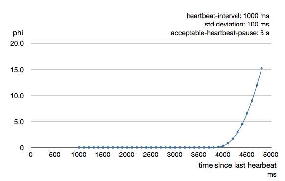

# Phi Accrual Failure Detector

## Introduction

Remote DeathWatch uses heartbeat messages and the failure detector to detect network failures and JVM crashes. 

The heartbeat arrival times are interpreted by an implementation of
[The Phi Accrual Failure Detector](https://pdfs.semanticscholar.org/11ae/4c0c0d0c36dc177c1fff5eb84fa49aa3e1a8.pdf) by Hayashibara et al.

## Failure Detector Heartbeats

Heartbeats are sent every second by default, which is configurable. They are performed in a request/reply handshake, and the replies are input to the failure detector.

The suspicion level of failure is represented by a value called *phi*.
The basic idea of the phi failure detector is to express the value of *phi* on a scale that
is dynamically adjusted to reflect current network conditions.

The value of *phi* is calculated as:

```
phi = -log10(1 - F(timeSinceLastHeartbeat))
```

where F is the cumulative distribution function of a normal distribution with mean
and standard deviation estimated from historical heartbeat inter-arrival times.

An accrual failure detector decouples monitoring and interpretation. That makes
them applicable to a wider area of scenarios and more adequate to build generic
failure detection services. The idea is that it is keeping a history of failure
statistics, calculated from heartbeats received from other nodes, and is
trying to do educated guesses by taking multiple factors, and how they
accumulate over time, into account in order to come up with a better guess if a
specific node is up or down. Rather than only answering "yes" or "no" to the
question "is the node down?" it returns a `phi` value representing the
likelihood that the node is down.
 
The following chart illustrates how *phi* increase with increasing time since the
previous heartbeat.


Phi is calculated from the mean and standard deviation of historical
inter arrival times. The previous chart is an example for standard deviation
of 200 ms. If the heartbeats arrive with less deviation the curve becomes steeper,
i.e. it is possible to determine failure more quickly. The curve looks like this for
a standard deviation of 100 ms.


To be able to survive sudden abnormalities, such as garbage collection pauses and
transient network failures the failure detector is configured with a margin, which
you may want to adjust depending on you environment.
This is how the curve looks like for `failure-detector.acceptable-heartbeat-pause` configured to
3 seconds.


 
## Logging

When the Cluster failure detector observes another node as unreachable it will log:

```
Marking node(s) as UNREACHABLE
```

and if it becomes reachable again:
```
Marking node(s) as REACHABLE
```

There is also a warning when the heartbeat arrival interval exceeds 2/3 of the `acceptable-heartbeat-pause`

```
heartbeat interval is growing too large
```


If you see false positives, as indicated by frequent `UNREACHABLE` followed by `REACHABLE` logging, you can
increase the `acceptable-heartbeat-pause` if you suspect that your environment is more unstable than what
is tolerated by the default value. However, it can be good to investigate the reason so that it is not caused
by long (unexpected) garbage collection pauses, overloading the system, too restrictive CPU quotas settings,
and similar.  

```
akka.cluster.failure-detector.acceptable-heartbeat-pause = 7s
```

Another log message to watch out for that typically requires investigation of the root cause:

```
Scheduled sending of heartbeat was delayed
```

## Failure Detector Threshold

The `threshold` that is the basis for the calculation is configurable by the
user, but typically it's enough to configure the `acceptable-heartbeat-pause` as described above.

* A low `threshold` is prone to generate many false positives but ensures
a quick detection in the event of a real crash. 
* Conversely, a high `threshold` generates fewer mistakes but needs more time to detect actual crashes. 
* The default `threshold` is 8 and is appropriate for most situations. However in
cloud environments, such as Amazon EC2, the value could be increased to 12 in
order to account for network issues that sometimes occur on such platforms.
