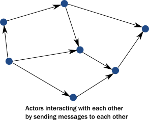

# How the Actor Model Meets the Needs of Modern, Distributed Systems

As described in the previous topic, common programming practices do not properly
address the needs of demanding modern systems. Thankfully, we
don't need to scrap everything we know. Instead, the actor model addresses these
shortcomings in a principled way, allowing systems to behave in a way that
better matches our mental model. The actor model abstraction
allows you to think about your code in terms of communication, not unlike the
exchanges that occur between people in a large organization.

Use of actors allows us to:

 * Enforce encapsulation without resorting to locks.
 * Use the model of cooperative entities reacting to signals, changing state, and sending signals to each other
   to drive the whole application forward.
 * Stop worrying about an executing mechanism which is a mismatch to our world view.

### Usage of message passing avoids locking and blocking

Instead of calling methods, actors send messages to each other. Sending a message does not transfer the thread
of execution from the sender to the destination. An actor can send a message and continue without blocking.
Therefore, it can accomplish more in the same amount of time.

With objects, when a method returns, it releases control of its executing thread. In this respect, actors behave
much like objects, they react to messages and return execution when they finish processing the current message.
In this way, actors actually achieve the execution we imagined for objects:

An important difference between passing messages and calling methods is that messages have no return value.
By sending a message, an actor delegates work to another actor. As we saw in @ref:[The illusion of a call stack](actors-motivation.md#the-illusion-of-a-call-stack),
if it expected a return value, the sending actor would either need to block or to execute the other actor's work on the same thread.
Instead, the receiving actor delivers the results in a reply message.

The second key change we need in our model is to reinstate encapsulation. Actors react to messages just like objects
"react" to methods invoked on them. The difference is that instead of multiple threads "protruding" into our actor and
wreaking havoc to internal state and invariants, actors execute independently from the senders of a message, and they
react to incoming messages sequentially, one at a time. While each actor processes messages sent to it sequentially,
different actors work concurrently with each other so that an actor system can process as many messages simultaneously as the hardware will support.

Since there is always at most one message being processed per actor,
the invariants of an actor can be kept without synchronization. This happens automatically without using locks:

In summary, this is what happens when an actor receives a message:

 1. The actor adds the message to the end of a queue.
 2. If the actor was not scheduled for execution, it is marked as ready to execute.
 3. A (hidden) scheduler entity takes the actor and starts executing it.
 4. Actor picks the message from the front of the queue.
 5. Actor modifies internal state, sends messages to other actors.
 6. The actor is unscheduled.

To accomplish this behavior, actors have:

 * A mailbox (the queue where messages end up).
 * A behavior (the state of the actor, internal variables etc.).
 * Messages (pieces of data representing a signal, similar to method calls and their parameters).
 * An execution environment (the machinery that takes actors that have messages to react to and invokes
   their message handling code).
 * An address (more on this later).

Messages go into actor mailboxes. The behavior of the actor describes how the actor responds to
messages (like sending more messages and/or changing state). An execution environment orchestrates a pool of threads
to drive all these actions completely transparently.

This is a very simple model and it solves the issues enumerated previously:

 * Encapsulation is preserved by decoupling execution from signaling (method calls transfer execution,
   message passing does not).
 * There is no need for locks. Modifying the internal state of an actor is only possible via messages, which are
   processed one at a time eliminating races when trying to keep invariants.
 * There are no locks used anywhere, and senders are not blocked. Millions of actors can be efficiently scheduled on a
   dozen of threads reaching the full potential of modern CPUs. Task delegation is the natural mode of operation for actors.
 * State of actors is local and not shared, changes and data is propagated via messages, which maps to how modern
   memory hierarchy actually works.    In many cases, this means transferring over only the cache lines that contain the data in the message while keeping local state and data cached at the original core. The same model maps exactly to remote communication where the state is kept in the RAM of machines and changes/data is propagated over the network as packets.

### Actors handle error situations gracefully

Since we no longer have a shared call stack between actors that send messages to each other, we need to handle
error situations differently. There are two kinds of errors we need to consider:

 * The first case is when the delegated task on the target actor failed due to an error in the task (typically some
   validation issue, like a non-existent user ID). In this case, the service encapsulated by the target actor is intact,
   it is only the task itself that is erroneous.
   The service actor should reply to the sender with a message, presenting the error case. There is nothing special here, errors are part of the domain and hence become ordinary messages.
 * The second case is when a service itself encounters an internal fault. Akka enforces that all actors are organized
   into a tree-like hierarchy, i.e. an actor that creates another actor becomes the parent of that new actor. This is very similar to how operating systems organize processes into a tree. Just like with processes, when an actor fails,
   its parent actor can decide how to react to the failure. Also, if the parent actor is stopped,
   all of its children are recursively stopped, too. This service is called supervision and it is central to Akka.

A supervisor strategy is typically defined by the parent actor when it is starting a child actor. It can decide
to restart the child actor on certain types of failures or stop it completely on others. Children never go silently
dead (with the notable exception of entering an infinite loop) instead they are either failing and the supervisor
strategy can react to the fault, or they are stopped (in which case interested parties are notified).
There is always a responsible entity for managing an actor: its parent. Restarts are not visible from the outside: collaborating actors can keep sending messages while the target actor restarts.

Now, let's take a short tour of the functionality Akka provides.
