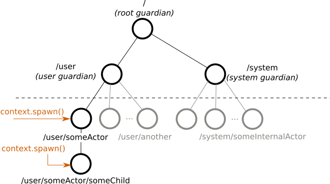

# Part 1: Actor Architecture

## Dependency

Add the following dependency in your project:

@@dependency[sbt,Maven,Gradle] {
  group="com.typesafe.akka"
  artifact="akka-actor-typed_$scala.binary_version$"
  version="$akka.version$"
}

## Introduction

Use of Akka relieves you from creating the infrastructure for an actor system and from writing the low-level code necessary to control basic behavior. To appreciate this, let's look at the relationships between actors you create in your code and those that Akka creates and manages for you internally, the actor lifecycle, and failure handling.

## The Akka actor hierarchy

An actor in Akka always belongs to a parent. You create an actor by calling  `ActorContext.spawn()`. The creator actor becomes the
_parent_ of the newly created _child_ actor. You might ask then, who is the parent of the _first_ actor you create?

As illustrated below, all actors have a common parent, the user guardian, which is defined and created when you start the `ActorSystem`.
As we covered in the @scala[[Quickstart Guide](https://developer.lightbend.com/guides/akka-quickstart-scala/)]@java[[Quickstart Guide](https://developer.lightbend.com/guides/akka-quickstart-java/)], creation of an actor returns a reference that is a valid URL. So, for example, if we create an actor named `someActor` from the user guardian with `context.spawn(someBehavior, "someActor")`, its reference will include the path `/user/someActor`.



In fact, before your first actor is started, Akka has already created two actors in the system. The names of these built-in actors contain _guardian_. The guardian actors include:

 - `/` the so-called _root guardian_. This is the parent of all actors in the system, and the last one to stop when the system itself is terminated.
 - `/system` the _system guardian_. Akka or other libraries built on top of Akka may create actors in the _system_ namespace.
 - `/user` the _user guardian_. This is the top level actor that you provide to start all other actors in your application.
 
The easiest way to see the actor hierarchy in action is to print `ActorRef` instances. In this small experiment, we create an actor, print its reference, create a child of this actor, and print the child's reference. We start with the Hello World project, if you have not downloaded it, download the Quickstart project from the @scala[[Lightbend Tech Hub](https://developer.lightbend.com/start/?group=akka&amp;project=akka-quickstart-scala)]@java[[Lightbend Tech Hub](https://developer.lightbend.com/start/?group=akka&amp;project=akka-quickstart-java)].

In your Hello World project, navigate to the `com.lightbend.akka.sample` package and create a new @scala[Scala file called `ActorHierarchyExperiments.scala`]@java[Java file called `ActorHierarchyExperiments.java`] here. Copy and paste the code from the snippet below to this new source file. Save your file and run `sbt "runMain com.lightbend.akka.sample.ActorHierarchyExperiments"` to observe the output.

Scala
:   @@snip [ActorHierarchyExperiments.scala](/akka-docs/src/test/scala/typed/tutorial_1/ActorHierarchyExperiments.scala) { #print-refs }

Java
:   @@snip [ActorHierarchyExperiments.java](/akka-docs/src/test/java/jdocs/typed/tutorial_1/ActorHierarchyExperiments.java) { #print-refs }

Note the way a message asked the first actor to do its work. We sent the message by using the parent's reference: @scala[`firstRef ! "printit"`]@java[`firstRef.tell("printit", ActorRef.noSender())`]. When the code executes, the output includes the references for the first actor and the child it created as part of the `printit` case. Your output should look similar to the following:

```
First: Actor[akka://testSystem/user/first-actor#1053618476]
Second: Actor[akka://testSystem/user/first-actor/second-actor#-1544706041]
```

Notice the structure of the references:

* Both paths start with `akka://testSystem/`. Since all actor references are valid URLs, `akka://` is the value of the protocol field.
* Next, just like on the World Wide Web, the URL identifies the system. In this example, the system is named `testSystem`, but it could be any other name. If remote communication between multiple systems is enabled, this part of the URL includes the hostname so other systems can find it on the network.
* Because the second actor's reference includes the path `/first-actor/`, it identifies it as a child of the first.
* The last part of the actor reference, `#1053618476` or `#-1544706041`  is a unique identifier that you can ignore in most cases.

Now that you understand what the actor hierarchy
looks like, you might be wondering: _Why do we need this hierarchy? What is it used for?_

An important role of the hierarchy is to safely manage actor lifecycles. Let's consider this next and see how that knowledge can help us write better code.

### The actor lifecycle
Actors pop into existence when created, then later, at user requests, they are stopped. Whenever an actor is stopped, all of its children are _recursively stopped_ too.
This behavior greatly simplifies resource cleanup and helps avoid resource leaks such as those caused by open sockets and files. In fact, a commonly overlooked difficulty when dealing with low-level multi-threaded code is the lifecycle management of various concurrent resources.

To stop an actor, the recommended pattern is to return `Behaviors.stopped()` inside the actor to stop itself, usually as a response to some user defined stop message or when the actor is done with its job. Stopping a child actor is technically possible by calling `context.stop(childRef)` from the parent, but it's not possible to stop arbitrary (non-child) actors this way.

The Akka actor API exposes some lifecycle signals, for example `PostStop` is sent just before the actor stops. No messages are processed after this point.

Let's use the `PostStop` lifecycle signal in a simple experiment to observe the behavior when we stop an actor. First, add the following 2 actor classes to your project:

Scala
:   @@snip [ActorHierarchyExperiments.scala](/akka-docs/src/test/scala/typed/tutorial_1/ActorHierarchyExperiments.scala) { #start-stop }

Java
:   @@snip [ActorHierarchyExperiments.java](/akka-docs/src/test/java/jdocs/typed/tutorial_1/ActorHierarchyExperiments.java) { #start-stop }

And create a 'main' class like above to start the actors and then send them a `"stop"` message:

Scala
:   @@snip [ActorHierarchyExperiments.scala](/akka-docs/src/test/scala/typed/tutorial_1/ActorHierarchyExperiments.scala) { #start-stop-main }

Java
:   @@snip [ActorHierarchyExperiments.java](/akka-docs/src/test/java/jdocs/typed/tutorial_1/ActorHierarchyExperiments.java) { #start-stop-main }

You can again use `sbt` to start this program. The output should look like this:

```
first started
second started
second stopped
first stopped
```

When we stopped actor `first`, it stopped its child actor, `second`, before stopping itself. This ordering is strict, _all_ `PostStop` signals of the children are processed before the `PostStop` signal of the parent
is processed.

### Failure handling

Parents and children are connected throughout their lifecycles. Whenever an actor fails (throws an exception or an unhandled exception bubbles out from @scala[`onMessage`]@java[`Receive`]) the failure information is propagated
to the supervision strategy, which then decides how to handle the exception caused by the actor. The supervision strategy is typically defined by the parent actor when it spawns a child actor. In this way, parents act as supervisors for their children. The default _supervisor strategy_ is to stop the child. If you don't define the strategy all failures result in a stop.

Let's observe a restart supervision strategy in a simple experiment. Add the following classes to your project, just as you did with the previous ones:

Scala
:   @@snip [ActorHierarchyExperiments.scala](/akka-docs/src/test/scala/typed/tutorial_1/ActorHierarchyExperiments.scala) { #supervise }

Java
:   @@snip [ActorHierarchyExperiments.java](/akka-docs/src/test/java/jdocs/typed/tutorial_1/ActorHierarchyExperiments.java) { #supervise }

And run with:

Scala
:   @@snip [ActorHierarchyExperiments.scala](/akka-docs/src/test/scala/typed/tutorial_1/ActorHierarchyExperiments.scala) { #supervise-main }

Java
:   @@snip [ActorHierarchyExperiments.java](/akka-docs/src/test/java/jdocs/typed/tutorial_1/ActorHierarchyExperiments.java) { #supervise-main }

You should see output similar to the following:

```
supervised actor started
supervised actor fails now
supervised actor will be restarted
supervised actor started
[ERROR] [11/12/2018 12:03:27.171] [ActorHierarchyExperiments-akka.actor.default-dispatcher-2] [akka://ActorHierarchyExperiments/user/supervising-actor/supervised-actor] Supervisor akka.actor.typed.internal.RestartSupervisor@1c452254 saw failure: I failed!
java.lang.Exception: I failed!
	at typed.tutorial_1.SupervisedActor.onMessage(ActorHierarchyExperiments.scala:113)
	at typed.tutorial_1.SupervisedActor.onMessage(ActorHierarchyExperiments.scala:106)
	at akka.actor.typed.scaladsl.AbstractBehavior.receive(AbstractBehavior.scala:59)
	at akka.actor.typed.Behavior$.interpret(Behavior.scala:395)
	at akka.actor.typed.Behavior$.interpretMessage(Behavior.scala:369)
	at akka.actor.typed.internal.InterceptorImpl$$anon$2.apply(InterceptorImpl.scala:49)
	at akka.actor.typed.internal.SimpleSupervisor.aroundReceive(Supervision.scala:85)
	at akka.actor.typed.internal.InterceptorImpl.receive(InterceptorImpl.scala:70)
	at akka.actor.typed.Behavior$.interpret(Behavior.scala:395)
	at akka.actor.typed.Behavior$.interpretMessage(Behavior.scala:369)
```

We see that after failure the supervised actor is stopped and immediately restarted. We also see a log entry reporting the exception that was handled, in this case, our test exception. In this example we also used the `PreRestart` signal which is processed before restarts.

For the impatient, we also recommend looking into the @ref:[fault tolerance reference page](../fault-tolerance.md) for more in-depth
details.

# Summary
We've learned about how Akka manages actors in hierarchies where parents supervise their children and handle exceptions. We saw how to create a very simple actor and child. Next, we'll apply this knowledge to our example use case by modeling the communication necessary to get information from device actors. Later, we'll deal with how to manage the actors in groups.

