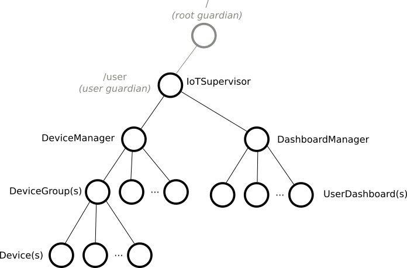

# Part 2: Creating the First Actor

## Introduction

With an understanding of actor hierarchy and behavior, the remaining question is how to map the top-level components of our IoT system to actors. The _user guardian_ can be an actor that represents the whole application. In other words, we will have a single top-level actor in our IoT system. The components that create and manage devices and dashboards will be children of this actor. This allows us to refactor the example use case architecture diagram into a tree of actors:

We can define the first actor, the IotSupervisor, with a few lines of code. To start your tutorial application:

1. Create a new `IotSupervisor` source file in the `com.lightbend.akka.sample` package.
1. Paste the following code into the new file to define the IotSupervisor.

Scala
:   @@snip [IotSupervisor.scala](/akka-docs/src/test/scala/typed/tutorial_2/IotSupervisor.scala) { #iot-supervisor }

Java
:   @@snip [IotSupervisor.java](/akka-docs/src/test/java/jdocs/typed/tutorial_2/IotSupervisor.java) { #iot-supervisor }

The code is similar to the actor examples we used in the previous experiments, but notice that instead of `println()` we use Akka's built in logging facility via @scala[context.log]@java[context.getLog()].

To provide the `main` entry point that creates the actor system, add the following code to the new @scala[`IotApp` object] @java[`IotMain` class].

Scala
:   @@snip [IotApp.scala](/akka-docs/src/test/scala/typed/tutorial_2/IotApp.scala) { #iot-app }

Java
:   @@snip [IotMain.java](/akka-docs/src/test/java/jdocs/typed/tutorial_2/IotMain.java) { #iot-app }

The application does little, other than log that it is started. But, we have the first actor in place and we are ready to add other actors.

## What's next?

In the following chapters we will grow the application gradually, by:

 1. Creating the representation for a device.
 2. Creating the device management component.
 3. Adding query capabilities to device groups.

