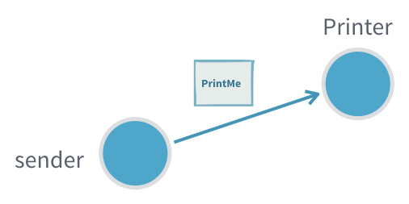
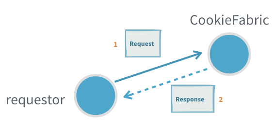
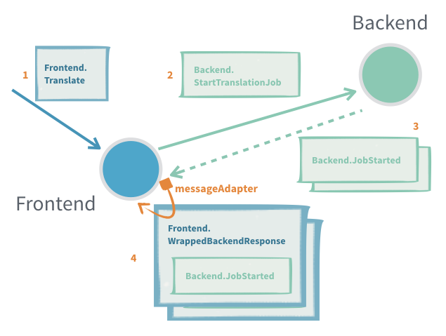
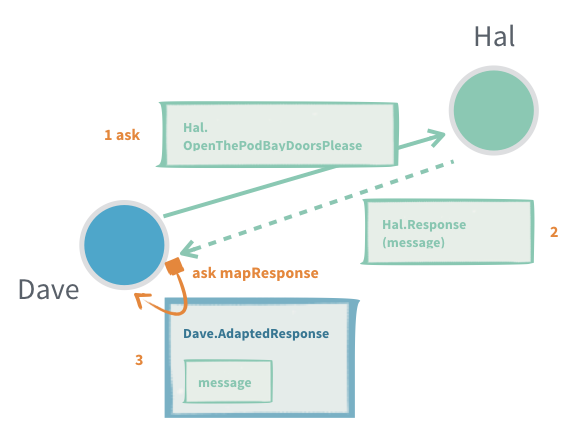
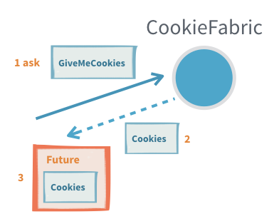
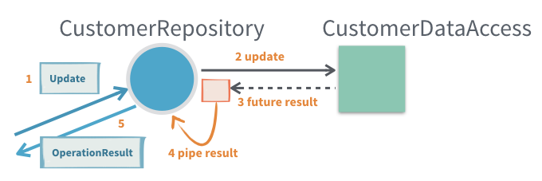
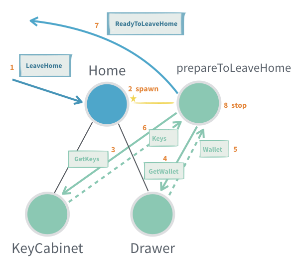
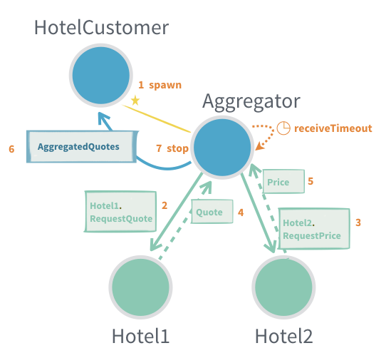
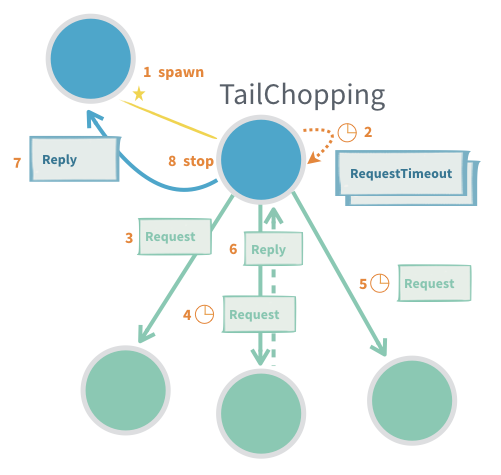
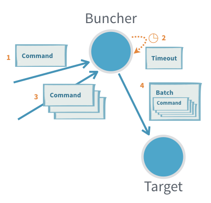

# Interaction Patterns

@@@ note
For the Akka Classic documentation of this feature see @ref:[Classic Actors](../actors.md).
@@@

## Dependency

To use Akka Actor Typed, you must add the following dependency in your project:

@@dependency[sbt,Maven,Gradle] {
  group=com.typesafe.akka
  artifact=akka-actor-typed_$scala.binary_version$
  version=$akka.version$
}

## Introduction

Interacting with an Actor in Akka is done through an @scala[`ActorRef[T]`]@java[`ActorRef<T>`] where `T` is the type of messages the actor accepts, also known as the "protocol". This ensures that only the right kind of messages can be sent to an actor and also that no one else but the Actor itself can access the Actor instance internals.

Message exchange with Actors follow a few common patterns, let's go through each one of them. 

## Fire and Forget

The fundamental way to interact with an actor is through @scala["tell", which is so common that it has a special symbolic method name: `actorRef ! message`]@java[`actorRef.tell(message)`]. Sending a message with tell can safely be done from any thread.

Tell is asynchronous which means that the method returns right away, when the statement after it is executed there is no guarantee that the message has been processed by the recipient yet. It also means there is no way to know if the message was received, the processing succeeded or failed.

**Example:**

With the given protocol and actor behavior:

Scala
:  @@snip [InteractionPatternsSpec.scala](/akka-actor-typed-tests/src/test/scala/docs/akka/typed/InteractionPatternsSpec.scala) { #fire-and-forget-definition }

Java
:  @@snip [InteractionPatternsTest.java](/akka-actor-typed-tests/src/test/java/jdocs/akka/typed/InteractionPatternsTest.java) { #fire-and-forget-definition }

Fire and forget looks like this:

Scala
:  @@snip [InteractionPatternsSpec.scala](/akka-actor-typed-tests/src/test/scala/docs/akka/typed/InteractionPatternsSpec.scala) { #fire-and-forget-doit }

Java
:  @@snip [InteractionPatternsTest.java](/akka-actor-typed-tests/src/test/java/jdocs/akka/typed/InteractionPatternsTest.java) { #fire-and-forget-doit }

**Useful when:**

 * It is not critical to be sure that the message was processed
 * There is no way to act on non successful delivery or processing
 * We want to minimize the number of messages created to get higher throughput (sending a response would require creating twice the number of messages)

**Problems:**

 * If the inflow of messages is higher than the actor can process the inbox will fill up and can in the worst case cause the JVM crash with an `OutOfMemoryError`
 * If the message gets lost, the sender will not know

## Request-Response

Many interactions between actors require one or more response message being sent back from the receiving actor. A response message can be a result of a query, some form of acknowledgment that the message was received and processed or events that the request subscribed to.

In Akka the recipient of responses has to be encoded as a field in the message itself, which the recipient can then use to send (tell) a response back.

**Example:**

With the following protocol:

Scala
:  @@snip [InteractionPatternsSpec.scala](/akka-actor-typed-tests/src/test/scala/docs/akka/typed/InteractionPatternsSpec.scala) { #request-response-protocol }

Java
:  @@snip [InteractionPatternsTest.java](/akka-actor-typed-tests/src/test/java/jdocs/akka/typed/InteractionPatternsTest.java) { #request-response-protocol }

The sender would use its own @scala[`ActorRef[Response]`]@java[`ActorRef<Response>`], which it can access through @scala[`ActorContext.self`]@java[`ActorContext.getSelf()`], for the `respondTo`. 

Scala
:  @@snip [InteractionPatternsSpec.scala](/akka-actor-typed-tests/src/test/scala/docs/akka/typed/InteractionPatternsSpec.scala) { #request-response-send }

Java
:  @@snip [InteractionPatternsTest.java](/akka-actor-typed-tests/src/test/java/jdocs/akka/typed/InteractionPatternsTest.java) { #request-response-send }

On the receiving side the @scala[`ActorRef[response]`]@java[`ActorRef<Response>`] can then be used to send one or more responses back:

Scala
:  @@snip [InteractionPatternsSpec.scala](/akka-actor-typed-tests/src/test/scala/docs/akka/typed/InteractionPatternsSpec.scala) { #request-response-respond }

Java
:  @@snip [InteractionPatternsTest.java](/akka-actor-typed-tests/src/test/java/jdocs/akka/typed/InteractionPatternsTest.java) { #request-response-respond }

**Useful when:**

 * Subscribing to an actor that will send many response messages back
 
**Problems:**

 * Actors seldom have a response message from another actor as a part of their protocol (see @ref:[adapted response](#adapted-response))
 * It is hard to detect that a message request was not delivered or processed (see @ref:[ask](#request-response-with-ask-between-two-actors))
 * Unless the protocol already includes a way to provide context, for example a request id that is also sent in the
   response, it is not possible to tie an interaction to some specific context without introducing a new,
   separate, actor (see @ref:[ask](#request-response-with-ask-between-two-actors) or @ref:[per session child actor](#per-session-child-actor))

## Adapted Response

Most often the sending actor does not, and should not, support receiving the response messages of another actor. In such cases we need to provide an `ActorRef` of the right type and adapt the response message to a type that the sending actor can handle.

**Example:**

Scala
:  @@snip [InteractionPatternsSpec.scala](/akka-actor-typed-tests/src/test/scala/docs/akka/typed/InteractionPatternsSpec.scala) { #adapted-response }

Java
:  @@snip [InteractionPatternsTest.java](/akka-actor-typed-tests/src/test/java/jdocs/akka/typed/InteractionPatternsTest.java) { #adapted-response }

You can register several message adapters for different message classes.
It's only possible to have one message adapter per message class to make sure
that the number of adapters are not growing unbounded if registered repeatedly.
That also means that a registered adapter will replace an existing adapter for
the same message class.

A message adapter will be used if the message class matches the given class or
is a subclass thereof. The registered adapters are tried in reverse order of
their registration order, i.e. the last registered first.

A message adapter (and the returned `ActorRef`) has the same lifecycle as
the receiving actor. It's recommended to register the adapters in a top level
`Behaviors.setup` or constructor of `AbstractBehavior` but it's possible to
register them later if needed.

The adapter function is running in the receiving actor and can safely access its state, but if it throws an exception the actor is stopped.

**Useful when:**

 * Translating between different actor message protocols
 * Subscribing to an actor that will send many response messages back
 
**Problems:**

 * It is hard to detect that a message request was not delivered or processed (see @ref:[ask](#request-response-with-ask-between-two-actors))
 * Only one adaption can be made per response message type, if a new one is registered the old one is replaced,
   for example different target actors can't have different adaption if they use the same response types, unless some
   correlation is encoded in the messages
 * Unless the protocol already includes a way to provide context, for example a request id that is also sent in the
   response, it is not possible to tie an interaction to some specific context without introducing a new,
   separate, actor

 
## Request-Response with ask between two actors
 
In an interaction where there is a 1:1 mapping between a request and a response we can use `ask` on the `ActorContext` to interact with another actor.

The interaction has two steps, first we need to construct the outgoing message, to do that we need an @scala[`ActorRef[Response]`]@java[`ActorRef<Response>`] to put as recipient in the outgoing message. The second step is to transform the successful `Response` or failure into a message that is part of the protocol of the sending actor.

**Example:**

Scala
:  @@snip [InteractionPatternsSpec.scala](/akka-actor-typed-tests/src/test/scala/docs/akka/typed/InteractionPatternsSpec.scala) { #actor-ask }

Java
:  @@snip [InteractionPatternsTest.java](/akka-actor-typed-tests/src/test/java/jdocs/akka/typed/InteractionPatternsTest.java) { #actor-ask }

The response adapting function is running in the receiving actor and can safely access its state, but if it throws an exception the actor is stopped.

**Useful when:**

 * Single response queries
 * An actor needs to know that the message was processed before continuing 
 * To allow an actor to resend if a timely response is not produced
 * To keep track of outstanding requests and not overwhelm a recipient with messages ("backpressure")
 * Context should be attached to the interaction but the protocol does not support that (request id, what query the response was for)
 
**Problems:**

 * There can only be a single response to one `ask` (see @ref:[per session child Actor](#per-session-child-actor))
 * When `ask` times out, the receiving actor does not know and may still process it to completion, or even start processing it after the fact
 * Finding a good value for the timeout, especially when `ask` triggers chained `ask`s in the receiving actor. You want a short timeout to be responsive and answer back to the requester, but at the same time you do not want to have many false positives

## Request-Response with ask from outside an Actor

Sometimes you need to interact with actors from the outside of the actor system, this can be done with fire-and-forget as described above or through another version of `ask` that returns a @scala[`Future[Response]`]@java[`CompletionStage<Response>`] that is either completed with a successful response or failed with a `TimeoutException` if there was no response within the specified timeout.
 
To do this we use @scala[`ActorRef.ask` (or the symbolic `ActorRef.?`) implicitly provided by `akka.actor.typed.scaladsl.AskPattern`]@java[`akka.actor.typed.javadsl.AskPattern.ask`] to send a message to an actor and get a @scala[`Future[Response]`]@java[`CompletionState[Response]`] back.

**Example:**

Scala
:  @@snip [InteractionPatternsSpec.scala](/akka-actor-typed-tests/src/test/scala/docs/akka/typed/InteractionPatternsSpec.scala) { #standalone-ask }

Java
:  @@snip [InteractionPatternsTest.java](/akka-actor-typed-tests/src/test/java/jdocs/akka/typed/InteractionPatternsTest.java) { #standalone-ask }

Note that validation errors are also explicit in the message protocol. The `GiveMeCookies` request can reply
with `Cookies` or `InvalidRequest`. The requestor has to decide how to handle `InvalidRequest` reply. Sometimes
that should be treated as a failed @scala[`Future`]@java[`Future`] and for that the reply can be mapped on the
requestor side.

Scala
:  @@snip [InteractionPatternsSpec.scala](/akka-actor-typed-tests/src/test/scala/docs/akka/typed/InteractionPatternsSpec.scala) { #standalone-ask-fail-future }

Java
:  @@snip [InteractionPatternsTest.java](/akka-actor-typed-tests/src/test/java/jdocs/akka/typed/InteractionPatternsTest.java) { #standalone-ask-fail-future }

**Useful when:**

 * Querying an actor from outside of the actor system 

**Problems:**

 * It is easy to accidentally close over and unsafely mutable state with the callbacks on the returned @scala[`Future`]@java[`CompletionStage`] as those will be executed on a different thread
 * There can only be a single response to one `ask` (see @ref:[per session child Actor](#per-session-child-actor))
 * When `ask` times out, the receiving actor does not know and may still process it to completion, or even start processing it after the fact

## Send Future result to self

When using an API that returns a @scala[`Future`]@java[`CompletionStage`] from an actor it's common that you would
like to use the value of the in the actor when the @scala[`Future`]@java[`CompletionStage`] is completed. For
this purpose the `ActorContext` provides a `pipeToSelf` method.

**Example:**

An actor, `CustomerRepository`, is invoking a method on `CustomerDataAccess` that returns a @scala[`Future`]@java[`CompletionStage`].

Scala
:  @@snip [InteractionPatternsSpec.scala](/akka-actor-typed-tests/src/test/scala/docs/akka/typed/InteractionPatternsSpec.scala) { #pipeToSelf }

Java
:  @@snip [InteractionPatternsTest.java](/akka-actor-typed-tests/src/test/java/jdocs/akka/typed/InteractionPatternsTest.java) { #pipeToSelf }

It could be tempting to just use @scala[`onComplete on the Future`]@java[`a callback on the CompletionStage`], but
that introduces the risk of accessing internal state of the actor that is not thread-safe from an external thread.
For example, the `numberOfPendingOperations` counter in above example can't be accessed from such callback.
Therefore it is better to map the result to a message and perform further processing when receiving that message.

**Useful when:**

 * Accessing APIs that are returning @scala[`Future`]@java[`CompletionStage`] from an actor, such as a database or
   an external service
 * The actor needs to continue processing when the @scala[`Future`]@java[`CompletionStage`] has completed
 * Keep context from the original request and use that when the @scala[`Future`]@java[`CompletionStage`] has completed,
   for example an `replyTo` actor reference
 
**Problems:**

 * Boilerplate of adding wrapper messages for the results

## Per session child Actor

In some cases a complete response to a request can only be created and sent back after collecting multiple answers from other actors. For these kinds of interaction it can be good to delegate the work to a per "session" child actor. The child could also contain arbitrary logic to implement retrying, failing on timeout, tail chopping, progress inspection etc.

Note that this is essentially how `ask` is implemented, if all you need is a single response with a timeout it is better to use `ask`.

The child is created with the context it needs to do the work, including an `ActorRef` that it can respond to. When the complete result is there the child responds with the result and stops itself.

As the protocol of the session actor is not a public API but rather an implementation detail of the parent actor, it may not always make sense to have an explicit protocol and adapt the messages of the actors that the session actor interacts with. For this use case it is possible to express that the actor can receive any message (@scala[`Any`]@java[`Object`]).

**Example:**

Scala
:  @@snip [InteractionPatternsSpec.scala](/akka-actor-typed-tests/src/test/scala/docs/akka/typed/InteractionPatternsSpec.scala) { #per-session-child }

Java
:  @@snip [InteractionPatternsTest.java](/akka-actor-typed-tests/src/test/java/jdocs/akka/typed/InteractionPatternsTest.java) { #per-session-child }

In an actual session child you would likely want to include some form of timeout as well (see @ref:[scheduling messages to self](#scheduling-messages-to-self)).

**Useful when:**

 * A single incoming request should result in multiple interactions with other actors before a result can be built,
   for example aggregation of several results
 * You need to handle acknowledgement and retry messages for at-least-once delivery

**Problems:**

 * Children have life cycles that must be managed to not create a resource leak, it can be easy to miss a scenario where the session actor is not stopped
 * It increases complexity, since each such child can execute concurrently with other children and the parent

## General purpose response aggregator

This is similar to above @ref:[Per session child Actor](#per-session-child-actor) pattern. Sometimes you might
end up repeating the same way of aggregating replies and want to extract that to a reusable actor.

There are many variations of this pattern and that is the reason this is provided as a documentation
example rather than a built in `Behavior` in Akka. It is intended to be adjusted to your specific needs.

**Example:**

This example is an aggregator of expected number of replies.
Requests for quotes are sent with the given `sendRequests` function to the two hotel actors, which both speak
different protocols. When both expected replies have been collected they are aggregated with the given `aggregateReplies`
function and sent back to the `replyTo`. If replies don't arrive within the `timeout` the replies so far are
aggregated and sent back to the `replyTo`.

Scala
:  @@snip [AggregatorSpec.scala](/akka-actor-typed-tests/src/test/scala/docs/akka/typed/AggregatorSpec.scala) { #usage }

Java
:  @@snip [AggregatorTest.java](/akka-actor-typed-tests/src/test/java/jdocs/akka/typed/AggregatorTest.java) { #usage }

The implementation of the `Aggregator`:

Scala
:  @@snip [Aggregator.scala](/akka-actor-typed-tests/src/test/scala/docs/akka/typed/Aggregator.scala) { #behavior }

Java
:  @@snip [Aggregator.java](/akka-actor-typed-tests/src/test/java/jdocs/akka/typed/Aggregator.java) { #behavior }

**Useful when:**

 * Aggregating replies are performed in the same way at multiple places and should be extracted to a more general
   purpose actor.
 * A single incoming request should result in multiple interactions with other actors before a result can be built,
   for example aggregation of several results
 * You need to handle acknowledgement and retry messages for at-least-once delivery

**Problems:**

 * Message protocols with generic types are difficult since the generic types are erased in runtime
 * Children have life cycles that must be managed to not create a resource leak, it can be easy to miss a scenario where the session actor is not stopped
 * It increases complexity, since each such child can execute concurrently with other children and the parent

## Latency tail chopping

This is a variation of above @ref:[General purpose response aggregator](#general-purpose-response-aggregator) pattern.

The goal of this algorithm is to decrease tail latencies ("chop off the tail latency") in situations
where multiple destination actors can perform the same piece of work, and where an actor may occasionally respond
more slowly than expected. In this case, sending the same work request (also known as a "backup request")
to another actor results in decreased response time - because it's less probable that multiple actors
are under heavy load simultaneously. This technique is explained in depth in Jeff Dean's presentation on
[Achieving Rapid Response Times in Large Online Services](http://static.googleusercontent.com/media/research.google.com/en//people/jeff/Berkeley-Latency-Mar2012.pdf).

There are many variations of this pattern and that is the reason this is provided as a documentation
example rather than a built in `Behavior` in Akka. It is intended to be adjusted to your specific needs.

**Example:**

Scala
:  @@snip [TailChopping.scala](/akka-actor-typed-tests/src/test/scala/docs/akka/typed/TailChopping.scala) { #behavior }

Java
:  @@snip [TailChopping.java](/akka-actor-typed-tests/src/test/java/jdocs/akka/typed/TailChopping.java) { #behavior }

**Useful when:**

 * Reducing higher latency percentiles and variations of latency are important
 * The "work" can be done more than once with the same result, e.g. a request to retrieve information

**Problems:**

 * Increased load since more messages are sent and "work" is performed more than once
 * Can't be used when the "work" is not idempotent and must only be performed once
 * Message protocols with generic types are difficult since the generic types are erased in runtime
 * Children have life cycles that must be managed to not create a resource leak, it can be easy to miss a scenario where the session actor is not stopped

## Scheduling messages to self

The following example demonstrates how to use timers to schedule messages to an actor. 

**Example:**

The `Buncher` actor buffers a burst of incoming messages and delivers them as a batch after a timeout or when the number of batched messages exceeds a maximum size.

Scala
:  @@snip [InteractionPatternsSpec.scala](/akka-actor-typed-tests/src/test/scala/docs/akka/typed/InteractionPatternsSpec.scala) { #timer }

Java
:  @@snip [InteractionPatternsTest.java](/akka-actor-typed-tests/src/test/java/jdocs/akka/typed/InteractionPatternsTest.java) { #timer }

There are a few things worth noting here:

* To get access to the timers you start with `Behaviors.withTimers` that will pass a `TimerScheduler` instance to the function. 
This can be used with any type of `Behavior`, including `receive`, `receiveMessage`, but also `setup` or any other behavior.
* Each timer has a key and if a new timer with the same key is started, the previous is cancelled and it's guaranteed that a message from the previous timer is not received, even though it might already be enqueued in the mailbox when the new timer is started.
* Both periodic and single message timers are supported. 
* The `TimerScheduler` is mutable in itself, because it performs and manages the side effects of registering the scheduled tasks.
* The `TimerScheduler` is bound to the lifecycle of the actor that owns it and it's cancelled automatically when the actor is stopped.
* `Behaviors.withTimers` can also be used inside `Behaviors.supervise` and it will automatically cancel the started timers correctly when the actor is restarted, so that the new incarnation will not receive scheduled messages from a previous incarnation.

### Schedule periodically

Scheduling of recurring messages can have two different characteristics:

* fixed-delay - The delay between sending subsequent messages will always be (at least) the given `delay`.
  Use `startTimerWithFixedDelay`.
* fixed-rate - The frequency of execution over time will meet the given `interval`. Use `startTimerAtFixedRate`.

If you are uncertain of which one to use you should pick `startTimerWithFixedDelay`.

When using **fixed-delay** it will not compensate the delay between messages if the scheduling is delayed longer
than specified for some reason. The delay between sending subsequent messages will always be (at least) the given
`delay`. In the long run, the frequency of messages will generally be slightly lower than the reciprocal of the
specified `delay`.

Fixed-delay execution is appropriate for recurring activities that require "smoothness." In other words,
it is appropriate for activities where it is more important to keep the frequency accurate in the short run
than in the long run.

When using **fixed-rate** it will compensate the delay for a subsequent task if the previous messages were delayed
too long. In such cases, the actual sending interval will differ from the interval passed to the `scheduleAtFixedRate`
method.

If the tasks are delayed longer than the `interval`, the subsequent message will be sent immediately after the
prior one. This also has the consequence that after long garbage collection pauses or other reasons when the JVM
was suspended all "missed" tasks will execute when the process wakes up again. For example, `scheduleAtFixedRate`
with an interval of 1 second and the process is suspended for 30 seconds will result in 30 messages being sent
in rapid succession to catch up. In the long run, the frequency of execution will be exactly the reciprocal of
the specified `interval`.

Fixed-rate execution is appropriate for recurring activities that are sensitive to absolute time
or where the total time to perform a fixed number of executions is important, such as a countdown
timer that ticks once every second for ten seconds.

@@@ warning

`scheduleAtFixedRate` can result in bursts of scheduled messages after long garbage collection pauses,
which may in worst case cause undesired load on the system. `scheduleWithFixedDelay` is often preferred.

@@@

## Responding to a sharded actor

When @ref:[Akka Cluster](cluster.md) is used to @ref:[shard actors](cluster-sharding.md) you need to
take into account that an actor may move or get passivated.

The normal pattern for expecting a reply is to include an @apidoc[akka.actor.typed.ActorRef] in the message, typically a message adapter. This can be used
for a sharded actor but if @scala[`ctx.self`]@java[`ctx.getSelf()`] is sent and the sharded actor is moved or passivated then the reply
will sent to dead letters.

An alternative is to send the `entityId` in the message and have the reply sent via sharding.

**Example:**

Scala
:  @@snip [sharded.response](/akka-cluster-sharding-typed/src/test/scala/docs/akka/cluster/sharding/typed/ShardingCompileOnlySpec.scala) { #sharded-response }

Java
:  @@snip [sharded.response](/akka-cluster-sharding-typed/src/test/java/jdocs/akka/cluster/sharding/typed/ShardingReplyCompileOnlyTest.java) { #sharded-response }

A disadvantage is that a message adapter can't be used so the response has to be in the protocol of the actor being responded to. Additionally the `EntityTypeKey`
could be included in the message if it is not known statically.

