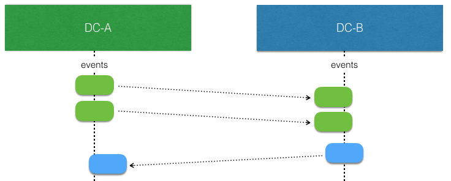
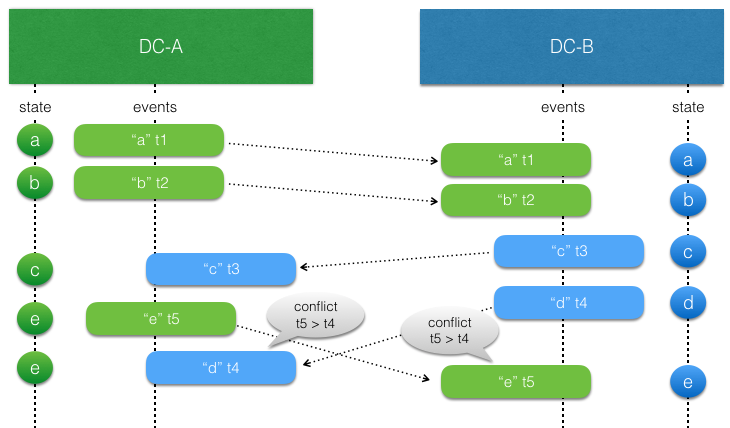

# Active-Active Event Sourcing

@@@ warning

This module is marked as @ref:[may change](../common/may-change.md) because it is a new feature that
needs feedback from real usage before finalizing the API. This means that API or semantics can change without
warning or deprecation period. It is also not recommended to use this module in production just yet.

@@@

@ref[Event sourcing](./persistence.md) with `EventSourcedBehavior`s is based on the single writer principle, which means that there can only be one active instance of a `EventSourcedBehavior` with a given `persistenceId`. Otherwise, multiple instances would store interleaving events based on different states, and when these events would later be replayed it would not be possible to reconstruct the correct state.

This restriction means that in the event of network partitions, and for a short time during rolling re-deploys, `EventSourcedBehaviors`s are unavailable.


Active-active event sourcing enables running multiple replicas of each entity. 
There is automatic replication of every event persisted to all replicas.

For instance, a replica can be run per:

* Data Center 
* Availability zone or rack

The motivations are:

* Redundancy to tolerate failures in one location and still be operational
* Serve requests from a location near the user to provide better responsiveness
* Balance the load over many servers

However, the event handler must be able to **handle concurrent events** as when active-active is enabled
there is no longer the single writer principle as there is with a normal `EventSourcedBehavior`.

The state of an active-active `EventSourcedBehavior` is **eventually consistent**. Event replication may be delayed
due to network partitions and outages and the event handler and those reading the state must be designed to handle this.

## Relaxing the single writer p`rinciple for availability

Taking the example of using active-active to run a replica per data center.

When there is no network partitions and no concurrent writes the events stored by an `EventSourcedBehavior` at one replica can be replicated and consumed by another (corresponding) replica in another data center without any concerns. Such replicated events can simply be applied to the local state.



The interesting part begins when there are concurrent writes by `EventSourcedBehavior`replicas. That is more likely to happen when there is a network partition, but it can also happen when there are no network issues. They simply write at the "same time" before the events from the other side have been replicated and consumed.


The event handler logic for applying events to the state of the entity must be aware of that such concurrent updates can occur and it must be modeled to handle such conflicts. This means that it should typically have the same characteristics as a Conflict Free Replicated Data Type (CRDT). With a CRDT there are by definition no conflicts and the events can just be applied. The library provides some general purpose CRDTs, but the logic of how to apply events can also be defined by an application specific function.

For example, sometimes it's enough to use application specific timestamps to decide which update should win.

To assist in implementing the event handler active-active detects these conflicts.

## API

@scala[The same API as regular `EventSourcedBehavior`s]@java[A very similar API to the regular `EventSourcedBehavior`] is used to define the logic. 

To enable an entity for active-active
replication @java[let it extend `ActiveActiveEventSourcedBehavior` instead of `EventSourcedBehavior` and] use the factory methods on @apidoc[ActiveActiveEventSourcing]. 

All replicas need to be known up front:

Scala
:  @@snip [ActiveActiveCompileOnlySpec.scala](/akka-persistence-typed-tests/src/test/scala/docs/akka/persistence/typed/ActiveActiveCompileOnlySpec.scala) { #replicas }

Java
:  @@snip [ActiveActiveCompileOnlyTest.java](/akka-persistence-typed-tests/src/test/java/jdocs/akka/persistence/typed/ActiveActiveCompileOnlyTest.java) { #replicas }


Then to enable replication create the event sourced behavior with the factory method:

Scala
:  @@snip [ActiveActiveCompileOnlySpec.scala](/akka-persistence-typed-tests/src/test/scala/docs/akka/persistence/typed/ActiveActiveCompileOnlySpec.scala) { #factory }

Java
:  @@snip [ActiveActiveCompileOnlyTest.java](/akka-persistence-typed-tests/src/test/java/jdocs/akka/persistence/typed/ActiveActiveCompileOnlyTest.java) { #factory }

The factory takes in:

* EntityID: this will be used as part of the underlying persistenceId
* Replica: Which replica this instance is
* All Replicas and the query plugin used to read their events
* A factory function to create an instance of the @scala[`EventSourcedBehavior`]@java[`ActiveActiveEventSourcedBehavior`] 

In this scenario each replica reads from each other's database effectively providing cross region replication for any database that has an Akka Persistence plugin. Alternatively if all the replicas use the same journal, e.g. for testing or if it is a distributed database such as Cassandra, the `withSharedJournal` factory can be used. 

Scala
:  @@snip [ActiveActiveCompileOnlySpec.scala](/akka-persistence-typed-tests/src/test/scala/docs/akka/persistence/typed/ActiveActiveCompileOnlySpec.scala) { #factory-shared}

Java
:  @@snip [ActiveActiveCompileOnlyTest.java](/akka-persistence-typed-tests/src/test/java/jdocs/akka/persistence/typed/ActiveActiveCompileOnlyTest.java) { #factory-shared }


@@@ div { .group-scala }

The function passed to both factory methods return an `EventSourcedBehavior` and provide access to the @apidoc[ActiveActiveContext] that has the following methods:

* entityId 
* replicaId
* allReplicas
* persistenceId - to provide to the `EventSourcedBehavior` factory. This **must be used**.

As well as methods that **can only be** used in the event handler. The values these methods return relate to the event that is being processed.

@@@

@@@ div { .group-java }

The function passed to both factory methods is invoked with a special @apidoc[ActiveActiveContext] that needs to be passed to the
concrete `ActiveActiveEventSourcedBehavior` and on to the super constructor.

The context gives access to: 

* entityId 
* replicaId
* allReplicas
* persistenceId

As well as methods that **can only be** used in the event handler, accessed through `getActiveActiveContext`. The values these methods return relate to the event that is being processed.

@@@

* origin: The ReplicaId that originally created the event
* concurrent: Whether the event was concurrent with another event as in the second diagram above
* recoveryRunning: Whether a recovery is running. Can be used to send commands back to self for side effects that should only happen once.
* currentTimeMillis: similar to `System.currentTimeMillis` but guaranteed never to go backwards

The factory returns a `Behavior` that can be spawned like any other behavior.

## Resolving conflicting updates

### Conflict free replicated data types

TODO example once CRDTs are in

### Last writer wins

Sometimes it is enough to use timestamps to decide which update should win. Such approach relies on synchronized clocks, and clocks of different machines will always be slightly out of sync. Timestamps should therefore only be used when the choice of value is not important for concurrent updates occurring within the clock skew.
 
 In general, last writer wins means that the event is used if the timestamp of the event is later (higher) than the timestamp of previous local update, otherwise the event is discarded. There is no built-in support for last writer wins, because it must often be combined with more application specific aspects.
 


There is a small utility class @apidoc[akka.persistence.typed.LwwTime] that can be useful for implementing last writer wins semantics.
It contains a timestamp representing current time when the event was persisted and an identifier of the
replica that persisted it. When comparing two @apidoc[akka.persistence.typed.LwwTime] the greatest timestamp wins. The replica
identifier is used if the two timestamps are equal, and then the one from the data center sorted first in
alphanumeric order wins.

The nature of last writer wins means that if you only have one timestamp for the state the events must represent an
update of the full state. Otherwise, there is a risk that the state in different data centers will be different and
not eventually converge.

An example of that would be an entity representing a blog post and the fields `author` and `title` could be updated
separately with events @scala[`AuthorChanged(newAuthor: String)`]@java[`new AuthorChanged(newAuthor)`] and @scala[`TitleChanged(newTitle: String)`]@java[`new TitleChanged(newTitle)`].

Let's say the blog post is created and the initial state of `title=Akka, author=unknown` is in sync in both replicas `DC-A` and `DC-B.

In `DC-A` author is changed to "Bob" at time `100`. Before that event has been replicated over to `DC-B` the
title is updated to "Akka News" at time `101` in `DC-B`. When the events have been replicated the result will be:

`DC-A`: The title update is later so the event is used and new state is `title=Akka News, author=Bob`

`DC-B`: The author update is earlier so the event is discarded and state is `title=Akka News, author=unknown`

The problem here is that the partial update of the state is not applied on both sides, so the states have diverged and will not become the same.

To solve this with last writer wins the events must carry the full state, such as @scala[`AuthorChanged(newContent: PostContent)`]@java[`new AuthorChanged(newContent)`] and @scala[`TitleChanged(newContent: PostContent)`]@java[`new TitleChanged(newContent)`]. Then the result would eventually be `title=Akka News, author=unknown` on both sides.
The author update is lost but that is because the changes were performed concurrently. More important is that the state
is eventually consistent.

Including the full state in each event is often not desired. An event typically represent a change, a delta. Then one can use several timestamps, one for each set of fields that can be updated together. In the above example one could use one timestamp for the title and another for the author. Then the events could represent changes to parts of the full state, such as @scala[`AuthorChanged(newAuthor: String)`]@java[`new AuthorChanged(newAuthor)`] and @scala[`TitleChanged(newTitle: String)`]@java[`new TitleChanged(newTitle)`].

## Side effects

TODO https://github.com/akka/akka/issues/29318

## How it works

You don’t have to read this section to be able to use the feature, but to use the abstraction efficiently and for the right type of use cases it can be good to understand how it’s implemented. For example, it should give you the right expectations of the overhead that the solution introduces compared to using just `EventSourcedBehavior`s.

### Causal deliver order

Causal delivery order means that events persisted in one data center are read in the same order in other data centers. The order of concurrent events is undefined, which should be no problem
when using [CRDT's](#conflict-free-replicated-data-types)
and otherwise will be detected via the `ActiveActiveContext` concurrent method.

For example:

```
DC-1: write e1
DC-2: read e1, write e2
DC-1: read e2, write e3
```

In the above example the causality is `e1 -> e2 -> e3`. Also in a third data center DC-3 these events will be read in the same order e1, e2, e3.

Another example with concurrent events:

```
DC1: write e1
DC2: read e1, write e2
DC1: write e3 (e2 and e3 are concurrent)
DC1: read e2
DC2: read e3
```

e2 and e3 are concurrent, i.e. they don't have a causal relation: DC1 sees them in the order "e1, e3, e2", while DC2 sees them as "e1, e2, e3".

A third data center may also see the events as either "e1, e3, e2" or as "e1, e2, e3".

### Concurrent updates

Active-active automatically tracks causality between events from different replias using [version vectors](https://en.wikipedia.org/wiki/Version_vector).


Each replica "owns" a slot in the version vector and increases its counter when an event is persisted. The version vector is stored with the event, and when a replicated event is consumed the version vector of the event is merged with the local version vector.

When comparing two version vectors `v1` and `v2`: 

* `v1` is SAME as `v2` iff for all i v1(i) == v2(i)
* `v1`is BEFORE `v2` iff for all i v1(i) <= v2(i) and there exist a j such that v1(j) < v2(j)
* `v1`is AFTER `v2` iff for all i v1(i) >= v2(i) and there exist a j such that v1(j) > v2(j)
* `v1`is CONCURRENT with `v2` otherwise
