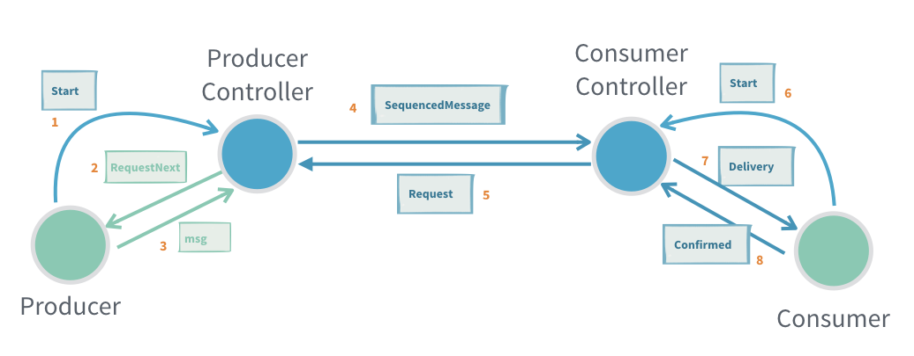
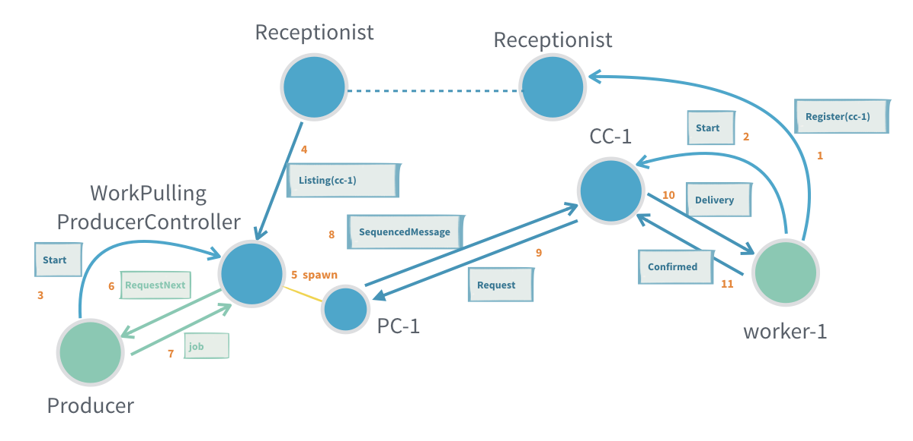
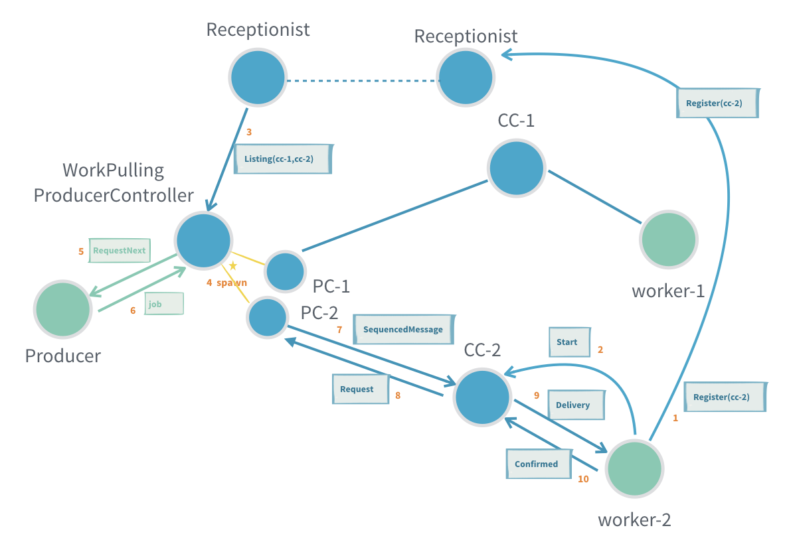
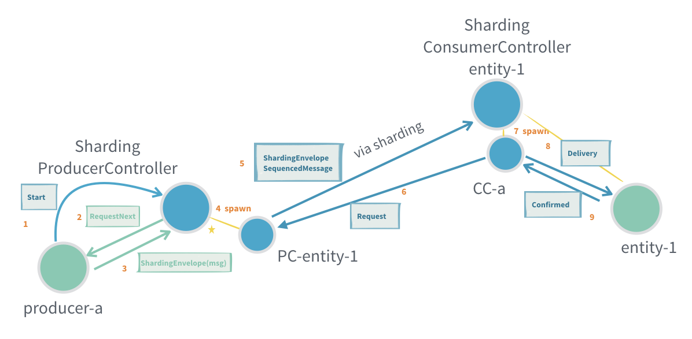
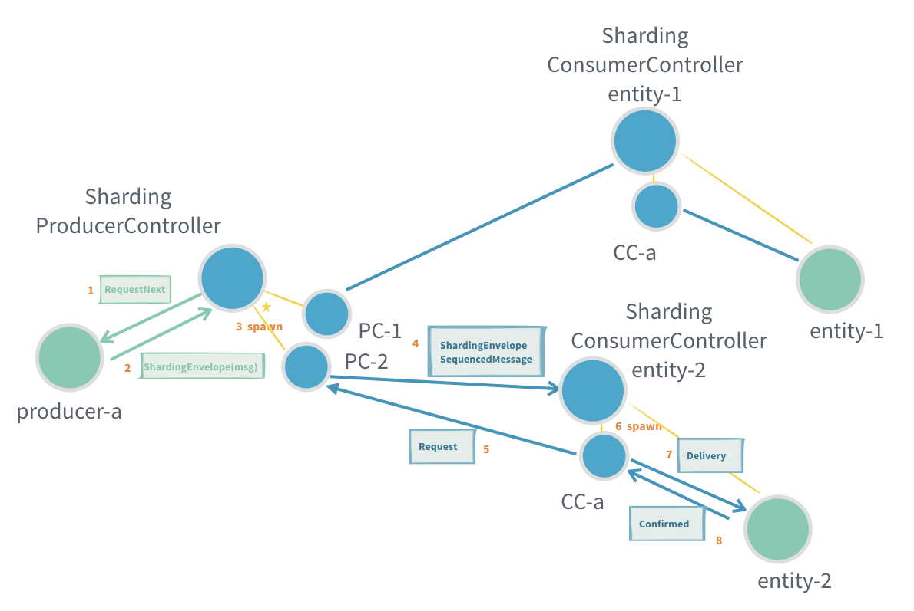
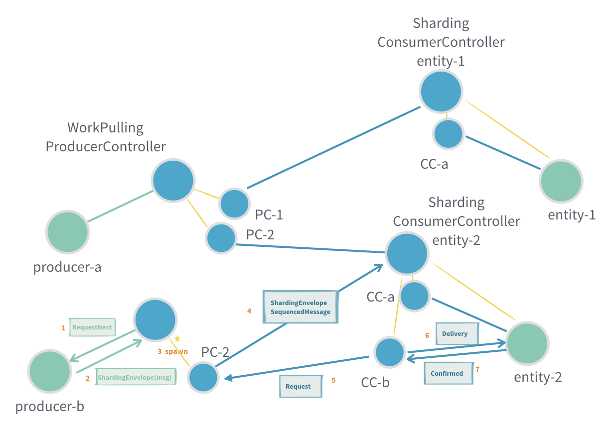

# Reliable delivery

You are viewing the documentation for the new actor APIs, to view the Akka Classic documentation, see @ref:[Classic At-Least-Once Delivery](../persistence.md#at-least-once-delivery).

@@@ warning

This module is currently marked as @ref:[may change](../common/may-change.md) because it is a new feature that
needs feedback from real usage before finalizing the API. This means that API or semantics can change without
warning or deprecation period. It is also not recommended to use this module in production just yet.

@@@

## Module info

To use reliable delivery, add the module to your project:

@@dependency[sbt,Maven,Gradle] {
  bomGroup=com.typesafe.akka bomArtifact=akka-bom_$scala.binary.version$ bomVersionSymbols=AkkaVersion
  symbol1=AkkaVersion
  value1="$akka.version$"
  group=com.typesafe.akka
  artifact=akka-actor-typed_$scala.binary.version$
  version=AkkaVersion
}

## Introduction

Normal @ref:[message delivery reliability](../general/message-delivery-reliability.md) is at-most-once delivery, which
means that messages may be lost. That should be rare, but still possible.

For interactions between some actors, that is not acceptable and at-least-once delivery or effectively-once processing
is needed. The tools for reliable delivery described here help with implementing that. It can't be achieved
automatically under the hood without collaboration from the application. This is because confirming when a message has been
fully processed is a business level concern. Only ensuring that it was transferred over the network or delivered to 
the mailbox of the actor would not be enough, since the actor may crash right before being able to process the message.

Lost messages are detected, resent and deduplicated as needed. In addition, it also includes flow control for
the sending of messages to avoid that a fast producer overwhelms a slower consumer or sends messages at
a higher rate than what can be transferred over the network. This can be a common problem in interactions between
actors, resulting in fatal errors like `OutOfMemoryError` because too many messages are queued in the mailboxes
of the actors. The detection of lost messages and the flow control is driven by the consumer side, which means
that the producer side will not send faster than the demand requested by the consumer side. The producer side will
not push resends unless requested by the consumer side.

There are 3 supported patterns, which are described in the following sections:

* @ref:[Point-to-point](#point-to-point)
* @ref:[Work pulling](#work-pulling)
* @ref:[Sharding](#sharding)

The Point-to-Point pattern has support for automatically @ref:[splitting up large messages](#chunk-large-messages)
and assemble them again on the consumer side. This feature is useful for avoiding head of line blocking from
serialization and transfer of large messages.

## Point-to-point

This pattern implements point-to-point reliable delivery between a single producer actor sending messages and a single consumer actor
receiving the messages.

Messages are sent from the producer to @apidoc[ProducerController$] and via @apidoc[ConsumerController$] actors, which
handle the delivery and confirmation of the processing in the destination consumer actor.

The producer actor will start the flow by sending a `ProducerController.Start` message to
the `ProducerController`.

The `ProducerController` sends `RequestNext` to the producer, which is then allowed to send one
message to the `ProducerController`. Thereafter the producer will receive a new `RequestNext`
when it's allowed to send one more message.

The producer and `ProducerController` actors are required to be local so that message delivery is
both fast and guaranteed. This requirement is enforced by a runtime check.

Similarly, on the consumer side the destination consumer actor will start the flow by sending an
initial `ConsumerController.Start` message to the `ConsumerController`. 

For the `ProducerController` to know where to send the messages, it must be connected with the
`ConsumerController`. This can be done with the `ProducerController.RegisterConsumer` or
`ConsumerController.RegisterToProducerController` messages. When using the point-to-point pattern,
it is the application's responsibility to connect them together. For example, this can be done by sending the `ActorRef`
in an ordinary message to the other side, or by registering the `ActorRef` in the @ref:[Receptionist](actor-discovery.md)
so it can be found on the other side.

You must also take measures to reconnect them if any of the sides crashes, for example by watching it
for termination.

Messages sent by the producer are wrapped in `ConsumerController.Delivery` when received by a consumer and the consumer
should reply with `ConsumerController.Confirmed` when it has processed the message.

The next message is not delivered until the previous one is confirmed. Any messages from the producer that arrive
while waiting for the confirmation are stashed by the `ConsumerController` and delivered when the previous
message is confirmed.

Similar to the producer side, the consumer and the `ConsumerController` actors are required to be local so that message delivery is
both fast and guaranteed. This requirement is enforced by a runtime check.

Many unconfirmed messages can be in flight between the `ProducerController` and `ConsumerController`, but
their number is limited by a flow control window. The flow control is driven by the consumer side, which means that
the `ProducerController` will not send faster than the demand requested by the `ConsumerController`.

### Point-to-point example

An example of a fibonacci number generator (producer):

Scala
:  @@snip [PointToPointDocExample.scala](/akka-cluster-sharding-typed/src/test/scala/docs/delivery/PointToPointDocExample.scala) { #imports #producer }

Java
:  @@snip [PointToPointDocExample.java](/akka-cluster-sharding-typed/src/test/java/jdocs/delivery/PointToPointDocExample.java) { #imports #producer }

and consumer of the fibonacci numbers:

Scala
:  @@snip [PointToPointDocExample.scala](/akka-cluster-sharding-typed/src/test/scala/docs/delivery/PointToPointDocExample.scala) { #consumer }

Java
:  @@snip [PointToPointDocExample.java](/akka-cluster-sharding-typed/src/test/java/jdocs/delivery/PointToPointDocExample.java) { #consumer }

The `FibonacciProducer` sends the messages to a `ProducerController`. The `FibonacciConsumer` receives the messages
from a `ConsumerController`. Note how the `ActorRef` in the `Start` messages are constructed as message adapters to map
the `RequestNext` and `Delivery` to the protocol of the producer and consumer actors respectively.

The `ConsumerController` and `ProducerController` are connected via the `ConsumerController.RegisterToProducerController`
message. The `ActorRef` of the `ProducerController` can be shared between producer and consumer sides with ordinary
messages, or by using the `Receptionist`. Alternatively, they can be connected in the other direction by sending
`ProducerController.RegisterConsumer` to the `ProducerController`.

Scala
:  @@snip [PointToPointDocExample.scala](/akka-cluster-sharding-typed/src/test/scala/docs/delivery/PointToPointDocExample.scala) { #connect }

Java
:  @@snip [PointToPointDocExample.java](/akka-cluster-sharding-typed/src/test/java/jdocs/delivery/PointToPointDocExample.java) { #connect }

### Point-to-point delivery semantics

As long as neither producer nor consumer crash, the messages are delivered to the consumer actor in the same order
as they were sent to the `ProducerController`, without loss or duplicates. This means effectively-once
processing without any business level deduplication.

Unconfirmed messages may be lost if the producer crashes. To avoid that, you need to enable the @ref:[durable
queue](#durable-producer) on the producer side. By doing so, any stored unconfirmed messages will be redelivered when the
corresponding producer is started again. Even if the same `ConsumerController` instance is used, there may be
delivery of messages that had already been processed but the fact that they were confirmed had not been stored yet.
This means that we have at-least-once delivery.

If the consumer crashes, a new `ConsumerController` can be connected to the original `ProducerConsumer`
without restarting it. The `ProducerConsumer` will then redeliver all unconfirmed messages. In that case
the unconfirmed messages will be delivered to the new consumer and some of these may already have been
processed by the previous consumer.
Again, this means that we have at-least-once delivery.

## Work pulling

Work pulling is a pattern where several worker actors pull tasks at their own pace from
a shared work manager instead of that the manager pushes work to the workers blindly
without knowing their individual capacity and current availability.

One important property is that the order of the messages should not matter, because each
message is routed randomly to one of the workers with demand. In other words, two subsequent
messages may be routed to two different workers and processed independent of each other.

Messages are sent from the producer to @apidoc[WorkPullingProducerController$] and via @apidoc[ConsumerController$]
actors, which handle the delivery and confirmation of the processing in the destination worker (consumer) actor.

and adding another worker

A worker actor (consumer) and its `ConsumerController` is dynamically registered to the
`WorkPullingProducerController` via a `ServiceKey`. It will register itself to the
@ref:[Receptionist](actor-discovery.md), and the `WorkPullingProducerController`
subscribes to the same key to find active workers. In this way workers can be dynamically
added or removed from any node in the cluster.

The work manager (producer) actor will start the flow by sending a `WorkPullingProducerController.Start`
message to the `WorkPullingProducerController`.

The `WorkPullingProducerController` sends `RequestNext` to the producer, which is then allowed
to send one message to the `WorkPullingProducerController`.
Thereafter the producer will receive a new `RequestNext` when it's allowed to send one more message.
`WorkPullingProducerController` will send a new `RequestNext` when there is a demand from any worker.
It's possible that all workers with demand are deregistered after the `RequestNext` is sent and before
the actual messages is sent to the `WorkPullingProducerController`. In that case the message is
buffered and will be delivered when a new worker is registered or when there is a new demand.

The producer and `WorkPullingProducerController` actors are supposed to be local so that these messages are
fast and not lost. This is enforced by a runtime check.

Similarly, on the consumer side the destination consumer actor will start the flow by sending an
initial `ConsumerController.Start` message to the `ConsumerController`.

Received messages from the producer are wrapped in `ConsumerController.Delivery` when sent to the consumer,
which is supposed to reply with `ConsumerController.Confirmed` when it has processed the message.
Next message is not delivered until the previous is confirmed. More messages from the producer that arrive
while waiting for the confirmation are stashed by the `ConsumerController` and delivered when the previous
message is confirmed.

The consumer and the `ConsumerController` actors are supposed to be local so that these messages are fast
and not lost. This is enforced by a runtime check.

Many unconfirmed messages can be in flight between the `WorkPullingProducerController` and each
`ConsumerController`, but it is limited by a flow control window. The flow control is driven by the
consumer side, which means that the `WorkPullingProducerController` will not send faster than the
demand requested by the workers.

### Work pulling example

Example of image converter worker (consumer):

Scala
:  @@snip [WorkPullingDocExample.scala](/akka-cluster-sharding-typed/src/test/scala/docs/delivery/WorkPullingDocExample.scala) { #imports #consumer }

Java
:  @@snip [WorkPullingDocExample.java](/akka-cluster-sharding-typed/src/test/java/jdocs/delivery/WorkPullingDocExample.java) { #imports #consumer }

and image converter job manager (producer):

Scala
:  @@snip [WorkPullingDocExample.scala](/akka-cluster-sharding-typed/src/test/scala/docs/delivery/WorkPullingDocExample.scala) { #producer }

Java
:  @@snip [WorkPullingDocExample.java](/akka-cluster-sharding-typed/src/test/java/jdocs/delivery/WorkPullingDocExample.java) { #producer }

Note how the `ActorRef` in the `Start` messages are constructed as message adapters to map the
`RequestNext` and `Delivery` to the protocol of the producer and consumer actors respectively.

See also the corresponding @ref:[example that is using ask from the producer](#ask-from-the-producer).

### Work pulling delivery semantics

For work pulling the order of the messages should not matter, because each message is routed randomly
to one of the workers with demand and can therefore be processed in any order.

As long as neither producers nor workers crash (or workers being removed for other reasons) the messages are
delivered to the workers without loss or duplicates. Meaning effectively-once processing without any
business level deduplication.

Unconfirmed messages may be lost if the producer crashes. To avoid that you need to enable the @ref:[durable
queue](#durable-producer) on the producer side. The stored unconfirmed messages will be redelivered when the
corresponding producer is started again. Those messages may be routed to different workers than before
and some of them may have already been processed but the fact that they were confirmed had not been stored
yet. Meaning at-least-once delivery.

If a worker crashes or is stopped gracefully the unconfirmed messages will be redelivered to other workers.
In that case some of these may already have been processed by the previous worker. Meaning at-least-once delivery.

## Sharding

To use reliable delivery with Cluster Sharding, add the following module to your project:

@@dependency[sbt,Maven,Gradle] {
  bomGroup=com.typesafe.akka bomArtifact=akka-bom_$scala.binary.version$ bomVersionSymbols=AkkaVersion
  symbol1=AkkaVersion
  value1="$akka.version$"
  group=com.typesafe.akka
  artifact=akka-cluster-sharding-typed_$scala.binary.version$
  version=AkkaVersion
}

Reliable delivery between a producer actor sending messages to @ref:[sharded](cluster-sharding.md) consumer
actor receiving the messages.

and sending to another entity

and sending from another producer (different node)

The @apidoc[ShardingProducerController$] should be used together with @apidoc[ShardingConsumerController$].

A producer can send messages via a `ShardingProducerController` to any `ShardingConsumerController`
identified by an `entityId`. A single `ShardingProducerController` per `ActorSystem` (node) can be
shared for sending to all entities of a certain entity type. No explicit registration is needed
between the `ShardingConsumerController` and `ShardingProducerController`.

The producer actor will start the flow by sending a `ShardingProducerController.Start`
message to the `ShardingProducerController`.

The `ShardingProducerController` sends `RequestNext` to the producer, which is then allowed
to send one message to the `ShardingProducerController`. Thereafter the producer will receive a
new `RequestNext` when it's allowed to send one more message.

In the @apidoc[ShardingProducerController.RequestNext] message there is information about which entities
that have demand. It is allowed to send to a new `entityId` that is not included in the `RequestNext.entitiesWithDemand`.
If sending to an entity that doesn't have demand the message will be buffered. This support for buffering
means that it is even allowed to send several messages in response to one `RequestNext` but it's recommended to
only send one message and wait for next `RequestNext` before sending more messages.

The producer and `ShardingProducerController` actors are supposed to be local so that these messages are
fast and not lost. This is enforced by a runtime check.

Similarly, on the consumer side the destination consumer actor will start the flow by sending an
initial `ConsumerController.Start` message to the `ConsumerController`.

There will be one `ShardingConsumerController` for each entity. Many unconfirmed messages can be in
flight between the `ShardingProducerController` and each `ShardingConsumerController`, but it is 
limited by a flow control window. The flow control is driven by the consumer side, which means that
the `ShardingProducerController` will not send faster than the demand requested by the consumers.

### Sharding example

The sharded entity is a todo list which uses an async database call to store its entire state on each change,
and first when that completes replies to reliable delivery that the message was consumed.

Example of `TodoList` entity (consumer):

Scala
:  @@snip [ShardingDocExample.scala](/akka-cluster-sharding-typed/src/test/scala/docs/delivery/ShardingDocExample.scala) { #imports #consumer }

Java
:  @@snip [ShardingDocExample.java](/akka-cluster-sharding-typed/src/test/java/jdocs/delivery/ShardingDocExample.java) { #imports #consumer }

and `TodoService` (producer):

Scala
:  @@snip [ShardingDocExample.scala](/akka-cluster-sharding-typed/src/test/scala/docs/delivery/ShardingDocExample.scala) { #producer }

Java
:  @@snip [ShardingDocExample.java](/akka-cluster-sharding-typed/src/test/java/jdocs/delivery/ShardingDocExample.java) { #producer }

Note how the `ActorRef` in the `Start` messages are constructed as message adapters to map the
`RequestNext` and `Delivery` to the protocol of the producer and consumer actors respectively.

Those are initialized with sharding like this (from the guardian):

Java
:  @@snip [ShardingDocExample.java](/akka-cluster-sharding-typed/src/test/java/jdocs/delivery/ShardingDocExample.java) { #init }

### Sharding delivery semantics

As long as neither producer nor consumer crash the messages are delivered to the consumer actor in the same order
as they were sent to the `ShardingProducerController`, without loss or duplicates. Meaning effectively-once
processing without any business level deduplication.

Unconfirmed messages may be lost if the producer crashes. To avoid that you need to enable the @ref:[durable
queue](#durable-producer) on the producer side. The stored unconfirmed messages will be redelivered when the
corresponding producer is started again. In that case there may be delivery of messages that had already been
processed but the fact that they were confirmed had not been stored yet. Meaning at-least-once delivery.

If the consumer crashes or the shard is rebalanced the unconfirmed messages will be redelivered. In that case
some of these may already have been processed by the previous consumer.

## Durable producer

Until sent messages have been confirmed the producer side keeps them in memory to be able to
resend them. If the JVM of the producer side crashes those unconfirmed messages are lost.
To make sure the messages can be delivered also in that scenario a @apidoc[DurableProducerQueue$] can be used.
Then the unconfirmed messages are stored in a durable way so that they can be redelivered when the producer
is started again. An implementation of the `DurableProducerQueue` is provided by @apidoc[EventSourcedProducerQueue$]
in `akka-persistence-typed`.

Be aware of that a `DurableProducerQueue` will add a substantial performance overhead. 

When using the `EventSourcedProducerQueue` the following dependency is needed:

@@dependency[sbt,Maven,Gradle] {
  bomGroup=com.typesafe.akka bomArtifact=akka-bom_$scala.binary.version$ bomVersionSymbols=AkkaVersion
  symbol1=AkkaVersion
  value1="$akka.version$"
  group=com.typesafe.akka
  artifact=akka-persistence-typed_$scala.binary.version$
  version=AkkaVersion
} 

You also have to select journal plugin and snapshot store plugin, see 
@ref:[Persistence Plugins](../persistence-plugins.md).

Example of the image converter work manager from the @ref:[Work pulling example](#work-pulling-example) with
`EventSourcedProducerQueue` enabled:
 
Scala
:  @@snip [WorkPullingDocExample.scala](/akka-cluster-sharding-typed/src/test/scala/docs/delivery/WorkPullingDocExample.scala) { #durable-queue }

Java
:  @@snip [WorkPullingDocExample.java](/akka-cluster-sharding-typed/src/test/java/jdocs/delivery/WorkPullingDocExample.java) { #durable-queue }

It's important to note that the `EventSourcedProducerQueue` requires a @ref:[PersistenceId](persistence.md#persistenceid),
which must be unique. The same `PersistenceId` must not be used for different producers at the same time.
A @ref:[Cluster Singleton](cluster-singleton.md) hosting the producer would satisfy that requirement,
or one producer per node and a naming scheme to ensure that different nodes use different `PersistenceId`. 

To deliver unconfirmed messages after a crash the producer must be started again with same `PersistenceId`
as before the crash.

## Ask from the producer

Instead of using `tell` with the `sendNextTo` in the `RequestNext` the producer can use `context.ask`
with the `askNextTo` in the `RequestNext`. The difference is that a reply is sent back when the
message has been handled. To include the `replyTo` `ActorRef` the message must be wrapped in a
`MessageWithConfirmation`. If a `DurableProducerQueue` is used then the reply is sent when the message
has been stored successfully, but it might not have been processed by the consumer yet. Otherwise the
reply is sent after the consumer has processed and confirmed the message.

Example of using `ask` in the image converter work manager from the @ref:[Work pulling example](#work-pulling-example):
 
Scala
:  @@snip [WorkPullingDocExample.scala](/akka-cluster-sharding-typed/src/test/scala/docs/delivery/WorkPullingDocExample.scala) { #ask }

Java
:  @@snip [WorkPullingDocExample.java](/akka-cluster-sharding-typed/src/test/java/jdocs/delivery/WorkPullingDocExample.java) { #ask }

## Only flow control

It's possible to use this without resending lost messages, but the flow control is still used. This can
for example be useful when both consumer and producer are know to be located in the same local `ActorSystem`.
This can be more efficient since messages don't have to be kept in memory in the `ProducerController` until
they have been confirmed, but the drawback is that lost messages will not be delivered. See configuration
`only-flow-control` of the `ConsumerController`.

## Chunk large messages

To avoid head of line blocking from serialization and transfer of large messages the @ref:[Point-to-Point](#point-to-point) 
pattern has support for automatically @ref:[splitting up large messages](#chunk-large-messages) and assemble them
again on the consumer side.

Serialization and deserialization is performed by the `ProducerController` and `ConsumerController` respectively
instead of in the remote transport layer.

This is enabled by configuration `akka.reliable-delivery.producer-controller.chunk-large-messages` and defines
the maximum size in bytes of the chunked pieces. Messages smaller than the configured size are not chunked, but
serialization still takes place in the `ProducerController` and `ConsumerController`. 

Aside from the configuration the API is the same as the @ref:[Point-to-point](#point-to-point) pattern. If
@ref:[Durable producer](#durable-producer) is enabled the chunked pieces are stored rather than the full large
message.

This feature is not implemented for @ref:[Work pulling](#work-pulling) and @ref:[Sharding](#sharding) yet.

## Configuration

There are several configuration properties, please refer to `akka.reliable-delivery` config section in the
reference configuration:

* @ref:[akka-actor-typed reference configuration](../general/configuration-reference.md#config-akka-actor-typed)
* @ref:[akka-persistence-typed reference configuration](../general/configuration-reference.md#config-akka-persistence-typed)
* @ref:[akka-cluster-sharding-typed reference configuration](../general/configuration-reference.md#config-cluster-sharding-typed)
