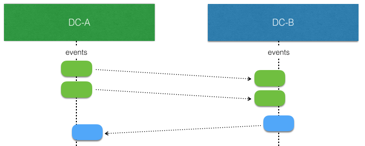
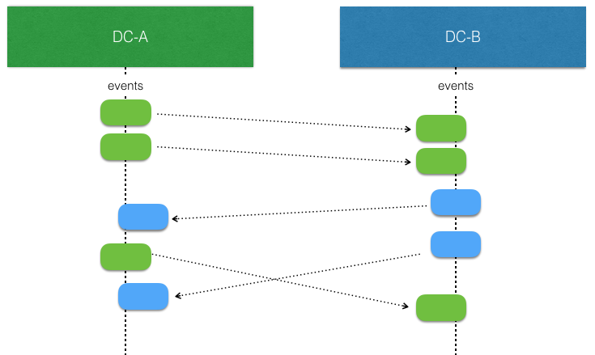
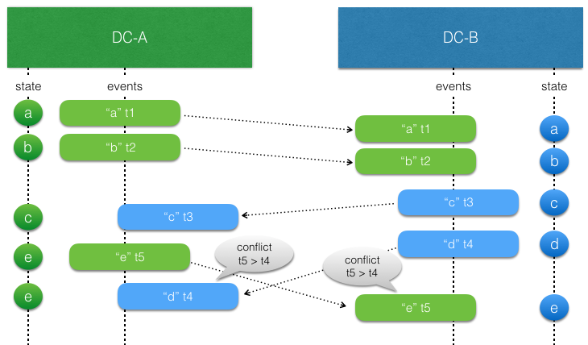
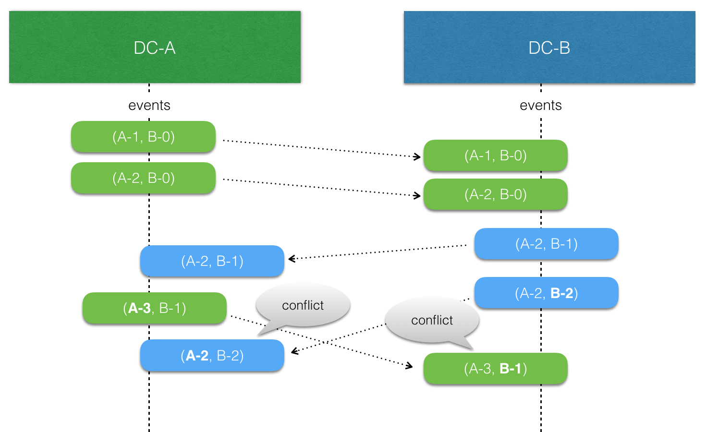

# Replicated Event Sourcing

@ref[Event Sourcing](./persistence.md) with `EventSourcedBehavior`s is based on the single writer principle, which means that there can only be one active instance of a `EventSourcedBehavior` 
with a given `persistenceId`. Otherwise, multiple instances would store interleaving events based on different states, and when these events would later be replayed it would not be possible to reconstruct the correct state.

This restriction means that in the event of network partitions, and for a short time during rolling re-deploys, some
`EventSourcedBehavior` actors are unavailable.

Replicated Event Sourcing enables running multiple replicas of each entity. 
There is automatic replication of every event persisted to all replicas.
This makes it possible to implement patterns such as active-active and hot standby.

For instance, a replica can be run per:

* Cloud provider region
* Data Center 
* Availability zone or rack

The motivations are:

* Redundancy to tolerate failures in one location and still be operational
* Serve requests from a location near the user to provide better responsiveness
* Allow updates to an entity from several locations
* Balance the load over many servers

However, the event handler must be able to **handle concurrent events** as when replication is enabled
the single-writer guarantee is not maintained like it is with a normal `EventSourcedBehavior`.

The state of a replicated `EventSourcedBehavior` is **eventually consistent**. Event replication may be delayed
due to network partitions and outages, which means that the event handler and those reading the state must be designed
to handle this.

To be able to use Replicated Event Sourcing the journal and snapshot store used is required to have specific support for the metadata that the replication needs (see @ref[Journal Support](#journal-support)).

The [Replicated Event Sourcing video](https://akka.io/blog/news/2020/09/09/replicated-event-sourcing-video)
is a good starting point describing the use cases and motivation for when to use Replicated Event Sourcing. The second part, [Replicated Event Sourcing data modelling](https://akka.io/blog/news/2020/10/22/replicated-event-sourcing-data-modelling) guides you to find a suitable model for your use-case.

## Relaxing the single-writer principle for availability

Taking the example of using Replicated Event Sourcing to run a replica per data center.

When there is no network partitions and no concurrent writes the events stored by an `EventSourcedBehavior` at one replica can be replicated and consumed by another (corresponding) replica in another data center without any concerns. Such replicated events can simply be applied to the local state.



The interesting part begins when there are concurrent writes by `EventSourcedBehavior` replicas. That is more likely to happen when there is a network partition, but it can also happen when there are no network issues. They simply write at the "same time" before the events from the other side have been replicated and consumed.



The event handler logic for applying events to the state of the entity must be aware of that such concurrent updates can occur, and it must be modeled to handle such conflicts. This means that it should typically have the same characteristics as a Conflict Free Replicated Data Type (CRDT). With a CRDT there are by definition no conflicts, the events can always be applied. The library provides some general purpose CRDTs, but the logic of how to apply events can also be defined by an application specific function.

For example, sometimes it's enough to use application specific timestamps to decide which update should win.

To assist in implementing the event handler the Replicated Event Sourcing detects these conflicts.

## API

@scala[The same API as regular `EventSourcedBehavior`s]@java[A very similar API to the regular `EventSourcedBehavior`] is used to define the logic. 

### Consuming events via gRPC transport

Since Akka 2.8.0 a gRPC based transport is the recommended way to set up the replication of events between the replicas.

The functionality is provided through the Akka Projection gRPC module, see the details about 
how to use it up in the @extref[Akka Projection gRPC documentation](akka-projection:grpc-replicated-event-sourcing-transport.html)

Complete samples of the gRPC transport set up can be found in the @extref[Akka Distributed Cluster Guide](akka-distributed-cluster:guide/3-active-active.html).

### Consuming events via direct access to replica databases

It is also possible to consume events with a direct connection to the database of each replica.

See @ref[Replicated Event Sourcing replication via direct access to replica databases](replicated-eventsourcing-db-transport.md)

## Resolving conflicting updates

### Conflict free replicated data types

Writing code to resolve conflicts can be complicated to get right.
One well-understood technique to create eventually-consistent systems is to
model your state as a Conflict Free Replicated Data Type, a CRDT. There are two types of CRDTs;
operation-based and state-based. For Replicated Event Sourcing the operation-based is a good fit,
since the events represent the operations. Note that this is distinct from the CRDT's implemented
in @ref:[Akka Distributed Data](distributed-data.md), which are state-based rather than operation-based.

The rule for operation-based CRDT's is that the operations must be commutative — in other words, applying the same events
(which represent the operations) in any order should always produce the same final state. You may assume each event
is applied only once, with @ref:[causal delivery order](#causal-delivery-order).

The following CRDTs are included that can you can use as the state or part of the state in the entity:

* @apidoc[LwwTime]
* @apidoc[Counter]
* @apidoc[akka.persistence.typed.crdt.ORSet]

Akka serializers are included for all these types and can be used to serialize when 
@ref[embedded in Jackson](../serialization-jackson.md#using-akka-serialization-for-embedded-types).

An example would be a movies watch list that is represented by the general purpose 
@apidoc[akka.persistence.typed.crdt.ORSet] CRDT. `ORSet` is short for Observed Remove Set. Elements can be added and
removed any number of times. Concurrent add wins over remove. It is an operation based CRDT where the delta of an
operation (add/remove) can be represented as an event.

Such movies watch list example:

Scala
:   @@snip [movie](/akka-persistence-typed-tests/src/test/scala/docs/akka/persistence/typed/ReplicatedMovieWatchListExampleSpec.scala) { #movie-entity }

Java
:   @@snip [movie](/akka-persistence-typed-tests/src/test/java/jdocs/akka/persistence/typed/ReplicatedMovieExample.java) { #movie-entity }

The @ref[Auction example](replicated-eventsourcing-auction.md) is a more comprehensive example that illustrates how application-specific
rules can be used to implement an entity with CRDT semantics.

### Last writer wins

Sometimes it is enough to use timestamps to decide which update should win. Such approach relies on synchronized clocks, and clocks of different machines will always be slightly out of sync. Timestamps should therefore only be used when the choice of value is not important for concurrent updates occurring within the clock skew.
 
 In general, last writer wins means that the event is used if the timestamp of the event is later (higher) than the timestamp of previous local update, otherwise the event is discarded. There is no built-in support for last writer wins, because it must often be combined with more application specific aspects.
 


There is a small utility class @apidoc[LwwTime] that can be useful for implementing last writer wins semantics.
It contains a timestamp representing current time when the event was persisted and an identifier of the
replica that persisted it. When comparing two @apidoc[LwwTime] the greatest timestamp wins. The replica
identifier is used if the two timestamps are equal, and then the one from the `replicaId` sorted first in
alphanumeric order wins.

Scala
:   @@snip [blog](/akka-persistence-typed-tests/src/test/scala/docs/akka/persistence/typed/ReplicatedBlogExampleSpec.scala) { #event-handler }

Java
:   @@snip [blog](/akka-persistence-typed-tests/src/test/java/jdocs/akka/persistence/typed/ReplicatedBlogExample.java) { #event-handler }

When creating the `LwwTime` it is good to have a monotonically increasing timestamp, and for that the `increase`
method in `LwwTime` can be used:

Scala
:   @@snip [blog](/akka-persistence-typed-tests/src/test/scala/docs/akka/persistence/typed/ReplicatedBlogExampleSpec.scala) { #command-handler }

Java
:   @@snip [blog](/akka-persistence-typed-tests/src/test/java/jdocs/akka/persistence/typed/ReplicatedBlogExample.java) { #command-handler }

The nature of last writer wins means that if you only have one timestamp for the state the events must represent an
update of the full state. Otherwise, there is a risk that the state in different replicas will be different and
not eventually converge.

An example of that would be an entity representing a blog post and the fields `author` and `title` could be updated
separately with events @scala[`AuthorChanged(newAuthor: String)`]@java[`new AuthorChanged(newAuthor)`] and @scala[`TitleChanged(newTitle: String)`]@java[`new TitleChanged(newTitle)`].

Let's say the blog post is created and the initial state of `title=Akka, author=unknown` is in sync in both replicas `DC-A` and `DC-B.

In `DC-A` author is changed to "Bob" at time `100`. Before that event has been replicated over to `DC-B` the
title is updated to "Akka News" at time `101` in `DC-B`. When the events have been replicated the result will be:

`DC-A`: The title update is later so the event is used and new state is `title=Akka News, author=Bob`

`DC-B`: The author update is earlier so the event is discarded and state is `title=Akka News, author=unknown`

The problem here is that the partial update of the state is not applied on both sides, so the states have diverged and will not become the same.

To solve this with last writer wins the events must carry the full state, such as @scala[`AuthorChanged(newContent: PostContent)`]@java[`new AuthorChanged(newContent)`] and @scala[`TitleChanged(newContent: PostContent)`]@java[`new TitleChanged(newContent)`]. Then the result would eventually be `title=Akka News, author=unknown` on both sides.
The author update is lost but that is because the changes were performed concurrently. More important is that the state
is eventually consistent.

Including the full state in each event is often not desired. An event typically represent a change, a delta. Then one can use several timestamps, one for each set of fields that can be updated together. In the above example one could use one timestamp for the title and another for the author. Then the events could represent changes to parts of the full state, such as @scala[`AuthorChanged(newAuthor: String)`]@java[`new AuthorChanged(newAuthor)`] and @scala[`TitleChanged(newTitle: String)`]@java[`new TitleChanged(newTitle)`].

## Side effects

In most cases it is recommended to do side effects as @ref[described for `EventSourcedBehavior`s](./persistence.md#effects-and-side-effects).

Side effects from the event handler are generally discouraged because the event handlers are also used during replay and when consuming replicated events and that would 
result in undesired re-execution of the side effects.

Uses cases for doing side effects in the event handler:

* Doing a side effect only in a single replica
* Doing a side effect once all replicas have seen an event
* A side effect for a replicated event
* A side effect when a conflict has occurred

There is no built in support for knowing an event has been replicated to all replicas but it can be modelled in your state. 
For some use cases you may need to trigger side effects after consuming replicated events. For example when an auction has been closed in 
all data centers and all bids have been replicated. 

The @api[ReplicationContext] contains the current replica, the origin replica for the event processes, and if a recovery is running. These can be used to 
implement side effects that take place once events are fully replicated. If the side effect should happen only once then a particular replica can be
designated to do it. The @ref[Auction example](replicated-eventsourcing-auction.md) uses these techniques.


## How it works

You don’t have to read this section to be able to use the feature, but to use the abstraction efficiently and for the right type of use cases it can be good to understand how it’s implemented. For example, it should give you the right expectations of the overhead that the solution introduces compared to using just `EventSourcedBehavior`s.

### Causal delivery order

Causal delivery order means that events persisted in one replica are read in the same order in other replicas. The order of concurrent events is undefined, which should be no problem
when using @ref:[CRDT's](#conflict-free-replicated-data-types)
and otherwise will be detected via the `ReplicationContext` concurrent method.

For example:

```
DC-1: write e1
DC-2: read e1, write e2
DC-1: read e2, write e3
```

In the above example the causality is `e1 -> e2 -> e3`. Also in a third replica DC-3 these events will be read in the same order e1, e2, e3.

Another example with concurrent events:

```
DC1: write e1
DC2: read e1, write e2
DC1: write e3 (e2 and e3 are concurrent)
DC1: read e2
DC2: read e3
```

e2 and e3 are concurrent, i.e. they don't have a causal relation: DC1 sees them in the order "e1, e3, e2", while DC2 sees them as "e1, e2, e3".

A third replica may also see the events as either "e1, e3, e2" or as "e1, e2, e3".

### Concurrent updates

Replicated Event Sourcing automatically tracks causality between events from different replicas using [version vectors](https://en.wikipedia.org/wiki/Version_vector).



Each replica "owns" a slot in the version vector and increases its counter when an event is persisted. The version vector is stored with the event, and when a replicated event is consumed the version vector of the event is merged with the local version vector.

When comparing two version vectors `v1` and `v2`: 

* `v1` is SAME as `v2` iff for all i `v1(i) == v2(i)`
* `v1`is BEFORE `v2` iff for all i `v1(i) <= v2(i)` and there exist a j such that `v1(j) < v2(j)`
* `v1`is AFTER `v2` iff for all i `v1(i) >= v2(i)` and there exist a j such that `v1(j) > v2(j)`
* `v1`is CONCURRENT with `v2` otherwise

## Tagging events and running projections

Just like for regular `EventSourcedBehavior`s it is possible to tag events along with persisting them. 
This is useful for later retrival of events for a given tag. The same @ref[API for tagging provided for EventSourcedBehavior](persistence.md#tagging) can 
be used for replicated event sourced behaviors as well.
Tagging is useful in practice to build queries that lead to other data representations or aggregations of these event 
streams that can more directly serve user queries – known as building the “read side” in @ref[CQRS](cqrs.md) based applications.

Creating read side projections is possible through @extref[Akka Projections](akka-projection:)
or through direct usage of the @ref[events by tag queries](../persistence-query.md#eventsbytag-and-currenteventsbytag).  

The tagging is invoked in each replicas, which requires some special care in using tags, or else the same event will be
tagged one time for each replica and show up in the event by tag stream one time for each replica. In addition to this
the tags will be written in the respective journal of the replicas, which means that unless they all share a single journal
the tag streams will be local to the replica even if the same tag is used on multiple replicas.

One strategy for dealing with this is to include the replica id in the tag name, this means there will be a tagged stream of events
per replica that contains all replicated events, but since the events can arrive in different order, they can also come in different
order per replica tag.

Another strategy would be to tag only the events that are local to the replica and not events that are replicated. Either
using a tag that will be the same for all replicas, leading to a single stream of tagged events where the events from each 
replica is present only once, or with a tag including the replica id meaning that there will be a stream of tagged events
with the events accepted locally for each replica.

Determining the replica id of the replicated actor itself and the origin replica id of an event is possible through the
@apidoc[ReplicationContext] when the tagger callback is invoked like this:

Scala
:  @@snip [ReplicatedEventSourcingTaggingSpec.scala](/akka-persistence-typed-tests/src/test/scala/akka/persistence/typed/ReplicatedEventSourcingTaggingSpec.scala) { #tagging }

Java
:  @@snip [ReplicatedStringSet.java](/akka-persistence-typed-tests/src/test/java/jdocs/akka/persistence/typed/ReplicatedStringSet.java) { #tagging }

In this sample we are using direct database replication with a shared journal, and single tag but only tagging local events to it and therefore ending up
with a single stream of tagged events from all replicas without duplicates.

## Hot Standby

If all writes occur to one replica and the other replicas are not started there might be many replicated events to catch up with when they are later started. Therefore it can be good to activate all replicas when there is some activity. 

This can be achieved automatically when direct access to replica databases and `ReplicatedSharding` is used and direct replication of events is enabled as described in @ref[Direct Replication of Events](replicated-eventsourcing-db-transport.md#direct-replication-of-events). When each written event is forwarded to the other replicas it will trigger them to start if they are not already started.

## Examples

More examples can be found in @ref[Replicated Event Sourcing Examples](./replicated-eventsourcing-examples.md)

## Journal Support

For a journal plugin to support replication it needs to store and read metadata for each event if it is defined in the @apiref[PersistentRepr]
 `metadata` field. To attach the metadata after writing it, `PersistentRepr.withMetadata` is used. The @apidoc[JournalSpec] in the Persistence TCK provides 
 a capability flag `supportsMetadata` to toggle verification that metadata is handled correctly.
 
For a snapshot plugin to support replication it needs to store and read metadata for the snapshot if it is defined in the @apiref[akka.persistence.SnapshotMetadata] `metadata` field. 
To attach the metadata when reading the snapshot the `akka.persistence.SnapshotMetadata.apply` factory overload taking a `metadata` parameter is used.
The @apidoc[SnapshotStoreSpec] in the Persistence TCK provides a capability flag `supportsMetadata` to toggle verification that metadata is handled correctly.

The following plugins support Replicated Event Sourcing over gRPC:

* [Akka Persistence R2DBC](https://doc.akka.io/docs/akka-persistence-r2dbc/current/) versions 1.1.0+
